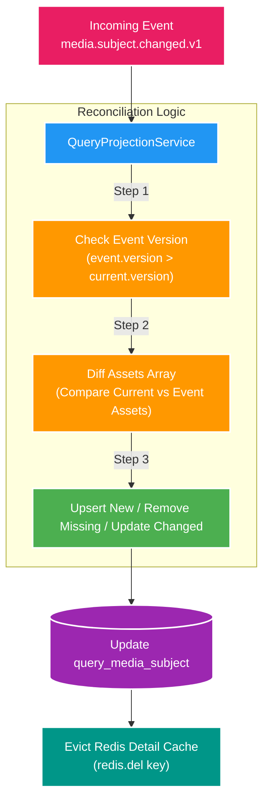

# 🔄 Data Reconciliation & Cache-Aside Eviction Pattern

Tài liệu chi tiết về cơ chế **Đối soát dữ liệu (Reconciliation)** khi Query Service nhận Kafka Event snapshot và chiến lược **Cache-Aside Eviction** với Redis.

---

## 1. Thuật toán Data Reconciliation (Hợp nhất trạng thái)

Khi `catalog-service` phát hành bản tin snapshot `media.subject.changed.v1`, Event chứa toàn bộ danh sách `assets` hiện tại của Subject.
`QueryProjectionService` trong `query-service` thực hiện thuật toán **Reconciliation** 3 bước:

---

## 2. Chiến lược Cache-Aside Pattern với Redis

### 2.1. Tại sao chọn Cache Eviction thay vì Cache Update?
- **Cache Eviction (Xóa Cache khi sửa DB)**: Đơn giản, tránh trường hợp 2 Event đến lệch thứ tự ghi đè data cũ lên Redis (Stale Cache).
- **Cache Update (Cập nhật Cache khi sửa DB)**: Dễ gặp Race Condition nếu có 2 concurrent updates.

### 2.2. Luồng xử lý Cache-Aside

1. **Khi Đọc (Read Request)**:
   - Kiểm tra Redis Key `query:subject:{id}`.
   - **Cache Hit**: Trả về dữ liệu lập tức (Latency < 2ms).
   - **Cache Miss**: Đọc từ PostgreSQL `query_db`, ghi kết quả vào Redis với TTL 10 phút, trả về client.

2. **Khi Ghi (Projection Event Update)**:
   - Ghi dữ liệu phẳng vào PostgreSQL `query_db`.
   - Thực hiện **Evict Cache**: Xóa Key `query:subject:{id}` khỏi Redis.
