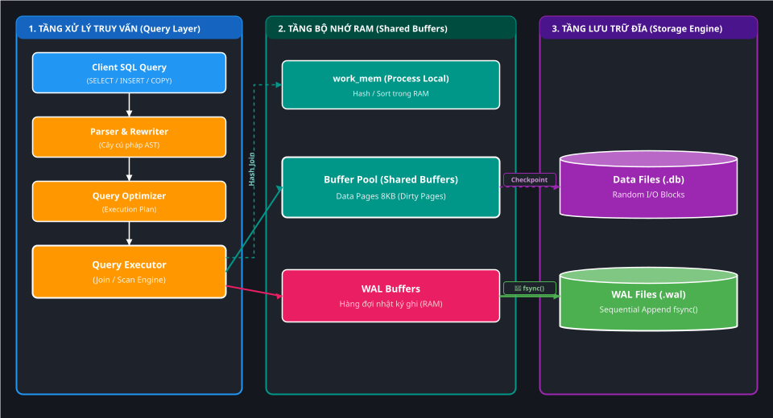
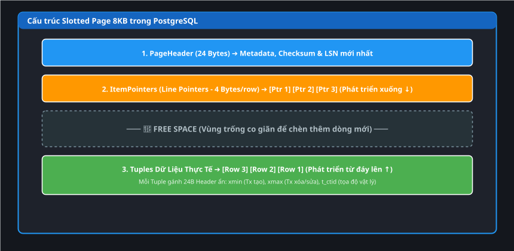
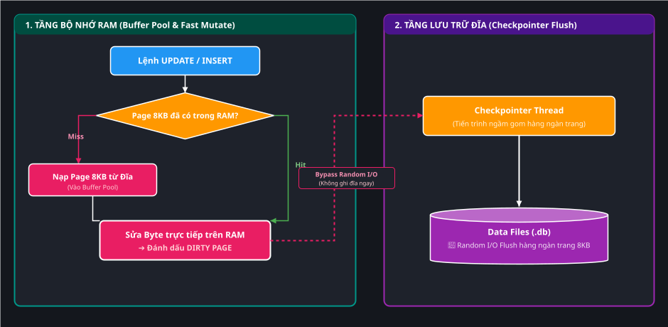
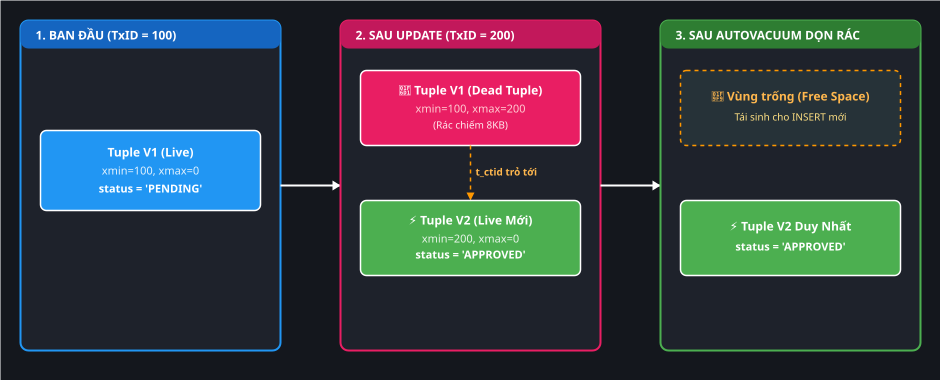
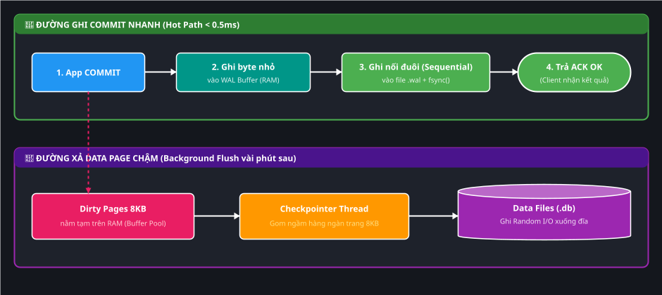
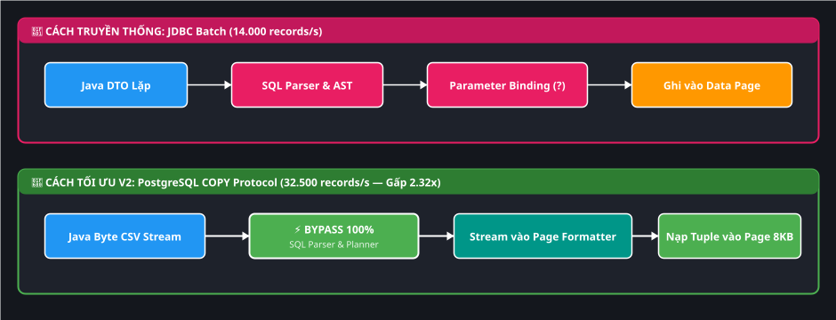
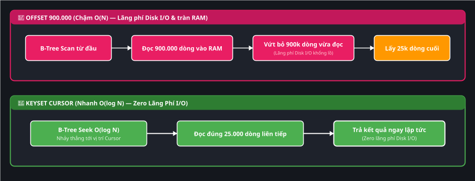
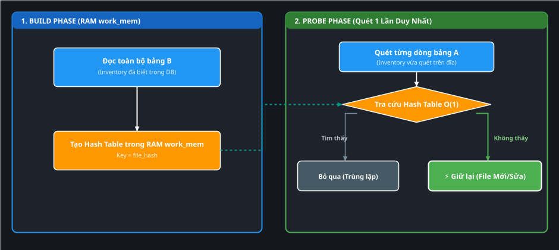
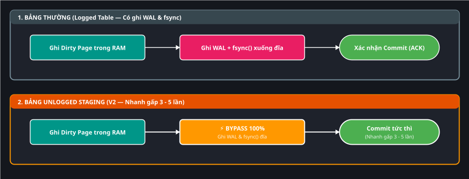
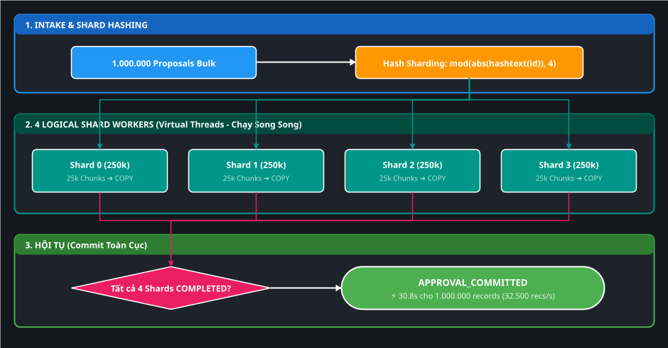

# 🗄️ Master Deep-Dive: Bản Đồ Nền Tảng DB Engine & Cẩm Nang Giải Pháp Tối Ưu

> **Mục tiêu tài liệu**: Giúp kỹ sư nắm bắt sâu sắc từ First Principles **bản chất lưu trữ dữ liệu và cơ chế vận hành bên trong của RDBMS (PostgreSQL 17)**: Data Pages (8KB), Buffer Pool, MVCC, WAL, B-Tree Indexes. Giải mã tường minh tại sao các giải pháp tối ưu trong dự án Backend V2 (**`COPY` streaming, Keyset Cursor, Hash Anti-Join, UNLOGGED Staging, Logical Sharding, Bounded Chunks**) lại đạt hiệu năng cao, chúng đang **bypass (bỏ qua) nút thắt nào** dưới tầng CSDL, hoàn cảnh sử dụng và các trade-offs (đánh đổi) đi kèm.

---

## 🧭 1. Bản Đồ Tổng Thể Kiến Trúc PostgreSQL Engine

Trước khi tìm hiểu các kỹ thuật tối ưu, hãy nhìn vào **Bản đồ 3 Tầng Kiến Trúc Phân Lớp (Query ➔ Memory ➔ Disk Storage)** của PostgreSQL:

*(💡 Gợi ý: Bạn có thể click đúp vào file [assets/postgresql-engine-architecture.drawio.svg](./assets/postgresql-engine-architecture.drawio.svg) trong IntelliJ để chỉnh sửa kéo thả trực quan).*

---

## 🧱 2. Bóc Tách 4 Khái Niệm Cốt Lõi Dưới Tầng Sâu CSDL

---

### 1️⃣ Data Page (Khối 8KB) & Cấu Trúc Slotted Page
- **Bản chất**: PostgreSQL **không bao giờ đọc/ghi từng byte lẻ trên đĩa**. Đơn vị nhỏ nhất mà CSDL trao đổi với ổ đĩa là một khối **Data Page có kích thước cố định $8\text{ KB}$ (8192 bytes)**.
- **Cơ chế Slotted Page (2 Đầu Co Giãn)**:
  - **Phía trên phát triển xuống $\downarrow$**: `PageHeader (24 bytes)` và mảng `ItemPointers (4 bytes/dòng)` trỏ vào vị trí byte của từng tuple.
  - **Ở giữa**: `Free Space` để chèn thêm dòng mới.
  - **Phía dưới phát triển lên $\uparrow$**: Các `Tuples (Dữ liệu thực tế)` xếp từ đáy trang ngược lên đỉnh.
- **Tuple Header Overhead (~24 bytes/row)**:
  - Mỗi dòng dữ liệu (Tuple) luôn mang theo 24 bytes metadata ẩn:
    - `xmin`: Transaction ID tạo ra dòng này.
    - `xmax`: Transaction ID xóa/sửa dòng này (mặc định $= 0$ nếu đang sống).
    - `t_ctid`: Địa chỉ vật lý của dòng `(Block_Number, Offset)`.

*(💡 Gợi ý: Bạn có thể click đúp vào file [assets/slotted-page-8kb.drawio.svg](./assets/slotted-page-8kb.drawio.svg) trong IntelliJ để chỉnh sửa kéo thả trực quan).*

---

### 2️⃣ Buffer Pool (Shared Buffers) & Dirty Pages
- **Bản chất**: CSDL là cỗ máy chạy trên RAM. Mọi câu lệnh `SELECT`, `INSERT`, `UPDATE` đều bắt buộc phải đưa Data Page 8KB từ đĩa vào **Buffer Pool trong RAM** trước khi xử lý.
- **Dirty Page là gì?**: Khi bạn chạy lệnh `INSERT` hoặc `UPDATE`:
  1. PostgreSQL tìm trang 8KB trong Buffer Pool.
  2. Sửa trực tiếp byte dữ liệu trên RAM. Trang này lập tức được đánh dấu là **Dirty Page** (Trang dơ — nghĩa là dữ liệu trên RAM đã khác với trên đĩa).
  3. **Không ghi xuống đĩa ngay** (vì Random I/O rất chậm).
  4. Tiến trình chạy ngầm **Checkpointer** sau vài phút mới gom hàng ngàn Dirty Pages để xả (Flush) một lần xuống file dữ liệu trên đĩa.

*(💡 Gợi ý: Bạn có thể click đúp vào file [assets/buffer-pool-dirty-pages.drawio.svg](./assets/buffer-pool-dirty-pages.drawio.svg) trong IntelliJ để chỉnh sửa kéo thả trực quan).*

---

### 3️⃣ MVCC (Multi-Version Concurrency Control) & Dead Tuples
- **Bản chất của lệnh `UPDATE` trong Postgres**:
  - PostgreSQL **không bao giờ sửa đè lên byte cũ (No In-Place Update)**.
  - Khi `UPDATE dòng X`: Postgres thực chất làm 2 việc:
    1. Đánh dấu dòng cũ là đã chết bằng cách gán `xmax = Transaction_ID_hiện_tại`.
    2. Tạo một dòng hoàn toàn mới (`INSERT`) với `xmin = Transaction_ID_hiện_tại`.
- **Hệ quả (Dead Tuples & Table Bloat)**:
  - Các dòng cũ bị xóa hoặc bị sửa trở thành **Dead Tuples (Dòng rác)** nằm chiếm dung lượng trang 8KB.
  - Tiến trình ngầm **AutoVACUUM** định kỳ phải quét dọn các Dead Tuples này để giải phóng khoảng trống (Free Space) trong trang 8KB cho dòng mới dùng lại.

*(💡 Gợi ý: Bạn có thể click đúp vào file [assets/mvcc-dead-tuples.drawio.svg](./assets/mvcc-dead-tuples.drawio.svg) trong IntelliJ để chỉnh sửa kéo thả trực quan).*

---

### 4️⃣ Write-Ahead Logging (WAL) & Ghi Bền Vững
- **Tại sao cần WAL?**: Vì Dirty Pages chỉ nằm trên RAM và chưa được ghi xuống đĩa ngay, nếu mất điện đột ngột thì toàn bộ thay đổi trên RAM sẽ bốc hơi!
- **Giải pháp**: Trước khi xác nhận `COMMIT` thành công cho ứng dụng, PostgreSQL bắt buộc phải ghi 1 bản ghi nhật ký thay đổi ngắn gọn vào **file WAL (.wal)** và gọi lệnh hệ điều hành `fsync()`.
- **Bí quyết tốc độ**: Ghi WAL là **Sequential I/O (Ghi nối tiếp vào cuối file)** nên cực nhanh ($< 0.5\text{ ms}$), trong khi ghi Data Page là **Random I/O (Tìm trang bất kỳ trên đĩa)** tốn tới $5 - 10\text{ ms}$.

*(💡 Gợi ý: Bạn có thể click đúp vào file [assets/wal-durability-hot-path.drawio.svg](./assets/wal-durability-hot-path.drawio.svg) trong IntelliJ để chỉnh sửa kéo thả trực quan).*

---

## 🛠️ 3. Giải Mã 5 Giải Pháp Tối Ưu Trong Dự Án Backend V2

Dưới đây là bảng phân tích sâu: **Giải pháp đó làm gì, bypass (bỏ qua) tầng nào của DB Engine, tại sao lại tạo ra tốc độ đột phá và trade-offs là gì?**

---

### 🚀 Solution 1: PostgreSQL `COPY` Protocol (Thay vì JDBC Batch Insert)

*(💡 Gợi ý: Bạn có thể click đúp vào file [assets/solution-1-copy-protocol.drawio.svg](./assets/solution-1-copy-protocol.drawio.svg) trong IntelliJ để chỉnh sửa kéo thả trực quan).*

- **Bản chất**: Sử dụng giao thức cấp thấp `CopyIn` của PostgreSQL driver để truyền trực tiếp một dòng byte stream thô vào DB engine.
- **Bypass cái gì dưới DB?**:
  - **Bypass tầng SQL Parser & Rewriter**: DB không cần phân tích cú pháp chuỗi SQL `INSERT INTO...`.
  - **Bypass Query Planner**: DB không cần suy nghĩ xem nên chạy plan nào.
  - **Bypass Statement Parameter Binding**: Không tốn CPU map từng tham số dấu `?` trong JDBC.
- **Tại sao nhanh?**: Tốc độ ghi tăng từ **$14.000\text{ records/s}$ lên $\mathbf{32.500\text{ records/s}}$ (Nhanh gấp 2.32 lần)**.
- **Khi nào dùng?**: Khi cần nạp hàng loạt (Bulk Ingestion) từ $\ge 1.000$ bản ghi trở lên (như duyệt 1 triệu proposal trong FT-050).
- **Trade-offs**: Cần format chuỗi chuẩn xác (xử lý escape ký tự, quote chuỗi và NULL), khó bắt lỗi trên từng dòng riêng lẻ nếu một dòng bị sai format.

---

### 📄 Solution 2: Keyset Pagination (Cursor) Thay vì `OFFSET / LIMIT`

*(💡 Gợi ý: Bạn có thể click đúp vào file [assets/solution-2-keyset-pagination.drawio.svg](./assets/solution-2-keyset-pagination.drawio.svg) trong IntelliJ để chỉnh sửa kéo thả trực quan).*

- **Bản chất**: Thay vì dùng `OFFSET 900000`, ta dùng điều kiện lọc theo khóa chính hoặc index đa cột: `WHERE scan_run_id = ? AND id > last_seen_id ORDER BY id LIMIT 25000`.
- **Bypass cái gì dưới DB?**:
  - **Bypass việc quét tuần tự (Sequential Scan) và nạp rác vào Buffer Pool**: Với `OFFSET 900k`, Postgres bắt buộc phải nạp hàng vạn trang 8KB từ đĩa vào RAM chỉ để đếm đủ 900.000 dòng rồi vứt đi.
- **Tại sao nhanh?**: Cây B-Tree thực hiện thao tác **Index Seek $O(\log N)$**, nhảy thẳng đến vị trí con trỏ `last_seen_id` và lấy đúng 25.000 dòng tiếp theo trong vài mili-giây.
- **Khi nào dùng?**: Khi phân trang dữ liệu lớn $> 100.000$ bản ghi, xử lý worker theo batch liên tục (như FT-045, FT-050).
- **Trade-offs**: Không thể nhảy trang tùy ý (không thể nhảy thẳng từ trang 1 sang trang 50); bắt buộc bảng phải có cột sắp xếp đơn điệu và có index hỗ trợ `(scan_run_id, id)`.

---

### 🔍 Solution 3: Hash Anti-Join (`NOT EXISTS`) Thay vì `NOT IN`

*(💡 Gợi ý: Bạn có thể click đúp vào file [assets/solution-3-hash-anti-join.drawio.svg](./assets/solution-3-hash-anti-join.drawio.svg) trong IntelliJ để chỉnh sửa kéo thả trực quan).*

- **Bản chất**: Dùng phép trừ đại số quan hệ $A \setminus B$ bằng cú pháp `WHERE NOT EXISTS (SELECT 1 FROM b WHERE b.key = a.key)`.
- **Bypass cái gì dưới DB?**:
  - **Bypass giải thuật Nested Loop Join $O(N \times M)$**: Không phải lấy từng dòng của bảng A chạy đi quét toàn bộ bảng B.
  - **Bypass vấn đề 3-Valued Logic của `NOT IN`**: `NOT IN` sẽ quét toàn bộ bảng nếu gặp `NULL`, làm vỡ index.
- **Tại sao nhanh?**: Giải thuật chia làm 2 pha chạy hoàn toàn trên RAM `work_mem` với độ phức tạp tuyến tính **$O(N + M)$**, lọc 1 triệu file trong **$< 1\text{ giây}$** (nhanh hơn 10 – 50 lần).
- **Khi nào dùng?**: Dùng khi đối soát dữ liệu (Reconciliation), tìm danh sách file mới, file bị sửa đổi, file bị xóa giữa 2 lần quét (FT-025, FT-048).
- **Trade-offs**: Cần cấp đủ dung lượng RAM `work_mem` (ví dụ `work_mem = 64MB`). Nếu bảng băm lớn hơn `work_mem`, Postgres sẽ phải xả ra đĩa (Spill to Disk) làm giảm tốc độ.

---

### ⚡ Solution 4: Bảng `UNLOGGED` Staging Table

*(💡 Gợi ý: Bạn có thể click đúp vào file [assets/solution-4-unlogged-table.drawio.svg](./assets/solution-4-unlogged-table.drawio.svg) trong IntelliJ để chỉnh sửa kéo thả trực quan).*

- **Bản chất**: Tạo bảng dữ liệu với từ khóa `CREATE UNLOGGED TABLE scan_inventory_staging (...)`.
- **Bypass cái gì dưới DB?**:
  - **Bypass 100% tầng Write-Ahead Logging (WAL)**: CSDL không ghi bất kỳ byte nhật ký nào vào file `.wal` và không gọi `fsync()`.
- **Tại sao nhanh?**: Tốc độ ghi dữ liệu tạm tăng **gấp 3 – 5 lần**, hoàn toàn giải phóng áp lực I/O đĩa cứng.
- **Khi nào dùng?**: Dùng làm vùng đệm chứa dữ liệu quét thô (Staging Table), tính toán đối soát xong là xóa, hoặc dữ liệu có thể dễ dàng quét lại từ ổ đĩa nếu máy chủ bị sập nguồn (FT-025, FT-031).
- **Trade-offs**: **Không an toàn khi sập nguồn (No Durability)**. Khi PostgreSQL restart sau crash, toàn bộ dữ liệu trong bảng `UNLOGGED` sẽ tự động bị xóa sạch (`TRUNCATE`). Không bao giờ dùng cho dữ liệu chính như đơn hàng, tài khoản, decisions.

---

### 🧩 Solution 5: Bounded Chunking (25k rows) & Logical Sharding (FT-050 / FT-051)

*(💡 Gợi ý: Bạn có thể click đúp vào file [assets/solution-5-logical-sharding.drawio.svg](./assets/solution-5-logical-sharding.drawio.svg) trong IntelliJ để chỉnh sửa kéo thả trực quan).*

- **Bản chất**: Chia 1 triệu proposal thành 40 chunks nhỏ (25.000 rows/chunk), mỗi chunk commit trong 1 transaction `REQUIRES_NEW` độc lập. Dùng `mod(abs(hashtext(id)), 4)` để 4 Shard Workers ghi song song qua `FOR UPDATE SKIP LOCKED`.
- **Bypass cái gì dưới DB?**:
  - **Bypass tràn Buffer Pool & OOM**: Tránh việc 1 transaction khổng lồ tích tụ 1.000.000 dirty tuples trong RAM làm tràn Shared Buffers.
  - **Bypass Single-Writer Bottleneck**: Phá vỡ nút thắt 1 kết nối ghi tuần tự bằng cách mở 4 luồng ghi song song trên DB đa nhân.
  - **Bypass Long-Running Transaction Lock**: Tránh giữ khóa bảng quá lâu làm nghẽn các câu lệnh khác.
- **Tại sao nhanh?**: Rút ngắn thời gian duyệt 1M files từ **$121\text{s} \rightarrow \mathbf{30,8\text{s}}$ (Thông lượng đạt $\mathbf{32.500\text{ records/s}}$)**.
- **Khi nào dùng?**: Xử lý hàng loạt quy mô lớn ($> 100.000$ đến hàng triệu bản ghi).
- **Trade-offs**: Cần bảng Shard Ledger (`scan_approval_operation_shard`) để theo dõi trạng thái con trỏ và xử lý retry khi 1 shard bị crash.

---

## 📊 4. Ma Trận Quyết Định Cho Kỹ Sư (Architect Decision Matrix)

| Vấn đề gặp phải | Giải pháp áp dụng | Tầng DB được tối ưu | Điểm nghẽn được Bypass | Trade-off phải chấp nhận |
| :--- | :--- | :--- | :--- | :--- |
| **Ghi hàng loạt quá chậm** | **PostgreSQL `COPY`** | Network & Parser | Bypass SQL Parser, AST & Parameter Binding | Khó validate từng dòng riêng lẻ |
| **Phân trang trang sau bị lag** | **Keyset Pagination** | Storage Engine | Bypass nạp hàng triệu Data Pages rác vào RAM | Không nhảy trang tùy ý được |
| **Lọc so sánh 2 bảng triệu dòng** | **Hash Anti-Join (`NOT EXISTS`)** | Memory Execution | Bypass Nested Loop $O(N \times M)$ & 3-valued NULL logic | Tốn bộ nhớ `work_mem` |
| **Nạp dữ liệu tạm làm chậm hệ thống** | **`UNLOGGED` Table** | Durability (WAL) | Bypass 100% việc ghi file WAL và `fsync` đĩa | Mất trắng dữ liệu tạm khi CSDL crash |
| **Ghi 1M bản ghi làm treo CSDL** | **Bounded Chunking & Sharding** | Concurrency & Buffer | Bypass Long Transaction & Single-thread WAL lock | Phải quản lý Checkpoint & Retry logic |

---

## 🔗 Liên Kết Học Tập Liên Quan:
- [Bài 01: Write-Ahead Logging & Storage Engine Internals](./01-wal-and-storage-engine-internals.md)
- [Bài 02: Anti-Join & Hash Anti-Join Query Optimization](./02-anti-join-and-query-optimization.md)
- [Bài 03: UNLOGGED Tables & Transient Storage](./03-unlogged-tables-and-transient-storage.md)
- [Bài 04: Giới Hạn Vật Lý RDBMS vs 1M+ Records/s](./04-rdbms-limits-vs-million-records-per-second.md)
- [Bài 05: Bản Chất & Cơ Chế Thực Hiện ACID](./05-acid-internals-and-implementation-mechanisms.md)
