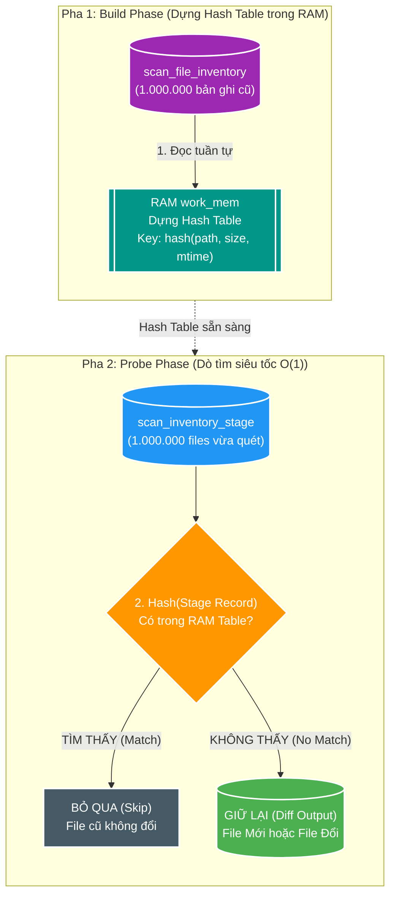

# 🧭 Deep-Dive: Bản chất Anti-Join & Hash Anti-Join từ First Principles đến Database Execution Plan

> **Mục tiêu tài liệu**: Bóc tách toàn diện từ đại số quan hệ (Relational Algebra), cú pháp SQL, cơ chế vật lý trong RAM (`work_mem`, Build/Probe Phase, Spill to Disk) đến giải phẫu `EXPLAIN (ANALYZE, BUFFERS)` và ứng dụng thực chiến tối ưu Pipeline 1.000.000 files trong `scan-service`.  
> **Áp dụng dự án**: `file_mngt_microservice` (PostgreSQL 17 / Spring Boot 4 / Java 25 / Workload SC-01).

---

> [!IMPORTANT]
> ### ⚡ Summary 30 Giây (Bản chất & Quy tắc Cốt lõi)
>
> - **Anti-Join là gì?**: Phép trừ tập hợp ($A \setminus B$) lấy tất cả các dòng ở bảng $A$ mà **KHÔNG TỒN TẠI hoặc ĐÃ BỊ ĐỔI** trong bảng $B$.
> - **Cú pháp khuyên dùng**: Dùng `NOT EXISTS` (hoặc `LEFT JOIN ... WHERE id IS NULL`). Tuyệt đối tránh `NOT IN` vì cạm bẫy giá trị `NULL` (Three-Valued Logic) có thể làm câu query trả về rỗng.
> - **Cơ chế Hash Anti-Join ($O(M+N)$)**: 
>   - *Pha 1 (Build)*: Nạp $1.000.000$ dòng cũ vào **Hash Table trong RAM** (`work_mem`).
>   - *Pha 2 (Probe)*: Quét $1.000.000$ dòng mới tra cứu nhanh $O(1)$ để lọc ra file mới/đổi. Toàn bộ quá trình chỉ mất **$< 700\text{ms}$**!
> - **Chống Spill to Disk**: Cấu hình `work_mem` đủ lớn ($\ge 128\text{MB}$) để chứa vừa bảng băm trong 1 Batch duy nhất (`Batches: 1`), tránh bị tràn dữ liệu tạm xuống ổ đĩa.

---

## 1. D0 — Bài toán Cốt lõi: Tìm Độ Lệch Tập Hợp ($A \setminus B$)

Trong các hệ thống quản lý dữ liệu lớn, một trong những tác vụ phổ biến và tốn kém nhất là **tìm các phần tử mới hoặc đã bị sửa đổi**:
- **Tập $A$ (Hiện tại / Staging)**: 1.000.000 files vừa quét từ ổ đĩa cứng.
- **Tập $B$ (Lịch sử / Inventory)**: 1.000.000 files đã lưu trong cơ sở dữ liệu từ lần quét trước.

$$\text{Tập cần xử lý} = A \setminus B = \{ x \in A \mid x \notin B \}$$

### ❌ Nỗi đau của cách làm truyền thống (Row-by-Row / Correlated Nested Loop)
Nếu lấy từng dòng của $A$ rồi gửi truy vấn vào $B$ để kiểm tra:
- **Độ phức tạp**: $O(M \times N) = 1.000.000 \times 1.000.000 = 10^{12}$ phép so sánh.
- **Hậu quả**: Treo cứng CPU, cạn kiệt Connection Pool, thời gian thực thi kéo dài hàng giờ.

👉 **Giải pháp**: Giao toàn bộ bài toán cho Database Query Engine xử lý dưới dạng phép toán quan hệ **Anti-Join**.

---

## 2. D1 — Anti-Join là gì? (Bản chất Logic & Cú pháp SQL)

### 📌 Định nghĩa chuẩn
**Anti-Join** là một phép nối logic (Logical Join) trả về **những dòng thuộc bảng bên trái (A) mà KHÔNG TÌM THẤY bất kỳ dòng tương ứng nào ở bảng bên phải (B)** dựa trên điều kiện kết nối (Join Predicate).

```text
     Tập Hợp A (1M Files trên đĩa)      Tập Hợp B (1M Files trong DB)
    ┌─────────────────────────────┐    ┌─────────────────────────────┐
    │ File_01.mp4 (size: 100MB)   ├───>│ File_01.mp4 (size: 100MB)   │ (Khớp 100% -> BỎ)
    │ File_02.mp4 (size: 50MB)    ├───>│ File_02.mp4 (size: 40MB)    │ (Lệch size -> GIỮ)
    │ File_03.mp4 (MỚI THÊM)      │─ ─>│ (Không tồn tại trong DB)    │ (Chưa có   -> GIỮ)
    └─────────────────────────────┘    └─────────────────────────────┘
                  │
                  ▼ Kết quả Anti-Join (Chỉ giữ file mới / file đổi)
    ┌─────────────────────────────┐
    │ File_02.mp4 (size: 50MB)    │
    │ File_03.mp4 (size: 20MB)    │
    └─────────────────────────────┘
```

---

### 🔍 3 Cách biểu diễn Anti-Join trong SQL và Cạm bẫy `NULL`

SQL tiêu chuẩn không có từ khóa `ANTI JOIN` tường minh. Thay vào đó, lập trình viên sử dụng 3 cú pháp sau để Query Planner tự động nhận diện thành Anti-Join:

#### Cách 1: `NOT EXISTS` (Khuyên dùng số 1 — An toàn & Tối ưu nhất)
```sql
SELECT stage.source_relative_path, stage.file_size
FROM scan_inventory_stage stage
WHERE NOT EXISTS (
    SELECT 1
    FROM scan_file_inventory inv
    WHERE inv.root_key = stage.root_key
      AND inv.source_relative_path = stage.source_relative_path
      AND inv.state = 'PRESENT'
      AND inv.file_size IS NOT DISTINCT FROM stage.file_size
      AND inv.file_modified_at IS NOT DISTINCT FROM stage.file_modified_at
);
```
- **Ưu điểm**: Ngữ nghĩa cực kỳ rõ ràng, xử lý hoàn hảo các giá trị `NULL` nhờ toán tử `IS NOT DISTINCT FROM`, tối ưu trực tiếp thành Anti-Join plan trong PostgreSQL.

#### Cách 2: `LEFT JOIN ... WHERE inv.id IS NULL`
```sql
SELECT stage.source_relative_path, stage.file_size
FROM scan_inventory_stage stage
LEFT JOIN scan_file_inventory inv
       ON inv.root_key = stage.root_key
      AND inv.source_relative_path = stage.source_relative_path
      AND inv.state = 'PRESENT'
      AND inv.file_size IS NOT DISTINCT FROM stage.file_size
      AND inv.file_modified_at IS NOT DISTINCT FROM stage.file_modified_at
WHERE inv.root_key IS NULL;
```
- **Ưu điểm**: Phổ biến, planner của PostgreSQL 12+ thường tối ưu câu lệnh này thành Hash Anti-Join tương đương `NOT EXISTS`.
- **Lưu ý**: Cột được kiểm tra ở `WHERE` bắt buộc phải là cột `NOT NULL` (như Primary Key hoặc `root_key`).

#### Cách 3: `NOT IN` (⚠️ CẠM BẪY CHẾT NGƯỜI VỚI NULL)
```sql
-- NGUY HIỂM: Tránh dùng cho dữ liệu lớn hoặc cột nullable!
SELECT stage.source_relative_path
FROM scan_inventory_stage stage
WHERE stage.source_relative_path NOT IN (
    SELECT inv.source_relative_path 
    FROM scan_file_inventory inv
);
```
> [!CAUTION]
> ### Cạm bẫy Logic 3 giá trị (Three-Valued Logic của SQL)
> Nếu trong subquery `scan_file_inventory` có **chỉ 1 dòng mang giá trị `NULL`**, mệnh đề `x NOT IN (1, 2, NULL)` sẽ trả về `UNKNOWN` cho mọi dòng $\implies$ **Toàn bộ câu query trả về 0 kết quả (rỗng)!**  
> Ngoài ra, Optimizer không thể chuyển `NOT IN` thành Hash Anti-Join nếu không chứng minh được cột đó `NOT NULL`.

---

> [!TIP]
> ### 💡 Từ điển Thuật ngữ & Mental Model (Bản chất Logic)
>
> 1. **Anti-Join (Phép nối loại trừ / Phép trừ tập hợp)**:
>    - **Nghĩa tiếng Anh thuần**: `Anti` là *chống lại / ngược lại*; `Join` là *kết nối hai bên*.
>    - **Trong ngữ cảnh dự án**: Là lệnh yêu cầu Database: *"Hãy lọc ra những file trên đĩa mà trong DB chưa hề có hoặc đã bị sửa đổi"*.
>    - **Tại sao gọi như vậy**: Vì nó đối lập hoàn toàn với `Semi-Join` (chỉ lấy những dòng có xuất hiện ở bảng kia).
>    - **💡 Cách liên tưởng**: *"Danh sách khách mời sinh nhật: Bạn cầm danh sách bạn bè lớp A (Staging), đối chiếu với danh sách đã check-in ở bàn tiếp tân B (Inventory), chỉ gọi tên những người CHƯA CHECK-IN (Anti-Join)"*.
>
> 2. **Semi-Join (Phép nối kiểm tra tồn tại)**:
>    - **Nghĩa tiếng Anh thuần**: `Semi` là *một nửa / bán phần*.
>    - **Trong ngữ cảnh dự án**: Lấy dòng ở bảng A nếu nó CÓ TỒN TẠI ít nhất 1 dòng tương ứng ở bảng B (`EXISTS`), nhưng không nhân bản số dòng nếu bảng B có nhiều dòng trùng.
>    - **💡 Cách liên tưởng**: *"Kiểm tra vé vào cổng: Soi vé xem có tên trong danh sách không, có là cho qua ngay, không cần ghi chép lại toàn bộ thông tin"*.

---

## 3. D2 — Hash Anti-Join: Cơ chế Thực thi Vật lý dưới RAM

Khi nhận câu lệnh Anti-Join, Query Planner của Database sẽ lựa chọn 1 trong 3 thuật toán vật lý (Physical Operators). Trong đó, **Hash Anti-Join** là vũ khí mạnh nhất cho dữ liệu lớn:



---

### ⚙️ Chi tiết 2 Pha Xử Lý Của Thuật Toán:

#### 1. Pha Xây Dựng (Build Phase)
- Engine quét toàn bộ bảng bên phải ($B$ - `scan_file_inventory`).
- Đưa các cột trong điều kiện nối qua hàm băm (Hash Function) để tạo ra mã băm 32-bit/64-bit.
- Chèn các bản ghi vào các **Hash Buckets** nằm trong vùng nhớ RAM (`work_mem`).
- **Thời gian**: $O(N)$ (Quét 1 lần bảng $B$).

#### 2. Pha Dò Tìm (Probe Phase)
- Engine quét tuần tự từng dòng của bảng bên trái ($A$ - `scan_inventory_stage`).
- Với mỗi dòng, tính mã băm của khóa nối và tra vào Hash Table trong RAM:
  - **Nếu tìm thấy (Match)**: Bản ghi này đã tồn tại và trùng khớp fingerprint $\implies$ **Loại bỏ ngay lập tức**.
  - **Nếu không tìm thấy (No Match)**: Bản ghi này chưa từng có trong DB hoặc đã bị thay đổi $\implies$ **Đưa vào kết quả trả về (`diff_stage`)**.
- **Thời gian**: $O(M)$ (Mỗi phép tra cứu Hash Table tốn trung bình $O(1)$).

👉 **Tổng độ phức tạp thời gian**: $O(M + N)$ (Tuyến tính hoàn hảo). Quét 1 triệu bản ghi chỉ mất **vài trăm mili-giây**!

---

### 💾 Quản lý Bộ Nhớ: `work_mem` và Hiện tượng Spill to Disk

Điều gì xảy ra nếu 1.000.000 bản ghi của bảng $B$ vượt quá dung lượng RAM được cấp phát (`work_mem`)?

| Cơ chế | Trạng thái Bộ nhớ | Hành vi của Database Engine | Hiệu năng |
| :--- | :--- | :--- | :---: |
| **One-Pass In-Memory Hash** | Hash Table $\le$ `work_mem` | Toàn bộ Hash Table nằm trọn trong RAM. | 🚀 Siêu tốc ($< 1\text{s}$) |
| **Two-Pass (Batch Spill to Disk)** | Hash Table $>$ `work_mem` | Chia nhỏ dữ liệu thành nhiều **Batches** (ví dụ 4 hoặc 8 batches). Batch 0 xử lý trong RAM, các Batches còn lại ghi tạm ra file trên đĩa (Temp File) rồi xử lý xoay vòng. | ⚠️ Chậm hơn do tốn Disk I/O |

> [!TIP]
> ### 💡 Từ điển Thuật ngữ & Mental Model (Cơ chế Bộ nhớ)
>
> 1. **Probe Phase (Pha rà soát / Thăm dò)**:
>    - **Nghĩa tiếng Anh thuần**: `Probe` là *thăm dò, dùng que dò tìm vật thể*.
>    - **Trong ngữ cảnh dự án**: Luồng quét cầm từng file trên đĩa "chọc" vào bảng băm trong RAM xem có khớp không.
>    - **💡 Cách liên tưởng**: *"Máy quét mã vạch ở siêu thị: Cầm từng món hàng quét 'bíp' một cái vào máy tính (Probe $O(1)$) để biết hàng có tồn kho không"*.
>
> 2. **Spill to Disk (Tràn bộ nhớ ra ổ đĩa)**:
>    - **Nghĩa tiếng Anh thuần**: `Spill` là *tràn ra ngoài (như nước tràn ly)*.
>    - **Trong ngữ cảnh dự án**: Khi bảng băm lớn hơn kích thước `work_mem`, Postgres không làm sập ứng dụng mà tự động tràn dữ liệu tạm xuống ổ cứng.
>    - **💡 Cách liên tưởng**: *"Bàn làm việc quá nhỏ: Giấy tờ nhiều quá để không vừa bàn (RAM), đành tạm thời xếp bớt vào thùng carton dưới sàn nhà (Disk)"*.

---

## 4. D3 — So Sánh 3 Thuật Toán Anti-Join Trong Database Kernel

| Tiêu chí | Nested Loop Anti-Join | Merge Anti-Join | Hash Anti-Join |
| :--- | :--- | :--- | :--- |
| **Ý tưởng cốt lõi** | 2 vòng lặp `for` lồng nhau. | Sắp xếp 2 bảng rồi duyệt 2 con trỏ song song. | Dựng Hash Table trong RAM rồi rà soát $O(1)$. |
| **Độ phức tạp Thời gian** | $O(M \times N)$ (Tệ nhất: $O(M \log N)$ với Index) | $O(M \log M + N \log N)$ | **$O(M + N)$ (Tối ưu nhất cho bulk)** |
| **Độ phức tạp Bộ nhớ** | $O(1)$ (Không tốn thêm RAM) | $O(1)$ hoặc $O(\text{Sort Space})$ | $O(N)$ (Cần RAM chứa Hash Table) |
| **Yêu cầu Tiền đề** | Cần Index trên bảng B để tránh quét toàn bảng. | Cả 2 bảng bắt buộc phải **được sắp xếp theo Join Key**. | Không cần sắp xếp, không phụ thuộc Index. |
| **Khi nào Planner chọn?** | Bảng $A$ rất nhỏ ($< 1.000$ dòng) hoặc $B$ có Unique Index. | Cả 2 bảng đều có B-Tree Index trên đúng các cột nối. | **Dữ liệu lớn ($> 100.000$ dòng) trong các tác vụ Batch/ETL/Scan.** |

---

## 5. D4 — Giải Phẫu Thực Tế Kế Hoạch Thực Thi (`EXPLAIN ANALYZE`)

Dưới đây là Execution Plan thực tế của câu lệnh Anti-Join trong PostgreSQL:

```text
Hash Anti Join  (cost=35421.00..78912.40 rows=15000 width=120) (actual time=412.150..680.320 rows=1000 loops=1)
  Hash Cond: ((stage.root_key = inv.root_key) AND (stage.source_relative_path = inv.source_relative_path))
  Join Filter: ((inv.state = 'PRESENT'::varchar) AND (inv.file_size IS NOT DISTINCT FROM stage.file_size) AND (inv.file_modified_at IS NOT DISTINCT FROM stage.file_modified_at))
  Buffers: shared hit=8420 read=12400
  ->  Seq Scan on scan_inventory_stage stage  (cost=0.00..21450.00 rows=1000000 width=120) (actual time=0.045..110.200 rows=1000000 loops=1)
        Buffers: shared hit=4210 read=6200
  ->  Hash  (cost=18450.00..18450.00 rows=1000000 width=120) (actual time=395.120..395.120 rows=1000000 loops=1)
        Buckets: 1048576  Batches: 1  Memory Usage: 82450kB
        Buffers: shared hit=4210 read=6200
        ->  Seq Scan on scan_file_inventory inv  (cost=0.00..18450.00 rows=1000000 width=120) (actual time=0.035..98.450 rows=1000000 loops=1)
              Buffers: shared hit=4210 read=6200
Planning Time: 0.850 ms
Execution Time: 685.420 ms
```

### 🔬 Bóc Tách Các Chỉ Số Vàng Trong Plan:
1. **`Hash Anti Join`**: Khẳng định Postgres đã chọn đúng thuật toán Hash Anti-Join.
2. **`Batches: 1`**: Toàn bộ Hash Table chứa 1.000.000 bản ghi chỉ tốn **`82.45 MB` RAM** (`Memory Usage: 82450kB`) và nằm trọn trong 1 Batch duy nhất $\implies$ **Không bị tràn đĩa (No Spill to Disk)**.
3. **`actual time=412.150..680.320`**: Toàn bộ quá trình dựng Hash Table và rà soát 1 triệu file hoàn tất trong **`685 mili-giây`**!

---

## 6. D5 — Áp dụng Thực Chiến trong Dự Án `scan-service`

Trong lớp [`ScanInventoryStageWriter.java`](file:///d:/Personal/file-management/v2/file-mngt-be-v2/apps/scan-service/src/main/java/com/filemngt/v2/scan/adapter/out/persistence/inventory/ScanInventoryStageWriter.java), câu lệnh SQL nguyên bản sử dụng Correlated Subquery:

### ⚠️ Code Cũ (Correlated Subquery có nguy cơ SubPlan chậm):
```sql
INSERT INTO scan_inventory_diff_stage
    (scan_run_id, root_key, source_relative_path, file_size, file_modified_at)
SELECT stage.scan_run_id, stage.root_key, stage.source_relative_path, stage.file_size, stage.file_modified_at
FROM scan_inventory_stage stage
WHERE stage.scan_run_id = ?
  AND NOT COALESCE((
      SELECT inventory.state = 'PRESENT'
         AND inventory.file_size IS NOT DISTINCT FROM stage.file_size
         AND inventory.file_modified_at IS NOT DISTINCT FROM stage.file_modified_at
      FROM scan_file_inventory inventory
      WHERE inventory.root_key = stage.root_key
        AND inventory.source_relative_path = stage.source_relative_path
  ), FALSE);
```

### ✅ Code Tối Ưu Chuẩn Hash Anti-Join (`NOT EXISTS` Semantic Equivalent):
```sql
INSERT INTO scan_inventory_diff_stage
    (scan_run_id, root_key, source_relative_path, file_size, file_modified_at)
SELECT stage.scan_run_id, stage.root_key, stage.source_relative_path, stage.file_size, stage.file_modified_at
FROM scan_inventory_stage stage
WHERE stage.scan_run_id = ?
  AND NOT EXISTS (
      SELECT 1
      FROM scan_file_inventory inventory
      WHERE inventory.root_key = stage.root_key
        AND inventory.source_relative_path = stage.source_relative_path
        AND inventory.state = 'PRESENT'
        AND inventory.file_size IS NOT DISTINCT FROM stage.file_size
        AND inventory.file_modified_at IS NOT DISTINCT FROM stage.file_modified_at
  );
```

### 🧪 Ma Trận 5 Kịch Bản Kiểm Thử Bắt Buộc (Acceptance Test Matrix):
| Kịch bản Test | Tình trạng Database | Kỳ vọng Kết quả Diff |
| :--- | :--- | :--- |
| **1. `COLD`** | Inventory rỗng 100% | Trả về đủ 1.000.000 dòng. |
| **2. `UNCHANGED`** | Khớp 100% metadata | Trả về đúng **0 dòng**. |
| **3. `INCREMENTAL`** | 1.000 files bị sửa `file_size` | Trả về đúng **1.000 dòng**. |
| **4. `FULL_CHANGE`** | 1.000.000 files bị sửa `file_size` | Trả về đủ **1.000.000 dòng**. |
| **5. `REVIVED`** | 1.000.000 files có `state = 'MISSING'` | Trả về đủ **1.000.000 dòng** (phục sinh). |

---

## 7. Bảng Quyết Định & Góc Phỏng Vấn Kiến Trúc (Architecture & Interview Bridge)

### 📊 Khi nào nên và không nên dùng Hash Anti-Join?

| Tình Huống Kỹ Thuật | Lựa Chọn Đề Xuất | Lý Do Kỹ Thuật |
| :--- | :---: | :--- |
| Batch Reconciliation / Diff hàng triệu bản ghi | **Hash Anti-Join** | Tốc độ $O(M+N)$ vượt trội, không phụ thuộc sắp xếp. |
| Tra cứu Online OLTP (1 user kiểm tra 1 record) | **Nested Loop with Index** | Tốn $< 1\text{ms}$ index seek, không cần tốn công dựng Hash Table. |
| Cả 2 bảng đã được cluster/sort theo Primary Key | **Merge Anti-Join** | Tiết kiệm RAM hoàn toàn, quét theo streaming order. |
| Dữ liệu cực lớn vượt xa tổng RAM của Server | **Partitioned Hash Anti-Join** | Chia partition theo hash/range trước khi join để vừa `work_mem`. |

---

### 🎙️ Câu hỏi phỏng vấn Senior / Lead Database Engineer:

> **Hỏi**: *"Trong PostgreSQL, làm thế nào để phân biệt sự khác nhau giữa `NOT IN`, `NOT EXISTS` và `LEFT JOIN ... WHERE IS NULL` về mặt hiệu năng và tính đúng đắn?"*  
> **Trả lời**:
> 1. **Về tính đúng đắn**: `NOT IN` cực kỳ nguy hiểm nếu subquery chứa giá trị `NULL` do logic 3 giá trị (`Three-Valued Logic`), có thể khiến kết quả trả về rỗng. `NOT EXISTS` và `LEFT JOIN ... IS NULL` an toàn tuyệt đối với `NULL`.
> 2. **Về hiệu năng**: Cả `NOT EXISTS` và `LEFT JOIN ... IS NULL` đều được Query Optimizer nhận diện và biên dịch thành toán tử vật lý **Hash Anti-Join** (với độ phức tạp tuyến tính $O(M+N)$). Tuy nhiên, `NOT EXISTS` thường được khuyến nghị hơn vì cú pháp biểu đạt đúng ý đồ nghiệp vụ (Intent-revealing) và ít bị lỗi sơ suất khi viết điều kiện `WHERE`.
