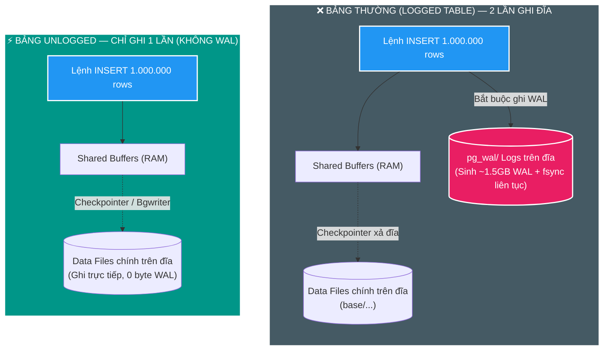
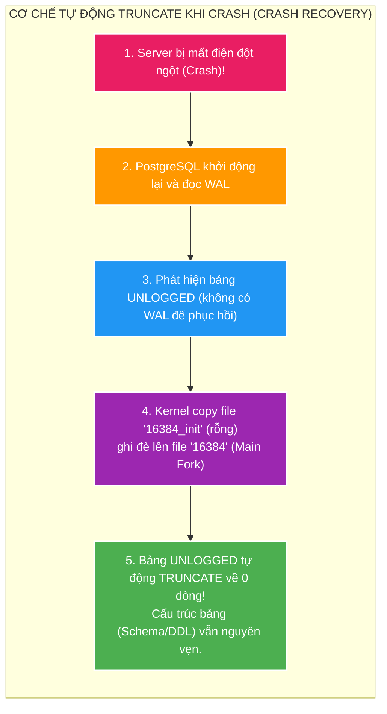

# ⚡ Deep-Dive: PostgreSQL UNLOGGED Tables & Transient Storage Internals

> **Mục tiêu học tập**: Bóc tách từ First Principles cơ chế hoạt động của `UNLOGGED TABLE` trong PostgreSQL Kernel: tại sao đạt tốc độ ghi gấp 3–5 lần bảng thường, cơ chế cấu trúc đĩa (`_init fork`), vòng đời khi xảy ra sự cố (Crash Truncation), phân biệt với `TEMPORARY TABLE` và quy tắc thiết kế kiến trúc an toàn cho bài toán 1.000.000 records.  
> **Tài liệu nền tảng liên quan**: Đọc trước [Bài 01: Write-Ahead Logging (WAL) & Storage Engine](./01-wal-and-storage-engine-internals.md).  
> **Áp dụng dự án**: `file_mngt_microservice` (`scan_inventory_stage`, `scan_inventory_diff_stage` trong `scan_db`).

---

> [!IMPORTANT]
> ### ⚡ Summary 30 Giây (Bản chất & Quy tắc Cốt lõi)
>
> - **Tại sao nhanh gấp 3–5x?**: Bỏ qua 100% việc ghi log WAL và gọi lệnh `fsync()` đĩa. Commit diễn ra tức thời trên RAM (`Shared Buffers`), nạp $1.000.000$ dòng qua `COPY` chỉ mất $\sim 1.8\text{ giây}$.
> - **Cơ chế khi Server Crash (`_init fork`)**: Postgres không thể khôi phục bảng này từ WAL. Khi restart, Kernel chép file `_init` (rỗng) đè lên file dữ liệu $\implies$ **Bảng tự động TRUNCATE sạch về 0 dòng** (Schema DDL và Index vẫn còn nguyên).
> - **Khi nào NÊN dùng?**: Bàn nháp nạp tạm (Staging/Scratchpad như `scan_inventory_stage`), bảng tính toán trung gian (Materialized cache), Web session mà dữ liệu có thể tạo lại được.
> - **Khi nào CẤM dùng?**: Dữ liệu thật (Canonical Source of Truth), hệ thống có Read Replicas (trên máy Standby bảng này **luôn luôn RỖNG** do không có WAL để replicate).

---

## 1. D0 — Bản chất vấn đề: Gánh nặng I/O của Bảng Thông Thường (Logged Table)

Như đã phân tích ở [Bài 01](./01-wal-and-storage-engine-internals.md), khi ghi dữ liệu vào một bảng thông thường trong PostgreSQL, hệ thống phải thực hiện đồng thời **2 luồng ghi dữ liệu**:
1. **Ghi vào Shared Buffers (RAM)** $\to$ Sửa Data Page 8KB và Index Pages.
2. **Ghi vào WAL Log (Đĩa)** $\to$ Tạo các bản ghi nhật ký tuần tự và gọi lệnh `fsync()` đẩy xuống đĩa cứng để đảm bảo tính Bền vững (Durability).



### 💥 Nghịch lý của Dữ liệu Tạm (Transient / Scratchpad Data):
Trong các tác vụ như **Quét 1 triệu file (Scan)** hoặc **ETL / Data Ingestion**:
- Bảng `scan_inventory_stage` chỉ là **bàn nháp tạm thời**: hứng dữ liệu từ đĩa $\to$ chạy phép Anti-Join $\to$ sau đó xóa sạch (`DELETE / TRUNCATE`).
- Dữ liệu này **hoàn toàn có thể tạo lại từ đầu** bằng cách quét lại ổ đĩa nếu server gặp sự cố.
- **Nếu dùng Bảng thường**: Chúng ta lãng phí $1,5\text{GB}$ ghi đĩa WAL, chiếm dụng I/O bus, kích hoạt Forced Checkpoint và làm nghẽn toàn bộ hệ thống chỉ để bảo vệ một mớ "dữ liệu nháp"!

👉 **Giải pháp của PostgreSQL**: Từ khóa **`CREATE UNLOGGED TABLE`**.

---

## 2. D1 — Tại sao UNLOGGED Table lại Siêu Tốc? (Cơ chế Kernel)

Một bảng được khai báo `UNLOGGED` đạt tốc độ ghi gấp **3–5 lần** (thậm chí 10 lần nếu có Index) so với bảng thường nhờ **4 sự giải phóng I/O cốt lõi**:

### 1. Triệt tiêu 100% chi phí ghi WAL (`0 Byte WAL Overhead`)
- Mọi thao tác `INSERT`, `UPDATE`, `DELETE` trên bảng `UNLOGGED` **không bao giờ sinh ra bất kỳ bản ghi WAL nào**.
- Không gọi lệnh hệ điều hành `fsync()` mỗi khi commit transaction $\implies$ Transaction commit diễn ra tức thời trong RAM.

### 2. Loại bỏ hiện tượng "Write Amplification" trên Index
- Trên bảng thường, mỗi lần sửa đổi một cột có đánh Index, PostgreSQL vừa phải cập nhật B-Tree Index trên RAM, vừa phải ghi hàng loạt WAL records mô tả thao tác chia nhánh cây (Page Split).
- Trên bảng `UNLOGGED`, các Index (B-Tree, Hash, GIN) gắn với bảng cũng **tự động trở thành UNLOGGED** $\implies$ Không phát sinh WAL cho Index.

### 3. Giảm tải Checkpoint & Tránh Checkpoint Stall
- Tiến trình `Checkpointer` không bị ép phải gom xả đĩa khẩn cấp vì dung lượng WAL của hệ thống không bị tăng lên.

### 4. Tận dụng tối đa Băng thông Bộ nhớ (Memory-speed Ingestion)
- Khi kết hợp `UNLOGGED TABLE` với lệnh `COPY FROM STDIN` nhị phân, dữ liệu được truyền thẳng vào Data Pages trên `Shared Buffers` với tốc độ lên tới **$\sim 300.000\text{ rows/giây}$**!

---

> [!TIP]
> ### 💡 Từ điển Thuật ngữ & Mental Model (UNLOGGED Internals)
>
> 1. **UNLOGGED Table (Bảng không ghi nhật ký phục hồi)**:
>    - **Nghĩa tiếng Anh thuần**: `Un` là *không*; `Logged` là *được ghi vào sổ nhật ký*.
>    - **Trong ngữ cảnh dự án**: Bảng tạm chung trong database, bỏ qua cơ chế WAL để tối đa hóa tốc độ ghi dữ liệu nháp.
>    - **💡 Cách liên tưởng**: *"Bảng phấn trong lớp học: Thầy cô viết nháp bài toán lên bảng phấn (UNLOGGED) để tính toán nhanh, xong việc thì xóa đi; không cần chép từng nét phấn vào sổ lưu trữ vĩnh viễn (WAL)"*.
>
> 2. **Write Amplification (Hệ số khuếch đại ghi đĩa)**:
>    - **Nghĩa tiếng Anh thuần**: `Write` là *ghi*; `Amplification` là *sự khuếch đại / phóng đại*.
>    - **Trong ngữ cảnh dự án**: Bạn chỉ ghi 100 bytes dữ liệu, nhưng hệ thống phải ghi thêm 500 bytes WAL log và 200 bytes Index log xuống đĩa. `UNLOGGED` triệt tiêu hoàn toàn sự khuếch đại này.
>    - **💡 Cách liên tưởng**: *"Mua một món đồ chơi nhỏ (100g) nhưng đóng gói qua 3 lớp hộp carton to tướng (500g) khiến chi phí vận chuyển tăng vọt"*.

---

## 3. D2 — Cơ chế Vòng đời Vật lý trên Đĩa & Trực giác về `_init Fork`

Để hiểu điều gì xảy ra khi Database bị sập nguồn (Crash), ta cần giải phẫu cách PostgreSQL lưu trữ file của một bảng `UNLOGGED` trên ổ cứng:

```text
Thư mục dữ liệu PostgreSQL: /var/lib/postgresql/data/base/<db_id>/
├── 16384           <-- Main Fork (Chứa dữ liệu thực tế của bảng)
├── 16384_fsm       <-- Free Space Map Fork (Bản đồ vùng nhớ trống)
├── 16384_vm        <-- Visibility Map Fork (Bản đồ hiển thị MVCC)
└── 16384_init      <-- Init Fork (File rỗng đặc biệt CHỈ CÓ ở UNLOGGED table!)
```



### 🛡️ Điều gì xảy ra khi Server bị Crash / Restart?
1. **Khi tắt máy an toàn (Clean Shutdown)**: PostgreSQL xả toàn bộ Dirty Pages của bảng `UNLOGGED` xuống đĩa $\implies$ **Dữ liệu vẫn còn nguyên** sau khi bật lại!
2. **Khi sập nguồn đột ngột (Crash / Power Loss)**:
   - Vì không có WAL, PostgreSQL không thể biết các Data Pages trên đĩa có bị phân mảnh hay lỗi thời không.
   - Trong quá trình Crash Recovery, PostgreSQL lấy file **`_init fork` (file rỗng)** chép đè lên file dữ liệu chính $\implies$ **Toàn bộ dữ liệu trong bảng bị xóa sạch (Tự động TRUNCATE về 0 bản ghi)**.
   - **Lưu ý**: Khung bảng (DDL Schema), tên cột, kiểu dữ liệu và Index **vẫn còn nguyên vẹn 100%**, sẵn sàng nhận dữ liệu mới.

---

## 4. D3 — So Sánh Toàn Diện: `LOGGED` vs `UNLOGGED` vs `TEMPORARY` vs `REDIS`

| Đặc tính Kỹ thuật | Regular Logged Table | UNLOGGED Table | TEMPORARY Table | Redis / In-Memory Cache |
| :--- | :---: | :---: | :---: | :---: |
| **Ghi WAL Log?** | Có (100% Durable) | **Không (0 Byte WAL)** | Không (0 Byte WAL) | Tùy chọn (AOF / RDB) |
| **Tốc độ Ghi** | Chuẩn | **Cực nhanh (Gấp 3–5x)** | Rất nhanh | Siêu tốc (RAM) |
| **Phạm vi Truy cập (Scope)** | Toàn cục (Mọi Session/Connection) | **Toàn cục (Shared across Sessions)** | Cục bộ (Chỉ 1 DB Connection) | Toàn hệ thống qua Network |
| **Sống sót qua Crash?** | Có (REDO từ WAL) | **Không (Tự động TRUNCATE)** | Không (Mất khi đứt kết nối) | Tùy cấu hình Persistence |
| **Hỗ trợ SQL / Anti-Join?** | Đầy đủ SQL | **Đầy đủ SQL Engine & Index** | Đầy đủ SQL | Hạn chế (Key-Value) |
| **Replication sang Standby?** | Có (Truyền qua WAL) | **KHÔNG (Rỗng trên Standby)** | Không | Phụ thuộc Redis Cluster |

---

## 5. D4 — Ma Trận Quyết Định Kiến Trúc (Architecture Decision Matrix)

### ✅ KHI NÀO NÊN SỬ DỤNG `UNLOGGED TABLE`?

1. **Staging / Scratchpad Table trong Pipeline Xử Lý Lớn (Dự án chúng ta)**:
   - Nạp triệu file từ ổ cứng vào để chạy `NOT EXISTS / Anti-Join` lọc dữ liệu mới/đổi.
   - Nếu sập nguồn giữa chừng: Tiến trình quét chỉ cần đánh dấu `FAILED` và chạy lại từ đầu (Idempotent Job).
2. **Bảng Cache / Tính toán Trung gian Phức tạp (Materialized Cache)**:
   - Gom nhóm dữ liệu thống kê phức tạp từ nhiều bảng, có thể tính toán lại bằng cronjob định kỳ.
3. **Session State / Web Token Storage trong Database**:
   - Lưu session đăng nhập của người dùng nếu chấp nhận rủi ro khi DB crash thì user phải đăng nhập lại.

---

### ❌ KHI NÀO TUYỆT ĐỐI KHÔNG ĐƯỢC DÙNG `UNLOGGED TABLE`?

1. **Dữ liệu Nguồn Sự Thật (Canonical / Source of Truth)**:
   - `scan_file_inventory`, `scan_proposal`, `scan_decision`, `catalog_asset`.
   - Mất dữ liệu này là mất mát tài sản vĩnh viễn không thể khôi phục!
2. **Hệ thống có Cụm Đọc Phân Tán (Read Replicas / Streaming Replication)**:
   - Vì bảng `UNLOGGED` không sinh WAL nên **không được replicate sang các máy Standby/Replica**.
   - Trên các máy Replica, bảng `UNLOGGED` **luôn luôn ở trạng thái RỖNG (0 dòng)**! Bất kỳ câu `SELECT` nào gửi sang Replica đều trả về rỗng.
3. **Dữ liệu yêu cầu Sao lưu Phục hồi theo Thời gian (Point-in-Time Recovery - PITR)**:
   - Các công cụ backup dựa trên WAL (`pg_basebackup`, `WAL-G`) sẽ bỏ qua toàn bộ dữ liệu của bảng `UNLOGGED`.

---

## 6. D5 — Ứng Dụng Thực Chiến Trong Dự Án `scan-service`

Trong `file_mngt_microservice`, bảng staging được thiết kế trong Flyway migration:

```sql
-- Migration: apps/scan-service/src/main/resources/db/migration/V2__create_scan_inventory_stage.sql

CREATE UNLOGGED TABLE IF NOT EXISTS scan_inventory_stage (
    id UUID PRIMARY KEY DEFAULT gen_random_uuid(),
    scan_run_id UUID NOT NULL,
    root_key VARCHAR(255) NOT NULL,
    source_relative_path VARCHAR(1000) NOT NULL,
    file_size BIGINT NOT NULL,
    file_modified_at TIMESTAMPTZ NOT NULL,
    created_at TIMESTAMPTZ NOT NULL DEFAULT now()
);

CREATE INDEX IF NOT EXISTS idx_scan_stage_run_path 
ON scan_inventory_stage (scan_run_id, root_key, source_relative_path);
```

### 🎯 Phân Tích Lợi Ích Trong Bài Toán 1 Triệu Files (SC-01):
1. **Tiết kiệm $1,5\text{GB}$ WAL log** cho mỗi lần chạy quét.
2. **Thời gian nạp 1M rows qua `PostgresCsvCopy`**: Chỉ mất **`1,8 – 2,2 giây`** (thay vì 12–15 giây nếu dùng bảng thường).
3. **Khả năng chia sẻ Connection Pool**: Vì là `UNLOGGED` (chứ không phải `TEMPORARY`), nhiều Virtual Threads và Connection khác nhau trong Pool của HikariCP đều có thể cùng truy cập và chia sẻ chung một bảng staging theo `scan_run_id`.

---

## 7. Cầu Nối Phỏng Vấn Kiến Trúc Sư Hệ Thống (Senior / Architect)

### 🎙️ Câu hỏi 1: *"Tại sao không dùng TEMPORARY TABLE mà lại dùng UNLOGGED TABLE cho tầng Staging của Microservice?"*
- **Trả lời**: *"Temporary Table chỉ tồn tại trong phạm vi của đúng 1 Database Connection (Session). Trong kiến trúc Spring Boot với HikariCP Connection Pool, tiến trình nạp dữ liệu (COPY), tiến trình phân tích (Diff) và tiến trình Commit thường lấy các Connection khác nhau từ Pool. Bảng `UNLOGGED TABLE` là bảng toàn cục (Global Schema) nên mọi connection đều truy cập được, nhưng vẫn giữ được ưu điểm triệt tiêu WAL như Temp Table."*

### 🎙️ Câu hỏi 2: *"Nếu hệ thống có Read Replica, điều gì sẽ xảy ra nếu ta SELECT từ một bảng UNLOGGED trên máy Replica?"*
- **Trả lời**: *"Nó sẽ luôn trả về 0 dòng (kết quả rỗng). Lý do là PostgreSQL Streaming Replication truyền dữ liệu qua WAL Log. Bảng UNLOGGED không sinh WAL nên máy Standby chỉ khởi tạo file `_init fork` rỗng. Do đó, mọi câu query đọc bảng UNLOGGED bắt buộc phải hướng về máy Primary (Master)."*
