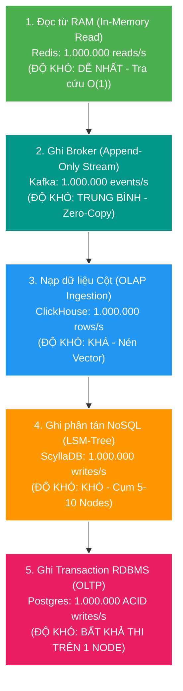
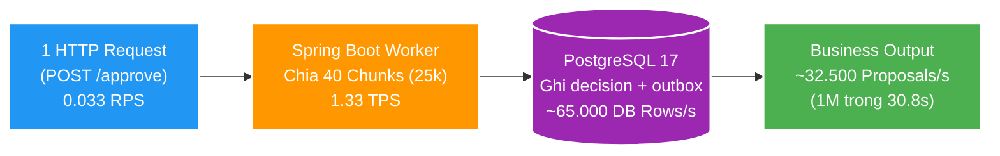
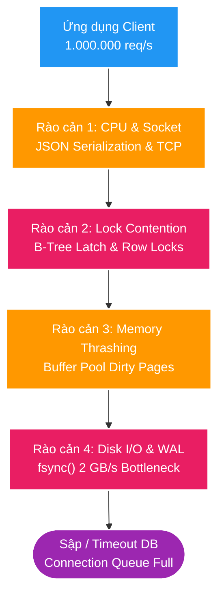
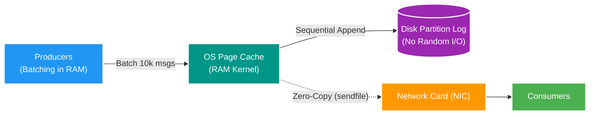
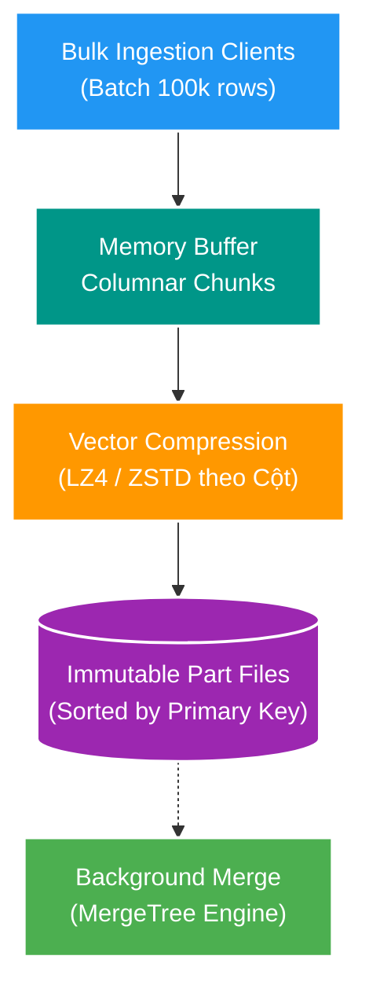
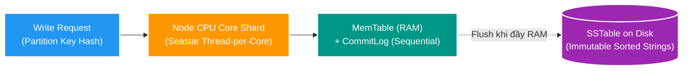
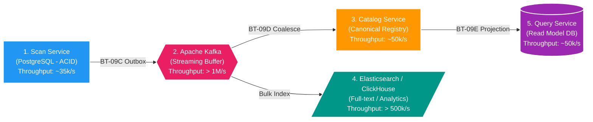

# 🗄️ Deep-Dive: Giới Hạn Vật Lý RDBMS vs Kiến Trúc Xử Lý Triệu Records/Giây (1M+ Records/s)

> **Mục tiêu topic**: Bóc tách từ First Principles bản chất của hiệu năng ghi trong cơ sở dữ liệu: Tại sao mức throughput **~32.500 records/s** (30,8 giây cho 1M proposals) trong Backend V2 là **Sweet Spot đỉnh cao** của kiến trúc Single RDBMS + ACID Transactional Outbox? Tại sao RDBMS không thể đạt 1.000.000 records/s trên một node và các hệ thống thực tế (Kafka, ClickHouse, ScyllaDB) đã thay đổi mô hình kiến trúc như thế nào để vượt qua rào cản triệu bản ghi/giây?

---

## 🧭 Bản Chất Trong Một Câu (Core Essence)

> **RDBMS (như PostgreSQL) được thiết kế tối ưu cho Tính Toàn Vẹn & Khả Năng Truy Vấn Phức Tạp (ACID, B-Tree, Row Locks), trong khi các hệ thống đạt Triệu Records/s (Kafka, ClickHouse, ScyllaDB) từ bỏ khóa dòng và giao dịch ACID chặt để chuyển sang cơ chế Ghi Nối Đuôi Tuần Tự (Append-Only Log / LSM-Tree) và Phân Mảnh Đa Node (Sharding).**

```text
Từ khóa cốt lõi (Keyword Spine):
[Single RDBMS Ceiling] ──> [WAL & B-Tree Locks] ──> [Append-Only & LSM-Tree] ──> [Zero-Copy & Vectorization] ──> [Architectural Trade-offs]
```

---

## 📚 1. Từ Điển Thuật Ngữ & Mental Model (Gốc Từ & Liên Tưởng)

| Thuật ngữ kỹ thuật | Nghĩa bản chất & Ngữ cảnh hệ thống | Hình ảnh liên tưởng đời sống |
| :--- | :--- | :--- |
| **ACID Transaction** | Bộ 4 đặc tính bảo vệ tính đúng đắn dữ liệu: Nguyên tử, Nhất quán, Cô lập, Bền vững. | Như việc đi công chứng giấy tờ nhà đất: Mọi thủ tục phải kiểm tra chéo, đóng dấu đỏ từng trang, không được phép sai sót. |
| **Write-Ahead Logging (WAL)** | Cơ chế ghi nhật ký thay đổi tuần tự xuống đĩa trước khi sửa data page trong RAM để chống mất dữ liệu khi sập nguồn. | Như cuốn sổ nhật ký thu chi của thủ quỹ ghi lại từng giao dịch ngay khi nhận tiền trước khi cất tiền vào két. |
| **B-Tree Index Lock** | Khóa trang bộ nhớ (Page Latch/Lock) để cập nhật cây chỉ mục tìm kiếm khi chèn dòng mới. | Như việc sắp xếp thẻ học sinh vào tủ hồ sơ: Mỗi khi thêm 1 thẻ mới đúng thứ tự A-Z, thủ thư phải giữ ngăn kéo đó không cho ai khác chạm vào. |
| **Append-Only Log** | Cấu trúc dữ liệu chỉ ghi nối tiếp vào cuối file, không bao giờ sửa hoặc xóa dữ liệu cũ tại chỗ (No In-place Update). | Như cuộn băng cassette hoặc cuộn giấy in hóa đơn: Chỉ in tiếp dòng mới xuống dưới, không bao giờ quay lại tẩy xóa dòng trước. |
| **LSM-Tree (Log-Structured Merge)** | Cấu trúc lưu trữ ghi đệm vào RAM (`MemTable`), ghi log tuần tự (`CommitLog`), sau đó định kỳ xả thành các file bất biến (`SSTable`) xuống đĩa. | Như gom tài liệu trên bàn làm việc vào từng thùng carton xếp chồng lên nhau, lâu lâu mới gom nhiều thùng lại phân loại một lần. |
| **Columnar Storage** | Lưu trữ dữ liệu theo từng cột thay vì từng dòng, giúp nén cực cao và đọc/ghi theo mảng byte lớn. | Thay vì đóng gói từng giỏ quà gồm (bánh, kẹo, rượu), ta xếp 1 triệu gói bánh vào 1 khoang, 1 triệu chai rượu vào 1 khoang để xếp khít nhất có thể. |
| **Zero-Copy I/O** | Kỹ thuật truyền dữ liệu trực tiếp từ Disk Cache sang Network Socket ở tầng OS Kernel mà không qua RAM của ứng dụng (User Space). | Như đường ống dẫn dầu thẳng từ tàu vào bể chứa, không cần công nhân múc từng xô đổ qua lại trên cầu cảng. |

---

## 📐 2. Giải Mã "1 Triệu/Giây": Kim Tự Tháp Độ Khó & Phân Biệt RPS, TPS, Records/s

Khi ai đó nói *"hệ thống xử lý 1 triệu bản ghi/giây"*, nếu không đặt trong ngữ cảnh cụ thể thì rất dễ bị ngộ nhận, bởi vì **1 triệu cái gì** và **làm hành động gì** có độ phức tạp và chi phí phần cứng chênh nhau hàng ngàn lần.

### 2.1. Kim Tự Tháp Độ Khó Của "1 Triệu/Giây"



### 2.2. Phân Biệt Các Chỉ Số Đo Lường (Metrics Disambiguation)

| Chỉ số | Tên đầy đủ | Ý nghĩa bản chất | Mối quan hệ với Record |
| :--- | :--- | :--- | :--- |
| **RPS** | **Requests Per Second** | Số lượng **yêu cầu HTTP/gRPC** client gửi lên API gateway mỗi giây. | **1 Request có thể chứa 0, 1 hoặc 1.000.000 records.** |
| **QPS** | **Queries Per Second** | Số lượng câu truy vấn (SELECT/DML) Database thực thi mỗi giây. | 1 Query có thể là `SELECT 1` hoặc `SELECT` trả về 50.000 dòng. |
| **TPS** | **Transactions Per Second** | Số lượng **giao dịch ACID (`BEGIN...COMMIT`)** CSDL hoàn tất thành công mỗi giây. | 1 Transaction có thể chèn 1 dòng lẻ hoặc chèn **25.000 dòng/chunk**. |
| **Records/s (Rows/s)** | **Throughput Bản Ghi** | Số lượng **đơn vị dữ liệu nghiệp vụ** thực tế được hệ thống xử lý trong 1 giây. | Phản ánh khối lượng công việc thực sự của CPU & Storage. |
| **IOPS** | **I/O Operations Per Sec** | Số lần phần cứng ổ đĩa (SSD/NVMe) đọc/ghi block $4\text{KB}/8\text{KB}$ mỗi giây. | 1 Transaction commit sinh ra từ 2 đến 10 IOPS xuống đĩa. |

### 2.3. Bóc Tách Thực Tế Từ Dự Án Backend V2 (`file-mngt-be-v2`)

Khi Admin bấm nút **"Duyệt 1.000.000 proposals"** trong FT-051:



- **RPS (Request/s)**: Hệ thống chỉ ghi nhận **$0.033\text{ RPS}$** (1 request chạy mất 30.8 giây $\rightarrow 1 / 30.8 = 0.033$).
- **TPS (Transaction/s)**: Đạt **$1.33\text{ TPS}$** (40 transactions chunk commit trong 30.8 giây).
- **DB Rows Ingestion**: PostgreSQL thực tế đang nạp **$\approx 65.000\text{ rows/s}$** ($32.500\text{ decisions} + 32.500\text{ outbox events}$ mỗi giây).
- **Business Throughput**: Hệ thống đạt **$\approx 32.500\text{ proposals/s}$**.

> 💡 **Quy tắc khi nói về hiệu năng trong System Design**: Luôn đi kèm 3 thông số: **(1) Thao tác là gì?** (Đọc RAM, Quét Log, Ghi ACID), **(2) Kích thước Payload bao nhiêu?**, và **(3) Mức độ cam kết (Guarantee) là gì?** (ACID tức thì hay Eventual Consistency).

---

## 🛑 3. Phân Tích 4 Rào Cản Vật Lý Khiến RDBMS Không Thể Đạt 1M Records/s Trên 1 Node

Khi chèn 1.000.000 records/s vào PostgreSQL, một node server đơn lẻ sẽ lập tức va phải **4 bức tường vật lý**:



### 1. Băng thông Đĩa & Nút thắt Tuần Tự WAL (`fsync`)
- Trong dự án V2, mỗi proposal duyệt sinh ra: 1 dòng `scan_decision` + 1 dòng `scan_outbox_event` (chứa JSON payload ~800 bytes).
- Ghi 1.000.000 records/s đồng nghĩa ghi **2.000.000 dòng/s** $\approx$ **1.5 GB – 2.0 GB dữ liệu thô mỗi giây**.
- PostgreSQL bắt buộc phải ghi toàn bộ thay đổi này vào file WAL và gọi system call `fsync()` để bảo đảm tính bền vững (Durability).
- **Giới hạn vật lý**: Bộ ghi WAL của PostgreSQL hoạt động theo cơ chế đơn luồng tuần tự (`WALWriter`). Ổ đĩa NVMe SSD PCIe 4.0 cao cấp nhất hiện nay cũng chỉ đạt tốc độ ghi ngẫu nhiên/tuần tự kèm `fsync` liên tục ở mức 50.000 – 100.000 IOPS. Việc nhồi 2 triệu IOPS/s vào 1 WAL pipeline sẽ làm tràn `WAL buffers` và đóng băng toàn bộ hệ thống.

### 2. Tranh chấp Khóa Cây Chỉ Mục B-Tree (Lock Contention)
- Một bảng nghiệp vụ chuẩn luôn có Primary Key, Foreign Key và các Index tìm kiếm (ví dụ: `idx_scan_proposal_run_id`, `idx_outbox_status`).
- Khi 1.000.000 dòng được chèn mỗi giây, các luồng ghi phải liên tục cập nhật và tách nút cây B-Tree (Page Splits).
- Để bảo vệ cấu trúc cây không bị hỏng, PostgreSQL sử dụng các khóa nhẹ (`LWLock` / Buffer Pin) trên từng trang 8KB. Khi có quá nhiều kết nối cùng ghi vào một vùng chỉ mục, hiện tượng **Lock Thrashing** xảy ra: CPU dành 90% thời gian chỉ để chờ nhả lock thay vì ghi dữ liệu thật (đây là lý do thực nghiệm `shardCount=8` trong FT-051 bị transaction timeout).

### 3. Giao thức Mạng & Chi phí Serialization (Network & Socket Overhead)
- Việc gửi 1 triệu payload qua JDBC đòi hỏi:
  - Phân tách gói tin TCP (Packet framing).
  - Copy bộ nhớ từ JVM Heap $\rightarrow$ Native Memory $\rightarrow$ OS Kernel Socket Buffer $\rightarrow$ Network Card $\rightarrow$ PostgreSQL Backend Process.
- Băng thông mạng nội bộ cần thiết tối thiểu: $1.000.000 \times 1.5\text{ KB} \times 8 \approx \mathbf{12\text{ – }18\text{ Gbps}}$ chỉ riêng cho đường truyền DB.

### 4. Áp lực Dọn Rác JVM (Garbage Collection Pressure)
- Tạo 1.000.000 Java DTO và serialize ra JSON String mỗi giây sẽ ngốn khoảng **2 – 4 GB RAM/giây** trên JVM. Bộ dọn rác (GC) dù dùng ZGC hay G1GC cũng sẽ bị quá tải (GC Spikes), dẫn đến Stop-The-World pauses làm đứt gãy kết nối cơ sở dữ liệu.

---

## 🚀 4. Các Hệ Thống Thực Tế Đạt Triệu Records/Giây Bằng Cách Nào?

Để đạt thông lượng từ **1.000.000 đến 10.000.000+ records/s**, các công nghệ chuyên biệt đã thay đổi hoàn toàn kiến trúc phần mềm và tận dụng triệt để phần cứng.

---

### Case Study 1: Apache Kafka — Thông lượng 1M – 7M Messages/giây
*Dẫn chứng thực tế*: Cụm Kafka tại **LinkedIn** xử lý hơn **7 nghìn tỷ messages/ngày** (>80 triệu msgs/s toàn cụm; mỗi broker lớn gánh 1.5 triệu msgs/s). **Uber** xử lý hàng triệu sự kiện GPS và chuyến đi mỗi giây qua Kafka.



#### Bí quyết kiến trúc của Kafka:
1. **Sequential Disk I/O**: Kafka chỉ ghi nối đuôi vào file log phân vùng (`.log`). Tốc độ ghi tuần tự của ổ đĩa nhanh gần bằng RAM (đạt 500 MB – 1 GB/s trên đĩa thường và > 3 GB/s trên NVMe).
2. **Tận dụng OS Page Cache**: Kafka chạy trên JVM nhưng không cache dữ liệu trên Java Heap (tránh GC). Dữ liệu được đẩy thẳng vào `Page Cache` của Linux Kernel.
3. **Zero-Copy Optimization**: Khi gửi dữ liệu cho Consumer, Kafka dùng system call `sendfile()`. Dữ liệu đi thẳng từ Page Cache ra Network Card mà không cần copy ngược lại vào không gian ứng dụng của JVM.
4. **Không có B-Tree hay Update**: Không có index động, không khóa dòng, không sửa đổi dữ liệu đã ghi (Immutable Data).

---

### Case Study 2: ClickHouse — Ingestion 1M – 5M Rows/giây
*Dẫn chứng thực tế*: **Cloudflare** sử dụng ClickHouse để phân tích lưu lượng mạng toàn cầu với tốc độ nạp **> 5.000.000 rows/s trên mỗi server**. ClickHouse benchmark chính thức đạt 1.5 – 2 triệu rows/s nạp dữ liệu trên máy chủ 32 cores NVMe.



#### Bí quyết kiến trúc của ClickHouse:
1. **Lưu trữ dạng cột (Columnar Storage)**: Dữ liệu của cùng 1 cột được lưu liền kề nhau trên đĩa. Do các giá trị cùng kiểu dữ liệu, tỷ lệ nén (Compression Ratio) đạt 80% – 90% bằng thuật toán LZ4/ZSTD.
2. **MergeTree Engine**: ClickHouse không ghi từng dòng lẻ. Client bắt buộc gom batch lớn (10.000 – 100.000 rows). Khi nhận batch, ClickHouse nén và ghi ra 1 file part bất biến trên đĩa. Một background thread sẽ từ từ gom (merge) các part nhỏ thành part lớn.
3. **Vectorized Query Execution**: Tận dụng tập lệnh SIMD của CPU (AVX-512) để xử lý hàng ngàn mảng dữ liệu trong 1 chu kỳ xung nhịp CPU.

---

### Case Study 3: ScyllaDB / Apache Cassandra — Ghi 1M+ Ops/giây
*Dẫn chứng thực tế*: **Discord** lưu trữ hàng trăm tỷ tin nhắn chat bằng Cassandra và ScyllaDB. ScyllaDB đạt **1.000.000 IOPS/giây** trên cụm chỉ gồm 3 node máy chủ (độ trễ P99 < 1ms).



#### Bí quyết kiến trúc của ScyllaDB:
1. **Kiến trúc Share-Nothing & Thread-Per-Core**: Viết bằng C++ trên nền framework Seastar. Mỗi CPU core sở hữu độc quyền một vùng nhớ RAM và ổ đĩa riêng, hoàn toàn **không dùng Mutex Lock hay Context Switch**.
2. **Cấu trúc LSM-Tree**: Mọi thao tác ghi được nạp tức thì vào `MemTable` trong RAM và ghi nối đuôi vào `CommitLog`. Không bao giờ ghi đè trực tiếp lên đĩa, giải phóng hoàn toàn sức ép I/O ngẫu nhiên.
3. **Khả năng Scale Ngang Tuyến Tính**: Càng thêm node, thông lượng tăng tuyến tính mà không bị thắt cổ chai ở một master node trung tâm.

---

## 📊 5. Ma Trận So Sánh Toàn Diện Các Mô Hình Kiến Trúc

| Tiêu chí | RDBMS (PostgreSQL) | Event Stream (Kafka) | OLAP Database (ClickHouse) | Distributed NoSQL (ScyllaDB) |
| :--- | :--- | :--- | :--- | :--- |
| **Thông lượng ghi (1 Node)** | **10.000 – 40.000 /s** | **1.000.000+ /s** | **1.000.000 – 5.000.000 /s** | **300.000 – 1.000.000 /s** |
| **Mô hình cấu trúc dữ liệu** | B-Tree + Row Storage | Append-only Commit Log | Columnar Chunked Storage | LSM-Tree (MemTable + SSTable) |
| **Cơ chế Transaction** | ACID nghiêm ngặt (Pessimistic / Locks) | Không (Offset checkpoint) | Không (Eventual Consistency per Part) | ACID cấp partition (Lightweight Tx) |
| **Khả năng Update / Delete** | Rất mạnh (In-place MVCC) | Không (Chỉ Append, Compaction) | Chậm (Phải qua Alter/Mutation Batch) | Append Tombstone (Xóa bằng đánh dấu) |
| **Khả năng truy vấn linh hoạt** | SQL đầy đủ, Complex JOIN, Index | Rất hạn chế (Chỉ đọc theo Offset) | SQL phân tích cực mạnh trên dữ liệu cột | Tra cứu nhanh theo Partition Key / Range |
| **Điểm nghẽn chính (Bottleneck)** | Disk WAL fsync & B-Tree Lock | Băng thông mạng (NIC Bandwidth) | RAM buffering & Batch Size | Kích thước đĩa khi Compaction |

---

## 🎯 6. Nhìn Nhận Thực Tế Cho Dự Án Backend V2 & Lời Khuyên Cho Architect

### Tại sao ~32.500 records/s là Điểm Cân Bằng Hoàn Hảo (Sweet Spot) cho V2?

Trong dự án `file-mngt-be-v2`, `scan-service` không phải là một công cụ phân tích log thuần túy hay một event broker. Nó là **Trọng tâm Nghiệp vụ (Transactional Source of Truth)**:
- Nó cần đảm bảo: Khi bấm "Approve 1M files", nếu hệ thống sập nguồn ở giây thứ 15, **không một file nào bị ghi trùng hay mất mát dữ liệu** (nhờ Transactional Outbox và Shard Ledgers).
- Thời gian **30,8 giây** cho 1 triệu bản ghi đã giúp người dùng phê duyệt toàn bộ ổ cứng 1 triệu tệp tin gần như ngay lập tức dưới góc độ tương tác ứng dụng.

### Kiến Trúc Mở Rộng Theo Từng Chặng (Separation of Concerns):

Thay vì cố ép một cơ sở dữ liệu quan hệ phải làm điều trái với bản chất vật lý của nó (đạt 1M records/s), một Software Architect sẽ phân chia tải theo từng tầng chuyên biệt:



1. **Tầng Giao dịch (Transactional Core)**: Dùng **PostgreSQL** để giữ đúng nghiệp vụ, tận dụng `COPY` và Logical Sharding để đạt đỉnh ~35k records/s (xong trong 30s).
2. **Tầng Vận chuyển & Giảm tải (Streaming Buffer)**: Dùng **Kafka** với throughput hàng triệu msgs/s làm vùng đệm điều hòa lưu lượng (Backpressure), chống sập các service phía sau.
3. **Tầng Hội tụ & Chiếu dữ liệu (Catalog & Query)**: Gom cụm (Coalesce) 1 triệu events thành các snapshot thực tế để giảm tải số lượng ghi xuống DB đọc.
4. **Tầng Tìm kiếm & Phân tích (Search & OLAP)**: Đẩy sang **Elasticsearch / ClickHouse** để phục vụ tìm kiếm toàn văn và báo cáo với tốc độ hàng trăm ngàn lượt truy vấn/giây.

---

## 🔗 Liên Kết & Tài Liệu Tham Khảo:
- [FT-050: Approval Preparation & Persistence Acceleration](../../../docs/features/050-approval-preparation-acceleration/02-design.md)
- [FT-051: Logical Approval Sharding Design & Benchmarks](../../../docs/features/051-logical-approval-sharding/02-design.md)
- [Database Internals Bài 01: Write-Ahead Logging & Storage Engine](./01-wal-and-storage-engine-internals.md)
- [System Design Reference: Figma Scaled PostgreSQL](../../references/system-design/distributed-databases/figma-scaled-postgresql/summary.md)
- [System Design Reference: Uber Kafka Reliable Reprocessing](../../references/system-design/event-driven/uber-kafka-reliable-reprocessing/summary.md)
