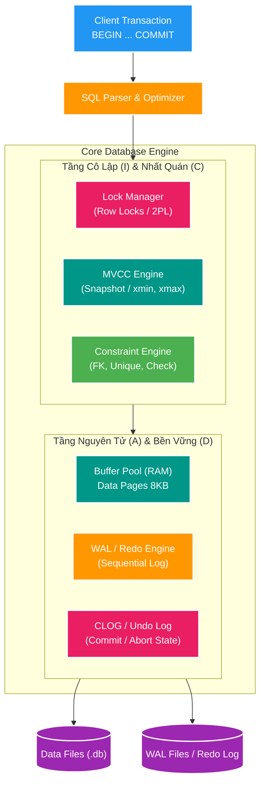
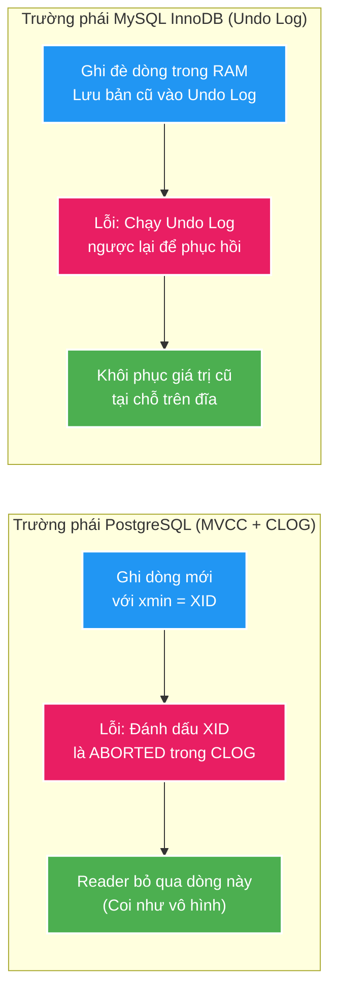
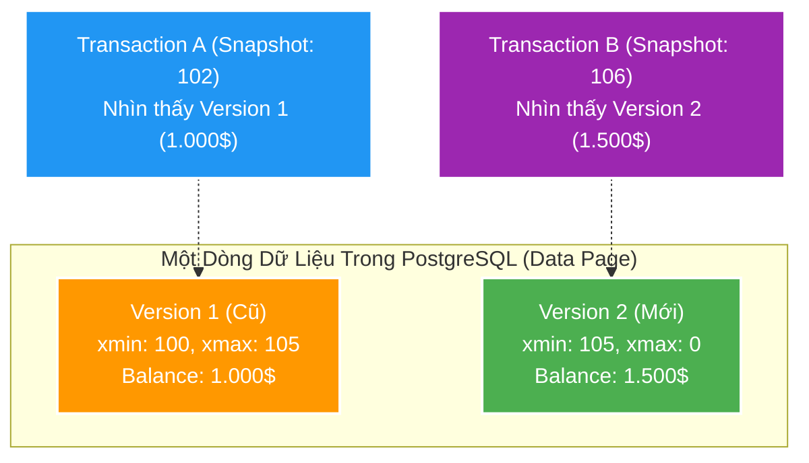
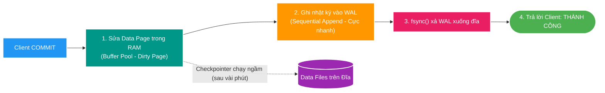
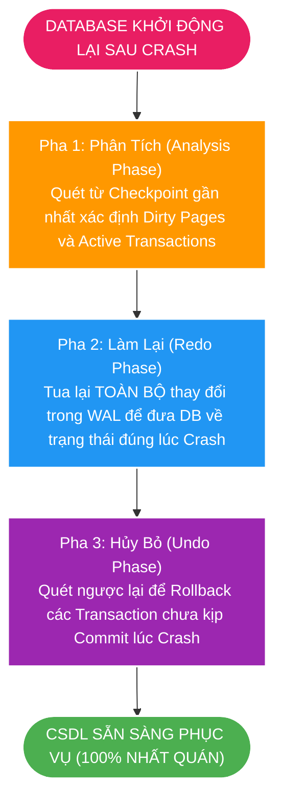

# 🗄️ Deep-Dive: Bí Mật Dưới Nắp Ca-pô của ACID — Cơ Chế & Kiến Trúc Bên Trong Cơ Sở Dữ Liệu

> **Mục tiêu topic**: Bóc tách từ First Principles toàn bộ kiến trúc bên trong (Internal Engine) của một Hệ quản trị cơ sở dữ liệu quan hệ (RDBMS như PostgreSQL / MySQL InnoDB). Trả lời cặn kẽ câu hỏi: **Bằng cách nào phần mềm có thể bảo đảm 100% 4 tính chất ACID (Atomicity, Consistency, Isolation, Durability) ngay cả khi gặp lỗi mạng, tranh chấp hàng ngàn luồng đồng thời hoặc sập nguồn đột ngột?**

---

## 🧭 Bản Chất Trong Một Câu (Core Essence)

> **ACID không phải là phép màu, mà là sự phối hợp chặt chẽ của 4 cỗ máy kiến trúc cốt lõi: MVCC & Undo Log (bảo đảm Atomicity), Schema Validation & B-Tree Locks (bảo đảm Consistency), Snapshot Isolation & Lock Manager (bảo đảm Isolation), và Write-Ahead Logging kết hợp thuật toán ARIES Crash Recovery (bảo đảm Durability).**

```text
Từ khóa cốt lõi (Keyword Spine):
[CLOG & Undo Log] ──> [B-Tree Constraint Engine] ──> [MVCC & 2PL Locks] ──> [WAL & ARIES Recovery] ──> [ACID Invariants]
```

---

## 🏗️ 1. Bản Đồ Kiến Trúc Tổng Thể: Cách RDBMS Hiện Thực Hóa ACID

Dưới đây là sơ đồ luồng hoạt động bên trong của một Database Engine khi một Transaction được thực thi:



---

## 🔍 2. Bóc Tách Chi Tiết 4 Cỗ Máy Thực Hiện Từng Chữ Cái ACID

---

### 🅰️ 1. Atomicity (Tính Nguyên tử) — Làm sao để "Tất cả hoặc Không có gì"?

#### Thách thức kỹ thuật:
Khi một transaction gồm 5 câu lệnh SQL, câu lệnh thứ 4 bị lỗi hoặc ứng dụng bị ngắt kết nối giữa chừng, làm sao DB xóa sạch các thay đổi của 3 câu lệnh trước đó mà không để lại rác?

#### Cơ chế giải quyết trong Database:

Có 2 trường phái thiết kế kiến trúc chính trong thế giới CSDL:



1. **Cơ chế CLOG / `pg_xact` (PostgreSQL)**:
   - Khi chạy `INSERT`/`UPDATE`, PostgreSQL ghi dòng mới vào trang dữ liệu với nhãn giao dịch `xmin = Transaction_ID`.
   - Nếu transaction bị `ROLLBACK`, PostgreSQL **không cần tốn công chạy đi xóa dữ liệu vừa ghi**. Thay vào đó, nó chỉ chuyển trạng thái của `Transaction_ID` trong mảng bit **Commit Log (CLOG)** từ `IN_PROGRESS` thành `ABORTED` (chỉ mất $1\text{ bit}$ trong RAM).
   - Mọi transaction khác khi đọc trang dữ liệu đó, thấy `xmin` là một giao dịch đã `ABORTED`, sẽ lập tức **bỏ qua dòng đó như thể nó chưa từng tồn tại**. Sau này tiến trình ngầm `VACUUM` sẽ dọn dẹp các dòng rác này.

2. **Cơ chế Undo Log (MySQL InnoDB / Oracle)**:
   - Trước khi sửa dữ liệu, DB ghi lại thao tác nghịch đảo vào **Undo Log** (ví dụ: muốn `UPDATE x=2 thành x=5` thì Undo Log lưu `x=2`; muốn `INSERT` thì Undo Log lưu lệnh `DELETE`).
   - Khi Rollback, DB duyệt ngược Undo Log từ dưới lên trên và chạy các thao tác hoàn tác để khôi phục dữ liệu về trạng thái cũ.

---

### 🅲 2. Consistency (Tính Nhất quán) — Làm sao để dữ liệu luôn đúng quy tắc?

#### Thách thức kỹ thuật:
Làm sao ngăn chặn các trạng thái dữ liệu vô lý (như số dư âm, 2 người cùng đăng ký 1 email, đơn hàng trỏ tới mã sản phẩm không tồn tại)?

#### Cơ chế giải quyết trong Database:

Tính nhất quán được xây dựng từ **2 tầng phòng thủ**:

```mermaid
flowchart TB
    DATA_INPUT["Dữ liệu chèn vào"] --> VAL_ENGINE{"Tầng 1: DB Constraints"}
    
    VAL_ENGINE -->|"Check Primary/Unique"| UNIQUE_CHECK["B-Tree Uniqueness Lock<br/>(Bắt lỗi Duplicate O(log N))"]
    VAL_ENGINE -->|"Check Foreign Key"| FK_CHECK["Shared Lock bảng cha<br/>(Bắt lỗi Orphan Record)"]
    VAL_ENGINE -->|"Check Condition"| CHECK_RULE["CHECK Constraint Validator<br/>(Ví dụ: balance &gt;= 0)"]
    
    UNIQUE_CHECK & FK_CHECK & CHECK_RULE --> APP_LAYER{"Tầng 2: App Invariants"}
    APP_LAYER -->|"Pessimistic Lock"| PESS_LOCK["SELECT FOR UPDATE<br/>(Bảo vệ Aggregate Root)"]
    APP_LAYER -->|"Optimistic Lock"| OPT_LOCK["Version Check (version = v+1)<br/>(Bảo vệ Lost Update)"]

    style DATA_INPUT fill:#2196F3,stroke:#fff,stroke-width:2px,color:#fff
    style VAL_ENGINE fill:#FF9800,stroke:#fff,stroke-width:2px,color:#fff
    style UNIQUE_CHECK fill:#E91E63,stroke:#fff,stroke-width:2px,color:#fff
    style FK_CHECK fill:#E91E63,stroke:#fff,stroke-width:2px,color:#fff
    style CHECK_RULE fill:#E91E63,stroke:#fff,stroke-width:2px,color:#fff
    style APP_LAYER fill:#009688,stroke:#fff,stroke-width:2px,color:#fff
    style PESS_LOCK fill:#4CAF50,stroke:#fff,stroke-width:2px,color:#fff
    style OPT_LOCK fill:#4CAF50,stroke:#fff,stroke-width:2px,color:#fff
```



1. **B-Tree Uniqueness Locking**: Khi tạo `UNIQUE` index, DB tạo cây B-Tree. Khi chèn khóa mới, DB tìm đến lá tương ứng và giữ khóa tạm thời (Index Latch). Nếu khóa đã tồn tại, nó ném lỗi `UniqueViolation` và hủy Transaction ngay lập tức.
2. **Foreign Key Triggers**: Khi chèn dòng con, DB bí mật đặt một Shared Lock (`FOR SHARE`) lên dòng cha tương ứng để đảm bảo dòng cha không bị xóa trong lúc dòng con đang được tạo.
3. **Application Invariants (Phối hợp với Domain Model)**: Với các quy tắc nghiệp vụ phức tạp (ví dụ: *"Tổng hạn mức thẻ tín dụng của 1 user qua 3 bảng không vượt quá 50 triệu"*), DB không tự hiểu được mà phải dùng cơ chế Khóa bi quan (`SELECT FOR UPDATE`) để khóa dòng User trước khi tính toán.

---

### 🅸 3. Isolation (Tính Cô lập) — Làm sao hàng ngàn luồng không giẫm chân nhau?

#### Thách thức kỹ thuật:
Nếu Transaction A đang tính tổng số tiền của toàn bộ khách hàng, cùng lúc đó Transaction B đang chuyển tiền giữa 2 tài khoản, làm sao A không bị tính sai (không thấy dữ liệu dở dang)?

#### Cơ chế giải quyết trong Database: **MVCC + Lock Manager**

Các RDBMS hiện đại sử dụng **MVCC (Multi-Version Concurrency Control)** với phương châm vàng:
> **"Người Đọc không bao giờ chặn Người Ghi — Người Ghi không bao giờ chặn Người Đọc"**



#### Cách Snapshot Isolation hoạt động:
1. Mỗi dòng trong bảng được gắn thêm 2 trường ẩn trong Tuple Header:
   - `xmin`: Transaction ID tạo ra dòng này.
   - `xmax`: Transaction ID đã xóa hoặc cập nhật dòng này (nếu chưa bị xóa/sửa thì `xmax = 0`).
2. Khi một câu lệnh `SELECT` bắt đầu, DB cấp cho nó một **Snapshot** chứa danh sách các Transaction ID đang chạy tại thời điểm đó.
3. Khi đọc một dòng, DB so sánh:
   - Nếu `xmin` nhỏ hơn snapshot và đã commit $\rightarrow$ Được phép đọc.
   - Nếu `xmin` là transaction chưa commit hoặc lớn hơn snapshot $\rightarrow$ Bỏ qua, tìm phiên bản cũ hơn.

#### 4 Cấp độ Cô lập (Isolation Levels) & Các hiện tượng bất thường:

| Cấp độ Cô lập | Dirty Read (Đọc rác) | Non-Repeatable Read (Đọc lại thấy khác) | Phantom Read (Bóng ma) | Cơ chế kỹ thuật bên dưới |
| :--- | :---: | :---: | :---: | :--- |
| **Read Uncommitted** | ⚠️ Bị | ⚠️ Bị | ⚠️ Bị | Đọc thẳng dữ liệu thô trong RAM không check commit. |
| **Read Committed** *(Mặc định Postgres/MySQL)* | 🛡️ **Không** | ⚠️ Bị | ⚠️ Bị | Mỗi câu lệnh `SELECT` lấy 1 Snapshot mới tại thời điểm chạy. |
| **Repeatable Read** | 🛡️ **Không** | 🛡️ **Không** | 🛡️ **Không** *(Postgres)* | Toàn bộ Transaction dùng chung **1 Snapshot duy nhất** từ đầu. |
| **Serializable** | 🛡️ **Không** | 🛡️ **Không** | 🛡️ **Không** | Dùng SSI (Serializable Snapshot Isolation) hoặc Khóa khoảng (Gap Locks). |

---

### 🅳 4. Durability (Tính Bền vững) — Làm sao sập nguồn mà không mất dữ liệu?

#### Thách thức kỹ thuật:
Ghi dữ liệu vào file dữ liệu chính (`.ibd` hoặc `.db`) rất chậm vì là **Random I/O** (phải tìm đúng trang trên đĩa). Nếu mỗi transaction đều bắt buộc chờ ghi đĩa xong mới phản hồi thì hệ thống chỉ chạy được 50 transaction/giây. Nhưng nếu chỉ ghi vào RAM thì mất điện sẽ mất sạch dữ liệu!

#### Cơ chế giải quyết trong Database: **Write-Ahead Logging (WAL) + ARIES Algorithm**



#### Quy tắc Vàng của WAL (Write-Ahead Logging):
> **"Không bao giờ được phép sửa Data Page trên đĩa trước khi bản ghi nhật ký WAL tương ứng đã được xả an toàn xuống đĩa (`fsync`)."**

1. Khi bạn bấm `COMMIT`, PostgreSQL **không ghi Data Page xuống đĩa**. Nó chỉ:
   - Sửa Data Page trong RAM (gọi là *Dirty Page*).
   - Ghi 1 bản ghi log ngắn gọn vào file WAL theo thứ tự tuần tự nối đuôi (**Sequential I/O**).
   - Gọi `fsync()` để ép ổ cứng ghi bản ghi WAL đó vào đĩa (chỉ mất $0.1 - 0.5\text{ ms}$).
   - Báo cho Client: **Thành công!**
2. **Tiến trình Checkpointer chạy ngầm**: Cứ mỗi 5 phút hoặc khi WAL đầy (ví dụ `max_wal_size = 1GB`), tiến trình `Checkpointer` mới từ từ gom hàng ngàn Dirty Pages trong RAM và ghi hàng loạt (Flush) vào các Data Files chính trên đĩa.

#### Thuật toán Phục Hồi Khi Sập Nguồn (ARIES Recovery Algorithm):
Nếu mất điện đột ngột khi Checkpointer chưa kịp ghi Dirty Pages xuống đĩa:
Khi bật máy chủ lại, Database Engine tự động thực hiện **3 Pha Phục Hồi ARIES**:



---

## 🧩 3. Bảng Tổng Hợp Cơ Chế Kiến Trúc Của Từng Thuộc Tính ACID

| Chữ cái | Thuộc tính | Vấn đề cần giải quyết | Cơ chế kiến trúc cốt lõi bên trong Database |
| :---: | :--- | :--- | :--- |
| **A** | **Atomicity** | Giao dịch dở dang do lỗi hoặc crash | **CLOG / `pg_xact`** (Postgres: đánh dấu ABORTED) hoặc **Undo Log** (MySQL: chạy ngược hoàn tác). |
| **C** | **Consistency** | Dữ liệu vi phạm quy tắc toàn vẹn | **Schema Constraint Engine** (Khóa Unique B-Tree, Trigger FK, Check constraints) + **Pessimistic Locking** (`SELECT FOR UPDATE`). |
| **I** | **Isolation** | Xung đột khi hàng ngàn luồng chạy song song | **MVCC** (`xmin`, `xmax`, Snapshot Isolation) + **Lock Manager** (Row Locks, Table Locks, 2PL). |
| **D** | **Durability** | Mất dữ liệu khi sập nguồn / hỏng phần cứng | **Write-Ahead Logging (WAL)** + **`fsync()`** + **Thuật toán phục hồi 3 pha ARIES**. |

---

## 🎯 4. Liên Hệ Trực Tiếp Với Dự Án Backend V2 (`file-mngt-be-v2`)

Trong kiến trúc Backend V2, chúng ta đã tận dụng triệt để các cơ chế ACID bên dưới của PostgreSQL 17:

1. **Ứng dụng Atomicity trong FT-050 / FT-051**:
   - Khi ghi 1 chunk 25.000 proposals, thao tác ghi `scan_decision`, `scan_outbox_event` và cập nhật `scan_approval_operation_shard` nằm trọn trong 1 transaction `REQUIRES_NEW`. Nếu `COPY` outbox bị lỗi, toàn bộ decision của shard đó tự động bị PostgreSQL đánh dấu `ABORTED` trong CLOG.
2. **Ứng dụng Isolation trong FT-051 (Logical Sharding)**:
   - Các worker virtual threads sử dụng cú pháp `FOR UPDATE SKIP LOCKED` của Lock Manager để claim shard độc quyền mà không bị block lẫn nhau.
   - Thêm migration `V24` lưu `proposal_cutoff_id` để cố định Snapshot, bảo đảm pagination không bị dính hiện tượng **Phantom Reads** khi có scan run mới.
3. **Ứng dụng Durability & WAL Tuning**:
   - Bounded chunk size tối đa **25.000 items/chunk** được thiết kế chính xác để không làm tràn `wal_buffers` và không gây nghẽn tiến trình `Checkpointer` khi xử lý khối lượng 1.000.000 bản ghi.

---

## 🔗 Tài Liệu Tham Khảo & Đọc Thêm:
- [Database Internals Bài 01: WAL, Shared Buffers & Storage Engine](./01-wal-and-storage-engine-internals.md)
- [Database Internals Bài 04: Giới Hạn Vật Lý RDBMS vs 1M+ Records/s](./04-rdbms-limits-vs-million-records-per-second.md)
- [C. Mohan et al. (IBM Research): ARIES: A Transaction Recovery Method Supporting Fine-Granularity Locking](https://web.stanford.edu/class/cs345d-01/rl/aries.pdf)
- [PostgreSQL Documentation: Chapter 30 — Reliability and the Write-Ahead Log](https://www.postgresql.org/docs/current/wal.html)
