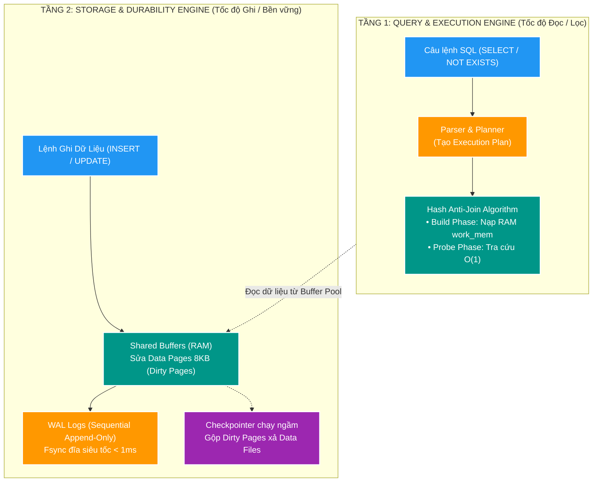

# 🗄️ Deep-Dive: PostgreSQL Database Internals — Storage & Query Engine

> **Mục tiêu topic**: Bóc tách toàn diện từ First Principles kiến trúc hoạt động bên dưới của hệ quản trị cơ sở dữ liệu quan hệ (PostgreSQL 17), bao gồm 2 trụ cột không thể tách rời: **Tầng Lưu Trữ & Bền Vững (Storage & Durability Engine)** và **Tầng Truy Vấn & Giải Thuật (Query & Execution Engine)** cho bài toán xử lý triệu bản ghi trong Backend V2.

---

## 📑 Danh Mục Bài Học trong Chuyên Đề:

```text
manual/learning/deep-dive/database-internals/
├── README.md                                 # [Hub] Bản đồ kiến trúc PostgreSQL Kernel
├── 00-postgresql-engine-mental-model-and-optimization-playbook.md # [Master] Bản đồ nền tảng & Cẩm nang giải pháp
├── 01-wal-and-storage-engine-internals.md    # [Tầng Ghi] Buffer Pool, WAL, Checkpoint, LSN, Crash Recovery
├── 02-anti-join-and-query-optimization.md    # [Tầng Đọc] Anti-Join, Hash Anti-Join, work_mem, EXPLAIN Plan
├── 03-unlogged-tables-and-transient-storage.md # [Tầng Tạm] UNLOGGED Tables, _init fork, Crash Truncation
├── 04-rdbms-limits-vs-million-records-per-second.md # [Giới Hạn] RDBMS Physical Limits vs 1M+ Records/s
└── 05-acid-internals-and-implementation-mechanisms.md # [Bản Chất ACID] CLOG, Undo/Redo, MVCC & ARIES
```

| Bài học | Tên tài liệu | Trọng tâm kỹ thuật cốt lõi | Vấn đề giải quyết |
| :---: | :--- | :--- | :--- |
| **00** | [Master Playbook: DB Engine & Giải Pháp Tối Ưu](./00-postgresql-engine-mental-model-and-optimization-playbook.md) | Data Page 8KB, Buffer Pool, MVCC, Slotted Page, và giải mã 5 giải pháp tối ưu V2 (`COPY`, Keyset, Anti-Join, UNLOGGED, Sharding). | Xây nền tảng vững chắc, hiểu cặn kẽ vì sao các giải pháp tối ưu lại nhanh và đang bypass nút thắt nào. |
| **01** | [Write-Ahead Logging (WAL) & Storage Engine](./01-wal-and-storage-engine-internals.md) | `Shared Buffers`, `Data Pages (8KB)`, `WAL`, `LSN`, `Checkpointer`, Write Coalescing và giải pháp Bounded Chunking (BT-09B). | Chống phình to WAL, I/O Freeze khi bulk insert 1M records. |
| **02** | [Anti-Join & Hash Anti-Join Query Optimization](./02-anti-join-and-query-optimization.md) | Đại số quan hệ $A \setminus B$, cú pháp SQL `NOT EXISTS`, cơ chế 2 pha Build/Probe trong RAM, `work_mem`, Spill to Disk và `EXPLAIN ANALYZE`. | Giảm thời gian lọc độ lệch (Diff) 1M records từ 6.5s xuống < 1s. |
| **03** | [UNLOGGED Tables & Transient Storage](./03-unlogged-tables-and-transient-storage.md) | Triệt tiêu WAL overhead, cơ chế `_init fork`, vòng đời khi Crash, so sánh với `TEMPORARY TABLE` và ứng dụng Staging 1M files. | Tăng tốc độ nạp dữ liệu tạm gấp 3–5 lần mà không gây ô nhiễm WAL. |
| **04** | [Giới Hạn RDBMS vs 1M+ Records/s](./04-rdbms-limits-vs-million-records-per-second.md) | 4 rào cản vật lý RDBMS, phân tích kiến trúc Kafka, ClickHouse, ScyllaDB với số liệu thực tế và vị trí Sweet Spot của Backend V2. | Trả lời câu hỏi giới hạn throughput RDBMS và cách hệ thống lớn scale triệu bản ghi/s. |
| **05** | [Bản Chất & Cơ Chế Thực Hiện ACID](./05-acid-internals-and-implementation-mechanisms.md) | CLOG bit-array, Undo Log, MVCC Tuple Header (`xmin`/`xmax`), Snapshot Isolation, WAL Log-Structured Durability và thuật toán 3 pha ARIES. | Bóc tách cặn kẽ cách CSDL bảo đảm 100% ACID khi lỗi mạng, concurrency hoặc sập nguồn. |

---

## 🧭 Bản Đồ Kiến Trúc PostgreSQL Kernel 2 Tầng:



---

## 🔗 Liên Kết Học Tập & Ứng Dụng Thực Chiến:

- **Workload SC-01 (Quét 1.000.000 files)**: Áp dụng Bài 02 để lọc changed files trong `< 1s` và Bài 01 để nạp nhị phân qua bảng `UNLOGGED` và chunk transaction.
- **Workload BT-09B (Approve 1.000.000 records)**: Áp dụng Bài 01 để chia nhỏ chunk 25.000 records kiểm soát WAL volume.
- [Lộ trình Học Microservices Nâng Cao](../../ADVANCED_MICROSERVICES_STUDY_ROADMAP.md)
