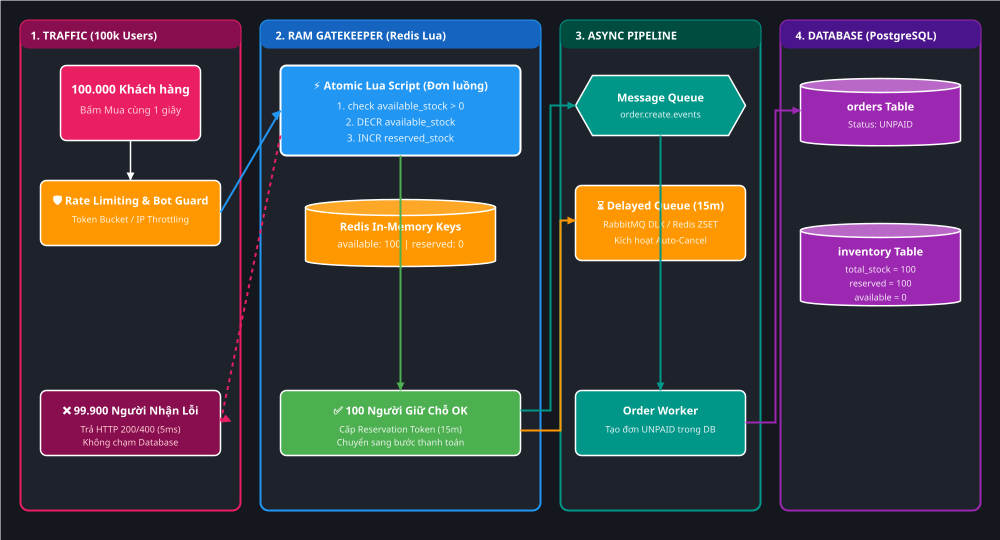
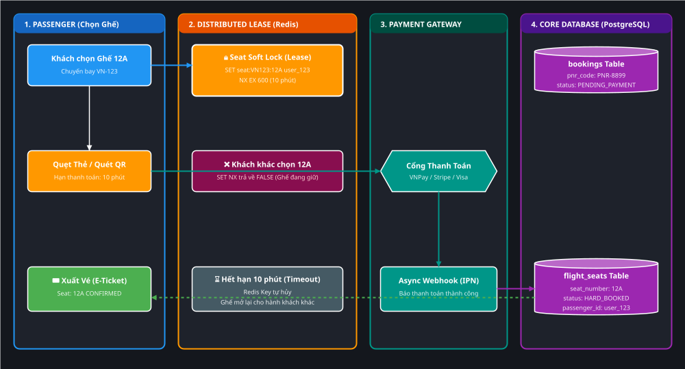
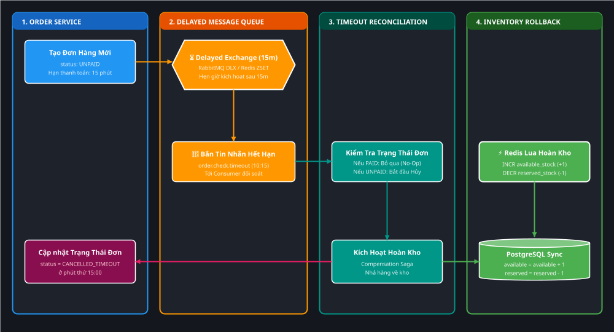

# Deep-Dive: Kiến Trúc Giữ Chỗ & Trừ Tồn Kho Đồng Thời Cao (Flash Sale & Seat Reservation)

> **Mục tiêu học tập**: Làm chủ các mô hình kiến trúc xử lý tranh chấp tài nguyên có hạn ở quy mô cực lớn ($\ge 100.000\text{ req/s}$) trong các hệ thống thực tế như **Shopee/Taobao Flash Sale** (trừ kho vô danh) và **Vietnam Airlines/CGV/Agoda** (giữ ghế/phòng cụ thể có thời hạn thanh toán).

---

## D0 — Vấn Đề Gốc Rễ (Problem Statement)

Tại sao các hệ thống thông thường lập tức sập hoặc bán âm kho khi gặp Flash Sale hoặc Mở bán vé máy bay Tết?

1. **Bán âm kho (Overselling / Negative Inventory)**:
   - Kho chỉ có 100 chiếc iPhone, nhưng 100.000 người cùng bấm mua trong 1 giây. Nếu dùng cơ chế `SELECT` kiểm tra rồi mới `UPDATE`, hiện tượng *Race Condition* sẽ xảy ra khiến 5.000 người mua thành công $\rightarrow$ Thảm họa bồi thường và pháp lý.
2. **Nghẽn cổ chai Khóa dòng Database (Row Lock Contention)**:
   - Nếu 100.000 kết nối cùng lao vào Database chạy `SELECT ... FOR UPDATE` trên 1 dòng sản phẩm, hàng đợi khóa sẽ làm CPU DB vọt lên 100%, cạn kiệt Connection Pool và kéo sập toàn bộ CSDL của các dịch vụ khác.
3. **Bài toán "Chiếm chỗ nhưng không trả tiền" (Abandoned Checkout / Hoarding)**:
   - Khách hàng bấm giữ chỗ nhưng tắt app hoặc đổi ý không thanh toán. Nếu giữ vĩnh viễn $\rightarrow$ Doanh nghiệp mất doanh thu. Nếu nhả ra $\rightarrow$ Cần cơ chế tự động hoàn kho (*Stock Rollback / Compensation*) an toàn, không bị race condition với người thanh toán muộn.

---

## D1 — Từ Điển Thuật Ngữ & Mental Model

> [!TIP]
> ### 💡 Từ điển Thuật ngữ & Mental Model (Gốc từ & Cách liên tưởng)
>
> 1. **Two-Phase Inventory (Tồn kho hai pha: Available vs Reserved vs Total)**:
>    - **Nghĩa tiếng Anh thuần**: `Available` (sẵn sàng để bán); `Reserved` (đã đặt cọc/đang giữ chỗ); `Total` (tổng tài sản vật lý trong kho).
>    - **Trong ngữ cảnh hệ thống**: Chia số lượng tồn kho thành 3 trạng thái. Khi khách bấm Đặt hàng, hệ thống chỉ trừ `available_stock` và cộng vào `reserved_stock` mà chưa trừ `total_stock`. Chỉ khi tiền vào tài khoản mới chính thức trừ `total_stock`.
>    - **💡 Cách liên tưởng**: *"Giống như quán ăn có 10 bàn. Khách gọi điện đặt trước 2 bàn $\rightarrow$ Bàn trống còn 8, bàn giữ chỗ là 2, tổng bàn vẫn là 10. Khi khách đến ngồi ăn mới chuyển bàn thành 'đang phục vụ'."*
>
> 2. **Seat Soft Lock / Lease (Khóa mềm giữ ghế có thời hạn)**:
>    - **Nghĩa tiếng Anh thuần**: `Soft` (mềm/tạm thời); `Lock` (khóa); `Lease` (hợp đồng thuê có hạn).
>    - **Trong ngữ cảnh hệ thống**: Cấp quyền độc quyền lên 1 ID ghế cụ thể (`Seat 12A`) trong một khoảng thời gian cố định (ví dụ: 10 phút) trên Redis. Nếu hết 10 phút không thanh toán, khóa tự biến mất mà không cần can thiệp thủ công.
>    - **💡 Cách liên tưởng**: *"Giống như bạn lấy áo khoác đặt lên ghế ở quán cafe để giữ chỗ đi lấy nước trong 10 phút. Nếu sau 10 phút bạn không quay lại, nhân viên phục vụ sẽ dọn áo đi cho khách khác ngồi."*
>
> 3. **Delayed Compensation / Stock Rollback (Bù trừ hoàn kho theo lịch hẹn)**:
>    - **Nghĩa tiếng Anh thuần**: `Delayed` (trì hoãn/hẹn giờ); `Compensation` (hành động đền bù/hoàn nguyên).
>    - **Trong ngữ cảnh hệ thống**: Kỹ thuật bắn 1 tin nhắn vào hàng đợi hẹn giờ (Delayed Queue / Time Wheel) đúng bằng thời gian giữ chỗ (15 phút). Sau 15 phút, worker thức dậy kiểm tra đơn hàng, nếu chưa trả tiền thì tự động trả hàng về kho.
>    - **💡 Cách liên tưởng**: *"Giống như bạn hẹn chuông báo thức 15 phút sau khi luộc trứng. Chuông reo bạn ra kiểm tra, nếu bếp chưa tắt thì bạn tự tay tắt bếp."*

---

## D2 — Cơ Chế Runtime & Hai Đại Use-Case Thực Tế

---

### Use Case 1: Shopee / Taobao Flash Sale (100.000 người tranh 100 iPhone)

Trong thương mại điện tử, sản phẩm Flash Sale là **tài nguyên vô danh theo số lượng** (không cần chọn đúng cái máy mang serial nào, chỉ cần số lượng còn $\ge 1$).



*(💡 Gợi ý: Bạn có thể click đúp vào file [assets/01-flash-sale-two-phase-stock.drawio.svg](./assets/01-flash-sale-two-phase-stock.drawio.svg) trong IntelliJ để mở trình biên tập Draw.io kéo thả trực quan).*

#### Luồng 4 bước chuẩn Enterprise:

1. **Bước 1: Pre-warming & Traffic Shedding (Tầng Gateway)**:
   - Trước giờ G 5 phút, nạp số lượng tồn kho `available_stock = 100` và `reserved_stock = 0` lên Redis Cluster.
   - API Gateway áp dụng thuật toán *Token Bucket* hoặc *Leaky Bucket* để chặn bot spam, click tặc và giới hạn mỗi User ID chỉ được gửi 1 request mua trong 2 giây.
2. **Bước 2: Atomic Reservation trên RAM (Redis Lua Script)**:
   - Request vượt qua Gateway sẽ chạy thẳng đoạn script Lua nguyên tử trên RAM Redis:
   ```lua
   -- stock_reserve.lua
   local avail_key = KEYS[1]   -- stock:available:iphone15
   local rsrv_key  = KEYS[2]   -- stock:reserved:iphone15
   local quantity  = tonumber(ARGV[1])

   local current_avail = tonumber(redis.call('get', avail_key) or "0")

   if current_avail >= quantity then
       redis.call('decrby', avail_key, quantity)
       redis.call('incrby', rsrv_key, quantity)
       return 1 -- ✅ THÀNH CÔNG: Giữ chỗ thành công trong 0.2ms
   else
       return 0 -- ❌ HẾT HÀNG: Trả về lỗi ngay lập tức
   end
   ```
   - **99.900 người nhận kết quả 0**: Gateway lập tức trả về HTTP 200 kèm JSON `"Rất tiếc, sản phẩm đã hết hàng!"` trong vòng **5 mili-giây** mà không chạm tới Database!
3. **Bước 3: Bắn tin nhắn tạo đơn bất đồng bộ (Async Queue)**:
   - **100 người nhận kết quả 1**: Backend cấp 1 `Reservation Token`, đồng thời bắn sự kiện `OrderCreateEvent` vào Kafka / RabbitMQ.
   - `Order Worker` phía sau nhặt tin nhắn và ghi đơn hàng vào PostgreSQL với trạng thái `UNPAID` (Thời hạn thanh toán: 15 phút).
4. **Bước 4: Hẹn giờ hủy đơn qua Delayed Queue**:
   - Đồng thời bắn 1 tin nhắn vào `Delayed Queue` với thời gian trễ 15 phút để chuẩn bị kích hoạt cơ chế hoàn kho nếu khách không thanh toán.

---

### Use Case 2: Đặt Vé Máy Bay / Vé Xem Phim / Đặt Phòng Khách Sạn (Specific Seat Lease)

Khác với Flash Sale iPhone, vé máy bay hay vé xem phim là **tài nguyên có định danh cụ thể (Specific Entity Identification)**: Khách hàng muốn ghế `12A`, không phải ghế bất kỳ.



*(💡 Gợi ý: Bạn có thể click đúp vào file [assets/02-airline-seat-reservation-flow.drawio.svg](./assets/02-airline-seat-reservation-flow.drawio.svg) trong IntelliJ để mở trình biên tập Draw.io kéo thả trực quan).*

#### Luồng xử lý Giữ Chỗ Ghế (Seat Lease Protocol):

1. **Khách hàng chọn ghế `12A` chuyến bay `VN-123`**:
   - Backend thực thi lệnh Redis Distributed Lock có TTL:
   ```bash
   SET seat:lock:VN123:12A "user_999" NX EX 600
   ```
   - Lệnh `NX` (Not Exists) đảm bảo: Nếu ghế đã có người giữ, lệnh trả về `nil` $\rightarrow$ Báo cho khách khác: *"Ghế này đang có người chọn, vui lòng chọn ghế khác"*.
   - Thời gian `EX 600` (10 phút) chính là **Lease Budget** để khách điền thông tin CMND/Hộ chiếu và thực hiện thanh toán.
2. **Khách hàng thanh toán qua Cổng VNPay / Stripe**:
   - Khách quẹt thẻ hoặc quét mã QR.
3. **Nhận Webhook xác nhận thanh toán (Payment IPN)**:
   - Khi Cổng thanh toán gửi Webhook báo thành công:
     ```sql
     -- Chuyển từ Soft Lock sang Hard Book trong PostgreSQL
     UPDATE flight_seats 
     SET status = 'BOOKED', passenger_id = 'user_999' 
     WHERE flight_id = 'VN123' AND seat_number = '12A' AND status = 'AVAILABLE';
     ```
   - Xóa Redis Key `seat:lock:VN123:12A` và xuất vé điện tử (`E-Ticket`) gửi vào Email khách hàng.

---

## D3 — Failure Modes & Xử Lý Sự Cố Tinh Vi

Cơ chế thực sự phân cấp giữa Senior và Junior nằm ở cách xử lý các kịch bản lỗi biên (*Edge Cases*):

### 1. Kịch bản: Khách hàng không thanh toán sau 15 phút (Auto-Cancellation Flow)



*(💡 Gợi ý: Bạn có thể click đúp vào file [assets/03-delayed-queue-stock-rollback.drawio.svg](./assets/03-delayed-queue-stock-rollback.drawio.svg) trong IntelliJ để mở trình biên tập Draw.io kéo thả trực quan).*

* **Cơ chế**:
  1. Ở phút thứ 15: Tin nhắn trong Delayed Queue được đẩy ra Consumer `order.check.timeout`.
  2. Consumer kiểm tra trạng thái đơn trong Database:
     - Nếu đã `PAID`: Bỏ qua (No-Op / Idempotent).
     - Nếu vẫn `UNPAID`:
       + Cập nhật đơn hàng thành `CANCELLED_TIMEOUT`.
       + Chạy Redis Lua Script để hoàn kho:
         ```lua
         redis.call('incrby', 'stock:available:iphone15', 1)
         redis.call('decrby', 'stock:reserved:iphone15', 1)
         ```
       + Cập nhật DB: `available_stock = available_stock + 1, reserved_stock = reserved_stock - 1`.
       + Chiếc iPhone lập tức xuất hiện trở lại trên app để người khác bấm mua!

---

### 2. Kịch bản hiểm ác: Khách trả tiền đúng lúc hệ thống vừa hủy đơn! (Late Payment Race Condition)

* **Hiện tượng**: Khách bấm thanh toán tại phút `14:59`. Do mạng ngân hàng chậm, Webhook báo tiền về ở phút `15:02`. Lúc này hệ thống ở phút `15:00` đã hủy đơn và nhả ghế cho người khác mua mất rồi!
* **Giải pháp chuẩn Enterprise (Payment Reconciliation)**:
  1. Webhook đến kiểm tra đơn hàng thấy trạng thái đã là `CANCELLED_TIMEOUT`.
  2. Hệ thống **không được phép ghi đè trạng thái thành PAID** (vì hàng/ghế đã bị bán cho người khác).
  3. Kích hoạt quy trình **Tự động Hoàn tiền (Auto-Refund Workflow)**:
     - Gọi API sang Cổng thanh toán hoàn lại 100% tiền vào tài khoản khách.
     - Gửi thông báo Push Notification/SMS: *"Giao dịch thanh toán của quý khách hoàn tất sau thời gian giữ chỗ. Chúng tôi đã hoàn lại tiền vào tài khoản của quý khách."*

---

### 3. Kịch bản: Sập Redis hoặc lệch số giữa Redis và Database (Drift & Reconciliation)

* **Vấn đề**: Redis là bộ nhớ đệm In-Memory. Nếu Redis Master bị crash trước khi replicate sang Replica, có thể xảy ra lệch số (Ví dụ: DB ghi nhận 100 đơn nhưng Redis báo còn 5 cái).
* **Giải pháp**:
  - Chạy **Scheduled Reconciliation Worker (Đối soát định kỳ)**: Cứ mỗi 5 phút quét:
    $$\text{Actual Available} = \text{Total DB Stock} - (\text{Count PAID Orders} + \text{Count Active UNPAID Orders})$$
  - Đồng bộ lại giá trị `stock:available` trên Redis.

---

## D4 — Bảng So Sánh Các Mô Hình Giữ Chỗ

| Tiêu chí | Shopee Flash Sale | Đặt Vé Máy Bay (Airline) | Đặt Phòng Khách Sạn (Booking/Agoda) |
| :--- | :--- | :--- | :--- |
| **Bản chất tài nguyên** | **Vô danh theo số lượng** (`Quantity`) | **Định danh cụ thể** (`Seat 12A`) | **Loại phòng theo ngày** (`Deluxe 20/08`) |
| **Công nghệ giữ chỗ** | Redis Lua (`DECR available`) | Redis Key with TTL (`SET seat NX EX`) | Database Optimistic Lock / Versioning |
| **Thời hạn giữ chỗ** | Ngắn (15 – 30 phút) | Trung bình (10 – 15 phút) | Dài (Có thể cho phép giữ đến ngày check-in) |
| **Khi hết hạn thanh toán** | Hoàn kho tức thì về RAM Redis | Xóa Redis Key, mở lại ghế trên sơ đồ | Hủy Booking, tính phí phạt (nếu có) |
| **Xử lý khi quá tải** | Chặn 99% tại Gateway/Redis | Xếp hàng chờ (*Virtual Waiting Room*) | Rate limit theo đối tác OTA |

---

## D5 — Cầu Nối Phỏng Vấn (Interview Cheat Sheet)

> **Hỏi:** *"Làm sao bạn thiết kế hệ thống bán 100 vé hòa nhạc Taylor Swift cho 1 triệu người mà không bị bán âm kho và không sập database?"*

> **Đáp mẫu Senior/Architect:**
> 1. **Traffic Shedding**: Dùng Nginx/Gateway Token Bucket lọc sạch bot/crawler, chỉ cho phép traffic hợp lệ đi qua.
> 2. **In-Memory Lua Gate**: Nạp tồn kho 100 vé vào Redis. Dùng Single-Threaded Lua Script để kiểm tra và trừ kho trong RAM (tốc độ 0.5ms). 999.900 người nhận thông báo hết vé ngay tại tầng Redis mà không có bất kỳ query nào chạm tới Database.
> 3. **Asynchronous Order Creation**: 100 người giữ chỗ thành công được cấp Token và đẩy vào Kafka Queue để Worker ghi đơn hàng trạng thái `UNPAID` xuống PostgreSQL.
> 4. **Delayed Queue Auto-Rollback**: Bắn tin nhắn trễ 10 phút vào RabbitMQ. Nếu sau 10 phút khách không thanh toán, Worker tự động chạy Lua script hoàn trả số lượng vé về Redis cho người khác mua lại.
> 5. **Late Payment Handling**: Nếu Webhook ngân hàng báo thành công sau khi đơn đã bị hủy, hệ thống tự động kích hoạt Refund API trả lại tiền cho khách hàng.
