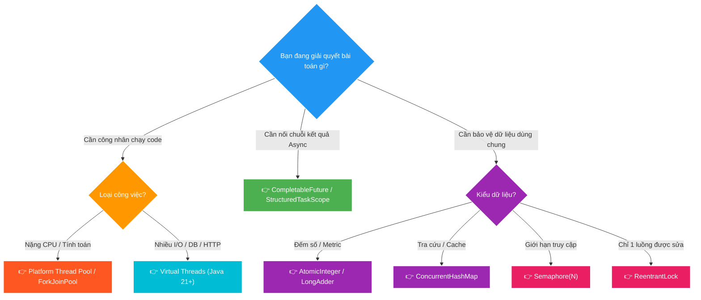

# 🧠 Java Concurrency: The Ultimate Mental Model & Architectural Guide

Tài liệu deep-dive toàn diện về **Concurrency & Multithreading trong Java** (từ Java 8 đến Java 21 / JDK 25): Định hình lại tư duy từ gốc, giải mã bản chất các tầng trừu tượng, phân biệt rạch ròi giữa *Thread Execution*, *Async Pipeline*, *Locks*, *Atomics* và *Memory Models*, kèm sơ đồ kiến trúc trực quan.

---

## 🗺️ Bản đồ Không gian Tổng thể (Spatial Architecture)

Bức tranh toàn cảnh về cách các khái niệm Concurrency trong Java tương tác và hỗ trợ lẫn nhau được chia thành **3 Không gian (Realms)**:


*(💡 Gợi ý: Bạn có thể click đúp vào file [assets/java-concurrency-mental-model.drawio.svg](assets/java-concurrency-mental-model.drawio.svg) trong IntelliJ để mở trình biên tập Draw.io kéo thả trực quan).*

---

## D0 — Problem: Tại sao Concurrency trong Java lại "rối rắm"?

Khi lập trình Java, các kỹ sư thường bị ngợp bởi hàng chục class: `Thread`, `Runnable`, `Callable`, `ExecutorService`, `ThreadPoolExecutor`, `ForkJoinPool`, `Future`, `CompletableFuture`, `CompletionStage`, `VirtualThread`, `synchronized`, `ReentrantLock`, `Semaphore`, `CountDownLatch`, `AtomicInteger`, `ThreadLocal`, `ScopedValue`...

### ❓ Vì sao lại có nhiều khái niệm như vậy?
Bởi vì Concurrency giải quyết **3 bài toán hoàn toàn khác nhau** trong máy tính, nhưng chúng thường bị gom chung dưới cái tên "Đa luồng":
1. **Bài toán 1 — Thực thi mã lệnh (Execution):** Ai là người chạy dòng lệnh này? Chạy trên bao nhiêu CPU Core? Quản lý vòng đời nhân viên ra sao?
2. **Bài toán 2 — Nhận kết quả bất đồng bộ (Coordination & Pipeline):** Khi một việc làm mất 5 giây (gửi mạng/gọi DB), làm sao để code không bị đứng hình (blocking) và nối tiếp bước 2, bước 3 mượt mà?
3. **Bài toán 3 — Bảo vệ dữ liệu dùng chung (Safety & Isolation):** Khi 100 luồng cùng lao vào đọc/ghi 1 biến trong RAM, làm sao để không bị sai số (Race Condition) và không bị rò rỉ dữ liệu giữa các request?

---

## D1 — Vocabulary: Phân loại 3 Realm trong 3 Giây

Để không bao giờ nhầm lẫn, hãy định vị bất kỳ class nào vào đúng **1 trong 3 Realm**:

```
┌────────────────────────────────────────────────────────────────────────────────────────┐
│                          3 REALM CONCURRENCY TRONG JAVA                                │
├────────────────────────────────────────────────────────────────────────────────────────┤
│ 1. EXECUTION REALM (Ai chạy?)          : Thread, VirtualThread, ThreadPoolExecutor     │
│ 2. RESULT PIPELINE REALM (Lấy kết quả?): CompletableFuture, StructuredTaskScope        │
│ 3. SAFETY & MEMORY REALM (Bảo vệ gì?)  : Lock, Semaphore, Atomic, ThreadLocal, Scoped │
└────────────────────────────────────────────────────────────────────────────────────────┘
```

---

## D2 — Mechanism: Bóc tách Chi tiết Từng Tầng

### 1. Realm 1: Thực thi & Điều phối Luồng (Execution Realm)

> **Câu hỏi cốt lõi:** *"Ai là công nhân trực tiếp thi hành mã lệnh bytecode?"*

```
                 ┌──────────────────────────────────────────────┐
                 │          ExecutorService (Interface)         │
                 │      "Bản mô tả công việc của Quản lý"       │
                 └──────────────────────┬───────────────────────┘
                                        │
             ┌──────────────────────────┴──────────────────────────┐
             ▼                                                     ▼
┌─────────────────────────┐                             ┌──────────────────────┐
│   ThreadPoolExecutor    │                             │     ForkJoinPool     │
│  "Đội trưởng Platform"  │                             │ "Đội Chia để trị"    │
│  Quản lý OS Threads     │                             │  Work-Stealing CPU   │
└────────────┬────────────┘                             └──────────┬───────────┘
             │                                                     │
             ▼                                                     ▼
┌─────────────────────────┐                             ┌──────────────────────┐
│ Platform Thread (OS 1:1)│                             │    Virtual Thread    │
│ ~1MB Stack, Đắt đỏ      │                             │  ~vài KB, M:N Loom   │
│ Tối đa 1K - 5K luồng    │                             │  Hàng triệu luồng    │
└─────────────────────────┘                             └──────────────────────┘
```

* **`Platform Thread` (OS Thread truyền thống):**
  * Ánh xạ trực tiếp $1:1$ với Thread của Nhân Hệ điều hành (Kernel).
  * Mỗi thread ngốn $\approx 1\text{ MB RAM}$ cho Native Stack. Chi phí chuyển ngữ cảnh (Context Switching) đắt.
  * Phù hợp: Các tác vụ tính toán nặng CPU (CPU-bound) như mã hóa dữ liệu, render đồ họa.
* **`Virtual Thread` (Java 21+ Project Loom):**
  * Luồng ảo do JVM quản lý trên RAM Heap (chỉ tốn $\approx \text{vài KB}$).
  * Cơ chế: Khi gặp Blocking I/O (chờ DB, chờ mạng), JVM tự **Unmount** luồng ảo khỏi OS Thread thật (Carrier Thread) để luồng ảo khác chạy. I/O xong thì **Remount** lại.
  * Phù hợp: Tác vụ I/O-bound (gọi HTTP, gọi Database, đọc file).
* **`ExecutorService` & `ThreadPoolExecutor`:**
  * `ExecutorService` là Interface: Cung cấp API `submit()`, `invokeAll()`, `shutdown()`.
  * `ThreadPoolExecutor` là Class triển khai: Nắm giữ `corePoolSize`, `maxPoolSize`, `keepAliveTime` và một `BlockingQueue` để chứa các task đang chờ.

---

### 2. Realm 2: Đường ống Bất đồng bộ & Nhận Kết quả (Result Pipeline Realm)

> **Câu hỏi cốt lõi:** *"Làm sao nối chuỗi hành động A ➔ B ➔ C mà không chặn đứng luồng CPU?"*

#### 🌟 `CompletableFuture<T>` — "Phiếu hẹn tương lai"
`CompletableFuture` **KHÔNG PHẢI LÀ MỘT THREAD**. Nó là một **cấu trúc dữ liệu chứa kết quả trong tương lai (Promise)**.

```java
// Ví dụ Pipeline không chặn luồng:
CompletableFuture.supplyAsync(() -> fetchUserData(userId), customPool) // 1. Lấy dữ liệu user
    .thenApply(user -> enrichWithOrders(user))                         // 2. Gộp đơn hàng
    .thenAccept(dto -> renderDashboard(dto))                           // 3. Hiển thị UI
    .exceptionally(ex -> handleError(ex))                              // 4. Bắt lỗi an toàn
    .orTimeout(5, TimeUnit.SECONDS);                                   // 5. Chốt chặn timeout
```

#### 🔍 Tại sao Kafka Publisher trong `scan-service` dùng `CompletableFuture`?
```
Caller Thread (Loop) ──── Gửi tin ────► Kafka Producer Network Buffer
         │                                       │
         ▼                                       ▼ (Bắn qua socket)
Nhận CompletableFuture (Ngay lập tức)      Kafka Broker (Xử lý & Ghi log)
         │                                       │
    (Đi gửi tiếp 500 tin khác)                   ▼ (Phản hồi ACK qua mạng)
         │                                 Broker trả ACK 
         ▼                                       │
Gom 500 CompletableFuture                       ▼
Chờ ACK và Bulk Update DB ◄────────────── future.complete(null)
```
* **Async Non-Blocking I/O:** Kafka Producer dùng sẵn 1 network I/O thread riêng. Khi gọi `kafka.send()`, gói tin được đưa vào socket buffer.
* **Không tốn thread chờ đợi:** Caller thread lập tức nhận về `CompletableFuture`. Khi broker trả ACK qua mạng, card mạng ngắt $\rightarrow$ Kafka driver gọi `future.complete(result)`.

---

### 3. Realm 3: An toàn Dữ liệu & Bộ nhớ (Safety & Memory Realm)

> **Câu hỏi cốt lõi:** *"Làm sao để 1.000 luồng chạy cùng lúc không làm hỏng dữ liệu của nhau?"*

| Công cụ | Bản chất cơ chế | Khi nào sử dụng? |
| :--- | :--- | :--- |
| **`synchronized`** | Khóa Monitor gắn trên Object Header của JVM. | Đoạn code ngắn cần đảm bảo chỉ **duy nhất 1 luồng** được vào tại một thời điểm. *(Lưu ý: Có thể gây Pinning trên Java 21 Virtual Threads nếu dùng sai)*. |
| **`ReentrantLock`** | Khóa linh hoạt mức code, hỗ trợ `tryLock(timeout)`, `lockInterruptibly()`. | Thay thế `synchronized` khi cần timeout, chia quyền hoặc tương thích 100% với Virtual Threads. |
| **`Semaphore(N)`** | Quản lý $N$ giấy phép (Permits) vào cửa. | Giới hạn số lượng luồng tối đa được truy cập tài nguyên (ví dụ: tối đa 20 kết nối Database cùng lúc). |
| **`CountDownLatch(N)`** | Bộ đếm lùi từ $N$ về $0$. | Luồng chính đứng đợi cho đến khi $N$ luồng con gọi `countDown()`. |
| **`AtomicInteger / AtomicLong`** | Cơ chế phần cứng **CAS (Compare-And-Swap)** không dùng khóa (Lock-Free). | Đếm số, tăng ID, cộng dồn metric với hiệu năng cực cao mà không bao giờ bị nghẽn khóa. |
| **`ConcurrentHashMap`** | Băm mảng thành nhiều ô (Bucket) và dùng CAS/Striped Lock. | Lưu trữ Cache, Map dữ liệu chia sẻ giữa hàng nghìn luồng đọc/ghi đồng thời. |
| **`BlockingQueue`** | Hàng đợi chặn luồng theo mô hình Producer - Consumer. | Truyền dữ liệu an toàn giữa luồng nạp việc và luồng xử lý việc. |
| **`volatile`** | Vô hiệu hóa CPU L1/L2 Cache, bắt đọc/ghi thẳng RAM. | Cờ báo hiệu (Flag) dừng luồng (`boolean isRunning`), đảm bảo luồng A đổi thì luồng B thấy ngay. |
| **`ThreadLocal`** | Map nội bộ gắn theo vòng đời của 1 Platform Thread. | Lưu `UserId`, `TraceId`, `SecurityContext` xuyên suốt các class trong 1 request. |
| **`ScopedValue` *(Java 21+)* | Giá trị bất biến (Immutable), siêu nhẹ gắn theo khối code. | Thay thế `ThreadLocal` khi chạy trên hàng triệu **Virtual Threads** để tránh rò rỉ bộ nhớ. |

---

## D3 — Failure Modes & Bẫy Chết Người (Pitfalls)

```
┌─────────────────────────┬───────────────────────────────┬──────────────────────────────────────────┐
│ Lỗi kinh điển           │ Triệu chứng                   │ Cách giải cứu chuẩn Architect            │
├─────────────────────────┼───────────────────────────────┼──────────────────────────────────────────┤
│ 1. Race Condition       │ Đếm mất số (count++ bị sai)   │ Dùng AtomicInteger hoặc LongAdder        │
│ 2. Deadlock             │ Toàn bộ server đứng hình      │ Khóa tài nguyên theo thứ tự ID cố định  │
│ 3. Thread Pool Starve   │ Task xếp hàng vô tận          │ Cấu hình Queue có giới hạn + Rejection   │
│ 4. Thread Pinning       │ Virtual Threads nghẽn Carrier │ Thay synchronized bằng ReentrantLock     │
│ 5. ThreadLocal Leak     │ Tràn RAM Heap (OOM)           │ Bắt buộc try-finally .remove() / Scoped  │
└─────────────────────────┴───────────────────────────────┴──────────────────────────────────────────┘
```

1. **Bẫy `ThreadLocal` rò rỉ bộ nhớ:**
   Khi dùng Thread Pool (tái sử dụng Thread), nếu luồng A xử lý xong Request mà không gọi `threadLocal.remove()`, dữ liệu của User cũ sẽ nằm mãi trên Heap hoặc bị User mới đọc nhầm!
2. **Bẫy Thread Pinning với Virtual Threads:**
   Nếu bạn bọc một thao tác Blocking I/O (như gọi HTTP) bên trong một khối `synchronized`, Virtual Thread sẽ bị **"ghim cứng" (Pinned)** vào Carrier OS Thread $\rightarrow$ Triệt tiêu hoàn toàn lợi thế về hiệu năng của Project Loom.
   $\rightarrow$ **Khắc phục:** Chuyển sang dùng `ReentrantLock`.

---

## D4 — Architectural Decision Matrix (Bảng Quyết Định)



---

## 📚 Từ điển Thuật ngữ & Mental Model (Gốc từ & Cách liên tưởng)

| Thuật ngữ | Tiếng Anh thuần | Ngữ cảnh dự án | Tại sao đặt tên như vậy? | Hình ảnh liên tưởng đời sống |
| :--- | :--- | :--- | :--- | :--- |
| **Concurrency** | *Xảy ra đồng thời* | Hệ thống quản lý nhiều việc cùng lúc. | Gốc Latin *concurrere* (chạy cùng nhau). | **Nghệ sĩ tung hứng**: 1 người tung 3 quả bóng cùng lúc bằng cách đảo tay liên tục. |
| **Parallelism** | *Song song thực sự* | Nhiều core CPU thực sự chạy 2 lệnh cùng tích tắc. | Gốc Hy Lạp *parallelos* (song song cạnh nhau). | **2 người chạy bộ** trên 2 làn đường riêng biệt. |
| **Non-blocking** | *Không làm nghẽn* | Gửi xong việc rồi đi làm việc khác, không đứng chờ. | *Block* nghĩa là chặn đứng dòng chảy. | **Gửi thư bưu điện**: Thả thư vào hòm rồi đi về, không cần đứng chờ người nhận đọc xong. |
| **Virtual Thread** | *Luồng ảo* | Luồng nhẹ do JVM quản lý trên Heap. | *Virtual* nghĩa là tạo cảm giác như thật nhưng không tồn tại vật lý riêng. | **Sim điện thoại ảo (eSIM)**: 1 điện thoại vật lý có thể chứa hàng chục eSIM mà không cần khe cắm to. |
| **Work-Stealing** | *Trộm việc* | Thuật toán trong `ForkJoinPool`. | Luồng rảnh rỗi tự "chôm" bớt việc từ đuôi hàng đợi của luồng bận. | **Quầy thu ngân siêu thị**: Thu ngân hết khách tự ngó sang quầy bên cạnh để kéo bớt khách sang tính tiền hộ. |

---

## 🎯 Cầu nối Phỏng vấn Kỹ thuật (Interview Cheat Sheet)

* **Q1: Khác nhau giữa `CompletableFuture` và `Thread` là gì?**
  * *Trả lời 30s:* `Thread` là công nhân thực thi mã lệnh (chiếm tài nguyên OS), còn `CompletableFuture` là chiếc hộp chứa kết quả bất đồng bộ (Promise). `CompletableFuture` có thể dùng Thread Pool để chạy task, hoặc chạy hoàn toàn Non-blocking nhờ sự kiện ngắt I/O của hệ thống mạng mà không tốn Thread nào chờ đợi.
* **Q2: Khi nào dùng `Virtual Thread` thay vì `ThreadPoolExecutor`?**
  * *Trả lời 30s:* Dùng `Virtual Thread` cho các tác vụ I/O-bound (gọi HTTP API, truy vấn DB, đọc ghi file) vì nó cực nhẹ và cho phép mở rộng hàng triệu kết nối. Vẫn giữ `ThreadPoolExecutor` cho các tác vụ CPU-bound nặng để kiểm soát số lượng luồng tương ứng với số Core CPU, tránh gây nghẽn CPU (thrashing).
* **Q3: Tại sao `AtomicInteger` nhanh hơn `synchronized`?**
  * *Trả lời 30s:* `synchronized` phải thông qua OS Monitor Lock, khi có tranh chấp luồng phải bị treo (suspend/block) và đánh thức (wake-up), tốn chi phí Context Switch. `AtomicInteger` dùng lệnh phần cứng **CAS (Compare-And-Swap)** chạy trực tiếp trên thanh ghi CPU, luồng không bao giờ bị block mà chỉ thử lại (spin loop) trong vài nano-giây.
