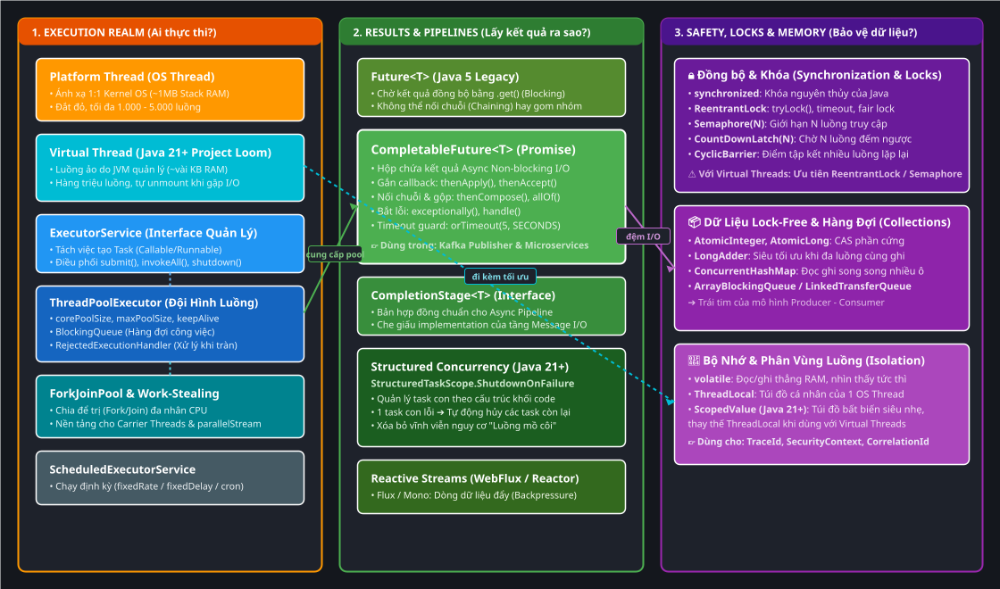
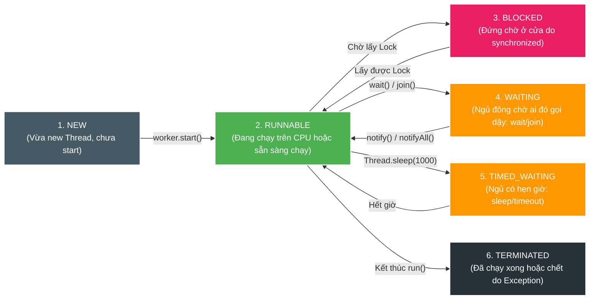
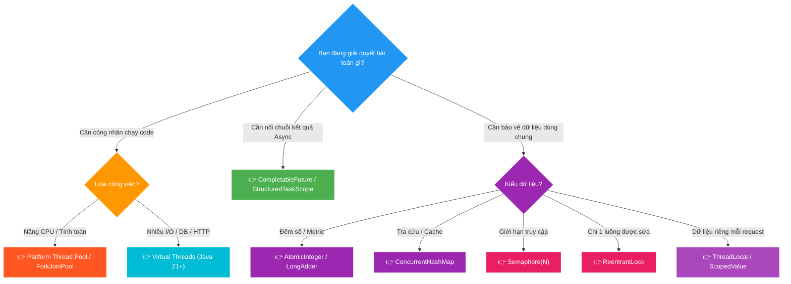

# 🧠 Java Concurrency: The Ultimate Mental Model & Architectural Guide

Tài liệu deep-dive toàn diện về **Concurrency & Multithreading trong Java** (từ Java 8 đến Java 21 / JDK 25): Định hình lại tư duy từ gốc, giải mã bản chất các tầng trừu tượng, phân biệt rạch ròi giữa *Thread Execution*, *Async Pipeline*, *Locks*, *Atomics* và *Memory Models*, kèm sơ đồ kiến trúc trực quan.

> [!TIP]
> ### 🎙️ Audio Đàm Đạo Võ Học: Tuyệt Kỹ Đa Luồng Java Kiếm Hiệp (NotebookLM)
> 
> * **Nghe trên Docsify / Web Browser:**
>   <audio controls style="width: 100%; margin-top: 8px;">
>     <source src="manual/learning/deep-dive/java-concurrency/assets/concurrency-wuxia-podcast.m4a" type="audio/mp4">
>     <source src="manual/learning/deep-dive/java-concurrency/assets/concurrency-wuxia-podcast.m4a" type="audio/x-m4a">
>     <source src="./assets/concurrency-wuxia-podcast.m4a" type="audio/mp4">
>   </audio>
> 
> * **Nghe trong Markdown Preview IDE:** 👉 [🎧 **Bấm vào đây để mở nghe file Audio** (Click to Play)](./assets/concurrency-wuxia-podcast.m4a)
> 
> *(💡 Vừa xem sơ đồ vừa nghe 2 MC AI đàm đạo về 3 Realm, Virtual Threads, Thread Pinning theo phong cách kiếm hiệp).*

---

## 🗺️ Bản đồ Không gian Tổng thể (Spatial Architecture)

Bức tranh toàn cảnh về cách các khái niệm Concurrency trong Java tương tác và hỗ trợ lẫn nhau được chia thành **3 Không gian (Realms)**:



*(💡 Gợi ý: Bạn có thể click đúp vào file [assets/java-concurrency-mental-model.drawio.svg](assets/java-concurrency-mental-model.drawio.svg) trong IntelliJ để mở trình biên tập Draw.io kéo thả trực quan).*

> 📖 **Đọc chuyên đề tiếp theo:** [🔒 Chuyên khảo Toàn diện về Các loại Lock trong Java (synchronized, ReentrantLock, StampedLock, Semaphore...)](./01-java-locks-deep-dive.md)

---

## D0 — Problem: Tại sao Concurrency trong Java lại "rối rắm"?

Khi lập trình Java, các kỹ sư thường bị ngợp bởi hàng chục class: `Thread`, `Runnable`, `Callable`, `ExecutorService`, `ThreadPoolExecutor`, `ForkJoinPool`, `Future`, `CompletableFuture`, `CompletionStage`, `VirtualThread`, `synchronized`, `ReentrantLock`, `Semaphore`, `CountDownLatch`, `AtomicInteger`, `ThreadLocal`, `ScopedValue`...

### ❓ Vì sao lại có nhiều khái niệm như vậy?
Bởi vì Concurrency giải quyết **3 bài toán hoàn toàn khác nhau** trong máy tính, nhưng chúng thường bị gom chung dưới cái tên "Đa luồng":
1. **Bài toán 1 — Thực thi mã lệnh (Execution):** Ai là người chạy dòng lệnh này? Chạy trên bao nhiêu CPU Core? Quản lý vòng đời nhân viên ra sao?
2. **Bài toán 2 — Nhận kết quả bất đồng bộ (Coordination & Pipeline):** Khi một việc làm mất 5 giây (gửi mạng/gọi DB), làm sao để code không bị đứng hình (blocking) và nối tiếp bước 2, bước 3 mượt mà?
3. **Bài toán 3 — Bảo vệ dữ liệu dùng chung (Safety & Isolation):** Khi 100 luồng cùng lao vào đọc/ghi 1 biến trong RAM, làm sao để không bị sai số (Race Condition) và không bị rò rỉ dữ liệu giữa các request?

---

## D1 — Vocabulary: Phân loại 3 Realm trong 3 Giây

Để không bao giờ nhầm lẫn, hãy định vị bất kỳ class nào vào đúng **1 trong 3 Realm**:

```
┌────────────────────────────────────────────────────────────────────────────────────────┐
│                          3 REALM CONCURRENCY TRONG JAVA                                │
├────────────────────────────────────────────────────────────────────────────────────────┤
│ 1. EXECUTION REALM (Ai chạy?)          : Thread, VirtualThread, ThreadPoolExecutor     │
│ 2. RESULT PIPELINE REALM (Lấy kết quả?): CompletableFuture, StructuredTaskScope        │
│ 3. SAFETY & MEMORY REALM (Bảo vệ gì?)  : Lock, Semaphore, Atomic, ThreadLocal, Scoped │
└────────────────────────────────────────────────────────────────────────────────────────┘
```

---

## D2 — Mechanism: Bóc tách Chi tiết Từng Tầng

### 1. Realm 1: Thực thi & Điều phối Luồng (Execution Realm)

> **Câu hỏi cốt lõi:** *"Ai là công nhân trực tiếp thi hành mã lệnh bytecode?"*

#### 🔬 Giải phẫu hạt nhân cốt lõi: `Process` vs `Thread`
```
┌─────────────────────────────────────────────────────────────────────────────┐
│                      MÁY TÍNH (OS & HARDWARE)                               │
├─────────────────────────────────────────────────────────────────────────────┤
│                                                                             │
│   🏢 PROCESS (Một Ứng dụng Java - VD: scan-service JVM instance)            │
│   ├── Được cấp vùng nhớ riêng biệt: HEAP RAM, File Descriptors, Sockets     │
│   │                                                                         │
│   │   👷 THREAD 1 (Công nhân 1)  ──► [ Stack riêng ~1MB | Program Counter ] │
│   │   👷 THREAD 2 (Công nhân 2)  ──► [ Stack riêng ~1MB | Program Counter ] │
│   │   👷 THREAD 3 (Công nhân 3)  ──► [ Stack riêng ~1MB | Program Counter ] │
│   │                                                                         │
│   └── Tất cả các Thread trong cùng 1 Process DÙNG CHUNG VÙNG NHỚ HEAP!      │
│                                                                             │
└─────────────────────────────────────────────────────────────────────────────┘
```

* **`Process` (Tiến trình):** Là một ứng dụng đang chạy độc lập (ví dụ `java -jar app.jar`). Hệ điều hành cấp riêng cho nó một vùng nhớ Heap. Process này **không thể tự ý đọc vùng nhớ của Process khác** (Bảo vệ bộ nhớ cấp OS).
* **`Thread` (Luồng):** Là **đơn vị thực thi nhỏ nhất (Smallest unit of execution)** mà nhân CPU có thể điều phối. 
  * Trong 1 Process có thể có nhiều Thread.
  * Các Thread này **dùng chung Heap RAM của Process** $\rightarrow$ Dẫn đến việc các luồng đọc/ghi đè biến của nhau (sinh ra nhu cầu dùng `synchronized`, `Lock`, `Atomic` để bảo vệ).

#### 📜 Nguồn gốc tên gọi: "Platform Thread" vs "Virtual Thread"
* **Trước Java 21 (1998 – 2023 — Suốt 25 năm):**
  * Trong Java chỉ có duy nhất 1 loại Thread, gọi ngắn gọn là **`Thread`** (`java.lang.Thread`).
  * Cứ mỗi lần `new Thread()` $\rightarrow$ JVM gọi System Call xuống OS Kernel tạo ra **1 OS Thread thật** (tỷ lệ $1:1$). Lúc đó không ai gọi là "Platform Thread" vì không có loại nào khác.
  * *(Ẩn dụ: Giống như trước năm 2007 chưa có Smartphone, mọi người chỉ gọi chiếc điện thoại Nokia là "Điện thoại")*.
* **Từ Java 21+ (Project Loom):**
  * Java phát minh ra luồng ảo siêu nhẹ do JVM quản lý trên RAM Heap, đặt tên là **`Virtual Thread`**.
  * Lúc này, để phân biệt loại luồng cũ gắn với OS và loại luồng ảo mới:
    * Luồng cũ được chính thức gọi là **`Platform Thread`** (Luồng nền tảng / Luồng OS).
    * Class cha chung vẫn giữ nguyên là **`java.lang.Thread`**.

```
                                  java.lang.Thread
                                         │
        ┌────────────────────────────────┴────────────────────────────────┐
        ▼                                                                 ▼
Platform Thread (Luồng cũ)                                      Virtual Thread (Luồng mới)
• Tên trước Java 21: Chỉ gọi là "Thread"                        • Xuất hiện từ Java 21 (Project Loom)
• Bản chất: Là 1 OS Thread thật do Windows/Linux quản lý        • Bản chất: Là Java Object do JVM quản lý trên RAM Heap
• Nặng: ~1MB RAM / luồng                                        • Nhẹ: ~vài KB RAM / luồng
```

#### 🔄 Vòng đời 6 trạng thái của Thread trong Java (`Thread.State`)


#### 🏢 Nhóm Quản lý Thread: `ExecutorService` & `ThreadPoolExecutor`
```
                 ┌──────────────────────────────────────────────┐
                 │          ExecutorService (Interface)         │
                 │      "Bản mô tả công việc của Quản lý"       │
                 └──────────────────────┬───────────────────────┘
                                        │
             ┌──────────────────────────┴──────────────────────────┐
             ▼                                                     ▼
┌─────────────────────────┐                             ┌──────────────────────┐
│   ThreadPoolExecutor    │                             │     ForkJoinPool     │
│  "Đội trưởng Platform"  │                             │ "Đội Chia để trị"    │
│  Quản lý OS Threads     │                             │  Work-Stealing CPU   │
└────────────┬────────────┘                             └──────────┬───────────┘
             │                                                     │
             ▼                                                     ▼
┌─────────────────────────┐                             ┌──────────────────────┐
│ Platform Thread (OS 1:1)│                             │    Virtual Thread    │
│ ~1MB Stack, Đắt đỏ      │                             │  ~vài KB, M:N Loom   │
│ Tối đa 1K - 5K luồng    │                             │  Hàng triệu luồng    │
└─────────────────────────┘                             └──────────────────────┘
```

* **Tại sao không tạo `new Thread().start()` trực tiếp?**
  * Tốn chi phí System Call tạo/hủy luồng.
  * Không kiểm soát số lượng luồng $\rightarrow$ Nếu 10.000 request ập đến sẽ gây tràn RAM hoặc **Nghẽn CPU vì chuyển ca (CPU Thrashing do Context Switching)**.
* **`ThreadPoolExecutor`**: Tạo sẵn một số lượng luồng cố định (`corePoolSize`), việc mới đến được đưa vào `BlockingQueue` để tái sử dụng luồng an toàn.
* **`Virtual Thread` (Java 21+)**: Không cần Thread Pool! Mỗi task tạo 1 Virtual Thread riêng (`Executors.newVirtualThreadPerTaskExecutor()`). Khi gặp I/O Blocking, JVM tự unmount khỏi Carrier Thread để phục vụ task khác.

---

### 2. Realm 2: Đường ống Bất đồng bộ & Nhận Kết quả (Result Pipeline Realm)

> **Câu hỏi cốt lõi:** *"Làm sao nối chuỗi hành động A ➔ B ➔ C mà không chặn đứng luồng CPU?"*

#### 🌟 `CompletableFuture<T>` — "Phiếu hẹn tương lai"
`CompletableFuture` **KHÔNG PHẢI LÀ MỘT THREAD**. Nó là một **cấu trúc dữ liệu chứa kết quả trong tương lai (Promise)**.

```java
// Ví dụ Pipeline không chặn luồng:
CompletableFuture.supplyAsync(() -> fetchUserData(userId), customPool) // 1. Lấy dữ liệu user
    .thenApply(user -> enrichWithOrders(user))                         // 2. Gộp đơn hàng
    .thenAccept(dto -> renderDashboard(dto))                           // 3. Hiển thị UI
    .exceptionally(ex -> handleError(ex))                              // 4. Bắt lỗi an toàn
    .orTimeout(5, TimeUnit.SECONDS);                                   // 5. Chốt chặn timeout
```

#### 🔍 Tại sao Kafka Publisher trong `scan-service` dùng `CompletableFuture`?
```
Caller Thread (Loop) ──── Gửi tin ────► Kafka Producer Network Buffer
         │                                       │
         ▼                                       ▼ (Bắn qua socket)
Nhận CompletableFuture (Ngay lập tức)      Kafka Broker (Xử lý & Ghi log)
         │                                       │
    (Đi gửi tiếp 500 tin khác)                   ▼ (Phản hồi ACK qua mạng)
         │                                 Broker trả ACK 
         ▼                                       │
Gom 500 CompletableFuture                       ▼
Chờ ACK và Bulk Update DB ◄────────────── future.complete(null)
```
* **Async Non-Blocking I/O:** Kafka Producer dùng sẵn 1 network I/O thread riêng. Khi gọi `kafka.send()`, gói tin được đưa vào socket buffer.
* **Không tốn thread chờ đợi:** Caller thread lập tức nhận về `CompletableFuture`. Khi broker trả ACK qua mạng, card mạng ngắt $\rightarrow$ Kafka driver gọi `future.complete(result)`.

---

### 3. Realm 3: An toàn Dữ liệu & Bộ nhớ (Safety & Memory Realm)

> **Câu hỏi cốt lõi:** *"Làm sao để 1.000 luồng chạy cùng lúc không làm hỏng dữ liệu của nhau?"*

#### 👤 Điểm sáng: `ThreadLocal` — "Túi đồ riêng của mỗi công nhân"

Trong khi `synchronized`, `Lock`, `Atomic` tập trung vào việc **bảo vệ tài nguyên dùng chung**, thì `ThreadLocal` đi theo triết lý ngược lại: **"Không chia sẻ gì cả (No Sharing)"**.

```
┌──────────────────────────────────────────────────────────────────────────┐
│                           MÔ HÌNH THREADLOCAL                            │
├──────────────────────────────────────────────────────────────────────────┤
│ Luồng 1 (Thread-1) ───► [ Túi đồ riêng của Thread 1: UserId = "Alice" ]  │
│ Luồng 2 (Thread-2) ───► [ Túi đồ riêng của Thread 2: UserId = "Bob"   ]  │
│ Luồng 3 (Thread-3) ───► [ Túi đồ riêng của Thread 3: UserId = "Carol" ]  │
└──────────────────────────────────────────────────────────────────────────┘
```

* **Bài toán giải quyết:** Truyền dữ liệu ẩn (Implicit Context) xuyên suốt các tầng kiến trúc (`Controller` $\rightarrow$ `Service` $\rightarrow$ `Repository`) mà không cần thêm tham số vào hàm.
* **Ứng dụng thực tế:**
  * `SecurityContextHolder` (Spring Security) — Lưu User đăng nhập.
  * `MDC.put("traceId", ...)` (SLF4J) — In TraceId xuyên suốt log của 1 request.
  * `TransactionSynchronizationManager` (Spring `@Transactional`) — Giữ kết nối DB của transaction hiện tại.
* **Cơ chế bên dưới:** Dữ liệu thực sự nằm trong trường `threadLocals` của object `java.lang.Thread`. Object `ThreadLocal` chỉ là chiếc **Chìa Khóa (Key)**.
* **Bẫy Memory Leak:** Trong Thread Pool, Thread không chết sau request. Nếu quên gọi `threadLocal.remove()`, dữ liệu cũ sẽ nằm mãi trên Heap hoặc User sau đọc nhầm dữ liệu của User trước.
* **Tiến hóa ở Java 21+:** `ScopedValue` thay thế `ThreadLocal` cho Virtual Threads (bất biến, tự hủy theo khối code, không sợ rò rỉ bộ nhớ).

#### 📊 Bảng so sánh các công cụ Safety & Memory

| Công cụ | Bản chất cơ chế | Khi nào sử dụng? |
| :--- | :--- | :--- |
| **`ThreadLocal`** | Map nội bộ gắn theo vòng đời của 1 Platform Thread. | Lưu `UserId`, `TraceId`, `SecurityContext` xuyên suốt các class trong 1 request. |
| **`ScopedValue` *(Java 21+)* | Giá trị bất biến (Immutable), siêu nhẹ gắn theo khối code. | Thay thế `ThreadLocal` khi chạy trên hàng triệu **Virtual Threads** để tránh rò rỉ bộ nhớ. |
| **`synchronized`** | Khóa Monitor gắn trên Object Header của JVM. | Đoạn code ngắn cần đảm bảo chỉ **duy nhất 1 luồng** được vào tại một thời điểm. *(Lưu ý: Tránh dùng khi bọc I/O trên Virtual Threads)*. |
| **`ReentrantLock`** | Khóa linh hoạt mức code, hỗ trợ `tryLock(timeout)`, `lockInterruptibly()`. | Thay thế `synchronized` khi cần timeout, chia quyền hoặc tương thích 100% với Virtual Threads. |
| **`Semaphore(N)`** | Quản lý $N$ giấy phép (Permits) vào cửa. | Giới hạn số lượng luồng tối đa được truy cập tài nguyên (ví dụ: tối đa 20 kết nối Database cùng lúc). |
| **`CountDownLatch(N)`** | Bộ đếm lùi từ $N$ về $0$. | Luồng chính đứng đợi cho đến khi $N$ luồng con gọi `countDown()`. |
| **`AtomicInteger / AtomicLong`** | Cơ chế phần cứng **CAS (Compare-And-Swap)** không dùng khóa (Lock-Free). | Đếm số, tăng ID, cộng dồn metric với hiệu năng cực cao mà không bao giờ bị nghẽn khóa. |
| **`ConcurrentHashMap`** | Băm mảng thành nhiều ô (Bucket) và dùng CAS/Striped Lock. | Lưu trữ Cache, Map dữ liệu chia sẻ giữa hàng nghìn luồng đọc/ghi đồng thời. |
| **`BlockingQueue`** | Hàng đợi chặn luồng theo mô hình Producer - Consumer. | Truyền dữ liệu an toàn giữa luồng nạp việc và luồng xử lý việc. |
| **`volatile`** | Vô hiệu hóa CPU L1/L2 Cache, bắt đọc/ghi thẳng RAM. | Cờ báo hiệu (Flag) dừng luồng (`boolean isRunning`), đảm bảo luồng A đổi thì luồng B thấy ngay. |

---

## D3 — Failure Modes & Bẫy Chết Người (Pitfalls)

```
┌─────────────────────────┬───────────────────────────────┬──────────────────────────────────────────┐
│ Lỗi kinh điển           │ Triệu chứng                   │ Cách giải cứu chuẩn Architect            │
├─────────────────────────┼───────────────────────────────┼──────────────────────────────────────────┤
│ 1. Race Condition       │ Đếm mất số (count++ bị sai)   │ Dùng AtomicInteger hoặc LongAdder        │
│ 2. Deadlock             │ Toàn bộ server đứng hình      │ Khóa tài nguyên theo thứ tự ID cố định  │
│ 3. Thread Pool Starve   │ Task xếp hàng vô tận          │ Cấu hình Queue có giới hạn + Rejection   │
│ 4. Thread Pinning       │ Virtual Threads nghẽn Carrier │ Thay synchronized bằng ReentrantLock     │
│ 5. ThreadLocal Leak     │ Tràn RAM Heap (OOM)           │ Bắt buộc try-finally .remove() / Scoped  │
└─────────────────────────┴───────────────────────────────┴──────────────────────────────────────────┘
```

---

## D4 — Architectural Decision Matrix (Bảng Quyết Định)



---

## 📚 Từ điển Thuật ngữ & Mental Model (Gốc từ & Cách liên tưởng)

| Thuật ngữ | Tiếng Anh thuần | Ngữ cảnh dự án | Tại sao đặt tên như vậy? | Hình ảnh liên tưởng đời sống |
| :--- | :--- | :--- | :--- | :--- |
| **Thread** | *Sợi chỉ / Tuyến* | Đơn vị thực thi nhỏ nhất của CPU. | Sợi chỉ xâu chuỗi các dòng lệnh bytecode tuần tự. | **Công nhân trên dây chuyền**: Nhặt từng linh kiện theo thứ tự lắp ráp. |
| **Platform Thread** | *Luồng nền tảng* | Luồng $1:1$ do OS Kernel trực tiếp quản lý. | Gắn cứng vào Platform bên dưới (Hệ điều hành Windows/Linux). | **Điện thoại Nokia cục gạch**: Bền chắc nhưng nặng, tốn tài nguyên vật lý. |
| **Virtual Thread** | *Luồng ảo* | Luồng nhẹ do JVM quản lý trên RAM Heap. | *Virtual* nghĩa là tạo cảm giác như thật nhưng không tồn tại vật lý riêng. | **Sim điện thoại ảo (eSIM)**: 1 điện thoại vật lý có thể chứa hàng chục eSIM mà không cần khe cắm to. |
| **ThreadLocal** | *Cục bộ theo luồng* | Biến chỉ tồn tại trong phạm vi của 1 luồng. | Dữ liệu là Local (cục bộ) của chính Thread đó. | **Túi quần riêng của công nhân**: Đồ ai nấy giữ, không ai đụng vào túi người khác. |
| **Context Switching** | *Chuyển đổi ngữ cảnh* | CPU dừng luồng A để nạp trạng thái chạy luồng B. | Context là ngữ cảnh/bối cảnh thanh ghi của luồng. | **Bàn giao ca làm việc**: Dừng việc, ghi chép sổ sách, giao đồ nghề cho ca sau. |
| **Concurrency** | *Xảy ra đồng thời* | Hệ thống quản lý nhiều việc cùng lúc. | Gốc Latin *concurrere* (chạy cùng nhau). | **Nghệ sĩ tung hứng**: 1 người tung 3 quả bóng cùng lúc bằng cách đảo tay liên tục. |
| **Non-blocking** | *Không làm nghẽn* | Gửi xong việc rồi đi làm việc khác, không đứng chờ. | *Block* nghĩa là chặn đứng dòng chảy. | **Gửi thư bưu điện**: Thả thư vào hòm rồi đi về, không cần đứng chờ người nhận đọc xong. |
