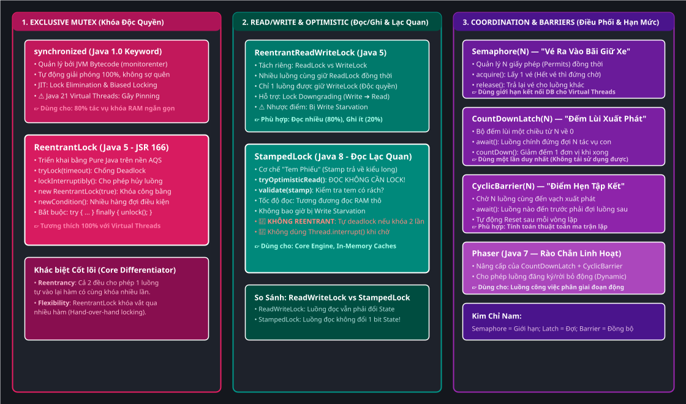
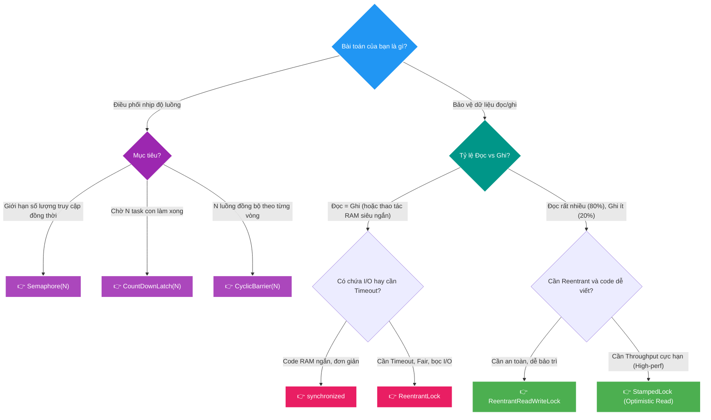

# 🔒 Java Locks Deep-Dive: From `synchronized` to `StampedLock` & Modern Concurrency

Tài liệu chuyên khảo sâu sắc về **Toàn bộ hệ thống Khóa (Locking Mechanisms) trong Java** (từ Java 1.0 đến Java 21 / JDK 25): Bóc tách bản chất từ mức JVM Bytecode, AQS (AbstractQueuedSynchronizer) đến Hardware CPU CAS, phân tích chi tiết từng loại khóa, bẫy lỗi kinh điển và cây quyết định chọn Lock chuẩn Architect.

---

## 🗺️ Bản đồ Tiến hóa & Phân loại Khóa (Architecture Map)

Bức tranh tổng thể về 3 Không gian Khóa trong Java được trực quan hóa qua sơ đồ Draw.io Vector SVG:



*(💡 Gợi ý: Bạn có thể click đúp vào file [assets/java-locks-evolution-architecture.drawio.svg](assets/java-locks-evolution-architecture.drawio.svg) trong IntelliJ để mở trình biên tập Draw.io kéo thả trực quan).*

---

## D0 — Problem: Tại sao Java lại cần nhiều loại Lock đến vậy?

Trong một hệ thống đa luồng, khi nhiều luồng cùng truy cập một tài nguyên bộ nhớ dùng chung (Shared Mutable State), chúng ta phải đối mặt với **Tam Giác Đánh Đổi (Locking Trade-off Triangle)**:

```
                      1. TÍNH NHẤT QUÁN (Consistency)
                         (Không bị Race Condition)
                                   ▲
                                  / \
                                 /   \
                                /     \
   2. HIỆU NĂNG THỦNG (Throughput) ◄───► 3. ĐỘ TIỆN DỤNG & AN TOÀN
   (Hàng triệu ops/sec, không nghẽn)     (Dễ viết, không lo Deadlock)
```

1. **Khóa quá chặt (Chỉ dùng `synchronized` / `ReentrantLock`):** Đảm bảo an toàn 100%, nhưng khi có 99% luồng chỉ đọc dữ liệu thì tất cả vẫn phải xếp hàng một $\rightarrow$ **Throughput bị bóp nghẹt**.
2. **Khóa chia đọc/ghi (`ReentrantReadWriteLock`):** Cho phép hàng nghìn luồng đọc cùng lúc, nhưng luồng ghi bị bỏ đói (**Write Starvation**) và chi phí thay đổi trạng thái Lock vẫn tốn CPU.
3. **Đọc không cần khóa (`StampedLock` - Optimistic Read):** Tốc độ đọc đạt cực đại, nhưng code cực kỳ phức tạp và dễ tự gây **Deadlock** nếu dùng sai.

$\rightarrow$ **Không có một ổ khóa nào hoàn hảo cho mọi trường hợp.** Mỗi loại khóa sinh ra để thống trị một phân khúc bài toán cụ thể!

---

## D1 — Vocabulary: 5 Khái niệm Cốt lõi Cần Nắm

Trước khi đi vào từng loại khóa, bạn phải hiểu rõ 5 thuật ngữ "xương sống":

1. **Reentrancy (Tính tái nhập / Khóa lặp lại):** 
   Một luồng **đang nắm giữ khóa** có thể tiếp tục bước vào một khối code khác cũng yêu cầu chính khóa đó mà không bị chặn lại. *(Ví dụ: Hàm A gọi Hàm B, cả 2 đều dùng chung 1 khóa)*.
2. **Fairness (Tính công bằng):**
   * **Unfair Lock (Mặc định - Bất công):** Luồng mới đến có thể "chen ngang" giành khóa nếu đúng lúc khóa vừa mở $\rightarrow$ **Throughput cao nhất** vì tận dụng được luồng đang sẵn sàng trên CPU.
   * **Fair Lock (Công bằng):** Luồng nào đến trước được xếp hàng vào trước (FIFO) $\rightarrow$ **Tránh bị đói luồng (Starvation)** nhưng throughput giảm 10–50x do chi phí chuyển ca luồng.
3. **Pessimistic Locking (Khóa Bi Quan):** Luôn cho rằng dữ liệu *sẽ bị sửa*, nên bắt buộc phải khóa chặt trước khi đọc/ghi (`synchronized`, `ReentrantLock`).
4. **Optimistic Reading (Đọc Lạc Quan):** Giả định rằng *rất ít khi có ai sửa*, nên cứ thoải mái đọc thẳng từ RAM mà không cần xin khóa, đọc xong mới kiểm tra lại xem có ai vừa sửa không (`StampedLock`).
5. **Lock Degrading / Upgrading (Hạ cấp / Nâng cấp khóa):**
   * **Downgrading (Được hỗ trợ):** Đang giữ Write Lock $\rightarrow$ Xin thêm Read Lock $\rightarrow$ Mở Write Lock (Hạ từ Ghi xuống Đọc an toàn).
   * **Upgrading (Không hỗ trợ trực tiếp vì gây Deadlock):** Đang giữ Read Lock mà đòi nâng lên Write Lock sẽ dễ khiến 2 luồng đọc cùng nâng cấp khóa và khóa cứng lẫn nhau.

---

## D2 — Mechanism: Giải phẫu 4 Nhóm Khóa trong Java

---

### NHÓM 1: Khóa Độc Quyền Cơ Bản (Exclusive Mutex)
> *Chỉ cho phép DUY NHẤT 1 luồng được thực thi tại một thời điểm.*

```
                 ┌───────────────────────────────────────────────────────────┐
                 │                EXCLUSIVE MUTEX COMPARISON                 │
                 ├─────────────────────────────┬─────────────────────────────┤
                 │   synchronized (Java 1.0)   │   ReentrantLock (Java 5)    │
                 ├─────────────────────────────┼─────────────────────────────┤
                 │ • Cấp độ JVM Bytecode       │ • Cấp độ Pure Java (AQS)    │
                 │ • Tự động giải phóng 100%   │ • Phải viết try-finally     │
                 │ • JIT Compiler tối ưu sâu   │ • Hỗ trợ tryLock(timeout)   │
                 │ • ⚠️ Virtual Thread Pinning │ • ✅ Virtual Thread Safe    │
                 └─────────────────────────────┴─────────────────────────────┘
```

#### 1. `synchronized` — Khóa nguyên thủy của JVM
* **Cơ chế bên dưới:** JVM sử dụng cặp lệnh bytecode `monitorenter` và `monitorexit`.
  Trong HotSpot C++, mỗi Java Object có một **Object Header (Mark Word)**. Mark Word sẽ chuyển đổi trạng thái:
  $$\text{Unlocked} \longrightarrow \text{Biased Lock} \longrightarrow \text{Lightweight Lock (CAS)} \longrightarrow \text{Heavyweight OS Mutex}$$
* **Ưu điểm vô đối:** Dù code có ném ngoại lệ hay sập nguồn, JVM **đảm bảo 100% tự động mở khóa**.
* **Nhược điểm:** Không có timeout (nếu kẹt là kẹt vĩnh viễn), không ngắt được luồng đang chờ, và gây **Thread Pinning** trên Virtual Threads Java 21 khi bọc Blocking I/O.

#### 2. `ReentrantLock` — Khóa linh hoạt của Doug Lea
* **Cơ chế bên dưới:** Được viết bằng **100% mã nguồn Java** dựa trên khung sườn **AQS (AbstractQueuedSynchronizer)**. Dùng một biến `volatile int state` và một hàng đợi 2 chiều (CLH Queue) quản lý các luồng đang chờ bằng lệnh CPU `CAS` và `LockSupport.park()`.
* **Vũ khí đặc biệt:**
  ```java
  ReentrantLock lock = new ReentrantLock(true); // true = Fair Lock
  
  // 1. Chống Deadlock bằng timeout:
  if (lock.tryLock(3, TimeUnit.SECONDS)) {
      try {
          doCriticalWork();
      } finally {
          lock.unlock(); // 🛑 BẮT BUỘC trong finally
      }
  } else {
      // Quá 3s không lấy được khóa -> Bỏ cuộc hoặc xử lý fallback an toàn
  }
  ```

---

### NHÓM 2: Khóa Phân Luồng Đọc/Ghi (Read-Write Locks)
> *Nhiều người được cùng ĐỌC, nhưng chỉ 1 người được GHI.*

#### `ReentrantReadWriteLock` (Java 5)
* **Nguyên lý:** Tách riêng 1 chiếc khóa thành 2 mặt: `lock.readLock()` và `lock.writeLock()`.
  * **Read Lock (Shared):** Nếu không có ai đang ghi, hàng nghìn luồng đọc có thể vào cùng lúc.
  * **Write Lock (Exclusive):** Khi có luồng ghi, toàn bộ luồng đọc và luồng ghi khác đều bị chặn lại.
* **Cơ chế bên dưới (AQS State Splitting):**
  AQS sử dụng một biến số nguyên 32-bit `state`:
  * **16 bit cao:** Đếm số lượng luồng đang giữ `Read Lock`.
  * **16 bit thấp:** Đếm số lần tái nhập của luồng giữ `Write Lock`.
* **⚠️ Vấn đề chí tử: Bỏ đói luồng Ghi (Write Starvation)**
  Nếu hệ thống liên tục có các luồng đọc nối đuôi nhau vào, biến đếm 16 bit cao không bao giờ về $0$ $\rightarrow$ Luồng ghi phải đứng chờ vô tận!

---

### NHÓM 3: Khóa Đọc Lạc Quan Siêu Tốc (Optimistic Stamped Locks)
> *Đọc dữ liệu với tốc độ ánh sáng mà KHÔNG CẦN XIN KHÓA.*

#### `StampedLock` (Java 8)
* **Ý tưởng đột phá:** Thay vì dùng AQS thay đổi trạng thái bộ nhớ, `StampedLock` trả về một con số `long stamp` (chiếc tem phiên bản).
* **3 Chế độ hoạt động:**
  1. **Optimistic Read (Đọc Lạc Quan):** Hoàn toàn không tốn 1 nano-giây nào để khóa!
  2. **Read Lock (Bi Quan):** Khóa đọc thông thường (nếu đọc lạc quan thất bại).
  3. **Write Lock (Bi Quan):** Khóa ghi độc quyền.

```java
public class Point {
    private double x, y;
    private final StampedLock sl = new StampedLock();

    // Phương thức Đọc Lạc Quan siêu tốc:
    public double distanceFromOrigin() {
        long stamp = sl.tryOptimisticRead(); // 1. Lấy tem đọc lạc quan
        double curX = x, curY = y;           // 2. Đọc biến thẳng từ RAM (Không lock)
        
        if (!sl.validate(stamp)) {           // 3. Kiểm tra: Có luồng nào vừa ghi đè không?
            stamp = sl.readLock();           // 4. Tem bị rách -> Xin khóa Đọc Bi Quan thật
            try {
                curX = x;
                curY = y;
            } finally {
                sl.unlockRead(stamp);        // 5. Giải phóng khóa đọc
            }
        }
        return Math.sqrt(curX * curX + curY * curY);
    }
}
```

* **🛑 2 Điều CẤM KỴ với `StampedLock`:**
  1. **KHÔNG CÓ TÍNH CHẤT REENTRANT:** Luồng đang giữ Write Lock mà gọi tiếp 1 hàm xin Write Lock $\rightarrow$ **Tự khóa chết chính mình (Deadlock)**.
  2. **KHÔNG DÙNG `Thread.interrupt()` khi chờ Lock:** Do lỗi thiết kế trong thuật toán nội bộ, nếu ngắt luồng đang chờ khóa của `StampedLock`, luồng có thể rơi vào vòng lặp vô tận ăn **100% CPU**! (Hãy dùng `readLockInterruptibly()` thay thế).

---

### NHÓM 4: Khóa Điều Phối & Rào Chắn (Coordination & Barriers)
> *Không dùng để bảo vệ 1 biến, mà dùng để điều phối nhịp độ giữa các luồng.*

```
┌──────────────────────────────────────────────────────────────────────────────────┐
│                     BỘ TỨ ĐIỀU PHỐI (COORDINATION TOOLS)                         │
├──────────────────────────────────────────────────────────────────────────────────┤
│ 1. Semaphore(N)        : Quản lý N giấy phép ra vào (Giới hạn tải / Rate Limit)  │
│ 2. CountDownLatch(N)   : Đếm ngược từ N về 0 (Đợi các task con làm xong)         │
│ 3. CyclicBarrier(N)    : Điểm hẹn tập kết N luồng, tự động lặp lại (Reset)       │
│ 4. Phaser              : Rào chắn linh hoạt động, cho phép thêm/bớt luồng        │
└──────────────────────────────────────────────────────────────────────────────────┘
```

* **`Semaphore(N)` — Bãi đỗ xe có giới hạn:**
  * Cực kỳ quan trọng trong thời đại **Java 21 Virtual Threads**: Virtual Threads có thể tạo ra hàng triệu con, nhưng Database chỉ chịu được 20 kết nối. Bọc kết nối DB bằng `Semaphore(20)` để chặn đứng nguy cơ sập DB!
* **`CountDownLatch(N)` — Còi xuất phát một lần:**
  * Luồng chính `latch.await()`, các luồng con chạy xong thì gọi `latch.countDown()`. Khi về 0, luồng chính chạy tiếp. **Không thể tái sử dụng**.
* **`CyclicBarrier(N)` — Điểm tập kết theo chu kỳ:**
  * Dùng cho các thuật toán chia nhỏ tính toán ma trận: $N$ luồng cùng chạy xong Bước 1, gặp nhau ở Barrier $\rightarrow$ cùng nhau bước tiếp sang Bước 2.

---

## D3 — Failure Modes & Bẫy Chết Người (Pitfalls)

```
┌───────────────────────────┬───────────────────────────────────────────┬──────────────────────────────────────────┐
│ Lỗi kinh điển             │ Cơ chế gây lỗi                            │ Giải pháp chuẩn Architect                │
├───────────────────────────┼───────────────────────────────────────────┼──────────────────────────────────────────┤
│ 1. ABBA Deadlock          │ Luồng 1 giữ Lock A đòi Lock B             │ Luôn xin khóa theo thứ tự ID cố định:    │
│                           │ Luồng 2 giữ Lock B đòi Lock A             │ if (id1 < id2) lock(A); lock(B);         │
├───────────────────────────┼───────────────────────────────────────────┼──────────────────────────────────────────┤
│ 2. Self-Deadlock          │ Dùng StampedLock nhưng gọi hàm con lồng   │ Chuyển sang ReentrantLock hoặc tách      │
│                           │ nhau cùng đòi Write Lock                  │ logic nội bộ không xin lại lock.         │
├───────────────────────────┼───────────────────────────────────────────┼──────────────────────────────────────────┤
│ 3. Quên Unlock trong code │ Xảy ra Exception trước dòng unlock()      │ Luôn đặt lock.unlock() trong block       │
│                           │ khiến khóa bị giữ mãi mãi                 │ finally { lock.unlock(); }               │
├───────────────────────────┼───────────────────────────────────────────┼──────────────────────────────────────────┤
│ 4. Virtual Thread Pinning │ Bọc thao tác I/O trong `synchronized`     │ Thay bằng `ReentrantLock` hoặc nâng      │
│                           │ làm nghẽn Carrier Thread trong Java 21    │ cấp lên Java 24+ (JEP 491).              │
├───────────────────────────┼───────────────────────────────────────────┼──────────────────────────────────────────┤
│ 5. StampedLock CPU 100%   │ Gọi thread.interrupt() khi luồng đang     │ Dùng readLockInterruptibly() hoặc        │
│                           │ đứng chờ trong StampedLock                │ ReentrantLock.                           │
└───────────────────────────┴───────────────────────────────────────────┴──────────────────────────────────────────┘
```

---

## D4 — Architectural Decision Matrix (Bảng Quyết Định 6 Chiều)

| Loại Lock | Tính Reentrant? | Hỗ trợ Fair? | Có Timeout? | Hỗ trợ Condition? | Chi phí CPU/RAM | Virtual Threads Safe? |
| :--- | :---: | :---: | :---: | :---: | :---: | :---: |
| **`synchronized`** | ✅ Có | ❌ Không | ❌ Không | ❌ (Chỉ wait/notify) | Thấp (JIT tối ưu) | ⚠️ Dễ bị Pinning (Java 21) |
| **`ReentrantLock`** | ✅ Có | ✅ Có | ✅ Có | ✅ Có (`newCondition`) | Trung bình | ✅ Rất an toàn (100%) |
| **`ReentrantReadWriteLock`**| ✅ Có | ✅ Có | ✅ Có | ✅ (Chỉ WriteLock) | Cao (AQS state phức tạp)| ✅ An toàn |
| **`StampedLock`** | 🛑 **KHÔNG** | ❌ Không | ✅ Có | ❌ Không | **Cực thấp (Zero Lock Read)**| ✅ An toàn |
| **`Semaphore`** | ❌ Không | ✅ Có | ✅ Có | ❌ Không | Thấp | ✅ Chuẩn Rate-limit |

---

### 🌲 Cây Quyết Định Chọn Lock trong 3 Giây



---

## 📚 Từ điển Thuật ngữ & Mental Model

| Thuật ngữ | Tiếng Anh thuần | Ngữ cảnh Lock | Tại sao đặt tên như vậy? | Hình ảnh liên tưởng đời sống |
| :--- | :--- | :--- | :--- | :--- |
| **Reentrant** | *Tự đi vào lại* | Luồng đã có khóa được vào tiếp hàm con. | *Re-enter* nghĩa là bước vào lại. | **Chìa khóa nhà thông minh**: Mở cửa chính vào nhà rồi thì mở tiếp cửa phòng ngủ mà không bị bảo vệ đuổi. |
| **Mutex** | *Loại trừ lẫn nhau* | Tên viết tắt của *Mutual Exclusion*. | Chỉ 1 thực thể được tồn tại trong vùng cấm. | **Buồng điện thoại công cộng**: Chỉ 1 người đứng gọi, người khác đứng ngoài chờ. |
| **Optimistic Read** | *Đọc lạc quan* | Đọc dữ liệu không xin khóa. | Lạc quan tin rằng không ai phá hoại. | **Cửa hàng tiện lợi tự phục vụ**: Khách cứ vào lấy đồ, lúc ra cửa mới quét tem kiểm tra. |
| **Starvation** | *Bị bỏ đói* | Luồng chờ mãi không được cấp tài nguyên. | Luồng bị đói CPU/Lock đến kiệt quệ. | **Xếp hàng mua vé**: Người già đứng sau bị những người chen ngang mua hết vé. |
| **AQS** | *Bộ đồng bộ hàng đợi* | Khung sườn cốt lõi của `j.u.c.locks`. | *AbstractQueuedSynchronizer*. | **Cây ATM rút tiền**: Xếp hàng tuần tự theo hàng đợi FIFO và cấp thẻ rút. |

---

## 🎯 Cầu nối Phỏng vấn Senior / Architect (Interview Questions)

* **Q1: Phân biệt `ReentrantLock` và `synchronized`? Khi nào bắt buộc dùng `ReentrantLock`?**
  * *Trả lời 30s:* `synchronized` là từ khóa của ngôn ngữ, tự động mở khóa bởi JVM và được JIT tối ưu hóa tốt cho code ngắn. Bắt buộc dùng `ReentrantLock` khi: (1) Cần `tryLock(timeout)` chống deadlock; (2) Cần khóa công bằng (Fairness); (3) Cần chia nhiều hàng đợi điều kiện (`Condition`); (4) Bọc thao tác I/O trên Virtual Threads Java 21 để tránh Thread Pinning.
* **Q2: Tại sao `StampedLock` lại có hiệu năng đọc nhanh hơn `ReentrantReadWriteLock`?**
  * *Trả lời 30s:* Với `ReentrantReadWriteLock`, mỗi khi có luồng đọc, nó vẫn phải dùng lệnh CAS để tăng biến đếm đọc trong AQS State (vẫn phát sinh xung đột bộ nhớ cache CPU). Với `StampedLock`, cơ chế **Optimistic Reading** hoàn toàn không ghi hay thay đổi bất kỳ bit nào trong bộ nhớ, chỉ đọc dữ liệu thô và đối soát `stamp`, giúp chi phí khóa giảm về xấp xỉ bằng $0$.
* **Q3: Tại sao `StampedLock` không hỗ trợ Reentrancy?**
  * *Trả lời 30s:* Để đạt hiệu năng tối thượng và cấu trúc dữ liệu cực kỳ tinh gọn, `StampedLock` mã hóa toàn bộ trạng thái phiên bản và khóa vào một biến `long state` duy nhất mà không lưu vết danh tính luồng sở hữu (`owner Thread`). Vì không biết ai đang giữ khóa, nó không thể hỗ trợ Reentrancy.
