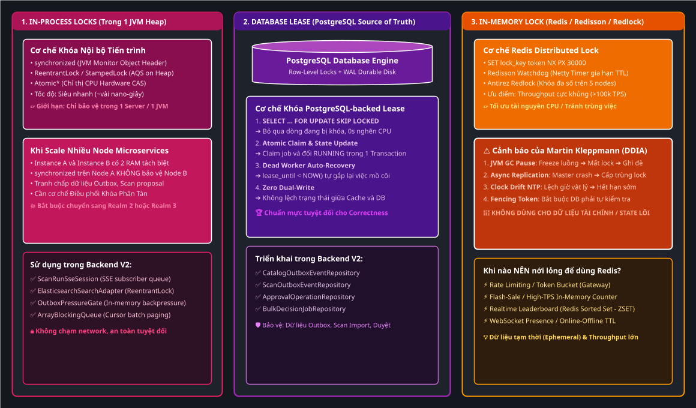
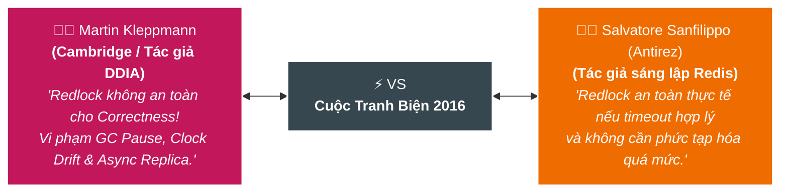
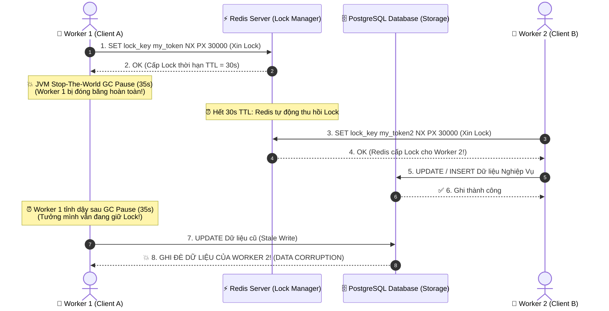
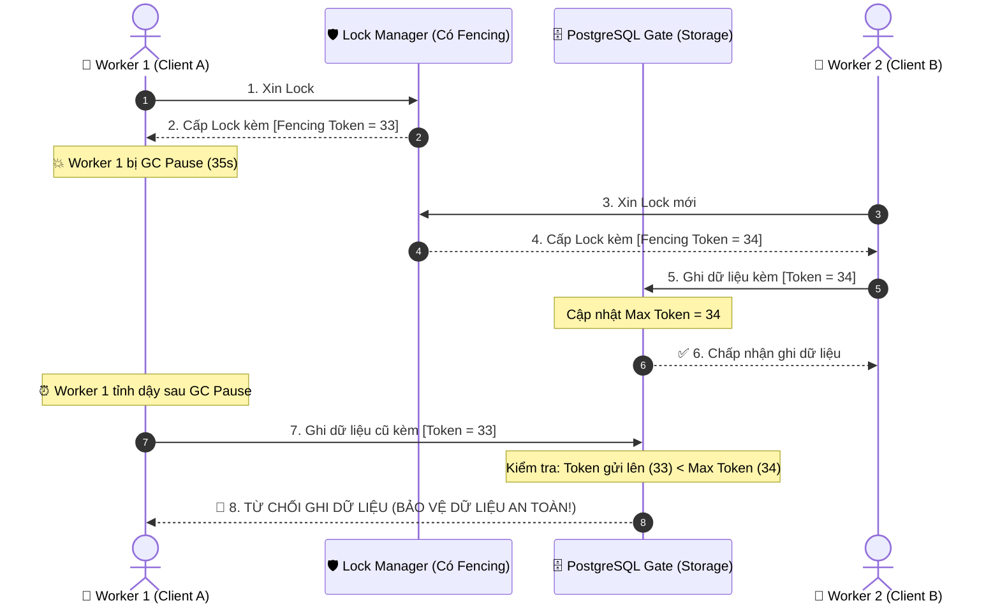
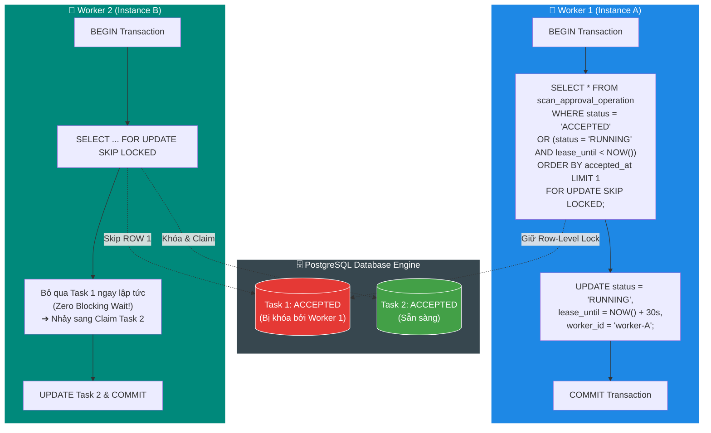
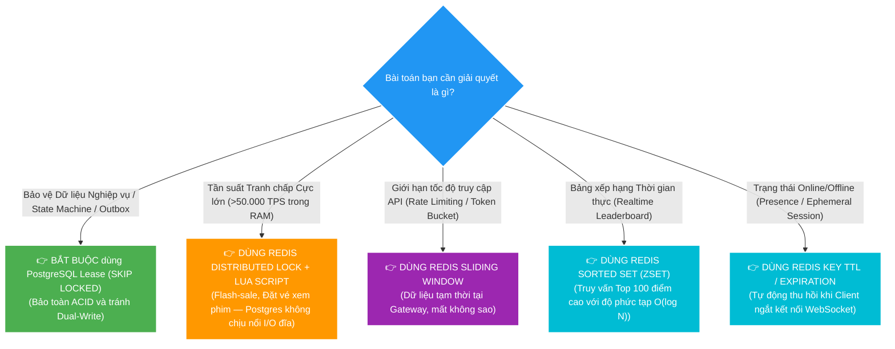

# 🏛️ Distributed Locks: PostgreSQL-backed Lease vs. Redis Redlock & The Great Debate

> **Tài liệu chuyên khảo sâu sắc về Khóa phân tán (Distributed Locking)**: Bóc tách bản chất cuộc tranh luận kinh điển giữa **Martin Kleppmann** (tác giả *Designing Data-Intensive Applications*) và **Antirez** (tác giả Redis), giải mã lý do kiến trúc Backend V2 kiên định chọn **PostgreSQL-backed Lease (`FOR UPDATE SKIP LOCKED`)**, và phân tích thấu đáo câu hỏi: *"Có quá khắt khe không? Khi nào nên nới lỏng để dùng Redis?"*

---

## 🗺️ Bản đồ Không gian Khóa: In-Process vs. Distributed Lock

Bức tranh tổng thể về 3 Không gian Khóa trong hệ thống phân tán được trực quan hóa qua sơ đồ Draw.io Vector SVG:

*(💡 Gợi ý: Bạn có thể click đúp vào file [assets/distributed-locks-landscape-architecture.drawio.svg](assets/distributed-locks-landscape-architecture.drawio.svg) trong IntelliJ để mở trình biên tập Draw.io kéo thả trực quan).*

---

## D0 — Problem: Tại sao Hệ phân tán lại cần Khóa?

Trong kiến trúc Microservices hoặc hệ thống có nhiều worker chạy song song (như `scan-service`, `catalog-service`), khi có 5 instance cùng khởi động:
1. **Tranh chấp tác vụ nền (Background Jobs):** Ai là người được quyền scan thư mục root, ai được quyền gửi email thông báo, ai được quyền drain bảng Outbox?
2. **Ngăn chặn xung đột dữ liệu (Data Corruption):** Nếu 2 worker cùng nhảy vào import 1 file hoặc cập nhật trạng thái của 1 `ScanRun`, dữ liệu sẽ bị ghi đè hỗn loạn (Race Condition & Lost Update).

### ❓ Cám dỗ mang tên "Redis SETNX / Redisson"
Hầu hết các kỹ sư khi gặp bài toán này đều nghĩ ngay đến Redis:
> *"Redis nhanh, chạy In-Memory, cú pháp `SET key value NX PX 30000` siêu gọn, lại có thư viện Redisson bọc sẵn. Tại sao không dùng Redis làm Distributed Lock cho tiện?"*

Nhưng đằng sau sự tiện lợi đó là một **"bãi mìn" về tính nhất quán dữ liệu (Correctness)** trong hệ phân tán.

---

## D1 — Vocabulary & Tranh luận Lịch sử: Martin Kleppmann vs. Antirez (Redlock)

Năm 2016, một cuộc tranh biện học thuật và kỹ thuật nổi tiếng bậc nhất trong lịch sử Khoa học Máy tính đã nổ ra giữa:
- **Martin Kleppmann**: Nhà nghiên cứu hệ phân tán tại Đại học Cambridge, tác giả cuốn sách "gối đầu giường" *Designing Data-Intensive Applications (DDIA)*.
- **Salvatore Sanfilippo (Antirez)**: Tác giả sáng lập nên Redis và thuật toán **Redlock** (thuật toán khóa phân tán trên cụm $N$ node Redis độc lập).

---

### 💥 3 Đòn phản biện chí tử của Martin Kleppmann về Redis Lock

#### 1. Bẫy GC Pause & Network Delay (Process Freeze)
Giả sử Client 1 lấy được Lock trên Redis với thời hạn TTL = 30 giây:

* **Cơ chế gây lỗi:** Client 1 không hề biết rằng mình đã bị mất Lock trong lúc ngủ đông. Khi tỉnh dậy, nó ung dung gửi lệnh ghi xuống Database $\rightarrow$ **Hai client cùng ghi đè dữ liệu lên nhau**.

---

#### 2. Vấn đề Nhân bản Bất đồng bộ (Asynchronous Replication) trong Redis
Redis Cluster / Master-Replica sử dụng cơ chế nhân bản bất đồng bộ để đạt tốc độ cao:
1. Client A gửi `SETNX lock_key` lên Master $\rightarrow$ Master lưu vào RAM và trả về `OK`.
2. **Master bị sập nguồn (Crash)** trước khi kịp đồng bộ key sang Replica!
3. Replica được bầu lên làm Master mới.
4. Client B đến xin Lock `lock_key` $\rightarrow$ Master mới thấy chưa có key này $\rightarrow$ **Tiếp tục cấp Lock cho Client B**.
5. 👉 **Hệ quả:** Cả Client A và Client B cùng lúc nắm giữ Lock độc quyền! Tính chất Mutex bị phá vỡ 100%.

---

#### 3. Bẫy Trôi Đồng Hồ Vật Lý (Clock Drift & Leap Seconds)
Thuật toán Redlock của Antirez cố gắng khắc phục bằng cách xin lock trên 5 node Redis độc lập và đo thời gian trôi qua. Tuy nhiên:
* Đồng hồ trên các máy chủ vật lý (`System.currentTimeMillis()`) phụ thuộc vào giao thức NTP (Network Time Protocol).
* Khi NTP điều chỉnh giờ (Clock Step) hoặc xảy ra hiện tượng trôi đồng hồ phần cứng (Hardware Drift), thời gian trên một node Redis có thể bị "nhảy cóc" về phía trước 1 giây $\rightarrow$ Lock bị hết hạn sớm hơn tính toán $\rightarrow$ Cấp trùng lock.

---

### 🛡️ Vũ khí giải cứu của Martin Kleppmann: `Fencing Token`

Martin Kleppmann chỉ ra rằng: **Một chiếc Lock Manager bên ngoài (như Redis) không bao giờ có thể tự bảo vệ dữ liệu nếu đích đến cuối cùng (Database/Storage) không tham gia xác thực.**

Để an toàn, Lock Manager bắt buộc phải trả về một con số tăng dần đơn điệu gọi là **Fencing Token (Số vé hàng rào)**:

> 🎯 **Kết luận của cuộc tranh luận**:
> - Nếu dùng Lock chỉ để **Tối ưu hóa hiệu năng (Efficiency)** — *Ví dụ: tránh 2 máy cùng render 1 video tốn CPU, nếu lỡ render trùng thì ghi đè file cũng không sao* $\rightarrow$ **Dùng Redis Lock / Redisson là rất tốt**.
> - Nếu dùng Lock để **Đảm bảo tính đúng đắn dữ liệu (Correctness)** — *Ví dụ: trừ tiền ngân hàng, import dữ liệu, claim transaction outbox, chuyển đổi state machine* $\rightarrow$ **KHÔNG ĐƯỢC tin tưởng Redis Lock đơn thuần**, mà phải dùng cơ chế có sự bảo đảm của chính Storage (như PostgreSQL ACID, Fencing Token, hoặc Raft/Etcd).

---

## D2 — Mechanism: Giải phẫu Kiến trúc PostgreSQL Lease trong Backend V2

Thay vì đưa thêm Redis vào làm Distributed Lock Manager (vừa tốn network round-trip, vừa đối mặt rủi ro Dual-Write), Backend V2 chọn giải pháp **PostgreSQL-backed Lease kết hợp `FOR UPDATE SKIP LOCKED`**.

### 🔬 3 Lợi thế Kiến trúc Tuyệt đối của PostgreSQL Lease

#### 1. Tính Nguyên Tử 100% trong Cùng 1 Transaction (Zero Dual-Write)
* Trong Redis Lock: Bạn phải gọi Redis để lấy Lock, sau đó mở Transaction DB để sửa dữ liệu. Nếu bước 1 thành công nhưng bước 2 sập nguồn (hoặc DB bị rollback), bạn phải viết code hoàn tác Lock Redis rất phức tạp.
* Trong PostgreSQL Lease: Hành động **Giành Khóa (Select Lock)** và **Đổi Trạng Thái Task sang RUNNING** diễn ra **nguyên tử trong cùng 1 câu lệnh SQL và cùng 1 ACID Transaction**. Không bao giờ có trạng thái lơ lửng giữa 2 hệ thống.

#### 2. Cơ chế `SKIP LOCKED` — Không Nghẽn Hàng Đợi (Zero Lock Contention)
* Lệnh thông thường `FOR UPDATE` bắt các worker khác phải đứng đợi (`blocked`) cho đến khi transaction trước commit.
* Cờ `SKIP LOCKED` (tính năng nguyên bản của PostgreSQL): Nếu hàng (row) nào đang bị worker khác khóa, PostgreSQL **tự động bỏ qua ngay lập tức** và quét tiếp các hàng tự do phía sau. Nhờ đó, 50 worker có thể cùng lúc tranh chấp hàng đợi mà không hề bị nghẽn CPU hay chờ đợi nhau 1 mili-giây nào!

#### 3. Tự Động Thu Hồi Job Khi Worker Chết (Dead Worker Recovery)
* Bằng điều kiện `OR (status = 'RUNNING' AND lease_until < :now)`:
  * Nếu Worker A đang chạy mà bị sập nguồn đột ngột (OOM, rút dây điện, crash pod), nó không kịp cập nhật trạng thái về `FAILED`.
  * Sau 30 giây (khi `lease_until` hết hạn), Worker B quét qua sẽ phát hiện đây là **Job mồ côi (Orphan Task)** và tự động giành quyền chạy tiếp mà **không cần bất kỳ tiến trình watchdog ngoài luồng nào can thiệp**!

---

## D3 — Failure Modes & Ma trận So sánh Sự cố

| Kịch bản Sự cố | Redis Distributed Lock (`Redisson` / `SETNX`) | PostgreSQL-backed Lease (`SKIP LOCKED`) |
| :--- | :--- | :--- |
| **1. Worker bị GC Pause lâu** | ❌ Cấp trùng lock cho worker khác $\rightarrow$ Race condition ghi đè dữ liệu DB. | ✅ Transaction kết nối TCP giữ Lock, hoặc chặn an toàn qua DB version. |
| **2. Master DB/Cache bị Crash** | ❌ Mất lock do Asynchronous Replication chưa kịp sync sang Replica. | ✅ WAL và ACID bảo đảm dữ liệu lock bền vững vĩnh viễn trên ổ cứng. |
| **3. Worker sập nguồn giữa chừng** | ⚠️ Phụ thuộc Watchdog timeout (Netty timer) trên Redis node. | ✅ Hết hạn `lease_until < now` $\rightarrow$ Worker khác tự động gắp lại task. |
| **4. Mất kết nối mạng cục bộ** | ❌ Lỗi Dual-Write: Redis OK nhưng DB lỗi $\rightarrow$ Hệ thống rơi vào Split-Brain. | ✅ Rollback toàn bộ trạng thái trong cùng 1 Local Transaction. |

---

## D4 — Architectural Decision: Có quá khắt khe không? Có nên nới lỏng?

### ❓ Câu hỏi: *"Có nên nới lỏng để dùng Redis nhiều hơn không? Không dùng có lãng phí không?"*

#### 🎯 Phân tích từ góc độ Kiến trúc sư:
1. **Ranh giới công nghệ (Right Tool for the Right Job):**
   * **PostgreSQL**: Đóng vai trò là **Source of Truth** (Nguồn chân lý duy nhất). Tất cả những gì liên quan đến **Dữ liệu tiền bạc, Task Outbox, Trạng thái Scan, Lịch sử duyệt** bắt buộc phải quản lý khóa bằng PostgreSQL Lease.
   * **Apache Kafka**: Đóng vai trò là **Durable Event Bus & Work Queue** (Đảm bảo thứ tự theo partition, lưu trữ bền vững, replay sự kiện khi cần).
   * **Redis**: Đóng vai trò là **Sub-millisecond Read Cache** cho `query-service` ([`RedisQueryDetailCache.java`](file:///d:/Personal/file-management/v2/file-mngt-be-v2/apps/query-service/src/main/java/com/filemngt/v2/query/adapter/out/cache/RedisQueryDetailCache.java)). Nếu Redis mất điện, toàn bộ cache mất đi chỉ làm web đọc chậm hơn một chút chứ **hoàn toàn không làm sai lệch hay mất mát 1 byte dữ liệu nào của hệ thống**.

2. **Cái giá thực sự của việc "dùng Redis cho đỡ phí":**
   * Tiền RAM/CPU để chạy 1 container Redis là rất nhỏ.
   * Nhưng cái giá phải trả khi biến Redis thành *Stateful Lock Coordinator* là: **Chi phí bảo trì, rủi ro mất đồng bộ Dual-Write, và việc phải đối mặt với 3 bài toán hóc búa của Martin Kleppmann lúc nửa đêm khi có sự cố**.

---

### 🌲 Cây Quyết Định: Khi nào NÊN nới lỏng để dùng Redis?

Chúng ta **hoàn toàn có thể và NÊN nới lỏng để đưa Redis vào phục vụ** khi bài toán thuộc các trường hợp sau:

---

> [!TIP]
> ### 💡 Từ điển Thuật ngữ & Mental Model (Gốc từ & Cách liên tưởng)
>
> 1. **Fencing Token (Mã hàng rào đơn điệu)**:
>    - **Nghĩa tiếng Anh thuần**: *Fence* là hàng rào bảo vệ; *Token* là tấm vé / thẻ bài.
>    - **Trong ngữ cảnh dự án**: Một con số nguyên tăng dần đơn điệu (1, 2, 3...) được cấp kèm theo mỗi lần xin lock. Database sẽ từ chối mọi thao tác ghi có số Token nhỏ hơn số Token lớn nhất mà nó từng ghi nhận.
>    - **Tại sao gọi như vậy**: Nó đóng vai trò như một "hàng rào" chặn đứng các yêu cầu ghi dữ liệu bị trễ (stale writes) từ các worker cũ đã bị hết hạn.
>    - **💡 Cách liên tưởng**: *"Tấm vé bốc số tại quầy ngân hàng: Quầy đã gọi đến số 50 thì người cầm vé số 49 mang lại sẽ bị từ chối phục vụ ngay lập tức"*.
>
> 2. **Lease (Hợp đồng thuê quyền có thời hạn)**:
>    - **Nghĩa tiếng Anh thuần**: *Lease* là hợp đồng cho thuê nhà / đất trong một khoảng thời gian cố định.
>    - **Trong ngữ cảnh dự án**: Quyền hạn thực thi một tác vụ được gán cho một worker cụ thể kèm một mốc thời gian hết hạn (`lease_until = now + 30s`). Nếu worker không gia hạn trước hạn chót, quyền tự động bị thu hồi.
>    - **Tại sao gọi như vậy**: Khác với từ "Lock" (khóa vĩnh viễn cho đến khi mở), "Lease" nhấn mạnh yếu tố **thời hạn hữu hạn**.
>    - **💡 Cách liên tưởng**: *"Hợp đồng thuê căn hộ 1 năm: Hết 1 năm nếu bạn không gia hạn thì chủ nhà có quyền đổi ổ khóa và cho người khác thuê mà không cần bạn đồng ý"*.
>
> 3. **Process Pause / Stop-The-World (Đóng băng tiến trình)**:
>    - **Nghĩa tiếng Anh thuần**: *Pause* là tạm dừng; *Stop-the-world* là cả thế giới dừng lại.
>    - **Trong ngữ cảnh dự án**: Khoảng thời gian toàn bộ các luồng ứng dụng Java bị bộ dọn rác JVM (Garbage Collector) tạm dừng hoàn toàn để dọn dẹp bộ nhớ RAM Heap.
>    - **Tại sao gọi như vậy**: Tiến trình bị "đóng băng" theo đúng nghĩa đen, không thể phản hồi mạng và không biết thời gian bên ngoài đang trôi.
>    - **💡 Cách liên tưởng**: *"Trọng tài thổi còi tạm dừng trận bóng đá: Toàn bộ cầu thủ đứng im trên sân, nhưng đồng hồ trận đấu ngoài đời thực vẫn tiếp tục nhảy giây"*.
>
> 4. **SKIP LOCKED (Nhảy cóc hàng bị khóa)**:
>    - **Nghĩa tiếng Anh thuần**: *Skip* là bỏ qua / nhảy qua; *Locked* là đã bị khóa.
>    - **Trong ngữ cảnh dự án**: Cú pháp SQL của PostgreSQL cho phép câu lệnh `SELECT ... FOR UPDATE` tự động lướt qua các hàng đang bị transaction khác giữ khóa thay vì phải đứng chờ.
>    - **Tại sao gọi như vậy**: Cơ chế hoạt động chính xác là "bỏ qua các ổ khóa đang đóng để tìm ngăn tủ mở sẵn".
>    - **💡 Cách liên tưởng**: *"Hành khách tìm buồng thử đồ ở shop quần áo: Thấy buồng nào đang đóng cửa thì đi thẳng tới buồng tiếp theo chứ không đứng chờ trước cửa buồng đang có người"*.

---

## 🎤 Cầu Nối Phỏng Vấn (Interview Bridges)

### Q1: *"Tại sao bạn không dùng Redis Distributed Lock (như Redlock/Redisson) mà lại dùng PostgreSQL Lease (`SKIP LOCKED`)?"*
* **Trả lời 30s:**
  > *"Em không dùng Redis Lock cho các tác vụ nghiệp vụ quan trọng vì 3 lý do phân tán: (1) **Tránh Dual-Write**: PostgreSQL Lease giúp việc giành khóa và cập nhật trạng thái RUNNING diễn ra nguyên tử trong cùng 1 ACID transaction; (2) **Tránh bẫy GC Pause**: Redis Lock không an toàn nếu worker bị Stop-the-world GC dẫn đến mất lock mà vẫn ghi DB; (3) **Dead Worker Recovery**: PostgreSQL tự động phục hồi job mồ côi khi hết hạn `lease_until` mà không cần watchdog phức tạp."*

### Q2: *"Vậy Redis trong dự án này đóng vai trò gì? Khi nào bạn sẽ quyết định dùng Redis Lock?"*
* **Trả lời 30s:**
  > *"Trong dự án, Redis được dùng đúng sở trường là **Read Cache siêu tốc (<1ms)** cho `query-service` (mất cache không mất data). Em sẽ chỉ mở rộng dùng Redis Lock hoặc In-Memory Counter khi bài toán chuyển sang dạng **Tần suất cực lớn (>50.000 TPS)** như Flash-sale trừ tồn kho trong RAM, hoặc làm **Rate Limiting / Token Bucket** ở API Gateway nơi dữ liệu có tính chất tạm thời (ephemeral) mà PostgreSQL không chịu nổi I/O đĩa."*

---

## 📚 Tài Liệu Tham Khảo (References)

1. **Martin Kleppmann (2016)** — [*How to do distributed locking*](https://martin.kleppmann.com/2016/02/08/how-to-do-distributed-locking.html).
2. **Salvatore Sanfilippo / Antirez (2016)** — [*Is Redlock safe?*](http://antirez.com/news/101).
3. **Martin Kleppmann** — *Designing Data-Intensive Applications (O'Reilly, Chapter 8: The Trouble with Distributed Systems & Fencing Tokens)*.
4. **PostgreSQL Documentation** — [*The Locking Clause: FOR UPDATE SKIP LOCKED*](https://www.postgresql.org/docs/current/explicit-locking.html).
5. **Backend V2 Source Code Reference** — [`ScanApprovalOperationRepository.java`](file:///d:/Personal/file-management/v2/file-mngt-be-v2/apps/scan-service/src/main/java/com/filemngt/v2/scan/adapter/out/persistence/approval/ApprovalOperationRepository.java#L22), [`RedisQueryDetailCache.java`](file:///d:/Personal/file-management/v2/file-mngt-be-v2/apps/query-service/src/main/java/com/filemngt/v2/query/adapter/out/cache/RedisQueryDetailCache.java).

---

> 📖 **Đọc chuyên đề tiếp theo:** [🧵 ThreadLocal vs ScopedValue: Truyền Context Trong Kỷ Nguyên Virtual Threads](./03-threadlocal-vs-scoped-value.md)

