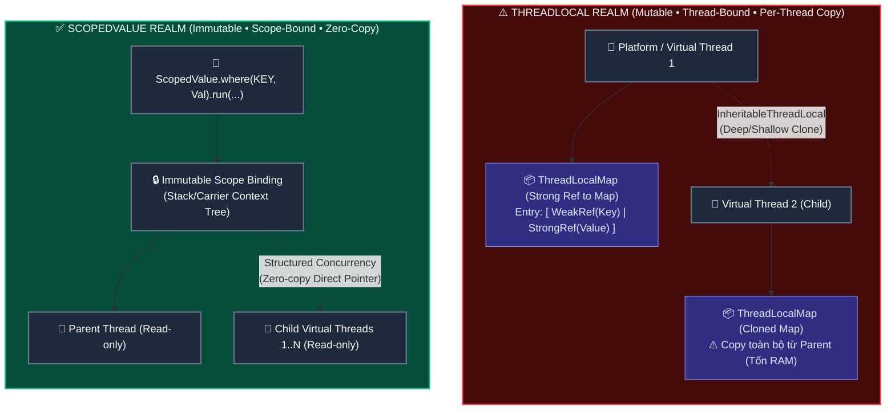
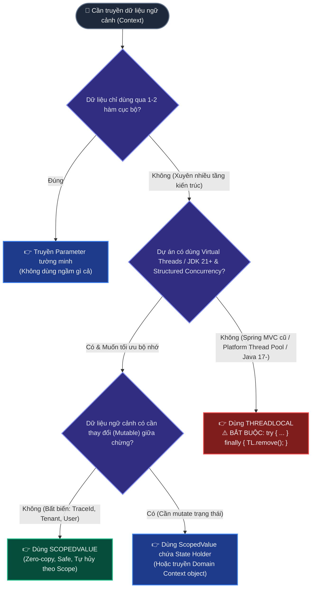

# 🧵 ThreadLocal vs ScopedValue: Truyền Context Trong Kỷ Nguyên Virtual Threads

Tài liệu chuyên khảo sâu sắc về **Cơ chế Truyền Dữ liệu Ngữ cảnh (Context Propagation)** trong Java (từ Java 1.2 đến Java 21 / JDK 25): Bóc tách bản chất từ bài toán Parameter Pollution, giải phẫu cấu trúc bộ nhớ `ThreadLocalMap` và `WeakReference`, phân tích cạm bẫy Memory Leak trên Thread Pool, lý do ra đời của `ScopedValue` (JEP 429/446/481/487) trong kỷ nguyên Virtual Threads, và cây quyết định lựa chọn chuẩn Architect.

---

## 🗺️ Bản đồ Kiến trúc Bộ nhớ (Spatial Architecture Map)

Bức tranh so sánh trực quan về cơ chế lưu trữ và chia sẻ bộ nhớ giữa `ThreadLocal` và `ScopedValue`:



---

## D0 — Problem: Nỗi Đau Truyền Ngữ Cảnh (Context Propagation)

Trong mọi ứng dụng Backend (như Spring Boot Web, Microservices, Batch Workers), một request từ người dùng khi gửi đến server luôn mang theo **dữ liệu ngữ cảnh (Context)**:
- `userId`, `tenantId`, `roles` (Bảo mật / Phân quyền)
- `traceId`, `spanId` (Distributed Tracing / Logging MDC)
- `transactionId`, `locale`, `connectionHolder`

### 1. Nỗi đau 1: Thảm họa "Ô nhiễm tham số" (Parameter Pollution)
Nếu không có cơ chế lưu trữ ngữ cảnh ngầm, bạn sẽ buộc phải truyền các biến này qua từng hàm:

```java
// ❌ Parameter Pollution: Mọi hàm nghiệp vụ đều bị "rác" tham số
public void handleRequest(HttpRequest req) {
    SecurityContext ctx = extractContext(req);
    processOrder(orderId, ctx);
}

public void processOrder(String orderId, SecurityContext ctx) {
    calculatePrice(orderId, ctx);
}

public void calculatePrice(String orderId, SecurityContext ctx) {
    applyDiscount(orderId, ctx);
}

public void applyDiscount(String orderId, SecurityContext ctx) {
    auditLogRepository.saveAudit(orderId, ctx.getUserId()); // Tận tầng 5 mới dùng tới!
}
```

### 2. Sự cứu rỗi suốt 25 năm của `ThreadLocal` (từ Java 1.2 — 1998)
`ThreadLocal` sinh ra như một chiếc "túi thần kỳ" gắn liền với từng luồng:
- **Tầng Web Filter/Interceptor**: Lấy token, nhét `SecurityContext` vào `ThreadLocal`.
- **Tầng Service / Repository sâu thẳm**: Gọi `SecurityContextHolder.getContext().getUserId()` bất cứ khi nào cần mà **không cần truyền tham số qua 10 tầng hàm**.
- **Tầng Filter kết thúc**: Gọi `ThreadLocal.remove()` để dọn dẹp.

---

### 3. Cuộc khủng hoảng của `ThreadLocal` trong kỷ nguyên mới

Mô hình `ThreadLocal` hoạt động tốt trong thời kỳ **1 Request = 1 Platform Thread** (kiểu Spring MVC cổ điển trên Tomcat thread pool nhỏ ~200 threads). Nhưng khi bước vào kỷ nguyên **Bất đồng bộ (Async/Reactive)** và đặc biệt là **Hàng triệu Virtual Threads (Java 21+)**, `ThreadLocal` bộc lộ 4 điểm yếu chí mạng:

```
┌─────────────────────────────────────────────────────────────────────────────┐
│                 4 TỬ HUYỆT CỦA THREADLOCAL TRONG HỆ THỐNG HIỆN ĐẠI          │
├─────────────────────────────────────────────────────────────────────────────┤
│ 1. KHÔNG GIỚI HẠN VÒNG ĐỜI (Unbounded Lifetime)                             │
│    Giá trị sống theo luồng, không tự hủy khi thoát hàm. Quên .remove()      │
│    sẽ gây Memory Leak và rò rỉ dữ liệu sang request tiếp theo (Contamination)│
├─────────────────────────────────────────────────────────────────────────────┤
│ 2. MUTABLE TỰ DO (Đột biến dữ liệu không kiểm soát)                         │
│    Bất kỳ method nào ở bất kỳ tầng nào cũng có thể gọi .set(null) hoặc      │
│    ghi đè, khiến các method khác phía sau bị lỗi mà không rõ nguyên nhân.  │
├─────────────────────────────────────────────────────────────────────────────┤
│ 3. BÙNG NỔ BỘ NHỚ TRÊN VIRTUAL THREADS (Memory Footprint Explosion)        │
│    1.000.000 Virtual Threads = 1.000.000 ThreadLocalMap riêng biệt.         │
│    Chỉ cần mỗi Map giữ vài KB, RAM JVM sẽ bị đốt hàng Gigabyte -> OOM.     │
├─────────────────────────────────────────────────────────────────────────────┤
│ 4. CHI PHÍ KẾ THỪA KHỦNG KHIẾP (InheritableThreadLocal Overhead)            │
│    Khi tạo luồng con, toàn bộ Map của luồng cha bị sao chép (shallow copy). │
│    Với hàng vạn child Virtual Threads, CPU và RAM bị nghẽn vì copy map.     │
└─────────────────────────────────────────────────────────────────────────────┘
```

---

## D1 — Vocabulary: Bảng Khái Niệm & Ranh Giới

| Khái niệm | Định nghĩa bản chất | Ranh giới sở hữu (Ownership) | Vòng đời (Lifetime) | Tính khả biến (Mutability) |
| :--- | :--- | :--- | :--- | :--- |
| **`ThreadLocal`** | Biến cục bộ gắn liền với một đối tượng `Thread` cụ thể. | Thuộc sở hữu của instance `Thread` (lưu trong `threadLocals`). | Vĩnh viễn cho đến khi `Thread` chết hoặc gọi `remove()`. | **Mutable** (Bất kỳ ai cũng có thể `get()` / `set()`). |
| **`InheritableThreadLocal`** | Biến `ThreadLocal` tự động copy giá trị từ cha sang con khi tạo thread mới. | Mỗi `Thread` con giữ một bản clone riêng biệt. | Như `ThreadLocal`, nhưng tốn bộ nhớ copy khi spawn thread. | **Mutable** độc lập ở từng luồng. |
| **`ScopedValue`** *(Java 21+ Preview)* | Biến ngữ cảnh gắn liền với **khối thực thi mã lệnh (Scope)**, không gắn với thread. | Thuộc về phạm vi thực thi (Scope execution tree). | Tự động hủy **100%** ngay khi rời khỏi khối `run()` / `call()`. | **Immutable** (Tuyệt đối không thể sửa đổi sau khi bind). |
| **`Carrier`** | Đối tượng đóng gói tập hợp các binding `(ScopedValue, Value)` để truyền đi. | Tạm thời trong quá trình setup scope. | Sống trong frame gọi hàm. | **Immutable**. |
| **`Rebinding (Shadowing)`** | Khả năng gán giá trị mới cho `ScopedValue` trong scope con mà không đổi giá trị ở scope cha. | Riêng cho scope con lồng bên trong. | Tự hồi phục giá trị cha khi thoát scope con. | Tạo frame mới, không sửa frame cũ. |

---

## D2 — Mechanism: Giải Phẫu Cấu Trúc Bộ Nhớ & Runtime

---

### 🔬 1. Giải phẫu nội bộ `ThreadLocal`: Cấu trúc `ThreadLocalMap` & Bí ẩn `WeakReference`

Để hiểu tại sao `ThreadLocal` gây Memory Leak, hãy xem cách JVM tổ chức nó trong RAM:

```
[ Thread Instance ] (Ví dụ: Tomcat Worker Thread-1)
       │
       └──► threadLocals: ThreadLocalMap
                 │
                 └──► table: Entry[]
                           │
                           ├── Entry[0]: [ Key: WeakRef(ThreadLocal@A)  | Value: StrongRef(UserContext) ]
                           ├── Entry[1]: [ Key: null (Đã bị GC thu hồi) | Value: StrongRef(BigPayload) ⚠️ LEAK! ]
                           └── Entry[2]: [ Key: WeakRef(ThreadLocal@B)  | Value: StrongRef(TraceContext) ]
```

#### ❓ Tại sao Key là `WeakReference` mà vẫn bị Memory Leak?
1. **Key** là một `WeakReference` trỏ tới đối tượng `ThreadLocal`: Khi biến `ThreadLocal` trong code của bạn không còn ai tham chiếu (ví dụ class loader unload), GC sẽ thu dọn Key $\rightarrow$ `Entry.get() == null` (Stale Entry).
2. **Value** lại là một **`StrongReference`** (Tham chiếu mạnh)!
3. **Mối nguy Thread Pool**: Trong môi trường Tomcat / ThreadPool, các Worker Thread **không bao giờ chết** (sống suốt đời ứng dụng).
4. `Thread` sống $\rightarrow$ `ThreadLocalMap` sống $\rightarrow$ `Entry[]` sống $\rightarrow$ **`Value` sống mãi trong Heap RAM** dù bạn không còn cách nào truy cập được nó nữa!

```java
// ⚠️ Kịch bản rò rỉ bộ nhớ kinh điển trên Thread Pool
public void doFilter(ServletRequest req, ServletResponse res, FilterChain chain) {
    try {
        UserContext ctx = loadUserContext(req);
        MY_THREAD_LOCAL.set(ctx); // Ghi vào ThreadLocalMap của Worker Thread
        chain.doFilter(req, res);
    } finally {
        // ❌ NẾU QUÊN DÒNG NÀY:
        // 1. ctx không bao giờ được GC thu hồi (Memory Leak).
        // 2. Request sau rơi vào đúng Thread này sẽ đọc nhầm ctx của request trước (Security Contamination)!
        MY_THREAD_LOCAL.remove(); // ✅ BẮT BUỘC PHẢI CÓ
    }
}
```

---

### 🔬 2. Giải phẫu nội bộ `ScopedValue`: Khối Scope Bất Biến & Chia Sẻ Không Tốn RAM

`ScopedValue` giải quyết tận gốc các điểm yếu của `ThreadLocal` bằng 3 nguyên tắc nền tảng:
1. **Gắn với phạm vi (Scope-bound)** chứ không gắn với vòng đời luồng.
2. **Bất biến (Immutable)**: Chỉ được gán (bind) một lần duy nhất khi mở scope.
3. **Kế thừa 0-copy (Zero-copy inheritance)**: Các child thread trong cùng Structured Concurrency cùng trỏ vào 1 context, không clone map.

#### Cú pháp và Vòng đời của `ScopedValue`:

```java
public class SecurityContextHolder {
    // 1. Khai báo ScopedValue tĩnh
    public static final ScopedValue<UserPrincipal> CURRENT_USER = ScopedValue.newInstance();
    public static final ScopedValue<String> TRACE_ID = ScopedValue.newInstance();
}

// 2. Thiết lập binding và thực thi khối code
public void handleWebRequest(HttpRequest req) {
    UserPrincipal user = authenticate(req);
    String traceId = req.getHeader("X-Trace-Id");

    // "where" liên kết giá trị -> "run" hoặc "call" giới hạn phạm vi hiệu lực
    ScopedValue.where(SecurityContextHolder.CURRENT_USER, user)
               .where(SecurityContextHolder.TRACE_ID, traceId)
               .run(() -> {
                   // Trong toàn bộ khối lambda này và tất cả các hàm con được gọi:
                   processBusinessLogic();
                   // Ngay khi lambda kết thúc, binding TỰ ĐỘNG BIẾN MẤT 100%!
                   // Không cần try-finally, không sợ quên dọn dẹp.
               });
}

public void processBusinessLogic() {
    // Đọc giá trị an toàn, không sợ bị hàm khác ghi đè
    UserPrincipal user = SecurityContextHolder.CURRENT_USER.get();
    String traceId = SecurityContextHolder.TRACE_ID.get();
    log.info("Processing order for user: {}, trace: {}", user.username(), traceId);
}
```

---

### 🔄 3. Cơ chế Rebinding (Shadowing) của `ScopedValue`

Điều gì xảy ra nếu một hàm con muốn chạy với quyền Admin tạm thời (RunAs / Elevated Privileges) mà không làm hỏng quyền của hàm cha?

```
┌─────────────────────────────────────────────────────────────────────────────┐
│ [Scope Ngoài - Caller]                                                      │
│ CURRENT_USER = "user_guest"                                                │
│   │                                                                         │
│   ├──► Gọi executeTask() -> Đọc được: "user_guest"                         │
│   │                                                                         │
│   ├──► [Scope Trong - Rebinding]                                            │
│   │    ScopedValue.where(CURRENT_USER, "admin_system").run(() -> {          │
│   │        // Chỉ TRONG NÀY: CURRENT_USER.get() == "admin_system"           │
│   │        performElevatedOperation();                                      │
│   │    });                                                                  │
│   │                                                                         │
│   └──► [Quay lại Scope Ngoài]                                               │
│        CURRENT_USER.get() == "user_guest" (Tự động phục hồi nguyên vẹn!)   │
└─────────────────────────────────────────────────────────────────────────────┘
```

* Với `ThreadLocal`: Bạn phải tự lưu giá trị cũ ra biến tạm, `set(admin)`, chạy xong `set(oldValue)` trong `finally`. Nếu quên hoặc lỗi $\rightarrow$ cả hệ thống bị kẹt quyền Admin!
* Với `ScopedValue`: Cơ chế Stack-based Shadowing tự động cô lập giá trị trong scope con và khôi phục giá trị cha hoàn toàn tự động.

---

### 🚀 4. Sức mạnh Kết hợp: `ScopedValue` + `StructuredTaskScope` (Project Loom)

Khi một tác vụ cha phân nhánh thành 100 tác vụ con chạy song song trên Virtual Threads:

```java
public Response handleParallelDashboard() {
    return ScopedValue.where(SecurityContextHolder.TRACE_ID, "trace-abc-999")
                      .call(() -> {
                          try (var scope = new StructuredTaskScope.ShutdownOnFailure()) {
                              // Tạo 3 sub-tasks chạy trên 3 Virtual Threads khác nhau
                              var userTask = scope.fork(() -> fetchUserProfile());
                              var orderTask = scope.fork(() -> fetchOrders());
                              var notifyTask = scope.fork(() -> fetchNotifications());

                              scope.join();           // Chờ cả 3 hoàn tất
                              scope.throwIfFailed();  // Quăng lỗi nếu có subtask fail

                              return new Response(userTask.get(), orderTask.get(), notifyTask.get());
                          }
                          // Cả 3 Virtual Threads con ở trên ĐỀU ĐỌC ĐƯỢC TRACE_ID = "trace-abc-999"
                          // MÀ KHÔNG TỐN 1 BYTE BỘ NHỚ ĐỂ SAO CHÉP MAP!
                      });
}
```

---

## D3 — Failure Modes & Những Cái Bẫy Chết Người (Pitfalls)

```
┌─────────────────────────────────────────────────────────────────────────────┐
│                       BẢNG CHẨN ĐOÁN SỰ CỐ & PHÒNG NGỪA                     │
├─────────────────────────────────────────────────────────────────────────────┤
│ 💥 SỰ CỐ 1: BÙNG NỔ RAM VỚI THREADLOCAL TRÊN VIRTUAL THREADS                │
│ • Triệu chứng: JVM sập vì OutOfMemoryError: Java heap space khi có tải lớn. │
│ • Nguyên nhân: Code giữ Buffer/Object nặng trong ThreadLocal. Khi có        │
│   500.000 Virtual Threads, sinh ra 500.000 bản sao Buffer -> Cháy RAM.      │
│ • Giải pháp: Tuyệt đối không dùng ThreadLocal làm object cache/buffer trên   │
│   Virtual Threads. Dùng ScopedValue hoặc truyền context tường minh.         │
├─────────────────────────────────────────────────────────────────────────────┤
│ 💥 SỰ CỐ 2: THREAD CONTAMINATION (LẪN DỮ LIỆU GIỮA CÁC USER)                │
│ • Triệu chứng: User A thỉnh thoảng nhìn thấy thông tin của User B.          │
│ • Nguyên nhân: Dùng ThreadLocal trên Tomcat Pool nhưng quên gọi .remove()   │
│   trong khối finally khi request gặp Exception bất ngờ.                     │
│ • Giải pháp: Áp dụng try-finally nghiêm ngặt hoặc chuyển sang ScopedValue.   │
├─────────────────────────────────────────────────────────────────────────────┤
│ 💥 SỰ CỐ 3: MẤT CONTEXT KHI DÙNG ASYNC PIPELINE (CompletableFuture)         │
│ • Triệu chứng: Gốc method có UserContext nhưng vào .thenApplyAsync() thì    │
│   UserContext bị null hoặc mang giá trị của thread khác trong ForkJoinPool. │
│ • Nguyên nhân: ThreadLocal không tự chuyển giao qua các async callback.     │
│ • Giải pháp: Phải dùng Context Snapshot Wrapper hoặc Structured Concurrency.│
├─────────────────────────────────────────────────────────────────────────────┤
│ 💥 SỰ CỐ 4: GỌI .get() NGOÀI PHẠM VI (NoSuchElementException)               │
│ • Triệu chứng: ScopedValue.get() ném ra NoSuchElementException.             │
│ • Nguyên nhân: Gọi ScopedValue ở một luồng hoặc một hàm nằm ngoài khối      │
│   ScopedValue.where().run().                                                │
│ • Giải pháp: Luôn kiểm tra ScopedValue.isBound() trước khi get() nếu        │
│   hàm có thể được gọi từ nhiều ngữ cảnh khác nhau (hoặc dùng orElse(null)).  │
└─────────────────────────────────────────────────────────────────────────────┘
```

---

## D4 — Architecture & Decision Guide: Khi Nào Dùng Cái Nào?

### 📊 1. Bảng So Sánh Toàn Diện (10 Tiêu Chí Kỹ Thuật)

| Tiêu chí | `ThreadLocal` | `InheritableThreadLocal` | `ScopedValue` (Java 21+) |
| :--- | :--- | :--- | :--- |
| **Tính khả biến (Mutability)** | Mutable (`set()` bất kỳ lúc nào) | Mutable độc lập ở từng thread | **Immutable** (Chỉ gán 1 lần khi bind) |
| **Vòng đời (Lifetime)** | Gắn theo luồng (Dễ leak) | Gắn theo luồng (Dễ leak) | **Gắn theo Scope code** (Tự hủy 100%) |
| **Dọn dẹp bộ nhớ** | Thủ công (`try-finally remove()`) | Thủ công (`remove()`) | **Tự động hoàn toàn** bởi runtime |
| **Chi phí spawn Child Thread** | Không truyền | Copy toàn bộ Map (Nặng CPU/RAM)| **Zero-Copy** (Trỏ chung context) |
| **Độ thân thiện Virtual Threads**| ⚠️ Nguy cơ tốn RAM nếu lạm dụng | ❌ Cực kỳ tốn kém (Anti-pattern) | **✅ Tối ưu hoàn hảo** (Thiết kế riêng cho Loom)|
| **Độ an toàn dữ liệu** | Thấp (Dễ bị ghi đè ngầm) | Thấp | **Tuyệt đối** (Không ai sửa được) |
| **Rebinding / Shadowing** | Phải lưu biến tạm & restore tay | Thủ công, dễ lỗi | **Hỗ trợ tự nhiên** dạng Stack Scope |
| **Truy cập ngoài Scope** | Luôn lấy được nếu cùng Thread | Luôn lấy được | Ném `NoSuchElementException` nếu unbound |
| **Trạng thái chuẩn hóa** | Chuẩn Java SE từ 1.2 | Chuẩn Java SE từ 1.2 | Preview (JDK 21/25 - JEP 481/487) |
| **Tương thích Spring / Libs** | 100% Framework hiện tại hỗ trợ | Được hỗ trợ rộng rãi | Đang trong lộ trình tích hợp dần |

---

### 🌳 2. Cây Quyết Định Chọn Cơ Chế Truyền Ngữ Cảnh (Architect Decision Tree)



---

### 🏢 3. Liên Hệ Thực Tế Dự Án `file-mngt-be-v2`

#### ❓ Dự án này có dùng `ScopedValue` không?
* **Hiện trạng**: Codebase `file-mngt-be-v2` **chưa trực tiếp khai báo hay dùng `ScopedValue`** (cũng như không tự tạo custom `ThreadLocal` context riêng, ngoại trừ tiện ích chuẩn `ThreadLocalRandom.current()` trong [`UuidV7.java`](file:///d:/Personal/file-management/v2/file-mngt-be-v2/apps/scan-service/src/main/java/com/filemngt/v2/scan/domain/identity/UuidV7.java)).
* **Lý do**: 
  1. `ScopedValue` hiện vẫn đang là **Preview Feature** trong các bản JDK 21–25 (JEP 429, JEP 446, JEP 481, JEP 487). Để đảm bảo tính ổn định cao nhất cho production, các thư viện nền tảng chưa bật mặc định.
  2. Toàn bộ hạ tầng Spring Boot (như `SecurityContextHolder`, `RequestContextHolder`, `TransactionSynchronizationManager`, Logback `MDC`) hiện vẫn đang vận hành ổn định trên nền `ThreadLocal` chuẩn của Spring Framework.

#### ❓ Virtual Thread có bắt buộc phải dùng `ScopedValue` không?
* **Câu trả lời dứt khoát**: **HOÀN TOÀN KHÔNG BẮT BUỘC**.
  * Virtual Thread trong Java 21+ **vẫn hỗ trợ `ThreadLocal` 100% bình thường**. Spring Boot chạy Virtual Threads (`spring.threads.virtual.enabled=true`) vẫn dùng `ThreadLocal` để giữ `SecurityContext` hay `MDC` mà không gặp lỗi cú pháp.
  * **Tuy nhiên**: Khi hệ thống mở rộng lên hàng trăm nghìn Virtual Threads phân nhánh tác vụ song song, việc chuyển dịch dần từ `ThreadLocal` sang `ScopedValue` là **Best Practice kiến trúc** để loại bỏ hoàn toàn nguy cơ rò rỉ RAM và triệt tiêu chi phí clone bộ nhớ.

---

> [!TIP]
> ### 💡 Từ điển Thuật ngữ & Mental Model (Gốc từ & Cách liên tưởng)
>
> 1. **ThreadLocal (Hộc tủ đồ cá nhân của nhân viên)**:
>    - **Nghĩa tiếng Anh thuần**: *Thread* là luồng thực thi; *Local* là cục bộ, riêng tư.
>    - **Trong ngữ cảnh dự án**: Một vùng nhớ gắn chặt vào từng luồng, chỉ luồng đó mới có chìa khóa mở ra xem và sửa.
>    - **Tại sao gọi như vậy**: Nó biến một biến có vẻ như toàn cục (`static`) thành biến chỉ có giá trị cục bộ bên trong một luồng.
>    - **💡 Cách liên tưởng**: *"Chiếc tủ cá nhân có khóa riêng ở phòng tập gym: Bạn cất đồ vào tủ số 5 thì chỉ có bạn mở được, người khác dùng tủ số 6 không thể thấy đồ của bạn. Nhưng nếu bạn tập xong đi về mà không dọn tủ (quên `.remove()`), đồ đạc sẽ nằm đó mãi mãi làm bẩn tủ cho người tập sau"*.
>
> 2. **ScopedValue (Thẻ khách đeo tạm thời)**:
>    - **Nghĩa tiếng Anh thuần**: *Scope* là phạm vi / ranh giới; *Value* là giá trị.
>    - **Trong ngữ cảnh dự án**: Một giá trị chỉ tồn tại và hợp lệ bên trong một ranh giới khối code xác định, tự động hết hiệu lực khi bước ra ngoài.
>    - **Tại sao gọi như vậy**: Giá trị bị ràng buộc chặt chẽ theo phạm vi thực thi (Lexical/Dynamic Scope) thay vì gắn theo luồng.
>    - **💡 Cách liên tưởng**: *"Chiếc thẻ khách VIP đeo vào cổ khi vào tòa nhà: Bạn bước qua cửa bảo vệ thì được phát thẻ đeo vào cổ, bạn và đoàn tùy tùng (child threads) đi đến đâu trong tòa nhà cũng được nhận diện quyền. Ngay khi bạn bước chân ra khỏi cửa tòa nhà (thoát scope), thẻ tự động vô hiệu lực và thu hồi ngay lập tức, không ai cần nhắc nhở dọn dẹp"*.
>
> 3. **Thread Contamination (Nhiễm bẩn dữ liệu chéo luồng)**:
>    - **Nghĩa tiếng Anh thuần**: *Contamination* là sự làm bẩn / ô nhiễm chéo.
>    - **Trong ngữ cảnh dự án**: Hiện tượng một worker thread trong Thread Pool thực thi Request 2 nhưng lại đọc được dữ liệu còn sót lại của Request 1 do lập trình viên quên gọi `ThreadLocal.remove()`.
>    - **Tại sao gọi như vậy**: Dữ liệu người dùng cũ "lây nhiễm" sang người dùng mới.
>    - **💡 Cách liên tưởng**: *"Cốc nước ở quán cà phê không được rửa sạch sau khi khách trước dùng xong: Khách sau vào ngồi đúng chiếc bàn đó và uống nhầm phần nước thừa của người trước"*.
>
> 4. **Zero-Copy Inheritance (Kế thừa không tốn chi phí sao chép)**:
>    - **Nghĩa tiếng Anh thuần**: *Zero-Copy* là không sao chép byte nào; *Inheritance* là sự kế thừa.
>    - **Trong ngữ cảnh dự án**: Cơ chế trong Structured Concurrency cho phép hàng nghìn Virtual Threads con cùng trỏ trực tiếp tới cấu trúc dữ liệu ScopedValue của luồng cha mà không cần nhân bản (clone) một Map mới vào RAM.
>    - **Tại sao gọi như vậy**: Tận dụng tính bất biến (Immutable) của dữ liệu để chia sẻ con trỏ an toàn tuyệt đối mà không tốn tài nguyên.
>    - **💡 Cách liên tưởng**: *"Chiếu một slide bài giảng lên màn hình lớn trong hội trường: Cả 1.000 sinh viên cùng nhìn chung một màn hình để đọc nội dung thay vì giáo viên phải photo in ra 1.000 bản giấy phát cho từng người"*.

---

## 🎤 Cầu Nối Phỏng Vấn (Interview Bridges)

### Q1: *"Virtual Thread trong Java 21 có bắt buộc phải dùng `ScopedValue` thay cho `ThreadLocal` không?"*
* **Trả lời 30s:**
  > *"Dạ không bắt buộc. Virtual Thread vẫn hỗ trợ `ThreadLocal` hoàn toàn bình thường để tương thích ngược 100% với các framework hiện hành như Spring Boot hay Hibernate. Tuy nhiên, `ScopedValue` là **khuyến nghị kiến trúc (Best Practice)** khi chạy hàng triệu Virtual Threads để giải quyết 3 vấn đề lớn của `ThreadLocal`: (1) Tránh rò rỉ RAM khi spawn số lượng thread khổng lồ; (2) Tránh chi phí clone map khi kế thừa sang child threads; và (3) Đảm bảo tính bất biến (Immutability) của dữ liệu ngữ cảnh."*

### Q2: *"Tại sao `ThreadLocalMap` sử dụng `WeakReference` cho Key nhưng vẫn có thể gây Memory Leak nghiêm trọng?"*
* **Trả lời 30s:**
  > *"Bởi vì trong cấu trúc `Entry` của `ThreadLocalMap`, chỉ có **Key** là `WeakReference`, còn **Value** lại là `StrongReference`. Khi ứng dụng chạy trên Thread Pool (như Tomcat Worker), các luồng không bao giờ chết. Dù Key có bị GC thu hồi thành `null`, thì bản thân `Value` vẫn được `Thread` tham chiếu mạnh thông qua mảng `table` của `ThreadLocalMap`. Nếu không chủ động gọi `.remove()`, đối tượng `Value` sẽ nằm lại mãi mãi trong Heap RAM."*

### Q3: *"Cơ chế Rebinding của `ScopedValue` khác gì so với việc gọi `ThreadLocal.set()`?"*
* **Trả lời 30s:**
  > *"Khi gọi `ThreadLocal.set()`, giá trị cũ bị ghi đè vĩnh viễn và muốn khôi phục thì ta phải tự backup/restore bằng tay rất dễ lỗi. Ngược lại, `ScopedValue.where(KEY, newVal).run(...)` sử dụng cơ chế **Shadowing trên Scope Stack**: Giá trị mới chỉ có hiệu lực bên trong khối lambda con; ngay khi thoát khối lambda đó, runtime tự động khôi phục giá trị cũ ở scope cha một cách an toàn và hoàn toàn không làm biến đổi dữ liệu của hàm gọi bên ngoài."*

---

> 📖 **Đọc chuyên đề trước:** [🏛️ Khóa Phân Tán: PostgreSQL Lease vs. Redis Redlock & Tranh Luận Martin Kleppmann vs. Antirez](./02-distributed-locks-redis-vs-db-lease.md)
>
> 📖 **Đọc chuyên đề tiếp theo:** [🚨 "Framework Lo Hết Rồi, Cần Gì Quan Tâm ThreadLocal?": 4 Cú Tát Thực Tế & Lời Giải ScopedValue](./04-why-threadlocal-matters-spring-reality-check.md)
