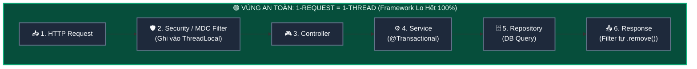
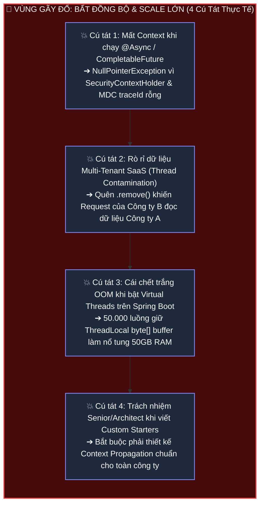
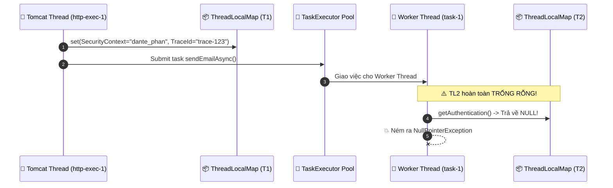
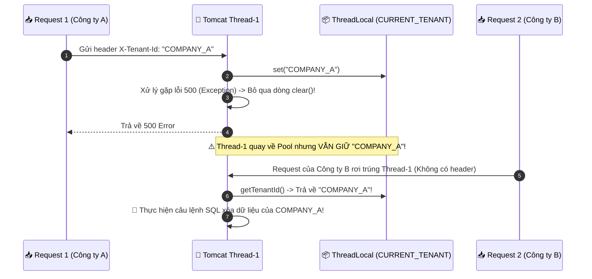
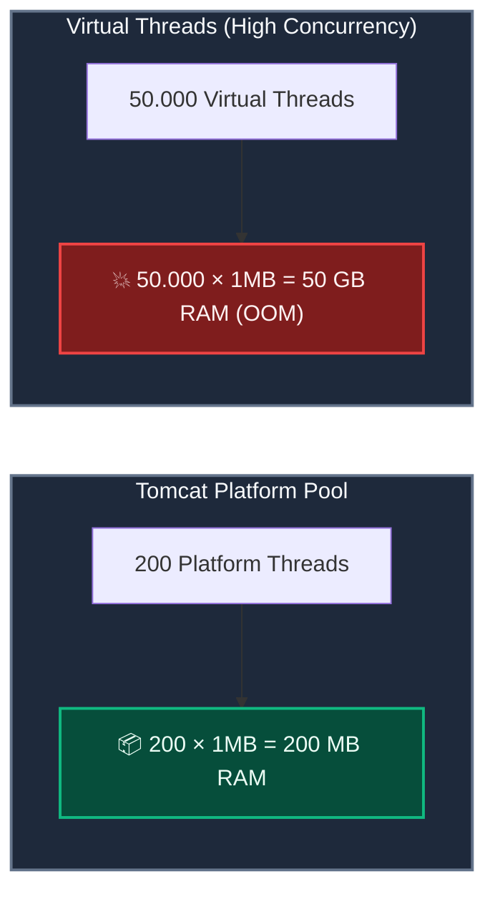

# 🚨 "Framework Lo Hết Rồi, Cần Gì Quan Tâm ThreadLocal?": 4 Cú Tát Thực Tế & Lời Giải ScopedValue

Tài liệu deep-dive chuyên sâu về **Bối cảnh Thực chiến của Context Propagation trong Java & Spring Boot**: Bóc tách lớp vỏ bọc "kỳ diệu" của Framework, chỉ ra 4 tình huống gãy đổ kinh điển (Mất Context khi chạy `@Async`/`CompletableFuture`, Rò rỉ dữ liệu Multi-tenant, Sập 50GB RAM khi bật Virtual Threads, và Thiết kế Custom Starters/Tracing), cùng giải pháp `TaskDecorator` hiện tại và bước chuyển mình sang `ScopedValue`.

---

## 🗺️ Bản đồ Không gian: Ảo Giác An Toàn vs Thực Tế Gãy Đổ

### 🟢 Block 1: Vùng An Toàn — Chu trình 1-Request = 1-Thread tuần tự
> Trong mô hình này, Framework âm thầm quản lý `ThreadLocal` từ đầu đến cuối, lập trình viên không cần can thiệp.



---

### 🔴 Block 2: Vùng Gãy Đổ — Khi phân nhánh Concurrency & Scale lớn
> Ngay khi bước ra khỏi 1 luồng duy nhất, 4 bài toán thực tế sau sẽ lập tức "đánh sập" hệ thống nếu không hiểu bản chất `ThreadLocal` / `ScopedValue`.




---

## D0 — Problem: Ảo Giác "Tôi Không Cần Biết ThreadLocal"

Trong các ứng dụng Spring Boot hàng ngày, lập trình viên thường chỉ viết các dòng code quen thuộc:

```java
@RestController
public class OrderController {
    @GetMapping("/orders")
    public List<Order> getOrders() {
        // Lấy thông tin user hiện tại
        String user = SecurityContextHolder.getContext().getAuthentication().getName();
        // Ghi log kèm traceId
        log.info("Fetching orders for user: {}", user); 
        return orderService.getOrders();
    }
}
```

Mọi thứ chạy "như có phép màu":
- `@Transactional` tự biết gắn các câu lệnh SQL vào đúng Database Connection.
- `SecurityContextHolder.getContext()` tự biết ai đang đăng nhập ở bất kỳ tầng nào.
- Logback `MDC` tự động in kèm `[traceId=xxx]` trong từng dòng log.
- `@RequestScope` tự động cô lập bean cho từng HTTP request.

### ❓ Bí mật đằng sau lớp vỏ bọc là gì?
**100% các tính năng "thần thánh" trên của Spring Boot đều chạy ngầm trên nền tảng `ThreadLocal`!**

```
┌──────────────────────────────┬────────────────────────────────────────────────────────┐
│ BẠN THẤY (Annotation / API)  │ BẢN CHẤT NGẦM BÊN DƯỚI (Spring Framework Internal)    │
├──────────────────────────────┼────────────────────────────────────────────────────────┤
│ @Transactional               │ TransactionSynchronizationManager.resources (ThreadLocal)│
│ SecurityContextHolder.get()  │ ThreadLocalSecurityContextHolderStrategy (ThreadLocal) │
│ MDC.put("traceId", id)       │ Logback ThreadLocalMDCAdapter (ThreadLocal)           │
│ RequestContextHolder.get()   │ ServletRequestAttributes (ThreadLocal)                │
└──────────────────────────────┴────────────────────────────────────────────────────────┘
```

> ⚠️ **Quy luật bất biến:** Lớp vỏ bọc này **CHỈ HOẠT ĐỘNG HOÀN HẢO** khi toàn bộ request của bạn chạy từ đầu đến cuối trên **DUY NHẤT 1 PLATFORM THREAD**. Ngay khi bạn phân nhánh xử lý, chuyển luồng hoặc tăng tải lên hàng triệu Virtual Threads, lớp vỏ bọc sẽ lập tức vỡ vụn!

---

## D1 — Vocabulary: Giải Mã "Hộp Đen" Context của Spring

1. **`SecurityContextHolderStrategy`**: Interface của Spring Security chịu trách nhiệm lưu trữ `SecurityContext`. Mặc định dùng `MODE_THREADLOCAL` (`ThreadLocalSecurityContextHolderStrategy`).
2. **`TransactionSynchronizationManager`**: Trái tim của `@Transactional` trong Spring. Quản lý Connection, Transaction Status, và Resource Binding theo từng `ThreadLocal`.
3. **`MDCAdapter` (Mapped Diagnostic Context)**: Bộ điều hợp của SLF4J/Logback, giữ một `Map<String, String>` trong `ThreadLocal` của từng luồng để tự động chèn `traceId`, `userId` vào mọi format log.
4. **`TaskDecorator`**: Callback interface của Spring cho phép bạn can thiệp vào khoảnh khắc một `Runnable` được submit sang một luồng khác, dùng để **sao chép thủ công context** từ luồng gọi sang luồng thực thi.
5. **`Thread Contamination` (Nhiễm bẩn dữ liệu luồng)**: Hiện tượng luồng trong Thread Pool tái sử dụng dữ liệu còn sót lại của request trước do không dọn dẹp sạch.

---

## D2 — Mechanism: Giải Phẫu 4 Cú Tát Thực Tế & Lời Giải

---

### 💥 Cú Tát 1: Mất Tích Context Khi Chạy Async (`@Async`, `CompletableFuture`)

#### 1. Kịch bản lỗi kinh điển:
Bạn có một API xử lý đơn hàng, sau khi lưu DB bạn muốn gửi email xác nhận bất đồng bộ để API phản hồi nhanh hơn:

```java
@RestController
@RequiredArgsConstructor
public class OrderController {
    private final NotificationService notificationService;
    private final OrderService orderService;

    @PostMapping("/orders")
    public ResponseEntity<Void> createOrder(@RequestBody OrderRequest req) {
        // 🟢 Ở Controller (Thread: http-nio-8080-exec-1)
        // Lấy username từ JWT token thành công: "dante_phan"
        String username = SecurityContextHolder.getContext().getAuthentication().getName();
        log.info("Creating order for: {}", username); // Log in kèm traceId: [trace-123]

        orderService.saveOrder(req);

        // Gọi hàm async để gửi email
        notificationService.sendEmailAsync(req.getEmail());

        return ResponseEntity.ok().build();
    }
}

@Service
public class NotificationService {
    @Async // ⚠️ BẮT ĐẦU ĐỔI LUỒNG!
    public void sendEmailAsync(String email) {
        // 🔴 Đang chạy trên Thread mới: task-executor-1
        
        // ❌ BÙM! NullPointerException vì getAuthentication() trả về null!
        String currentUser = SecurityContextHolder.getContext().getAuthentication().getName();

        // ❌ Log bị mất sạch traceId: [traceId=null] -> Không trace được log trên Kibana/Grafana!
        log.info("Sending confirmation email to: {}, triggered by: {}", email, currentUser);
    }
}
```

#### 2. Vì sao lại lỗi?
* Khi chuyển sang `@Async`, Spring đẩy tác vụ sang một Worker Thread khác trong `ThreadPoolTaskExecutor`.
* Worker Thread mới này có một `ThreadLocalMap` **hoàn toàn trống rỗng**. Toàn bộ `SecurityContext` và `MDC` nằm ở luồng Tomcat cũ không tự nhảy qua được!



#### 3. Giải pháp truyền thống: Dùng `TaskDecorator` để "sao chép thủ công"
Để giải quyết, bạn bắt buộc phải hiểu cơ chế này và tự cấu hình một `TaskDecorator`:

```java
@Configuration
@EnableAsync
public class AsyncConfig {

    @Bean(name = "taskExecutor")
    public Executor taskExecutor() {
        ThreadPoolTaskExecutor executor = new ThreadPoolTaskExecutor();
        executor.setCorePoolSize(10);
        executor.setMaxPoolSize(50);
        executor.setQueueCapacity(100);
        executor.setThreadNamePrefix("async-worker-");
        
        // ✅ Cấu hình TaskDecorator để copy context qua luồng mới
        executor.setTaskDecorator(new ContextCopyingTaskDecorator());
        executor.initialize();
        return executor;
    }
}

// Bộ sao chép context thủ công
public class ContextCopyingTaskDecorator implements TaskDecorator {
    @Override
    public Runnable decorate(Runnable runnable) {
        // 1. Chạy trên Luồng GỌI (Tomcat thread): Lấy context hiện tại ra
        SecurityContext securityContext = SecurityContextHolder.getContext();
        Map<String, String> mdcContext = MDC.getCopyOfContextMap();

        return () -> {
            try {
                // 2. Chạy trên Luồng WORKER: Nạp context vào luồng mới
                if (securityContext != null) {
                    SecurityContextHolder.setContext(securityContext);
                }
                if (mdcContext != null) {
                    MDC.setContextMap(mdcContext);
                }
                // 3. Thực thi logic nghiệp vụ thật
                runnable.run();
            } finally {
                // 4. BẮT BUỘC DỌN DẸP để tránh ô nhiễm luồng worker
                SecurityContextHolder.clearContext();
                MDC.clear();
            }
        };
    }
}
```

---

### 💥 Cú Tát 2: Rò Rỉ Dữ Liệu Chéo Giữa Các Tenant (Thread Contamination)

#### 1. Kịch bản lỗi bảo mật nghiêm trọng:
Trong kiến trúc Multi-tenancy (SaaS phục vụ nhiều công ty trên cùng 1 hệ thống), bạn dùng `AbstractRoutingDataSource` để định tuyến câu query đến đúng schema DB của từng công ty dựa vào `TenantContext`:

```java
public class TenantContext {
    private static final ThreadLocal<String> CURRENT_TENANT = new ThreadLocal<>();

    public static void setTenantId(String tenantId) {
        CURRENT_TENANT.set(tenantId);
    }

    public static String getTenantId() {
        return CURRENT_TENANT.get();
    }

    public static void clear() {
        CURRENT_TENANT.remove();
    }
}
```

Bạn viết một `TenantFilter` để chặn request từ Gateway:

```java
@Component
public class TenantFilter implements Filter {
    @Override
    public void doFilter(ServletRequest request, ServletResponse response, FilterChain chain) 
            throws IOException, ServletException {
        HttpServletRequest httpReq = (HttpServletRequest) request;
        String tenantId = httpReq.getHeader("X-Tenant-Id");

        TenantContext.setTenantId(tenantId);

        // ❌ LỖI CON NGƯỜI: Không bọc chain.doFilter() trong khối try-finally!
        chain.doFilter(request, response);
        
        // Dòng clear() đặt ở đây: Nếu có Exception xảy ra ở Controller, dòng này SẼ KHÔNG ĐƯỢC CHẠY!
        TenantContext.clear(); 
    }
}
```

#### 2. Thảm họa xảy ra như thế nào?



> 💥 **Hậu quả:** Người dùng Công ty B xem và chỉnh sửa toàn bộ dữ liệu của Công ty A! Đây là lỗi bảo mật cấp độ tối cao (Critical Security Incident).

---

### 💥 Cú Tát 3: Sập 50GB RAM Khi Bật Virtual Threads Trên Spring Boot

#### 1. Kịch bản sập nguồn:
Bạn nâng cấp lên Spring Boot 3.2+ / Java 21, đọc tài liệu thấy bảo Virtual Threads giúp tăng throughput vượt bậc. Bạn hào hứng bật cấu hình:
```properties
spring.threads.virtual.enabled=true
```

Trong dự án có một thư viện nén file Zip hoặc parse JSON cũ. Tác giả thư viện này muốn "tối ưu hiệu năng" nên dùng `ThreadLocal` để cache một buffer 1MB, tránh việc GC phải thu dọn liên tục:

```java
// Mã nguồn bên trong một thư viện third-party:
public class LegacyZipCompressor {
    // Mỗi thread giữ 1 buffer 1MB trong ThreadLocal để tái sử dụng
    private static final ThreadLocal<byte[]> BUFFER_CACHE = 
            ThreadLocal.withInitial(() -> new byte[1024 * 1024]); // 1 MB

    public byte[] compress(byte[] input) {
        byte[] buffer = BUFFER_CACHE.get();
        // Thực hiện nén dữ liệu bằng buffer...
        return result;
    }
}
```

#### 2. Bài toán toán học làm nổ tung RAM:

```
┌─────────────────────────────────────────────────────────────────────────────┐
│ 1. MÔ HÌNH PLATFORM THREAD CŨ (Tomcat Thread Pool ~200 Threads):            │
│    200 Threads × 1 MB Buffer = 200 MB RAM Heap.                             │
│    -> Quá nhẹ nhàng, hệ thống chạy êm ru suốt 5 năm không ai nhận ra!       │
├─────────────────────────────────────────────────────────────────────────────┤
│ 2. MÔ HÌNH VIRTUAL THREADS MỚI (Xử lý 50.000 requests cùng lúc):            │
│    50.000 Virtual Threads × 1 MB Buffer = 50.000 MB = 50 GB RAM!            │
│    -> JVM hết sạch RAM Heap -> Sập OutOfMemoryError ngay lập tức!           │
└─────────────────────────────────────────────────────────────────────────────┘
```



> 💡 **Bài học sống còn:** Trên Virtual Threads, **Thread được tạo ra và biến mất liên tục như bọt nước**. Tuyệt đối không được dùng `ThreadLocal` làm object pool / buffer cache!

---

### 💥 Cú Tát 4: Khi Bạn Lên Senior/Architect — Tự Viết Shared Libs & Custom Starters

Khi bạn đảm nhận vị trí Senior hoặc Tech Lead trong doanh nghiệp, bạn sẽ phải xây dựng các bộ thư viện dùng chung (Common Starters / Core SDKs):
1. **Audit Log Starter**: Tự động bắt mọi thao tác `INSERT/UPDATE` để ghi log ai làm vào bảng `audit_logs`.
2. **Distributed Tracing Starter**: Tự động lấy `traceparent` từ HTTP Header, đính vào `MDC`, gửi kèm theo mọi Kafka Message và SQL Query (thông qua P6Spy hoặc Hibernate Interceptor).
3. **Dynamic Data Masking**: Ẩn số thẻ tín dụng / số điện thoại với user thường nhưng hiển thị đầy đủ với user quản trị cấp cao.

Tất cả các kiến trúc trên **bắt buộc phải có một tầng Context Management cực kỳ chuẩn xác**. Nếu bạn không hiểu cách `ThreadLocal` hoạt động và cách dọn dẹp, toàn bộ các ứng dụng khác trong công ty import Starter của bạn sẽ bị dính Memory Leak và lỗi nhiễm bẩn dữ liệu!

---

## D3 — The Next Evolution: `ScopedValue` Giải Quyết Ra Sao?

Trong Java 21+ (Project Loom), `ScopedValue` ra đời để thay thế hoàn toàn nhu cầu dùng `TaskDecorator` vá víu và loại bỏ tận gốc nguy cơ rò rỉ dữ liệu.

### So sánh trực tiếp giữa 2 thời kỳ:

```java
// ==========================================
// THỜI KỲ 1: TaskDecorator (Vá víu, dễ sót)
// ==========================================
public void oldWay() {
    SecurityContext ctx = SecurityContextHolder.getContext();
    executor.submit(() -> {
        try {
            SecurityContextHolder.setContext(ctx); // Copy thủ công
            doWork();
        } finally {
            SecurityContextHolder.clearContext();  // Dọn thủ công
        }
    });
}

// ==========================================
// THỜI KỲ 2: ScopedValue + Structured Concurrency (Thanh lịch, Zero-copy)
// ==========================================
public static final ScopedValue<UserPrincipal> CURRENT_USER = ScopedValue.newInstance();

public void modernWay() {
    UserPrincipal user = authenticate();

    // Ràng buộc giá trị -> Tự động chia sẻ cho mọi Virtual Thread con bên trong
    ScopedValue.where(CURRENT_USER, user).run(() -> {
        try (var scope = new StructuredTaskScope.ShutdownOnFailure()) {
            scope.fork(() -> callServiceA()); // Tự động đọc được CURRENT_USER
            scope.fork(() -> callServiceB()); // Tự động đọc được CURRENT_USER
            scope.join();
        }
        // Ra khỏi đây: Tự động giải phóng 100%, không tốn 1 byte sao chép RAM!
    });
}
```

---

## D4 — Architecture & Checklist Chuẩn Production

Khi phát triển ứng dụng Spring Boot và Java Concurrency, hãy áp dụng **Checklist 5 Tiêu Chí Vàng**:

```
┌─────────────────────────────────────────────────────────────────────────────┐
│                 CHECKLIST KIỂM SOÁT CONTEXT DÀNH CHO SENIOR / LEAD          │
├─────────────────────────────────────────────────────────────────────────────┤
│ [ ] 1. Mọi nơi gọi ThreadLocal.set() BẮT BUỘC phải nằm trong try-finally    │
│       với ThreadLocal.remove() ở khối finally.                              │
│                                                                             │
│ [ ] 2. Khi dùng @Async hoặc CompletableFuture, đã cấu hình TaskDecorator    │
│       để propagate SecurityContext và MDC hay chưa?                         │
│                                                                             │
│ [ ] 3. Khi bật Virtual Threads, đã quét toàn bộ codebase và thư viện bên    │
│       thứ 3 xem có ai dùng ThreadLocal<byte[]> hoặc Object Buffer không?    │
│                                                                             │
│ [ ] 4. Với hệ thống Multi-tenant, đã có Integration Test kiểm tra việc      │
│       gọi liên tiếp 2 request khác Tenant trên cùng 1 Worker Thread chưa?   │
│                                                                             │
│ [ ] 5. Với code mới trên Java 21+, ưu tiên truyền Parameter tường minh      │
│       hoặc dùng ScopedValue cho các luồng xử lý phân nhánh song song.       │
└─────────────────────────────────────────────────────────────────────────────┘
```

---

> [!TIP]
> ### 💡 Từ điển Thuật ngữ & Mental Model (Gốc từ & Cách liên tưởng)
>
> 1. **TaskDecorator (Người đóng gói đính kèm)**:
>    - **Nghĩa tiếng Anh thuần**: *Task* là công việc; *Decorator* là người trang trí, bổ sung tính năng.
>    - **Trong ngữ cảnh dự án**: Một interface bọc quanh task bất đồng bộ để copy context từ luồng cha sang luồng con trước khi chạy và dọn dẹp sau khi xong.
>    - **💡 Cách liên tưởng**: *"Người giao hàng kẹp thêm phong bì hóa đơn đỏ vào gói hàng trước khi chuyển cho shipper đi giao, giao xong thì xé bỏ cuống biên lai"*.
>
> 2. **Thread Contamination (Nhiễm bẩn chéo luồng)**:
>    - **Nghĩa tiếng Anh thuần**: *Contamination* là sự làm bẩn / ô nhiễm.
>    - **Trong ngữ cảnh dự án**: Hiện tượng luồng trong Thread Pool thực thi request mới nhưng lại đọc được dữ liệu cũ của request trước do quên gọi `.remove()`.
>    - **💡 Cách liên tưởng**: *"Cốc nước ở quán cà phê không được rửa sau khi khách cũ về: Khách mới vào uống nhầm nước thừa của người trước"*.
>
> 3. **Buffer Hoarding (Tích trữ túi đồ phình to)**:
>    - **Nghĩa tiếng Anh thuần**: *Hoarding* là hành vi tích trữ quá mức.
>    - **Trong ngữ cảnh dự án**: Thói quen lưu các mảng byte lớn (`byte[1024*1024]`) trong `ThreadLocal` để tái sử dụng, gây thảm họa OOM khi số lượng thread tăng lên hàng chục nghìn.
>    - **💡 Cách liên tưởng**: *"Mỗi nhân viên trong công ty giữ riêng một tủ đồ sắt 100kg. Khi công ty chỉ có 10 người thì không sao, nhưng khi thuê 10.000 lao động thời vụ mang theo 10.000 tủ sắt thì sàn nhà bị sập"*.

---

## 🎤 Cầu Nối Phỏng Vấn (Interview Bridges)

### Q1: *"Tại sao khi tôi dùng `@Async` trong Spring Boot thì `SecurityContextHolder.getContext()` lại trả về null?"*
* **Trả lời 30s:**
  > *"Bởi vì Spring Security mặc định sử dụng `ThreadLocalSecurityContextHolderStrategy` để lưu trữ context gắn theo từng `Thread`. Khi phương thức được đánh dấu `@Async`, Spring sẽ đẩy việc sang một luồng khác trong ThreadPoolExecutor có `ThreadLocalMap` hoàn toàn riêng biệt. Để khắc phục, ta cấu hình `TaskDecorator` cho `ThreadPoolTaskExecutor` để sao chép `SecurityContext` từ luồng cha sang luồng worker trước khi thực thi, đồng thời gọi `clearContext()` trong `finally`."*

### Q2: *"Khi bật Virtual Threads trong Spring Boot 3 (`spring.threads.virtual.enabled=true`), nguy cơ lớn nhất đối với `ThreadLocal` là gì?"*
* **Trả lời 30s:**
  > *"Nguy cơ lớn nhất là **Bùng nổ bộ nhớ Heap (OutOfMemoryError)** do hiện tượng 'Buffer Hoarding'. Với Platform Thread Pool (~200 luồng), việc các thư viện cache mảng `byte[]` hoặc Object nặng trong `ThreadLocal` chỉ tốn vài trăm MB. Nhưng với Virtual Threads, hệ thống có thể tạo ra 50.000 đến 100.000 luồng đồng thời, nhân số lượng bản sao `ThreadLocalMap` lên hàng vạn lần và làm sập JVM. Do đó trên Virtual Threads, ta phải loại bỏ các buffer cache trong `ThreadLocal` và chuyển sang dùng `ScopedValue` hoặc cấp phát ngắn hạn."*

---

> 📖 **Đọc chuyên đề trước:** [🧵 ThreadLocal vs ScopedValue: Truyền Context Trong Kỷ Nguyên Virtual Threads](./03-threadlocal-vs-scoped-value.md)
>
> 📖 **Đọc chuyên đề tiếp theo:** [🗺️ Phân Tầng Concurrency & Connection Pool: Từ Ứng Dụng Java Đến Database](./05-concurrency-landscape-app-vs-db-layer-demystified.md)
