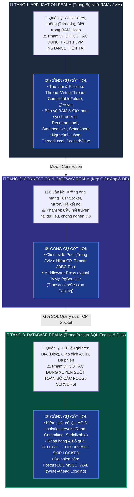
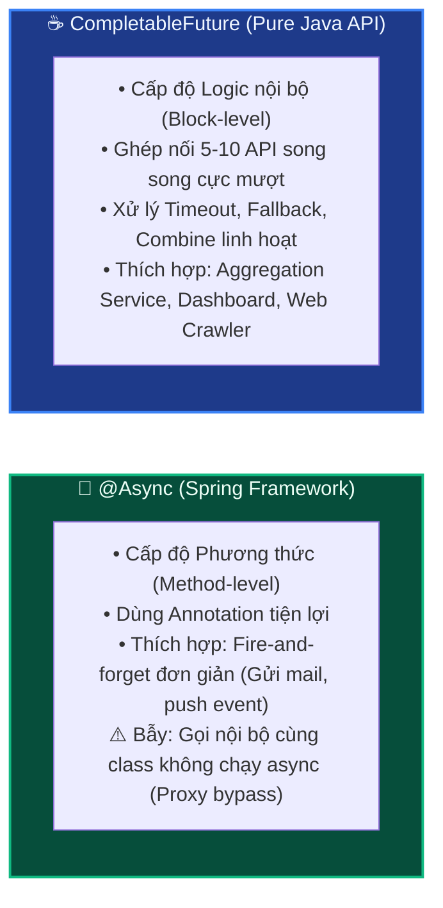
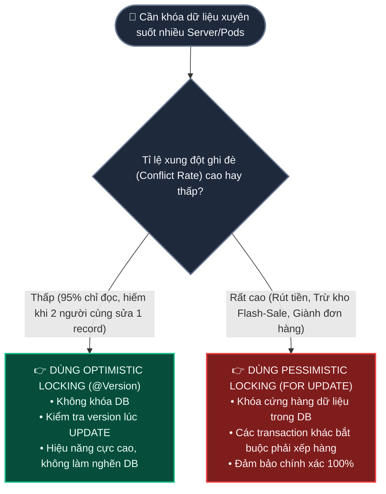

# 🗺️ Phân Tầng Concurrency & Connection Pool: Từ Ứng Dụng Java Đến Database

Tài liệu cẩm nang toàn diện nhằm **Xóa Bỏ Hoàn Toàn Sự Nhầm Lẫn** giữa các tầng Concurrency: Phân định rạch ròi ranh giới giữa **Tầng Ứng dụng (App/JVM)**, **Tầng Điều phối Kết nối (Connection Pool)** và **Tầng Cơ sở dữ liệu (Database)**; giải mã bản chất các công cụ (`Semaphore`, `ReentrantLock`, `CompletableFuture`, `@Async`, `HikariCP`, `PgBouncer`, `FOR UPDATE`); hướng dẫn thực chiến các hàm async hay dùng và cây quyết định chọn đúng công cụ ở đúng tầng.

---

## 🗺️ Bản Đồ Không Gian: 3 Tầng Concurrency Riêng Biệt

Để không bao giờ bị lẫn lộn, bạn hãy luôn hình dung hệ thống chia thành **3 Không Gian Vật Lý & Logic hoàn toàn khác nhau**:



---

## D0 — Problem: Nỗi Hoang Mang "Ai Đang Quản Lý Cái Gì?"

Lập trình viên thường bị "rối loạn tiền đình" khi cùng lúc đối mặt với:
`synchronized`, `ReentrantLock`, `StampedLock`, `Semaphore`, `AtomicInteger`, `CompletableFuture`, `@Async`, `HikariCP`, `PgBouncer`, `FOR UPDATE`, `Optimistic Lock (@Version)`.

### ❓ Vì sao lại lẫn lộn?
Bởi vì tất cả các công cụ này đều mang danh nghĩa **"giải quyết vấn đề đồng thời (Concurrency)"**, nhưng chúng giải quyết ở **3 bài toán hoàn toàn khác nhau**:

1. **Bài toán 1 — Bảo vệ biến trong RAM của 1 máy:**
   * Bạn có biến `private int count = 0;` trong Java. Khi 100 luồng trong cùng 1 JVM cùng tăng biến này $\rightarrow$ Dùng `AtomicInteger`, `synchronized`, hoặc `ReentrantLock`.
   * ⚠️ *Nếu hệ thống scale ra 3 Kubernetes Pods (3 JVM riêng biệt), các công cụ trên hoàn toàn VÔ DỤNG!*

2. **Bài toán 2 — Tiết kiệm đường truyền mạng đến Database:**
   * Mỗi lần mở một kết nối TCP từ Java sang PostgreSQL tốn $10\text{ms} - 50\text{ms}$ và tốn $10\text{MB}$ RAM của OS $\rightarrow$ Dùng **Connection Pool (`HikariCP`, `PgBouncer`)** để tạo sẵn 50 đường ống và dùng đi dùng lại.

3. **Bài toán 3 — Bảo vệ hàng dữ liệu trên ổ đĩa Database:**
   * Tài khoản của khách chỉ còn 100.000 VNĐ. Khách bấm rút tiền trên cả App Mobile và Web cùng 1 giây (2 request bay vào 2 Pods khác nhau) $\rightarrow$ Dùng **Database Locking (`SELECT ... FOR UPDATE`)** hoặc **Optimistic Locking (`@Version`)** trên PostgreSQL!

---

## D1 — Vocabulary: Bảng "Căn Cước Công Dân" Của Các Công Cụ

Để không còn mơ hồ, hãy định danh chính xác bản chất kỹ thuật của từng khái niệm:

| Tên công cụ | Bản chất kỹ thuật | Tầng hoạt động | Nhiệm vụ cốt lõi |
| :--- | :--- | :--- | :--- |
| **`Semaphore`** | **JDK Concrete Class** (`java.util.concurrent.Semaphore`) | Tầng App (JVM) | Đếm giấy phép (Permits) để giới hạn số luồng cùng truy cập một tài nguyên trong RAM. |
| **`ReentrantLock`** | **JDK Concrete Class** implementing `Lock` | Tầng App (JVM) | Khóa độc quyền trong RAM (1 luồng vào, hỗ trợ timeout, tái nhập). |
| **`StampedLock`** | **JDK Concrete Class** (`java.util.concurrent.locks`) | Tầng App (JVM) | Khóa tối ưu đọc lạc quan (Optimistic Read) siêu tốc độ trong RAM. |
| **`CompletableFuture`**| **JDK Concrete Class** implementing `CompletionStage`| Tầng App (JVM) | Xây dựng pipeline xử lý kết quả bất đồng bộ theo phong cách lập trình hàm (Fluent API). |
| **`@Async`** | **Spring Annotation + AOP Proxy** | Tầng App (Spring) | Tự động đẩy một phương thức sang `TaskExecutor` để chạy ngầm. |
| **`ThreadLocal` / `ScopedValue`** | **JDK Classes** | Tầng App (JVM) | Lưu trữ dữ liệu ngữ cảnh (User, Tenant, TraceId) theo luồng hoặc theo scope code. |
| **`HikariCP`** | **Third-party Java Library** (JDBC Pool) | Tầng Kết nối (Trong JVM)| Quản lý pool các kết nối JDBC trong bộ nhớ Java để tái sử dụng socket TCP. |
| **`PgBouncer`** | **Standalone C Application** (Proxy Middleware) | Tầng Kết nối (Ngoài JVM)| Đứng giữa hàng chục server App và Database để gom và ghép kênh hàng nghìn kết nối. |
| **`FOR UPDATE`** | **Cú pháp SQL Chuẩn (DBMS Engine)** | Tầng Database | Khóa cứng các hàng dữ liệu (Pessimistic Row Lock) trên đĩa cho đến khi `COMMIT`. |
| **`SKIP LOCKED`** | **Mệnh đề SQL của PostgreSQL** | Tầng Database | Bỏ qua các hàng đang bị khóa để lấy hàng rảnh rỗi tiếp theo (Xây dựng Worker Queue). |
| **`@Version` (Optimistic Lock)**| **Design Pattern** (Ứng dụng kết hợp DB check) | Tầng App + DB | So khớp số version (`WHERE version = 1`) lúc update để phát hiện xung đột ghi đè. |

---

## D2 — Mechanism: Bóc Tách Chi Tiết Từng Tầng

---

### 🏢 PHẦN 1: TẦNG ỨNG DỤNG (Java Concurrency & CompletableFuture)

#### 1. `Semaphore` là cái gì? Class, Interface hay Design Pattern?
* **Khái niệm lý thuyết (CS Concept):** Là một cấu trúc đồng bộ do nhà khoa học máy tính *Edsger Dijkstra* phát minh năm 1965.
* **Hiện thực trong Java:** Là một **Class cụ thể có sẵn trong JDK** (`java.util.concurrent.Semaphore`), bạn không cần cài thêm bất kỳ dependency nào!
* **Cơ chế:** Quản lý một số lượng "giấy phép" (`permits`):
  - `semaphore.acquire()`: Lấy 1 giấy phép (nếu còn $>0$ thì đi tiếp; nếu hết $=0$ thì luồng bị treo đứng chờ).
  - `semaphore.release()`: Trả lại 1 giấy phép cho người sau.
* **Khác biệt với Lock:** 
  - `Lock` = Semaphore với $1$ giấy phép (Chỉ đúng 1 người vào).
  - `Semaphore` = Cho phép $N$ người vào cùng lúc (Ví dụ: Giới hạn tối đa 10 request đồng thời được gọi API sang bên thứ 3).

---

#### 2. `CompletableFuture`: Pipeline Xử Lý Bất Đồng Bộ Hiện Đại

`CompletableFuture` (Java 8+) là công cụ mạnh mẽ nhất để xử lý bất đồng bộ mà không bị rơi vào "Callback Hell".

```
┌─────────────────────────────────────────────────────────────────────────────┐
│                 BẢN ĐỒ CÁC HÀM CỐT LÕI CỦA COMPLETABLEFUTURE                │
├─────────────────────────────────────────────────────────────────────────────┤
│ 1. KHỞI TẠO TÁC VỤ:                                                         │
│    • runAsync(Runnable)       : Chạy ngầm KHÔNG cần trả về kết quả          │
│    • supplyAsync(Supplier<T>) : Chạy ngầm CÓ trả về kết quả T               │
├─────────────────────────────────────────────────────────────────────────────┤
│ 2. BIẾN ĐỔI & NỐI TIẾP (Chaining):                                          │
│    • thenApply(Function)      : Nhận kết quả bước 1 -> Chuyển thành kiểu mới│
│    • thenCompose(Function)    : Nối tiếp một Future khác (tránh lồng nhau)  │
│    • thenAccept(Consumer)     : Nhận kết quả và tiêu thụ (in log, lưu DB)   │
├─────────────────────────────────────────────────────────────────────────────┤
│ 3. GOM NHIỀU LUỒNG SONG SONG:                                               │
│    • thenCombine(other, BiFn) : Chờ 2 Future hoàn tất -> Ghép kết quả       │
│    • CompletableFuture.allOf(): Chờ TẤT CẢ danh sách Futures chạy xong      │
│    • CompletableFuture.anyOf(): Lấy kết quả của Future XONG NHANH NHẤT      │
├─────────────────────────────────────────────────────────────────────────────┤
│ 4. BẮT LỖI & FALLBACK:                                                      │
│    • exceptionally(Function)  : Trả về giá trị mặc định nếu gặp lỗi         │
└─────────────────────────────────────────────────────────────────────────────┘
```

#### 3. So sánh `@Async` vs `CompletableFuture` (Khi nào dùng cái nào?)



#### 4. Ví dụ Thực Chiến 7 Hàm Hay Dùng Nhất Của `CompletableFuture`:

```java
@Service
@RequiredArgsConstructor
public class DashboardAggregatorService {

    private final UserClient userClient;
    private final OrderClient orderClient;
    private final PaymentClient paymentClient;
    private final Executor customAsyncExecutor; // Luôn dùng ThreadPool riêng!

    public DashboardResponse buildUserDashboard(String userId) {

        // 1. supplyAsync: Chạy 2 tác vụ song song độc lập
        CompletableFuture<UserProfile> userFuture = CompletableFuture.supplyAsync(
            () -> userClient.getUserProfile(userId), customAsyncExecutor
        ).exceptionally(ex -> UserProfile.anonymous()); // Fallback nếu lỗi

        CompletableFuture<List<Order>> ordersFuture = CompletableFuture.supplyAsync(
            () -> orderClient.getRecentOrders(userId), customAsyncExecutor
        );

        // 2. thenCompose: Sau khi có Profile -> Lấy tiếp Cấp bậc VIP (Nối tiếp)
        CompletableFuture<VipStatus> vipFuture = userFuture.thenCompose(
            profile -> CompletableFuture.supplyAsync(() -> userClient.getVipStatus(profile.vipLevel()))
        );

        // 3. thenCombine: Gom kết quả của 2 luồng (Orders + VIP Status) lại
        CompletableFuture<DashboardSummary> summaryFuture = ordersFuture.thenCombine(
            vipFuture, 
            (orders, vip) -> new DashboardSummary(orders.size(), vip.discountPercent())
        );

        // 4. runAsync: Gửi audit log ngầm không cần chờ đợi (Fire-and-forget)
        CompletableFuture.runAsync(
            () -> log.info("Dashboard generated for user: {}", userId), customAsyncExecutor
        );

        // 5. Chờ lấy kết quả cuối cùng (có timeout 3 giây)
        try {
            return new DashboardResponse(userFuture.join(), summaryFuture.get(3, TimeUnit.SECONDS));
        } catch (Exception e) {
            throw new BusinessException("Không thể tải dashboard", e);
        }
    }
}
```

---

### 🌉 PHẦN 2: TẦNG KẾT NỐI (HikariCP vs PgBouncer)

Rất nhiều lập trình viên nhầm lẫn giữa **Luồng ứng dụng (App Thread)** và **Kết nối Database (DB Connection)**:

```
┌─────────────────────────────────────────────────────────────────────────────┐
│ 1. APP THREAD (Platform / Virtual Thread):                                  │
│    • Là nhân viên thi hành bytecode trong RAM JVM.                          │
│    • Có thể có 10.000 đến 1.000.000 Virtual Threads cùng lúc!                │
├─────────────────────────────────────────────────────────────────────────────┤
│ 2. DB CONNECTION (TCP Socket tới PostgreSQL):                               │
│    • Là đường dây điện thoại nối từ Server Java sang Server PostgreSQL.     │
│    • Mỗi Connection tốn RAM nặng ở PostgreSQL Process (khoảng 5-10MB/conn). │
│    • PostgreSQL chỉ chịu tối đa khoảng 100 - 300 Physical Connections!      │
└─────────────────────────────────────────────────────────────────────────────┘
```


* **`HikariCP` (Nội bộ 1 App JVM):** Giúp 50.000 Virtual Threads chia sẻ nhau **50 Connection** nội bộ trong 1 Pod.
* **`PgBouncer` (Ngoại vi - Toàn bộ Cụm Hệ Thống):** Khi bạn có 20 Microservices, mỗi microservice có 50 connection $\rightarrow 20 \times 50 = 1.000$ connections. PostgreSQL sẽ sập RAM nếu nhận 1.000 kết nối trực tiếp. **PgBouncer** đứng ở giữa gom 1.000 kết nối này lại và điều phối xuống chỉ còn **20 kết nối thật** tới PostgreSQL!

---

### 🐘 PHẦN 3: TẦNG CƠ SỞ DỮ LIỆU (PostgreSQL Concurrency & Locks)

Khi hệ thống của bạn scale ra **nhiều Kubernetes Pods**, mọi cơ chế khóa ở Tầng App (`synchronized`, `ReentrantLock`) đều **mất tác dụng**. Bạn bắt buộc phải dùng Concurrency ở Tầng Database:



---

## D3 — Failure Modes: 4 Sai Lầm "Râu Ông Nọ Cắm Cằm Bà Kia"

```
┌─────────────────────────────────────────────────────────────────────────────┐
│                      4 TỬ HUYỆT DO LẪN LỘN CÁC TẦNG CONCURRENCY             │
├─────────────────────────────────────────────────────────────────────────────┤
│ 💥 SAI LẦM 1: DÙNG SYNCHRONIZED ĐỂ CHỐNG RÚT TIỀN 2 LẦN KHI CÓ 2 PODS       │
│ • Triệu chứng: Viết synchronized ở Java method nhưng tài khoản vẫn bị âm.   │
│ • Nguyên nhân: synchronized chỉ khóa RAM của Pod 1. Request ở Pod 2 chạy   │
│   trên JVM khác nên không bị ảnh hưởng.                                     │
│ • Giải pháp: Phải dùng Database Lock (SELECT ... FOR UPDATE) hoặc Redis Lock.│
├─────────────────────────────────────────────────────────────────────────────┤
│ 💥 SAI LẦM 2: GỌI @ASYNC CÙNG CLASS (SPRING PROXY BYPASS)                   │
│ • Triệu chứng: Đánh dấu @Async nhưng hàm vẫn chạy tuần tự đồng bộ.         │
│ • Nguyên nhân: Gọi this.myAsyncMethod() bỏ qua lớp AOP Proxy của Spring.   │
│ • Giải pháp: Tách method async sang một @Service khác hoặc dùng             │
│   CompletableFuture.runAsync() trực tiếp.                                   │
├─────────────────────────────────────────────────────────────────────────────┤
│ 💥 SAI LẦM 3: KHÔNG TRUYỀN EXECUTOR CHO COMPLETABLEFUTURE                   │
│ • Triệu chứng: Cả hệ thống bị đơ nghẽn khi chạy nhiều CompletableFuture.   │
│ • Nguyên nhân: Mặc định CompletableFuture dùng ForkJoinPool.commonPool().   │
│   Nếu có tác vụ I/O chậm (gọi mạng), nó sẽ chiếm hết CPU threads chung.    │
│ • Giải pháp: Luôn truyền custom ThreadPoolExecutor vào tham số thứ 2.       │
├─────────────────────────────────────────────────────────────────────────────┤
│ 💥 SAI LẦM 4: NGHĨ 10.000 VIRTUAL THREADS CẦN 10.000 DB CONNECTIONS         │
│ • Triệu chứng: Cấu hình HikariCP maxPoolSize = 5000 -> PostgreSQL sập RAM. │
│ • Nguyên nhân: Không hiểu bản chất ghép kênh. Virtual Thread chỉ mượn       │
│   Connection trong vài mili-giây rồi trả lại.                               │
│ • Giải pháp: Giữ HikariCP pool nhỏ gọn (30-50), tối ưu index câu query nhanh│
└─────────────────────────────────────────────────────────────────────────────┘
```

---

## D4 — Architecture & Decision Guide: Khi Nào Dùng Cái Gì?

```
┌───────────────────────────────────────────────────┬───────────────────────────────────────────┐
│ BÀI TOÁN THỰC TẾ                                  │ CÔNG CỤ CHUẨN XÁC CẦN DÙNG                │
├───────────────────────────────────────────────────┼───────────────────────────────────────────┤
│ Giới hạn chỉ cho phép 10 request gọi API ngoài    │ 👉 java.util.concurrent.Semaphore (Tầng 1)│
│ Gọi 3 dịch vụ song song và ghép dữ liệu trả về    │ 👉 CompletableFuture.supplyAsync + thenCombine│
│ Gửi email / notification không cần đợi kết quả    │ 👉 @Async (Spring Service riêng)          │
│ Chống sửa đè thông tin User (ít khi xung đột)     │ 👉 Optimistic Locking (@Version) (Tầng 3) │
│ Trừ tiền tài khoản ngân hàng (xung đột cao)       │ 👉 SELECT ... FOR UPDATE (Tầng 3)         │
│ Worker phân tán nhặt Job trong DB không trùng nhau│ 👉 SELECT ... FOR UPDATE SKIP LOCKED      │
│ Tái sử dụng kết nối trong 1 Spring Boot App       │ 👉 HikariCP (Tầng 2)                      │
│ Gom kết nối từ 50 Microservices tới 1 PostgreSQL  │ 👉 PgBouncer (Tầng 2)                     │
└───────────────────────────────────────────────────┴───────────────────────────────────────────┘
```

---

> [!TIP]
> ### 💡 Từ điển Thuật ngữ & Mental Model (Gốc từ & Cách liên tưởng)
>
> 1. **Semaphore (Cột đèn tín hiệu giao thông / Máy đếm vé)**:
>    - **Nghĩa tiếng Anh thuần**: *Semaphore* là hệ thống truyền tin bằng cờ hiệu hoặc cột đèn tín hiệu đường sắt.
>    - **Trong ngữ cảnh dự án**: Một class của Java cho phép tối đa $N$ luồng cùng bước qua cổng kiểm soát.
>    - **💡 Cách liên tưởng**: *"Bãi đỗ xe có 10 chỗ trống: Mỗi xe vào làm biển báo trừ 1. Khi biển báo hiển thị số 0 thì xe thứ 11 phải đứng chờ ngoài barie cho đến khi có xe khác đi ra"*.
>
> 2. **CompletableFuture (Chiếc hộp cam kết tương lai)**:
>    - **Nghĩa tiếng Anh thuần**: *Completable* là có thể hoàn tất; *Future* là tương lai.
>    - **Trong ngữ cảnh dự án**: Một đối tượng đại diện cho một kết quả chưa có ngay bây giờ nhưng hứa hẹn sẽ hoàn tất trong tương lai, cho phép ta gắn sẵn các hàm xử lý tiếp theo (`thenApply`, `thenCombine`).
>    - **💡 Cách liên tưởng**: *"Chiếc thẻ rung lấy trà sữa: Khi đặt món, quán đưa bạn chiếc thẻ rung. Bạn thoải mái đi dạo, làm việc khác. Khi trà sữa làm xong, thẻ rung lên và kích hoạt hành động ra lấy trà sữa"*.
>
> 3. **HikariCP vs PgBouncer (Bến xe nội bộ vs Cầu vượt cao tốc liên tỉnh)**:
>    - **HikariCP**: Bến đỗ xe nội bộ của 1 tòa nhà công ty (quản lý xe của riêng nhân viên công ty đó).
>    - **PgBouncer**: Trạm thu phí và điều phối luồng xe trên toàn tuyến cao tốc quốc gia (điều tiết xe từ hàng trăm công ty khác nhau đổ về trung tâm dữ liệu).

---

## 🎤 Cầu Nối Phỏng Vấn (Interview Bridges)

### Q1: *"Sự khác biệt bản chất giữa `ReentrantLock` trong Java và `SELECT ... FOR UPDATE` trong Database là gì?"*
* **Trả lời 30s:**
  > *"Khác biệt cốt lõi nằm ở **Phạm vi bảo vệ (Scope of Protection)**. `ReentrantLock` hoạt động ở **Tầng App (RAM JVM)**, chỉ có tác dụng bảo vệ dữ liệu giữa các luồng chạy trên cùng một máy đơn lẻ. Còn `SELECT ... FOR UPDATE` hoạt động ở **Tầng Database (Disk/Engine)**, có tác dụng khóa các hàng dữ liệu xuyên suốt toàn bộ các Servers, Pods và Microservices cùng kết nối vào cơ sở dữ liệu đó."*

### Q2: *"Tại sao khi dùng `CompletableFuture` ta luôn được khuyến nghị phải truyền vào một Custom `Executor` thay vì dùng hàm mặc định?"*
* **Trả lời 30s:**
  > *"Bởi vì nếu không truyền Executor, `CompletableFuture` sẽ mặc định sử dụng `ForkJoinPool.commonPool()`. Pool này được chia sẻ chung cho toàn bộ JVM với số luồng giới hạn bằng số nhân CPU. Nếu ta chạy các tác vụ I/O nghẽn lâu (như gọi HTTP API bên thứ 3 hoặc đọc file lớn), nó sẽ chiếm dụng hết sạch các luồng chung, làm tê liệt toàn bộ các tính năng khác trong ứng dụng như Parallel Streams."*

---

> 📖 **Đọc chuyên đề trước:** [🚨 "Framework Lo Hết Rồi, Cần Gì Quan Tâm ThreadLocal?": 4 Cú Tát Thực Tế & Lời Giải ScopedValue](./04-why-threadlocal-matters-spring-reality-check.md)
