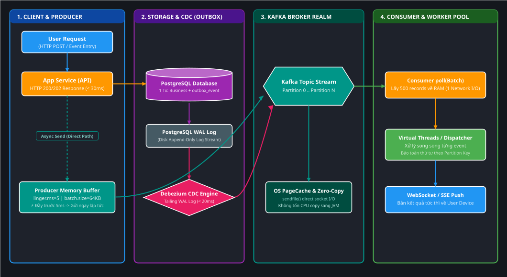
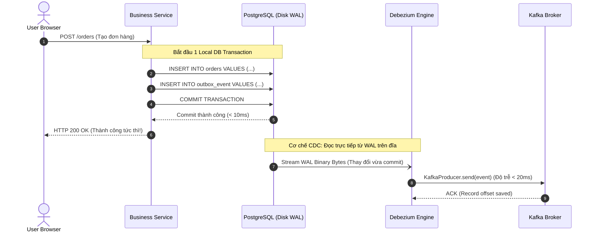
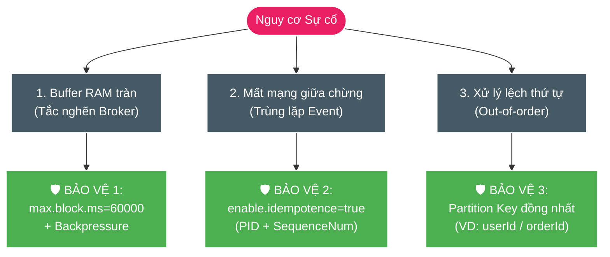

# 🚀 Deep-Dive: Nghịch Lý Batching vs Tức Thời (Real-Time) Trong Hệ Thống Phân Tán Chịu Tải Lớn

Tài liệu giải thích từ **First Principles (Nguyên lý gốc rễ)** dành cho **DEV1** đến **Senior/Architect** về cơ chế vận hành của **Kafka Producer, Consumer và Transactional Outbox (CDC)**. Tài liệu giải mã nghịch lý: *Vì sao hệ thống lớn xử lý hàng triệu người dùng phân tán bắt buộc phải gom batch, nhưng người dùng vẫn nhận phản hồi tức thời trong vài mili-giây?*

---

## 🎯 Bản chất trong một câu

> **Gom batch trong hệ thống chịu tải cao không phải là "ngồi chờ gom cho đủ hàng", mà là cơ chế "Micro-batching thích ứng theo mili-giây (Adaptive Micro-batching)": Đầy bồn chứa thì bắn ngay trong $0.5\text{ms}$, vắng khách thì chạm ngưỡng $5\text{ms}$ là đi luôn, kết hợp cùng Change Data Capture (CDC) đọc trực tiếp nhật ký đĩa để đạt throughput cực đại với latency gần như bằng không.**

---

## 💡 Từ điển Thuật ngữ & Mental Model (Gốc từ & Cách liên tưởng)

> [!TIP]
> ### 💡 Từ điển Thuật ngữ & Mental Model
>
> 1. **Micro-batching (Gom lô siêu nhỏ cấp mili-giây)**:
>    - **Nghĩa tiếng Anh thuần**: `Micro` là *siêu nhỏ* ($10^{-6}$); `Batching` là *gom thành từng mẻ/lô hàng*.
>    - **Trong ngữ cảnh dự án**: Thay vì gửi từng tin nhắn đơn lẻ qua mạng hoặc gom cả nghìn tin trong vài chục giây, hệ thống gom các tin nhắn đến dồn dập trong khoảng thời gian siêu ngắn ($2\text{ms} - 5\text{ms}$) hoặc dung tích nhỏ ($64\text{KB}$) thành một gói tin TCP duy nhất.
>    - **Tại sao lại gọi như vậy**: Để phân biệt với *Batch Processing truyền thống* (như Hadoop chạy tính lương hàng đêm mất vài tiếng).
>    - **💡 Cách liên tưởng**: *"Thang máy thông minh tại tòa nhà chọc trời: Nếu có 10 người ùa vào cùng 1 giây thì đóng cửa chạy ngay; nếu chỉ có 1 người bước vào thì đợi đúng 3 giây không ai vào nữa là tự đóng cửa chạy, không bắt ai đứng chờ vô lý."*
>
> 2. **`linger.ms` & `batch.size` (Độ trễ chờ tối đa & Dung tích bồn chứa)**:
>    - **Nghĩa tiếng Anh thuần**: `Linger` là *nấn ná, chần chừ*; `Batch size` là *kích thước tối đa của một mẻ*.
>    - **Trong ngữ cảnh dự án**: Hai van điều tiết của Kafka Producer. `batch.size=65536` ($64\text{KB}$) là ngưỡng đầy bồn; `linger.ms=5` là thời gian nấn ná tối đa. Điều kiện nào đến trước sẽ kích hoạt gửi tin ngay.
>    - **Tại sao lại gọi như vậy**: Mô tả chính xác hành vi "chần chừ thêm vài mili-giây" của luồng gửi để chờ các tin nhắn khác đến ghép chuyến.
>    - **💡 Cách liên tưởng**: *"Bác tài xế xe buýt mini: 'Đủ 16 khách là nổ máy chạy ngay; nếu chưa đủ thì đúng 5 phút sau dù có 2 khách cũng xuất bến, quyết không trễ giờ!'."*
>
> 3. **Change Data Capture - CDC (Bắt thay đổi dữ liệu từ gốc đĩa)**:
>    - **Nghĩa tiếng Anh thuần**: `Change` (*thay đổi*); `Data` (*dữ liệu*); `Capture` (*bắt giữ, chụp lại*).
>    - **Trong ngữ cảnh dự án**: Công nghệ (như Debezium) kết nối vào file nhật ký ghi trước (*Postgres Write-Ahead Log - WAL* hoặc *MySQL Binlog*). Khi có lệnh `INSERT/UPDATE` vừa commit, CDC đọc luồng byte từ đĩa và đẩy sang Kafka chỉ sau $10\text{ms} - 30\text{ms}$, không cần chạy câu lệnh SQL `SELECT`.
>    - **Tại sao lại gọi như vậy**: Ghi nhận trực tiếp mọi biến động dữ liệu ngay tại nguồn phát sinh thấp nhất của hệ quản trị CSDL.
>    - **💡 Cách liên tưởng**: *"Gắn camera theo dõi trực tiếp hóa đơn in ra từ máy tính tiền siêu thị thay vì mỗi tối cử kế toán đi mở từng ngăn kéo đếm lại từng tờ giấy."*
>
> 4. **Zero-Copy / OS PageCache (Truyền thẳng từ đĩa ra mạng không trung chuyển)**:
>    - **Nghĩa tiếng Anh thuần**: `Zero` (*không*); `Copy` (*sao chép*).
>    - **Trong ngữ cảnh dự án**: Hệ điều hành Linux dùng hàm `sendfile()` chuyển dữ liệu từ PageCache của kernel thẳng vào Card mạng (NIC buffer), không cần copy qua vùng nhớ JVM của ứng dụng.
>    - **Tại sao lại gọi như vậy**: Giảm triệt để số lần CPU phải sao chép dữ liệu giữa Kernel Space và User Space.
>    - **💡 Cách liên tưởng**: *"Hàng gửi từ kho trung tâm được chuyển thẳng lên container ra cảng, không cần bốc dỡ vào phòng khách của công ty môi giới để kiểm tra rồi mới đóng gói lại."*

---

## 1. D0 — Vấn đề: Nghịch Lý Latency vs Throughput (Vì Sao Gửi 1-1 Làm Sập Hệ Thống?)

### ❌ Tư duy ngây thơ của DEV1: "Muốn tức thời thì có event nào phải gửi ngay event đó!"

Giả sử hệ thống nhận $10.000\text{ requests/giây}$ từ người dùng toàn cầu:

```
[10.000 Requests] ──(Mỗi request 1 TCP Packet riêng)──► [Database / Kafka Broker]
```

* **Về mặt Network**: Mỗi event $500\text{ bytes}$ phải cõng thêm $66\text{ bytes}$ TCP/IP Header. 10.000 lần bắt tay socket, $10.000$ lần chuyển đổi ngữ cảnh CPU (Context Switch) từ User Space sang Kernel Space.
* **Về mặt Lưu trữ (Disk I/O)**: Mỗi event ghi xuống đĩa bắt buộc gọi `fsync()` vật lý. Một ổ SSD NVMe xịn nhất chỉ chịu được khoảng $10.000 - 50.000\text{ random IOPS}$. Ổ đĩa nghẽn cứng, hàng đợi (Queue) phình to, và trễ mạng tăng từ $5\text{ms}$ lên $5.000\text{ms}$ (5 giây)!

### ❌ Gom batch kiểu truyền thống (Naive Polling): "Cứ 5 giây quét DB một lần"

```
[Service DB] ──(Mỗi 5s: SELECT * FROM outbox WHERE published=false LIMIT 1000)──► [Poller]
```

* Event đầu tiên rơi vào giây thứ 0.01 sẽ phải **ngồi chờ đến giây thứ 5.00** mới được quét $\to$ Độ trễ trung bình $2.5\text{ giây}$, phá hủy trải nghiệm tức thời của người dùng.
* Khi có $1.000.000$ dòng ghi dồn dập, câu lệnh `SELECT` làm lock bảng và nổ chỉ số CPU Database.

### 📊 Bảng So sánh Toán học I/O Thực tế

| Tiêu chí | Gửi từng event lẻ (1-by-1) | Gom batch chậm (Polling 5s) | Micro-batching thích ứng (Kafka + CDC) |
| :--- | :--- | :--- | :--- |
| **Giao thức I/O** | 10.000 TCP calls / sec | 1 DB Query mỗi 5s | Gom trong $5\text{ms}$ hoặc đầy $64\text{KB}$ |
| **Độ trễ (Latency)** | $50\text{ms} - 5.000\text{ms}$ (khi nghẽn) | $2.500\text{ms} - 5.000\text{ms}$ | **$2\text{ms} - 25\text{ms}$** |
| **Băng thông (Throughput)** | Thấp ($< 3.000\text{ msg/s}$) | Trung bình | **Cực đại ($> 200.000\text{ msg/s}$)** |
| **Áp lực CPU / Disk** | Quá tải Context Switch | Quá tải DB Lock & Scan | Tối ưu tuyệt đối (Zero-Copy & Stream) |

---

## 2. Bức Tranh Kiến Trúc Tổng Thể

### Sơ đồ Kiến trúc Pixel-Perfect (.drawio.svg)


*Hình 1: Kiến trúc 4 phân vùng từ Client Request, Database Outbox CDC, Kafka Stream đến Consumer Parallel Dispatcher. (Bạn có thể click đúp mở file SVG này trong IntelliJ Draw.io Plugin để xem chi tiết).*

---

### Sơ đồ Phân vùng Không gian 3 Vùng (Mermaid 3-Tier Spatial Architecture)

```mermaid
flowchart TD
    subgraph CLIENT_REALM["1. CLIENT & PRODUCER REALM"]
        direction TB
        REQ(["User Request\n(HTTP POST)"])
        APP["App Service\n(Business API)"]
        PROD_BUF(("RecordAccumulator\nlinger.ms=5ms\nbatch=64KB"))
        REQ -->|"1. Gửi lệnh"| APP
        APP -->|"2A. Direct Async"| PROD_BUF
    end

    subgraph STORAGE_REALM["2. STORAGE & CDC REALM (OUTBOX)"]
        direction TB
        PG_DB[("PostgreSQL\n1 Tx: Data + Outbox")]
        WAL_LOG["Postgres WAL\n(Disk Binary Stream)"]
        CDC_ENG{{"Debezium Engine\nTailing WAL Log"}}
        APP -->|"2B. Local Tx"| PG_DB
        PG_DB -->|"3. Ghi đĩa"| WAL_LOG
        WAL_LOG -->|"4. Đọc byte < 20ms"| CDC_ENG
    end

    subgraph BROKER_REALM["3. KAFKA BROKER & CONSUMER REALM"]
        direction TB
        K_TOPIC{{"Kafka Topic\nPartitions 0..N"}}
        K_CACHE(("PageCache OS\nZero-Copy sendfile"))
        C_POLL["Consumer poll()\n(Batch 500 msgs)"]
        WORKERS["Virtual Threads\nParallel Dispatch"]
        WS_NOTI(["WebSocket / SSE\nPhản hồi User"])

        PROD_BUF -->|"5A. Flush batch"| K_TOPIC
        CDC_ENG -->|"5B. Stream event"| K_TOPIC
        K_TOPIC -->|"6. Lấy dữ liệu"| K_CACHE
        K_CACHE -->|"7. I/O Socket"| C_POLL
        C_POLL -->|"8. Bắn đa luồng"| WORKERS
        WORKERS -->|"9. Báo tức thì"| WS_NOTI
    end

    style CLIENT_REALM fill:#1e222b,stroke:#2196F3,stroke-width:2px
    style STORAGE_REALM fill:#1e222b,stroke:#9C27B0,stroke-width:2px
    style BROKER_REALM fill:#1e222b,stroke:#009688,stroke-width:2px
    style REQ fill:#2196F3,stroke:#fff,stroke-width:1.5px,color:#fff
    style APP fill:#FF9800,stroke:#fff,stroke-width:1.5px,color:#fff
    style PROD_BUF fill:#009688,stroke:#fff,stroke-width:1.5px,color:#fff
    style PG_DB fill:#9C27B0,stroke:#fff,stroke-width:1.5px,color:#fff
    style WAL_LOG fill:#455A64,stroke:#fff,stroke-width:1.5px,color:#fff
    style CDC_ENG fill:#E91E63,stroke:#fff,stroke-width:1.5px,color:#fff
    style K_TOPIC fill:#009688,stroke:#fff,stroke-width:1.5px,color:#fff
    style K_CACHE fill:#004D40,stroke:#fff,stroke-width:1.5px,color:#fff
    style C_POLL fill:#FF9800,stroke:#fff,stroke-width:1.5px,color:#fff
    style WORKERS fill:#4CAF50,stroke:#fff,stroke-width:1.5px,color:#fff
    style WS_NOTI fill:#2196F3,stroke:#fff,stroke-width:1.5px,color:#fff
```



---

## 3. D1 — Bảng Ranh Giới Thành Phần (Component Boundary & Ownership)

| Thành phần | Sở hữu (Owns) | KHÔNG làm (Does NOT Own) | Cơ chế tức thời & Batching |
| :--- | :--- | :--- | :--- |
| **`Application API`** | Nhận HTTP, validate dữ liệu, thực thi nghiệp vụ cốt lõi, commit DB. | Không chờ Kafka gửi xong mới trả về cho User. | Phản hồi HTTP 200/202 trong $< 30\text{ms}$. |
| **`PostgreSQL WAL`** | Ghi tuần tự mọi thay đổi xuống đĩa cứng (Append-only). | Không parse JSON nghiệp vụ, không kết nối mạng. | Ghi tức thì khi Transaction `COMMIT`. |
| **`Debezium (CDC)`** | Đọc stream nhị phân từ WAL, chuyển thành Event và bắn sang Kafka. | Không can thiệp vào lock bảng hay logic DB. | Tailing liên tục, độ trễ từ $10\text{ms} - 30\text{ms}$. |
| **`Kafka Producer Buffer`** | Gom các message gửi vào cùng Partition trong RAM (`RecordAccumulator`). | Không giữ tin vĩnh viễn trên RAM khi chưa gửi. | Micro-batching: Bắn ngay khi đủ $64\text{KB}$ hoặc sau $5\text{ms}$. |
| **`Kafka Broker`** | Quản lý Partition log trên đĩa, tận dụng OS PageCache để phục vụ Consumer. | Không giải mã nội dung Payload của tin nhắn. | Zero-Copy `sendfile()` truyền thẳng ra mạng. |
| **`Kafka Consumer`** | `poll()` một mẻ tin nhắn từ Broker về RAM. | Không xử lý tuần tự từng tin làm nghẽn luồng đọc. | Poll theo batch $500$, xử lý song song bằng Virtual Threads. |

---

## 4. D2 — Luồng Runtime Chi Tiết (Cơ Chế Hoạt Động Của Hệ Thống Lớn)

### 🔹 Giai đoạn 1: User-Facing UX — Phân Tách Đường Đồng Bộ & Bất Đồng Bộ

Các dự án lớn (Shopee, Netflix, Grab, Stripe) chia luồng xử lý của 1 user request thành 2 đường rõ rệt:

```
                  ┌──► [ 1. Core Synchronous Path ] ──► Ghi DB + Trả HTTP 200 (< 30ms)
[ User Bấm Nút ] ─┤
                  └──► [ 2. Async Event / Outbox ]  ──► Bắn Kafka ──► Analytics, Sync, Email
```

1. **Đường đồng bộ cốt lõi (Critical Path)**:
   * Trừ tiền, kiểm tra tồn kho, lưu đơn hàng vào DB trong **1 Database Transaction duy nhất**.
   * Trả kết quả thành công HTTP 200/201 ngay cho Web/App trong vòng **$20\text{ms} - 40\text{ms}$**. Trải nghiệm người dùng là **tức thời**.
2. **Đường bất đồng bộ (Non-critical Event Path)**:
   * Tạo hóa đơn, tích điểm thành viên, gửi thông báo đẩy, cập nhật Elasticsearch.
   * Các việc này được ủy thác cho **Transactional Outbox / Kafka**, hoàn tất sau đó $100\text{ms} - 500\text{ms}$ mà người dùng không hề cảm nhận được sự chờ đợi.

---

### 🔹 Giai đoạn 2: Transactional Outbox — Tại Sao CDC Lại Tức Thời Hơn Polling?



* **Không quét bảng (No Table Scanning)**: Debezium không thực hiện bất kỳ câu lệnh SQL `SELECT` nào. Nó đóng vai trò như một Slave DB, lắng nghe trực tiếp luồng nhị phân WAL stream.
* **Độ trễ gần như bằng không**: Ngay khoảnh khắc ổ cứng ghi xong byte cuối của lệnh `COMMIT`, Debezium đã bốc được dữ liệu và đẩy sang Kafka trong vòng $10\text{ms} - 30\text{ms}$.

---

### 🔹 Giai đoạn 3: Kafka Producer Adaptive Batching — Bí Mật Của `linger.ms` & `batch.size`

Kafka Producer chứa một vùng nhớ đệm gọi là **`RecordAccumulator`**. Vùng nhớ này chia thành nhiều bồn nhỏ, mỗi bồn đại diện cho một **Topic-Partition**.

```
Event 1 (User A) ──┐
Event 2 (User B) ──┼──► [ RecordAccumulator Buffer (64KB) ] ──(Đầy 64KB HOẶC Hết 5ms)──► Bắn 1 TCP Packet
Event 3 (User C) ──┘
```

#### Quy tắc quyết định thời điểm phát tin:
$$\text{Trigger Send} = (\text{Dung lượng buffer} \ge \text{batch.size}) \quad \mathbf{OR} \quad (\text{Thời gian chờ} \ge \text{linger.ms})$$

* **Trường hợp 1: Tải cực cao (High Load - 50.000 req/s)**:
  Cứ mỗi $0.1\text{ms}$ có hàng chục event đổ vào. Buffer $64\text{KB}$ **đầy sau $0.3\text{ms}$**. Producer gửi gói tin TCP ngay lập tức!
  $$\text{Latency} = 0.3\text{ms} \quad (\text{Nhanh hơn cả lúc vắng tải!})$$
* **Trường hợp 2: Tải thấp (Low Load - 5 req/s)**:
  Event rơi vào buffer, đứng đợi. Sau $5\text{ms}$ (`linger.ms`), không có event nào khác tới, Producer kích hoạt gửi gói tin chứa 1 event đó đi ngay.
  $$\text{Latency} = 5\text{ms} \quad (\text{Người dùng hoàn toàn không cảm nhận được 5ms trễ})$$

#### Cấu hình chuẩn Production chịu tải cao:
```properties
# Van thời gian: Chờ tối đa 5ms để gom cùng các tin khác
linger.ms=5

# Van dung lượng: Đạt 64KB gửi ngay lập tức
batch.size=65536

# Nén dữ liệu theo mẻ: Giảm 70% băng thông mạng, nén cực nhanh bằng thuật toán của Facebook/Google
compression.type=lz4

# Số lượng mẻ tin được bay trên đường truyền cùng lúc mà không cần chờ ACK mẻ trước
max.in.flight.requests.per.connection=5

# Bật bảo toàn tính toàn vẹn (Chống duplicate & bảo toàn thứ tự)
enable.idempotence=true
```

---

### 🔹 Giai đoạn 4: Consumer — "Poll theo Batch" nhưng "Xử Lý theo Stream Song Song"

Khi Consumer gọi lệnh `consumer.poll(Duration.ofMillis(100))`, nó nhận về một danh sách chứa ví dụ $500\text{ records}$. 

Nhiều lập trình viên mới mắc sai lầm: *Dùng vòng lặp `for (ConsumerRecord r : records)` để xử lý từng record tuần tự $\to$ gây nghẽn!*

**Cách hệ thống lớn triển khai (Dispatcher Pattern với Java 21+ Virtual Threads):**

```java
// 1. Consumer lấy 1 batch 500 records về RAM trong 1 lần gọi socket
ConsumerRecords<String, OrderEvent> records = consumer.poll(Duration.ofMillis(100));

// 2. Dispatcher đẩy ngay lập tức 500 records này cho Virtual Threads xử lý đồng thời
try (var executor = Executors.newVirtualThreadPerTaskExecutor()) {
    for (ConsumerRecord<String, OrderEvent> record : records) {
        executor.submit(() -> {
            // Xử lý độc lập từng event trong RAM: Tức thời cho từng User!
            processIndividualUserEvent(record.value());
        });
    }
} // Chờ các virtual threads hoàn tất rồi mới Commit Offset
consumer.commitSync();
```

* **I/O Mạng**: Chỉ tốn 1 lần truyền nhận mạng để lấy $500$ messages.
* **Xử lý Logic**: $500$ messages được xử lý song song tức thì trên CPU, từng người dùng nhận kết quả ngay sau vài mili-giây.

---

## 5. D3 — Failure Modes & Cơ Chế Phòng Thủ (Guarantees & Resilience)



### 1. Tràn bộ nhớ Producer (`buffer.memory`)
* **Hiện tượng**: Khi Broker bị chậm, buffer $32\text{MB}$ trên RAM của Producer bị đầy.
* **Cơ chế xử lý**: `KafkaProducer.send()` sẽ block tối đa `max.block.ms` (mặc định 60 giây). Sau 60s nếu không giải phóng được vùng nhớ sẽ ném `TimeoutException` để kích hoạt Circuit Breaker, không để ứng dụng bị OOM (Out Of Memory).

### 2. Trùng lặp tin nhắn khi Retry (Duplicate Messages)
* **Hiện tượng**: Producer gửi 1 batch $100$ messages, Broker đã ghi đĩa nhưng mạng bị đứt trước khi gửi ACK về. Producer gửi lại toàn bộ batch $\to$ nguy cơ duplicate.
* **Cơ chế xử lý (`enable.idempotence=true`)**: Mỗi Producer được gán 1 `Producer ID (PID)` và mỗi record có 1 `Sequence Number` tăng dần. Broker nhận lại tin cũ sẽ đối chiếu: nếu `Sequence Number` đã tồn tại thì ghi nhận ACK nhưng **bỏ qua không ghi trùng lặp vào log**.

### 3. Thứ tự xử lý của cùng một User (Ordering Guarantee)
* **Cơ chế**: Luôn truyền `Partition Key = userId` hoặc `orderId`. Tất cả event của cùng 1 User **chắc chắn rơi vào cùng 1 Partition**. Trong 1 Partition, Kafka bảo đảm thứ tự tuần tự nghiêm ngặt (Strict FIFO).

---

## 6. D4 — Bảng Ra Quyết Định Kiến Trúc (Architecture Decision Matrix)

| Mô hình | Khi nào NÊN dùng? | Khi nào KHÔNG NÊN dùng? | Đánh đổi (Trade-offs) |
| :--- | :--- | :--- | :--- |
| **HTTP Direct Call (Đồng bộ)** | Luồng đọc dữ liệu tức thì (Search, xem profile), CRUD đơn giản nội bộ service. | Nghiệp vụ ghi phân tán, gửi notification, cập nhật báo cáo, thanh toán. | Đơn giản, nhưng chịu tải kém, dễ lỗi dây chuyền (Cascading Failure). |
| **Outbox Polling Worker (`@Scheduled`)** | Dự án vừa và nhỏ, hạ tầng đơn giản, chấp nhận độ trễ $1\text{s} - 5\text{s}$. | Hệ thống High-Load hàng triệu user, yêu cầu độ trễ $< 100\text{ms}$. | Dễ code, không cần cài thêm tool, nhưng tốn CPU DB và độ trễ cao. |
| **Transactional Outbox + CDC (Debezium)** | Hệ thống phân tán lớn, tài chính, sàn thương mại điện tử, cần độ trễ $< 50\text{ms}$ và bảo toàn 100% dữ liệu. | Dự án nhỏ, team ít người, không có nhân sự vận hành Kafka Connect / Debezium. | Cực nhanh, tức thời, không tốn tài nguyên DB, nhưng phức tạp hạ tầng. |
| **Kafka Micro-batching Stream** | Mọi pipeline trao đổi dữ liệu phân tán chịu tải cao (High Throughput). | Giao tiếp 2 chiều cần trả dữ liệu Response Object ngay trong cùng thread HTTP. | Băng thông cực đại, độ trễ mili-giây, cần thiết kế kiến trúc bất đồng bộ. |

---

## 7. Hiểu Lầm Thường Gặp (Misconceptions & Red Flags)

| Hiểu lầm của DEV1 (Red Flag) | Thực tế Kiến trúc Đúng (Green Flag) |
| :--- | :--- |
| ❌ *Muốn nhanh thì đặt `batch.size=0` và `linger.ms=0`.* | ✅ Đặt như vậy làm tê liệt mạng và CPU do bùng nổ TCP packets, latency thực tế sẽ **tăng vọt hàng trăm lần** khi có tải. |
| ❌ *Consumer gom 500 tin thì người thứ 500 phải chờ người thứ 1 chạy xong.* | ✅ Consumer poll 500 tin về RAM trong $1\text{ms}$, sau đó bắn cho 500 Virtual Threads chạy song song cùng 1 lúc. |
| ❌ *Outbox bắt buộc phải viết code timer quét DB.* | ✅ Các hệ thống lớn dùng CDC tailing trực tiếp WAL/Binlog của Database, hoàn toàn không chạy câu lệnh SQL quét DB. |
| ❌ *Event-driven là người dùng trên app phải chờ tải trang.* | ✅ Tách Core Sync Path (trả UI trong 30ms) và Async Event Path (chạy ngầm phía sau). |

---

## 8. Cầu Nối Phỏng Vấn (Senior/Architect Interview Questions)

### ❓ Câu hỏi 30 giây: "Tại sao Kafka lại gom batch thay vì gửi từng event?"
> **Trả lời**: Kafka gom batch dưới dạng **Micro-batching (mili-giây)** để tối ưu hóa I/O mạng và đĩa cứng (giảm chi phí header TCP, context switch và tận dụng cơ chế ghi tuần tự Sequential Disk I/O cùng OS PageCache Zero-Copy). Dưới tải cao, batch được lấp đầy trong dưới $1\text{ms}$ nên throughput tăng gấp hàng trăm lần mà latency thực tế vẫn duy trì ở mức vài mili-giây.

### ❓ Câu hỏi 2 phút: "Làm thế nào để bảo đảm tính nhất quán dữ liệu và phản hồi tức thời cho người dùng trong kiến trúc Transactional Outbox phân tán?"
> **Trả lời**:
> 1. **Ở tầng Ứng dụng**: Phân tách luồng xử lý làm 2 phần. Phần cốt lõi ghi dữ liệu nghiệp vụ và ghi bảng Outbox trong **cùng 1 Local Database Transaction**, sau đó phản hồi HTTP 200 ngay cho người dùng ($< 30\text{ms}$).
> 2. **Ở tầng Trích xuất Event**: Thay vì dùng Polling Worker quét bảng làm chậm DB, ta dùng **CDC (Change Data Capture như Debezium)** để đọc trực tiếp luồng stream từ file nhật ký ghi trước (Postgres WAL / MySQL Binlog). Debezium bắt event ngay khi Transaction commit và đẩy sang Kafka với độ trễ chỉ từ $10\text{ms} - 30\text{ms}$.
> 3. **Ở tầng Producer & Consumer**: Producer bật `enable.idempotence=true` và gom micro-batch (`linger.ms=5`, `batch.size=64KB`). Consumer poll batch về RAM và dùng Thread Pool / Virtual Threads để dispatch xử lý song song theo Partition Key, bảo đảm thứ tự và gửi cập nhật về client qua WebSocket/SSE nếu cần.
