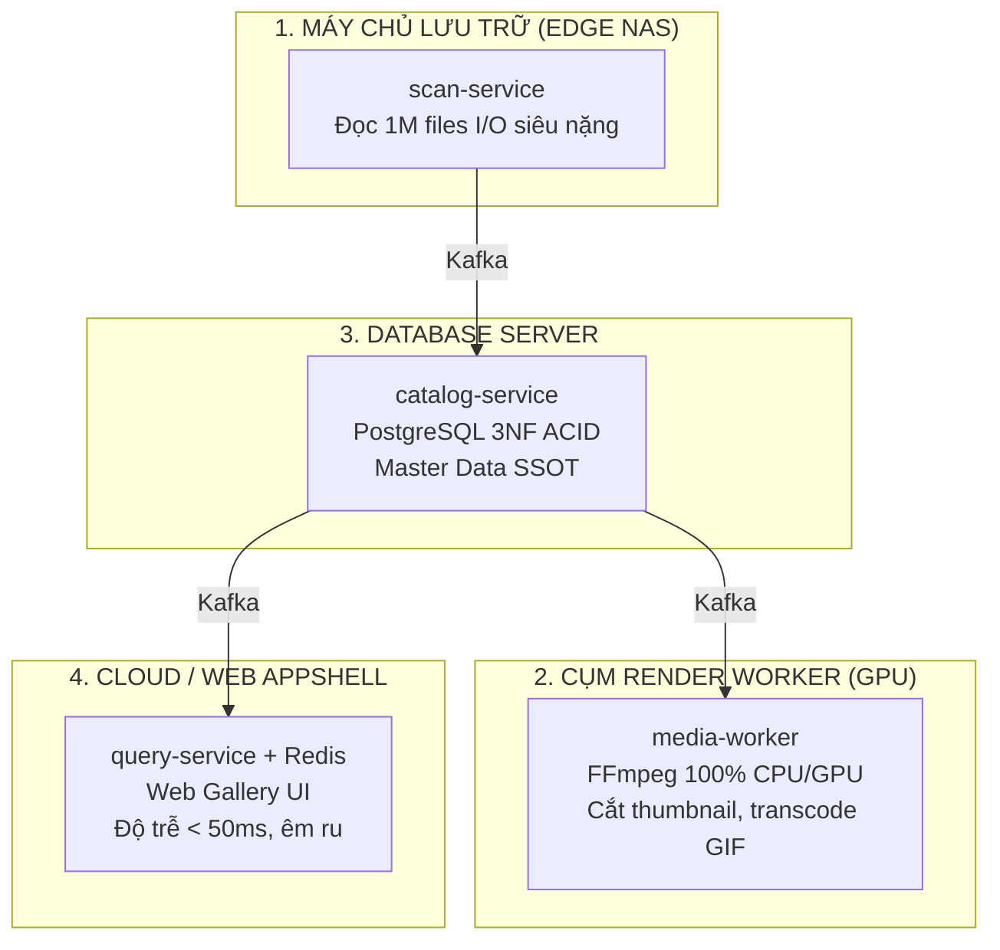
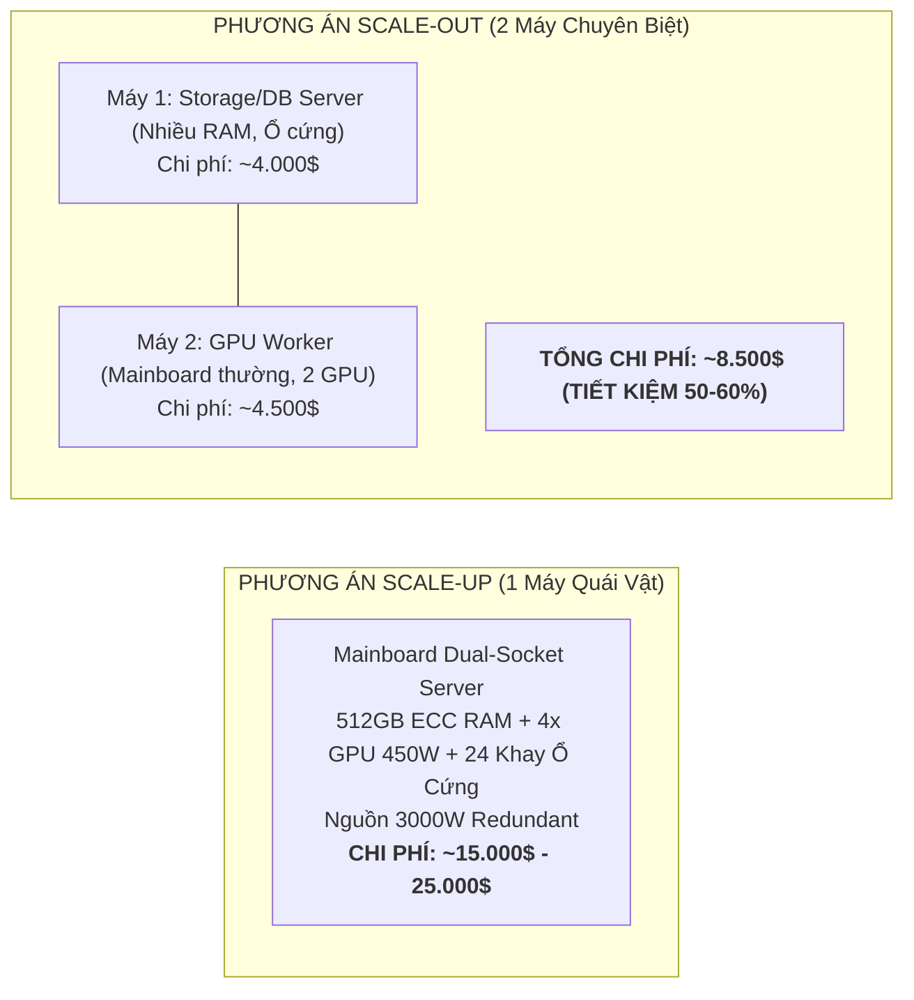

# Deep-Dive: Bối cảnh Nghiệp vụ Thực tế & Kinh tế học Phần cứng trong Hệ thống Media Ingestion

Ngày cập nhật: 2026-08-15  
Phạm vi: Tài liệu tổng hợp kiến trúc hệ thống, bản chất kinh doanh, lý giải kỹ thuật và cẩm nang phỏng vấn cho dự án **Distributed Media Asset Management (MAM) Platform (Backend V2)**.

---

## MỤC LỤC

1. [Bản chất Nghiệp vụ & Khách hàng Thực tế](#1-bản-chất-nghiệp-vụ--khách-hàng-thực-tế)
2. [Phân biệt Hệ thống Ingestion File Vật lý vs Web Tra cứu Text](#2-phân-biệt-hệ-thống-ingestion-file-vật-lý-vs-web-tra-cứu-text)
3. [Nỗi đau Vận hành & Sự gãy đổ của Hệ thống V1 Monolith](#3-nỗi-đau-vận-hành--sự-gãy-đổ-của-hệ-thống-v1-monolith)
4. [Lý giải các Mâu thuẫn Nghiệp vụ Cốt lõi](#4-lý-giải-các-mâu-thuẫn-nghiệp-vụ-cốt-lõi)
5. [Tại sao cần Microservices? (Khi Monolith vẫn có thể chạy 25s)](#5-tại-sao-cần-microservices-khi-monolith-vẫn-có-thể-chạy-25s)
6. [Kinh tế học Phần cứng Máy chủ: Scale-Up vs Scale-Out](#6-kinh-tế-học-phần-cứng-máy-chủ-scale-up-vs-scale-out)
7. [Cẩm nang Phỏng vấn & Script Thuyết trình (STAR Method)](#7-cẩm-nang-phỏng-vấn--script-thuyết-trình-star-method)

---

## 1. Bản chất Nghiệp vụ & Khách hàng Thực tế

- **Khách hàng**: Một đơn vị phát hành nội dung số và quản lý bản quyền truyền thông lớn tại **Tokyo, Nhật Bản** (Digital Media Production & Licensing Agency).
- **Quy mô tài sản**: Sở hữu kho lưu trữ mạng (NAS/SAN) dung lượng **100+ TB** với hơn **1.000.000 files** (bao gồm video master 4K, trailer quảng cáo, album ảnh FullPics, GIF preview, file dump từ thiết bị quay di động Syncdroid).
- **Mô hình hoạt động**: Tiếp nhận kho dữ liệu định kỳ từ hơn **50 studio sản xuất đối tác**; quản lý thông tin diễn viên (actress), thể loại (tags), bản quyền phát hành; phục vụ biên tập viên và nhân viên kinh doanh tra cứu/phân phối nội dung.

---

## 2. Phân biệt Hệ thống Ingestion File Vật lý vs Web Tra cứu Text

Nhiều người thường nhầm lẫn hệ thống này với các trang web danh bạ thông tin như **JAVLibrary, IMDb hay Wikipedia**:

```text
+------------------------------------+--------------------------------------------------+
| Tiêu chí so sánh                   | Web Tra cứu Text (JAVLibrary/IMDb)               | Hệ thống Ingestion File Vật lý (Backend V2)      |
+------------------------------------+--------------------------------------------------+
| Bản chất dữ liệu                   | Chỉ lưu CHỮ (Metadata: tiêu đề, tên diễn viên,   | Quản lý FILE NHỊ PHÂN THẬT trên ổ cứng           |
|                                    | link ảnh tĩnh URL). Không chứa file video gốc.   | (100TB video, ảnh raw, GIF, hash SHA-256).      |
+------------------------------------+--------------------------------------------------+
| Khối lượng Database                | 1 triệu dòng text ~ 500 MB RAM (Rất nhỏ,         | 1 triệu files vật lý ~ 1.5 - 2.5 GB dữ liệu thô, |
|                                    | một máy chủ MySQL đơn giản xử lý trong 1ms).    | kèm 6 B-Tree indexes, evidence payload, WAL.     |
+------------------------------------+--------------------------------------------------+
| Thách thức kỹ thuật                | Đọc nhanh (Read-heavy), cache web, SEO,          | Đọc/Ghi đĩa cực hạn (I/O Heavy), phân tích       |
|                                    | phân trang danh mục.                             | regex song song, kiểm soát lock, stream video.   |
+------------------------------------+--------------------------------------------------+
```

---

## 3. Nỗi đau Vận hành & Sự gãy đổ của Hệ thống V1 Monolith

### 3.1. Thời kỳ làm thủ công (Manual Era)
- Nhận đợt bàn giao 50.000 file mới từ studio $\rightarrow$ 10–15 nhân viên mở Windows Explorer trên từng ổ cứng mạng.
- Gõ Excel bằng tay, tự đổi tên file, nhặt từng ảnh bìa ghép vào thư mục video.
- **Hậu quả**: Mất 2 tuần làm việc, tỷ lệ sai sót cao (xóa nhầm file gốc, mất liên kết album ảnh và video).

### 3.2. Thời kỳ V1 (Monolith với Spring Boot + Hibernate)
- Viết script tự động quét thư mục và lưu vào Database qua ORM (`save()`).
- **Lý do V1 sập khi dữ liệu chạm ngưỡng 1.000.000 files**:
  1. *Quét quá lâu*: Mất **45 phút – 1 tiếng** vì Hibernate chạy lặp từng row và dirty-checking trên 1 triệu entities.
  2. *Khóa Database*: Tiến trình quét ghi liên tục làm khóa bảng (Lock contention), nhân viên không thể mở Web Gallery để tìm kiếm.
  3. *Không có Lease Fencing / Checkpoint*: Nếu script chết ở file thứ 500.000, khi chạy lại phải quét từ file số 1 $\rightarrow$ Gây lỗi trùng lặp (Duplicate Key).

---

## 4. Lý giải các Mâu thuẫn Nghiệp vụ Cốt lõi

### 4.1. Tại sao phải Scan 1M file trong < 30 giây? (Nếu không phải chỉ chạy 1 lần Day-1)

Scan 1 triệu file **là tính năng vận hành thường trực** vì 3 lý do:

1. **Hiện tượng "Silent File Tampering" (Sửa file ngoài luồng trên NAS)**:
   - Các Video Editor được cấp quyền trực tiếp vào ổ mạng SMB để dựng phim. Họ tự ý đổi tên, xóa file hỏng, hoặc chèn thêm file ảnh/video mới vào ổ cứng mà không qua Web CMS.
   - Hệ thống bắt buộc phải chạy **Reconciliation định kỳ hàng đêm** để đối chiếu 1M file trên đĩa với DB. Nếu mất 45 phút thì hệ thống bị nghẽn; thời gian **25 giây** giúp việc đối chiếu diễn ra vô hình với người dùng.
2. **Phục hồi sau sự cố đứt kết nối mạng lưu trữ (NAS Mount Recovery)**:
   - Khi ổ SAN/NAS bị ngắt kết nối mạng và mount lại, toàn bộ filesystem cache bị reset. Hệ thống cần quét cold scan siêu tốc để xác minh tính toàn vẹn 1M files trong vài chục giây thay vì downtime cả buổi sáng.
3. **Mở rộng kho lưu trữ (Storage Key Expansion)**:
   - Khi cắm thêm tủ đĩa SAN 20TB mới chứa sẵn 300.000 file, khả năng nuốt 1M file trong 25 giây cho phép đưa storage mới vào khai thác ngay lập tức.

### 4.2. Tại sao Approve phải dưới 3 giây cho 5.000 records / 30 giây cho 1M records?

1. **Quy trình làm việc của đội ngũ Kiểm định (Review Queue Workflow)**:
   - Sau khi scan, 1 triệu file được đưa vào hàng đợi duyệt. Nhân viên QC lọc theo đợt phát hành (mỗi batch 5.000 – 50.000 file) và ấn "Approve All".
   - Ngay sau đó, họ chuyển sang Web Gallery để kiểm tra kết quả hiển thị, gắn tag marketing và xuất link cho đối tác.
2. **Xóa bỏ hiện tượng Stale Read & Duplicate Actions**:
   - Nếu sau khi bấm Approve mà phải đợi 5–10 phút để Catalog và Query đồng bộ qua Kafka, màn hình Web Gallery sẽ bị trống hoặc thiếu file.
   - Người dùng tưởng hệ thống lỗi sẽ bấm Approve lại nhiều lần $\rightarrow$ gây nghẽn mạng và race condition. Đồng bộ trong **2–3 giây** mang lại trải nghiệm **Near Real-Time**.

---

## 5. Tại sao cần Microservices? (Khi Monolith vẫn có thể chạy 25s)

Về mặt thuật toán đơn thuần, một ứng dụng Monolith tối ưu tốt vẫn có thể scan 1M file trong 25 giây. Việc chia Microservices phục vụ **4 mục tiêu vận hành phần cứng**:



1. **Cách ly tài nguyên (Resource Contention & Blast Radius)**:
   - `scan-service` ngốn 100% Disk I/O; `media-worker` ngốn 100% CPU/GPU cho FFmpeg.
   - Tách riêng giúp **Web Gallery (`query-service`) luôn mượt mà với CPU 5%**, phục vụ người dùng tra cứu sub-50ms mà không bị treo khi job nền đang chạy.
2. **Triển khai trên phần cứng chuyên biệt (Heterogeneous Hardware)**:
   - Scanner đặt tại Storage Server (sát tủ đĩa); Worker đặt tại Render Node (có card GPU); Query đặt trên Cloud VM linh hoạt.
3. **Cách ly sự cố (Crash Isolation)**:
   - File video bị lỗi làm crash tiến trình C++ của FFmpeg $\rightarrow$ Chỉ Worker khởi động lại và đẩy event vào DLT; Web xem phim và Master Catalog không bao giờ bị sập.
4. **Polyglot Persistence (CQRS)**:
   - Tầng Ghi (Catalog) cần PostgreSQL 3NF toàn vẹn ACID; Tầng Đọc (Query) cần Elasticsearch tìm kiếm mờ tiếng Nhật/Anh và Redis cache đa tầng.

---

## 6. Kinh tế học Phần cứng Máy chủ: Scale-Up vs Scale-Out

### Mâu thuẫn: "Tại sao không mua 1 máy quái vật (vừa nhiều RAM vừa nhiều GPU) mà phải chia 2 máy?"



### 4 lý do phần cứng thực tế:

1. **Nghẽn làn PCIe (PCIe Lanes Bottleneck)**:
   - CPU thông thường chỉ có 24–28 làn PCIe. Nhét vừa 2 GPU (32 làn), vừa Card SAS RAID 24 ổ cứng (16 làn), vừa Card 10GbE $\rightarrow$ Bắt buộc phải mua CPU máy chủ siêu đắt (Dual AMD EPYC / Intel Xeon Platinum) và bo mạch chủ đắt gấp 5 lần.
2. **Xung đột nhiệt độ: GPU làm "chết" Ổ cứng (Thermal Destruction)**:
   - Ổ cứng (100TB dữ liệu) hoạt động tốt nhất ở **35°C – 45°C** (trên 55°C tỷ lệ chết ổ tăng gấp 5).
   - Card GPU FFmpeg tỏa nhiệt **75°C – 85°C** (350W–450W). Nhét chung sẽ thổi khí nóng nung hỏng toàn bộ kho đĩa 100TB.
3. **Vùng an toàn mạng (Network DMZ Security)**:
   - Cổng Web public mở ra Internet phải đặt ở vùng DMZ. Không bao giờ được phép đặt cổng Web public chung cỗ máy vật lý chứa 100TB dữ liệu Master gốc (tránh Ransomware chiếm quyền máy chủ).
4. **Độ sẵn sàng (SPOF) & Vòng đời thiết bị (Lifecycle)**:
   - Cập nhật driver GPU NVIDIA cần restart máy $\rightarrow$ Nếu chung 1 máy thì sập cả Web công ty.
   - Ổ đĩa NAS dùng 5–7 năm; Card GPU nâng cấp mỗi 2 năm để render nhanh hơn $\rightarrow$ Scale-Out giúp nâng cấp linh hoạt với chi phí rẻ.

---

## 7. Cẩm nang Phỏng vấn & Script Thuyết trình (STAR Method)

### 7.1. Kịch bản Pitching 60 giây (Elevator Pitch)

> *"Dự án tiêu biểu nhất em từng triển khai là **Hệ thống Quản lý và Khai thác Kho Media Phân tán (Distributed Media Asset Management - V2)** cho một đơn vị phát hành nội dung số tại **Tokyo, Nhật Bản**.*
>
> *Khách hàng quản lý kho NAS hơn **100 TB với hơn 1.000.000 files media** từ 50 studio đối tác. Hệ thống V1 cũ bằng Monolith ORM mất gần 1 tiếng để quét, thường xuyên treo DB và không đáp ứng được quy chuẩn bóc tách mã phim đặc thù.*
>
> *Bọn em đã kiến trúc lại toàn bộ hệ thống bằng **Java 25, Spring Boot 4, Apache Kafka (KRaft), PostgreSQL, Redis và Elasticsearch**, tập trung giải quyết 3 bài toán lớn:*
> 1. * **Tối ưu Ingestion 1M files**: Bỏ ORM, thay bằng **Streaming PostgreSQL `COPY` nhị phân**, kết hợp **Virtual Threads** phân tích regex song song và **Set-based SQL Diff** trên bảng unlogged. Kéo thời gian quét 1.000.000 file từ **1m55s xuống còn 25.7 giây** (~39.000 files/s).*
> 2. * **Tối ưu luồng Approve xuyên service**: Triệt tiêu Write Amplification bằng **Kafka Batch Listener kết hợp Coalesce theo Aggregate Key**, giảm 80% snapshot event thừa, đưa thời gian đồng bộ 5.000 bản ghi từ **hơn 40s xuống dưới 3 giây**.*
> 3. * **Tách biệt Data Plane và Control Plane**: Dùng **Nginx Direct Media Delivery** hỗ trợ HTTP 206 Partial Content để stream trực tiếp video 4K từ ổ cứng, giải phóng hoàn toàn tải nặng cho API Gateway.*
>
> *Kiến trúc này giúp giảm 90% chi phí nhân sự kiểm định thủ công và đảm bảo hệ thống Web luôn đạt độ trễ sub-50ms."*

---

### 7.2. Bộ từ khóa ghi điểm cao (High-Value Technical Keywords)

- `PostgreSQL Direct COPY FROM STDIN` & `Unlogged Staging Tables`
- `Set-based SQL Differential Engine` (Anti-join / `INSERT SELECT`)
- `Java 25 Virtual Threads Parallel Parser`
- `Transactional Outbox Pattern` with `Kafka KRaft`
- `Kafka Batch Listener with Subject-level Coalescing`
- `Distributed Lease Fencing` (`SKIP LOCKED` & `Optimistic Version Guard`)
- `Kafka Poison-Pill Isolation` & `Dead-Letter Topic (DLT)`
- `CQRS Read Model` with `Elasticsearch Multi-facet Search` & `Redis Pipeline`
- `Zero-Copy Nginx Media Plane` with `HTTP 206 Partial Content Streaming`
