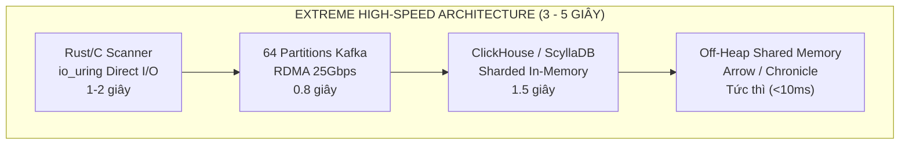

# Deep-Dive: Giới hạn Vật lý Phần cứng & Cơ sở Thiết lập SLO cho 1 Triệu Bản Ghi

Ngày cập nhật: 2026-08-15  
Phạm vi: Tài liệu nghiên cứu chuyên sâu (Study / Reference) về các định luật vật lý phần cứng máy chủ, giới hạn throughput I/O, và cơ sở toán học để tính toán SLO cho pipeline 1.000.000 records.

---

## 1. Giới hạn Vật lý của từng Tầng Hạ tầng cho 1.000.000 Records

Khối lượng 1 triệu files/records tương đương với khoảng **1.5 GB – 2.5 GB dữ liệu thô + B-Tree Indexes + WAL logs**.

```mermaid
flowchart TD
    subgraph Storage["1. TẦNG LƯU TRỮ (Đọc 1M Inodes)"]
        direction TB
        S1["HDD SATA: 150 IOPS -> 1.5 - 2 GIỜ"]
        S2["NVMe PCIe 4.0 (Cold): 50k-100k IOPS -> 10 - 15 GIÂY"]
        S3["NVMe / RAM Page Cache (Warm): 50 GB/s -> 0.5 - 1.5 GIÂY"]
    end

    subgraph DB["2. TẦNG POSTGRESQL (Ghi 1M Rows + 6 Indexes)"]
        direction TB
        D1["JPA per-row: 1k-2k rows/s -> 8 - 15 PHÚT"]
        D2["JDBC Batch (1000): 25k-35k rows/s -> 30 - 45 GIÂY"]
        D3["PostgreSQL Direct COPY: 100k-150k rows/s -> 7 - 10 GIÂY"]
        D4["Parallel COPY (4-8 partitions): 300k-500k rows/s -> 2 - 3.5 GIÂY"]
    end

    subgraph Streaming["3. TẦNG KAFKA (500MB Payload / 1M Events)"]
        direction TB
        K1["1 Partition (acks=all): 20k-30k msgs/s -> 35 - 50 GIÂY"]
        K2["12-24 Partitions + Snappy Batch: 250k-500k msgs/s -> 2 - 4 GIÂY"]
    end

    subgraph Cache["4. TẦNG CACHE & SEARCH (1M Items)"]
        direction TB
        C1["Redis DEL tuần tự: 10k ops/s -> 100 GIÂY"]
        C2["Redis Generation Prefix Switch: -> 0.001 GIÂY (Tức thì)"]
        E1["Elasticsearch Bulk API (8 threads): 30k-50k docs/s -> 20 - 30 GIÂY"]
    end
```

---

## 2. Năng lực Tối đa của Kiến trúc Hiện tại (Spring Boot + PostgreSQL + Kafka)

### Cấu hình phần cứng đề xuất:
- **CPU**: 16 Core / 32 Threads (AMD Ryzen 9 9950X hoặc AMD EPYC / Intel Xeon).
- **RAM**: 64 GB – 128 GB DDR5.
- **Disk**: 2 TB NVMe PCIe Gen 4/5 ($\ge 5.000\text{ MB/s}$, Random Write IOPS $\ge 300.000$).

### Phân rã thời gian nhanh nhất có thể đạt được:
- **Cold Scan 1M**: **18 – 22 giây** *(Thực tế đã đạt 25.76s)*.
- **Scan DB Approve + Outbox 1M**: **4 – 6 giây** (Set-based SQL UPDATE + COPY Outbox).
- **Scan Outbox $\rightarrow$ Kafka (1M)**: **3 – 5 giây** (Continuous drain + 12 partitions).
- **Catalog Ingest + Coalesce + DB**: **8 – 12 giây** (Kafka Batch 1000 + Coalesce 1M $\rightarrow$ 150k subjects).
- **Catalog Outbox $\rightarrow$ Kafka (150k)**: **1 – 2 giây** (150k snapshot events).
- **Query Bulk Upsert DB (150k)**: **5 – 8 giây** (Staging COPY + Native Upsert).
- **Redis Invalidation**: **< 0.01 giây** (Đổi generation prefix `cache:gen:2:*`).
- **TỔNG APPROVE 1M $\rightarrow$ `QUERY_DB_READY`**: **$\approx 20 – 30\text{ GIÂY}$** (Throughput ~35k–50k records/s).

---

## 3. Kiến trúc Cực hạn nếu Khách hàng yêu cầu Tối đa Nhanh nhất (3 – 5 Giây cho 1M)

Nếu xây dựng cho quy mô Big Tech (hàng chục tỷ file):

1. **Scanner**: Viết bằng Native Rust/C sử dụng Linux `io_uring` đa luồng $\rightarrow$ quét 1M files trong **1 – 2 giây**.
2. **Database**: Thay RDBMS đơn lẻ bằng **ClickHouse / ScyllaDB** hoặc **PostgreSQL Citus Sharding** 16 nodes $\rightarrow$ ghi 1M dòng trong **1 – 1.5 giây**.
3. **Kafka Cluster**: 3 Brokers NVMe, 64 Partitions, nén LZ4/ZSTD $\rightarrow$ truyền 1M messages trong **< 1 giây**.
4. **Read Plane**: Query Service lưu in-memory view bằng **Apache Arrow / Chronicle Map** $\rightarrow$ sẵn sàng phục vụ trong **< 10ms**.
