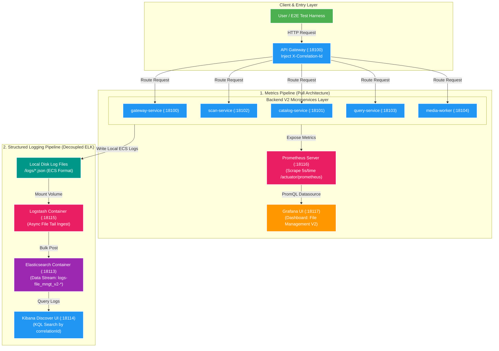

# 📊 Observability Overview & Architecture

Tài liệu tổng quan về kiến trúc, triết lý thiết kế, sơ đồ luồng dữ liệu và phân bổ tài nguyên của hệ thống **Observability** (Metrics, Structured Logging, Distributed Tracing) trong dự án **Backend V2** (`file_mngt_microservice`).

---

## 1. Tổng quan & Triết lý Thiết kế

### 🎯 Động lực bài toán trong Kiến trúc Microservices & EDA
Trong Backend V2:
1. **Phân tán Use Case**: Một tác vụ người dùng (như Approve Scan Proposal) trải qua nhiều service khác nhau: `gateway-service` → `scan-service` (Outbox) → Kafka → `catalog-service` (Outbox) → Kafka → `query-service` (Projection) & `media-worker`.
2. **Khó khăn khi chẩn đoán sự cố**: Khi dữ liệu không xuất hiện ở Query/Gallery V2, lỗi có thể ở REST API, Database transaction, Outbox Relay, Kafka Consumer, Elasticsearch Sync, hoặc Redis Cache.
3. **Mục tiêu Observability**: Cung cấp khả năng **khảo sát hệ thống thời gian thực (Real-time Inspection)** và **khoanh vùng sự cố siêu tốc (Fast Root-Cause Analysis)** mà không cần remote debug hay ghi log lộn xộn.

### 💡 Nguyên tắc thiết kế cốt lõi (Core Principles)
- **Tách biệt 2 trụ cột độc lập**:
  - **Metrics**: Đo lường sức khỏe, lưu lượng, độ trễ và backlog (Prometheus + Grafana).
  - **Structured Logs**: Tra cứu chi tiết dấu vết và exception theo request/correlation (Spring Boot ECS JSON + ELK Stack).
- **Không chặn luồng nghiệp vụ (Non-blocking & Opt-in)**:
  - Log được ghi file async; hỏng ELK không làm nghẽn REST API.
  - Metrics thu thập qua Scrape bất đồng bộ từ Actuator.
  - Đóng gói dưới dạng Compose profile `docker compose --profile observability up -d`.

---

## 2. Sơ đồ Kiến trúc Tổng thể (High-Level Architecture)

---

## 3. Phân bổ Port Local (Port Allocation Mapping)

Tuân thủ **[ADR-004-local-port-allocation.md](file:///d:/Study/Project/file_mngt_microservice/docs/adr/ADR-004-local-port-allocation.md)**:

| Component | Port Local | Protocol / Access URL | Nhiệm vụ chính |
| :--- | :---: | :--- | :--- |
| **Elasticsearch (Logs)** | `18113` | `http://localhost:18113` | Lưu trữ Logs Data Stream (`logs-file_mngt_v2-*`) |
| **Kibana** | `18114` | `http://localhost:18114` | Giao diện tra cứu log bằng KQL (Discover) |
| **Logstash** | `18115` | Internal / TCP `18115` | Pipeline nhận, parse ECS JSON và shipping log |
| **Prometheus** | `18116` | `http://localhost:18116` | Thu thập (Scrape) & lưu trữ Time-series Metrics |
| **Grafana** | `18117` | `http://localhost:18117` | Giao diện Dashboard quan sát tổng quan hệ thống |

---

## 4. Mục lục Các phần Đào sâu (Deep-Dive Modules)

1. [01. Metrics: Prometheus & Grafana](01-metrics-prometheus-grafana.md)
2. [02. Structured Logging: Spring Boot ECS & ELK Stack](02-structured-logging-elk.md)
3. [03. Correlation ID & Distributed Tracing](03-correlation-id-tracing.md)
4. [04. Dashboards, Alerting & Incident Response](04-dashboards-alerting-incidents.md)
5. [Ngân hàng Câu hỏi Phỏng vấn Observability Overview](question-bank/00-overview-questions.md)
