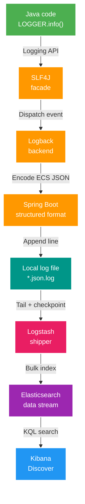
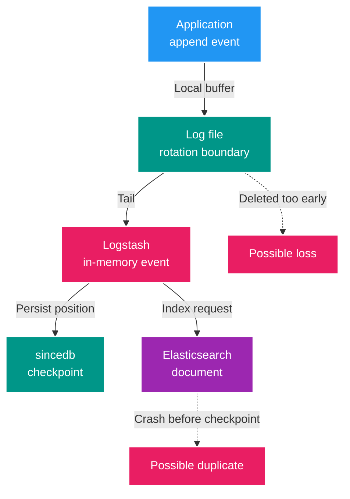

# Structured Logging & ELK — từ log event đến kiến trúc vận hành

Tài liệu này đi từ bản chất của một log event đến pipeline Spring Boot 4.0.3 → file → Logstash → Elasticsearch → Kibana trong Backend V2. Mục tiêu không phải nhớ tên công cụ, mà là giải thích được dữ liệu đi đâu, failure xảy ra ở đâu và guarantee nào thực sự tồn tại.

> **Bản chất trong một câu:** Logging biến một sự kiện runtime thành record có ngữ cảnh để con người và máy có thể tìm kiếm; pipeline tốt phải hữu ích khi sự cố xảy ra mà không trở thành nguyên nhân làm business flow hỏng theo.

**Keyword spine:** `Log event → Context → Schema → Encode → Append → Ship → Index → Query → Retain`.

## Bản đồ học từ Foundation đến Architect

| Độ sâu | Câu hỏi phải trả lời được |
| --- | --- |
| D0 — Problem | Tại sao application state và exception response chưa đủ để debug? |
| D1 — Vocabulary | Log event gồm gì; facade, backend, encoder, appender, shipper, storage khác nhau thế nào? |
| D2 — Mechanism | Một `LOGGER.info()` đi qua JVM, file, Logstash, Elasticsearch và Kibana ra sao? |
| D3 — Failure | Có thể block, mất, trùng hoặc làm đầy đĩa ở điểm nào? |
| D4 — Architecture | Khi nào chọn file shipping, async appender, Logstash, data stream và retention policy nào? |

## 1. Gốc của vấn đề: log là gì?

### 1.1. State trả lời “đang là gì”, log trả lời “đã xảy ra gì”

Database thường giữ trạng thái cuối cùng. HTTP response cho biết kết quả của một request. Metric cho biết xu hướng tổng hợp. Khi cần trả lời “request nào đi qua service nào, quyết định gì được đưa ra trước lỗi”, ta cần chuỗi observation event theo thời gian — đó là vai trò của log.

Một log event tốt thường có:

| Nhóm | Ví dụ | Ý nghĩa |
| --- | --- | --- |
| Time | `@timestamp` | Sự kiện xảy ra khi nào |
| Severity | `log.level=INFO` | Mức độ nghiêm trọng |
| Source | `service.name`, `log.logger` | Thành phần nào phát log |
| Narrative | `message` | Điều gì vừa xảy ra |
| Context | `correlationId`, `eventId` | Nối các event cùng một flow |
| Outcome | status, duration, error type | Kết quả và failure có cấu trúc |
| Exception | type, message, stack trace | Bằng chứng kỹ thuật khi lỗi |

Log không tự động là audit log, distributed trace hay source of truth. Muốn dùng cho compliance/audit phải có yêu cầu riêng về tính bất biến, quyền truy cập, retention và chống chối bỏ.

### 1.2. Text log và structured log

Text log đặt phần lớn dữ liệu vào một chuỗi:

```text
INFO approved proposal scan=42 correlation=abc
```

Structured log giữ cùng ý nghĩa thành field:

```json
{
  "@timestamp": "2026-08-03T03:24:17.428Z",
  "log.level": "INFO",
  "service.name": "scan-service",
  "message": "Approved scan proposal",
  "correlationId": "abc",
  "scanId": "42"
}
```

Khác biệt cốt lõi không phải “JSON đẹp hơn text”, mà là **schema tạo địa chỉ ổn định cho dữ liệu**. Query `correlationId:"abc"` đáng tin hơn tìm chuỗi `message:"*abc*"`; mapping, dashboard và retention cũng có thể vận hành theo field.

## 2. Mental model: mỗi component chỉ làm một việc



| Component | Owns | Không owns |
| --- | --- | --- |
| SLF4J | API mà source code gọi | File format, queue, storage |
| Logback | Tạo/dispatch logging event qua appender | ECS storage, Kibana query |
| Spring Boot structured logging | Encoder/format JSON ECS, đưa MDC/key-value vào JSON | Shipping và retention Elasticsearch |
| File appender | Ghi event đã encode vào file | Đưa file lên Elasticsearch |
| Logstash | Tail, parse, transform và gửi event | Sinh log trong application |
| Elasticsearch | Index và search document | Hiển thị UI, giữ canonical business data |
| Kibana | Explore/query/visualize | Lưu log gốc thay Elasticsearch |

Hai ngộ nhận cần loại bỏ ngay:

- Bật ECS không bỏ Logback: ECS thay cách encode output, Logback vẫn là logging backend mặc định của project.
- Bật ECS không bắt buộc Logstash: shipper là một stage độc lập; có thể thay bằng Filebeat, Fluent Bit hoặc Vector tùy deployment.

## 3. Một `LOGGER.info()` chạy như thế nào trong Backend V2?

### 3.1. Từ lời gọi Java đến logging event

Source dùng SLF4J:

```java
private static final Logger LOGGER = LoggerFactory.getLogger(ScanDecisionService.class);

LOGGER.info("Approved scan proposal scanId={} proposalId={}", scanId, proposalId);
```

Placeholder trì hoãn việc render message cho tới khi level được bật. `LoggerFactory.getLogger(CurrentClass.class)` quyết định tên logger; copy-paste sai class không làm event chạy sai business logic nhưng khiến `log.logger` sai và gây nhiễu điều tra.

`@Slf4j` chỉ là cách Lombok sinh field logger lúc compile. Chọn Lombok hay khai báo thủ công là quyết định ergonomics/dependency, không thay đổi pipeline logging. Không nên tạo base class chỉ để chia sẻ logger vì inheritance đó không biểu diễn quan hệ domain.

### 3.2. Spring Boot 4 ECS encode event

Năm service hiện cấu hình:

```yaml
logging:
  file:
    name: ${OBSERVABILITY_LOG_FILE:logs/gateway-service.json.log}
  structured:
    format:
      file: ecs
```

Spring Boot 4.0.3 hỗ trợ ECS, GELF và Logstash JSON format built-in. Với ECS, các key-value trong MDC được thêm vào JSON object; `service.name` mặc định lấy từ `spring.application.name` nếu không override.

MDC phù hợp với context có request scope như `correlationId`. MDC không phải business storage: phải set tại boundary, propagate có chủ đích và cleanup trong `finally` để tránh rò context sang request khác.

### 3.3. Synchronous hay asynchronous?

Đây là điểm phải phân biệt **khả năng framework** với **cấu hình dự án**:

| Câu hỏi | Trả lời đúng trong project hiện tại |
| --- | --- |
| Có `AsyncAppender` trong config không? | Không tìm thấy `logback-spring.xml`/`AsyncAppender` hay cấu hình queue. |
| Có thể kết luận request thread chỉ enqueue rồi quay về không? | Không. File appender hiện được gọi theo đường logging thông thường; OS page cache không biến nó thành `AsyncAppender`. |
| Logback có hỗ trợ async không? | Có, khi cấu hình `AsyncAppender` bọc child appender. |
| Async Logback dùng RingBuffer không? | `AsyncAppender` chuẩn dùng `BlockingQueue`; RingBuffer thường gắn với async logging của Log4j2/LMAX Disruptor. |
| Queue đầy thì luôn drop và không block? | Không. `neverBlock=false` là default; queue đầy có thể làm caller block. Đặt `neverBlock=true` mới chọn drop thay vì block. |

`AsyncAppender` giảm latency trên caller nhưng đổi failure semantics: queue dùng heap, có thể drop event mức thấp gần đầy, có thể block khi đầy, và có thể mất event chưa flush khi shutdown/crash. Vì vậy “async” là trade-off cần đo và cấu hình, không phải khẩu hiệu an toàn tuyệt đối.

## 4. Decoupled file shipping của dự án

### 4.1. Luồng runtime thực tế

1. Service ghi JSON Lines vào `logs/<service>.json.log`.
2. Compose bind-mount các thư mục log read-only vào Logstash.
3. File input của Logstash tail `*.json.log`, decode JSON với ECS compatibility.
4. `sincedb_path` lưu checkpoint để Logstash biết vị trí đã đọc của file.
5. Elasticsearch output ghi vào data stream `logs-file_mngt_v2-local`.
6. Kibana data view `logs-file_mngt_v2-*` dùng để search.

Project evidence:

- App output: `apps/*/src/main/resources/application.yml`.
- Shipper: `infra/observability/logstash/pipeline/file-mngt-v2.conf`.
- Bind mount và named volume: `infra/compose/compose.yaml`.

### 4.2. Vì sao file shipping giúp decouple?

Application không mở HTTP/socket tới Elasticsearch trên mỗi log event. Logstash/Elasticsearch down không trực tiếp tạo network failure trong app; file local trở thành buffer giữa producer và shipper.

Nhưng decoupling không đồng nghĩa “ELK sập thì API chắc chắn không ảnh hưởng”:

- File appender hiện có thể chạy trên caller thread.
- Disk chậm, disk full hoặc filesystem error vẫn có thể tăng latency hay làm mất khả năng ghi log.
- Backlog lớn hơn dung lượng/retention file local có thể bị xóa trước khi ship.

### 4.3. `sincedb` là checkpoint, không phải exactly-once

`sincedb` nhớ identity/vị trí đọc để tiếp tục sau restart. `start_position => beginning` chủ yếu áp dụng cho file chưa từng thấy; file đã có checkpoint tiếp tục theo checkpoint.

Không nên nói “không bao giờ đọc lặp” hoặc “không bao giờ mất”:

- Nếu event đã index nhưng checkpoint chưa kịp persist trước crash, event có thể được đọc/index lại.
- Nếu file bị rotate/xóa trước khi Logstash đọc, event có thể mất khỏi pipeline.
- Nếu `sincedb` bị mất hoặc identity file thay đổi, Logstash có thể đọc lại hoặc xử lý khác kỳ vọng.
- Pipeline này không đặt deterministic document ID, nên duplicate vật lý là khả năng cần chấp nhận/quan sát.



## 5. Rotation và retention là ba bài toán khác nhau

| Layer | Câu hỏi | Cơ chế |
| --- | --- | --- |
| Application file | File local có phình vô hạn không? | Logback rolling policy: size/time, archive, `max-history`, `total-size-cap` khi được cấu hình/default áp dụng. |
| Shipper checkpoint | Logstash đã đọc tới đâu? | `sincedb`; đây không phải retention hay xác nhận end-to-end exactly-once. |
| Elasticsearch | Searchable log giữ bao lâu? | Data stream lifecycle/ILM hoặc policy tương ứng; độc lập với file local. |

Project hiện không khai báo explicit `logging.logback.rollingpolicy.*` và không có policy retention 30 ngày được source-control trong pipeline này. Vì vậy tài liệu không được biến các con số ví dụ như `10MB`, `7 ngày`, `30 ngày` thành guarantee của dự án. Khi production hóa phải chốt backlog budget giữa tốc độ ghi, tốc độ ship, giới hạn file local và retention Elasticsearch.

## 6. Failure model cần nói được ở cấp Senior

| Failure | Ảnh hưởng | Guardrail/decision |
| --- | --- | --- |
| Logstash down | File backlog tăng | Monitor backlog/disk; giữ app không phụ thuộc network shipper |
| Elasticsearch down/chậm | Logstash retry/backpressure | Queue/buffer phù hợp; alert shipper output failure |
| Disk local full/chậm | Appender lỗi hoặc request latency tăng | Rotation, quota, disk alert, giảm log volume |
| App crash/shutdown đột ngột | Event trong buffer JVM/OS có thể chưa durable | Chấp nhận best effort hoặc dùng durable architecture khác cho audit |
| Rotation nhanh hơn tail | File có thể biến mất trước khi ship | Tính retention theo worst-case outage/backlog |
| `sincedb` mất | Có thể re-read hoặc lệch checkpoint | Persist Logstash data volume và quan sát duplicate |
| Mapping/cardinality bùng nổ | Heap/index/storage tăng | Schema discipline; ID nằm trong field nhưng không dùng bừa cho aggregation/dashboard |
| Log chứa secret/path nhạy cảm | Data leak qua file và Elasticsearch | Redaction, allow-list field, access control và retention ngắn nhất cần thiết |

Guarantee phù hợp cho pipeline học tập hiện tại là **best-effort operational logging có checkpoint**, không phải durable audit trail hay exactly-once delivery.

## 7. Query theo field thay vì “grep message”

KQL hữu ích khi dữ liệu quan trọng có field ổn định:

| Mục đích | KQL |
| --- | --- |
| Theo một request | `correlationId : "..."` |
| Lỗi của Scan | `service.name : "scan-service" and log.level : "ERROR"` |
| Một logger | `log.logger : "com.filemngt.v2.scan.application.ScanDecisionService"` |
| HTTP 5xx nếu field tồn tại | `http.response.status_code >= 500` |

Nếu phải liên tục tìm `message : "*JOKE-011*"`, đó là dấu hiệu key quan trọng chưa được ghi thành structured field. Tuy nhiên không phải mọi ID đều nên thành dashboard dimension; field search được và metric label là hai quyết định cardinality khác nhau.

## 8. Decision table kiến trúc

| Quyết định | Chọn khi | Trade-off |
| --- | --- | --- |
| Synchronous file appender | Volume vừa, đơn giản, ưu tiên không có JVM queue | Caller chịu latency I/O |
| Logback `AsyncAppender` | Cần tách caller khỏi latency appender và chấp nhận queue semantics | Heap, drop/block, shutdown flush, tuning |
| File shipping | Có disk/volume local đáng tin và muốn tách app khỏi network collector | Rotation, backlog và host lifecycle |
| Direct network appender | Deployment không có file bền và collector được thiết kế với bounded failure | App phụ thuộc network/buffer hơn |
| Logstash | Cần transform/filter/routing phong phú | Nặng hơn agent shipper tối giản |
| Filebeat/Fluent Bit/Vector | Chủ yếu collect/forward ở edge | Ít năng lực transform hoặc hệ sinh thái khác |
| Elasticsearch data stream | Time-series append-oriented, cần search field/full text | Chi phí index/storage, mapping governance |
| Loki-style label index | Ưu tiên chi phí thấp và query theo label | Không index mọi field/full text như Elasticsearch |

Log data stream và `media-subject-search` phải tách mapping, lifecycle và ownership. Nhưng chúng đang dùng cùng một Elasticsearch instance local, nên đây là **logical isolation**, không phải resource isolation: log spike vẫn có thể tranh CPU, heap, disk và I/O với media search.

## 9. Interview bridge: các ngộ nhận cần tránh

- “Structured logging = JSON” — thiếu schema, context và query contract thì JSON vẫn hỗn loạn.
- “Spring Boot ECS thay Logback/Logstash” — sai ranh giới component.
- “Ghi file là async” — OS buffering khác JVM `AsyncAppender`.
- “Logback async dùng RingBuffer” — `AsyncAppender` chuẩn dùng `BlockingQueue`.
- “`neverBlock=true` là default” — default của Logback là `false`.
- “`sincedb` cho exactly-once” — checkpoint không phải distributed transaction.
- “Logstash down không bao giờ ảnh hưởng app” — disk/backlog vẫn là coupling gián tiếp.
- “Tách index là tách tài nguyên” — cùng cluster vẫn tranh tài nguyên.
- “Log đã có thì không cần trace” — log event và distributed span giải các câu hỏi khác nhau.

### Câu trả lời 30 giây

> Backend V2 dùng SLF4J/Logback để tạo log event, Spring Boot 4 encode file theo ECS, Logstash tail file bằng checkpoint `sincedb`, Elasticsearch index vào logs data stream và Kibana query theo field. Giá trị kiến trúc nằm ở schema + context + failure isolation; pipeline hiện là best effort, file appender chưa được cấu hình async và `sincedb` không cung cấp exactly-once.

## 10. Nguồn kiểm chứng

- [Spring Boot 4.0.3 — Logging](https://docs.spring.io/spring-boot/reference/features/logging.html): structured formats, ECS, MDC và file output.
- [Logback manual — AsyncAppender](https://logback.qos.ch/manual/appenders.html#AsyncAppender): `BlockingQueue`, drop threshold, `neverBlock` và shutdown flush.
- [Logstash file input](https://www.elastic.co/guide/en/logstash/current/plugins-inputs-file.html): tail mode, `start_position` và `sincedb`.
- [Elastic Common Schema](https://www.elastic.co/guide/en/ecs/current/index.html): field naming convention.
- [Tóm tắt ghi nhớ](summary/02-structured-logging.md)
- [Question bank](question-bank/02-logging-questions.md)
