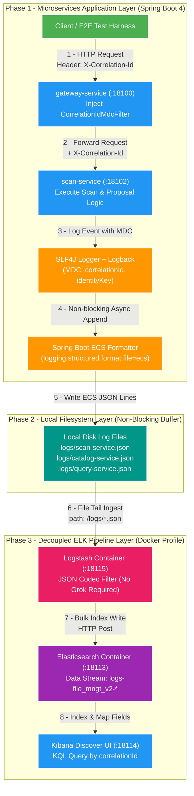

# 📜 Structured Logging Deep-Dive: Spring Boot ECS & ELK Stack

Tài liệu đi sâu vào kiến trúc ghi log cấu trúc chuẩn Elastic Common Schema (ECS) trong Spring Boot 4, cơ chế File Shipping độc lập của Logstash và kỹ thuật tra cứu log chuyên sâu bằng Kibana Query Language (KQL).

---

## 1. Bản Đồ Nền Tảng: Phân Biệt SLF4J, Logback, ECS, Logstash, Elasticsearch & Kibana

> **Giải thích cho người mất gốc**: Đừng nhầm lẫn giữa các thành phần! Mỗi thành phần giữ một vai trò duy nhất trong dây chuyền.

```
[Mã Java: log.info()] ➔ (SLF4J Interface) ➔ (Logback Engine + Spring Boot ECS)
                                                       │
                                            (Ghi đĩa local: logs/scan-service.json)
                                                       │
                                            (Logstash đọc ngầm qua sincedb)
                                                       ▼
                                             [Logstash Ingest Pipeline]
                                                       ▼
                                             [Elasticsearch Database]
                                                       ▼
                                             [Kibana Web UI User Interface]
```

### 📊 Bảng Phân Tầng Trách Nhiệm Chi Tiết

| Thành phần | Nằm ở đâu? | Vai trò chính là gì? | Có cần tự viết Code / Config không? | Có thể thay thế bằng gì? | Sử dụng nếu... (Khi nào dùng?) |
| :--- | :--- | :--- | :--- | :--- | :--- |
| **SLF4J** | Nằm trong **Java Code** | Là **Interface chuẩn** để lập trình viên gọi `log.info("...")` hoặc `log.error("...")`. | **CÓ**: Gọi hàm `log.info()` trong mã Java. | Apache Commons Logging, System.Logger (Java 9+). | Luôn luôn dùng làm Facade abstraction để không bị phụ thuộc cứng vào thư viện log cụ thể. |
| **Logback** | Nằm trong **JVM App** | Là **Logging Engine thực tế** chạy ngầm trong Spring Boot để ghi log ra đĩa/console. | **KHÔNG**: Spring Boot tự động tích hợp sẵn Logback. | Log4j2, JUL (`java.util.logging`). | Dùng khi làm ứng dụng Spring Boot (vì Spring Boot mặc định sẵn), cần hiệu năng I/O cao. |
| **Spring Boot 4 ECS** | Nằm trong **Spring Boot** | Là **Trình định dạng (Formatter)**. Nó bảo Logback: *"Hãy format câu log thành JSON chuẩn Elastic Common Schema (ECS)"*. | **CÓ (2 dòng config)**: Khai báo `logging.structured.format.file=ecs` trong `application.properties`. | Thư viện `logstash-logback-encoder` (Spring 2/3), Custom XML Layout. | Dùng khi muốn xuất log JSON chuẩn hóa sẵn sàng cho ELK Stack mà KHÔNG cần cài library ngoài hay XML. |
| **Logstash** | Nằm ở **Docker Container riêng** | Là **Log Shipper**. Đứng ngoài ứng dụng, đọc ngầm file `/logs/*.json` rồi đẩy về Elasticsearch. | **KHÔNG SỬA CODE APP**: Chỉ cấu hình 1 file `logstash.conf` ngầm ở hạ tầng. | Filebeat *(siêu nhẹ bằng Go)*, Fluentd, Vector, Fluent Bit. | Dùng khi cần **Transform/Filter/Groks log phức tạp** trước khi lưu trữ. *(Nếu chỉ ship log nhẹ thì dùng Filebeat)*. |
| **Elasticsearch** | Nằm ở **Docker Container riêng** | Là **Cơ sở dữ liệu NoSQL** chuyên lưu trữ và đánh chỉ mục (Index) các câu log để tìm kiếm siêu tốc. | **KHÔNG SỬA CODE APP**: Chạy container có sẵn. | Grafana Loki *(lưu log nhẹ index label)*, OpenSearch, ClickHouse. | Dùng khi cần **Full-text search log siêu tốc**, tìm kiếm theo từ khóa JSON chi tiết chuẩn doanh nghiệp. |
| **Kibana** | Nằm ở **Docker Container riêng** | Là **Giao diện Web UI** (`:18114`) cho kỹ sư mở máy tính gõ KQL để tìm kiếm log. | **KHÔNG SỬA CODE APP**: Mở trình duyệt Web là dùng được ngay. | Grafana UI, OpenSearch Dashboards. | Dùng đi kèm với Elasticsearch để tra cứu log KQL, xem Discover và làm Dashboard theo dõi sự cố. |

> **Thắc mắc cốt lõi 1**: *"SLF4J là Interface, vậy mặc định Spring Boot chọn thư viện thực thi (Implementation) nào?"*
> **CÂU TRẢ LỜI**: Spring Boot mặc định chọn **LOGBACK**! Thông qua dependency ngầm `spring-boot-starter-logging`, Spring Boot tự nạp `slf4j-api.jar` (Interface) và `logback-classic.jar` (Engine). Khi bạn gọi `log.info()`, SLF4J sẽ gọi trực tiếp Logback đằng sau hậu trường.
>
> **Thắc mắc cốt lõi 2**: *"Bật Spring Boot 4 ECS có nghĩa là bỏ Logback và Logstash không?"*
> **CÂU TRẢ LỜI KHÔNG!** Spring Boot 4 ECS **KHÔNG thay thế Logback hay Logstash**. Nó chỉ giúp Logback xuất ra JSON chuẩn ECS **sẵn sàng cho Logstash đọc ngay mà không cần cài thêm plugin ngoài hay viết XML phức tạp**.

### 1.1. So sánh `@Slf4j` (Lombok) vs Khai báo Thủ công (`LoggerFactory.getLogger`)

> **Thắc mắc lập trình**: *"Dùng `@Slf4j` của Lombok có khác gì khai báo thủ công `private static final Logger LOGGER = LoggerFactory.getLogger(...)` như trong dự án?"*

#### 📊 Bảng So Sánh Chi Tiết

| Tiêu chí | Dùng Annotation `@Slf4j` (Lombok) | Khai báo thủ công `LoggerFactory.getLogger(...)` |
| :--- | :--- | :--- |
| **Cách khai báo** | Đặt 1 dòng `@Slf4j` trên đầu Class. | Viết dòng dài: `private static final Logger LOGGER = LoggerFactory.getLogger(TargetClass.class);` |
| **Bản chất hoạt động** | **Lombok Annotation Processor** tự động chèn chèn mã bytecode `private static final Logger log = ...` ở phase Compile. | Tự lập trình viên khai báo trực tiếp bằng tay trong code Java. |
| **Rủi ro Copy-Paste** | **0% Rủi ro**: Lombok tự lấy tên Class hiện tại (`TargetClass.class`). | **Rủi ro cao**: Copy-paste code từ `ClassA` sang `ClassB` dễ quên đổi tên class `ClassA.class` ➔ **Log in nhầm tên Class!** |
| **Tên biến Logger** | Tự động sinh tên biến là **`log`** (viết thường). | Tùy chọn đặt tên biến: **`LOGGER`** (chuẩn Hằng số Static Constant) hoặc **`log`**. |
| **Phụ thuộc Library** | Phụ thuộc vào **Lombok Annotation Processor**. | **Thuần 100% SLF4J Standard**, không phụ thuộc Lombok. |

#### 🏆 Best Practice Hướng Dẫn Chọn Lựa:
1. **Dùng `@Slf4j` (Lombok)**: Khi dự án đã sử dụng Lombok sẵn (`@Getter`, `@Setter`, `@RequiredArgsConstructor`). Đây là cách viết Clean Code, gọn nhẹ và loại bỏ hoàn toàn rủi ro Copy-Paste nhầm class name.
2. **Dùng `LoggerFactory.getLogger(...)` thủ công**: Khi viết các module Core Platform, Servlet Filter ngầm, hoặc quy tắc dự án muốn Strict Zero-Lombok ở các lớp đặc thù. *(Cần chú ý cẩn thận khi Copy-Paste phải sửa đúng tên `TargetClass.class`)*.

### 1.2. Đào Sâu: Rủi Ro Quên Đổi Class, Trade-offs Lombok & Anti-Pattern Base Logger

> **Thắc mắc kiến trúc 1**: *"Nếu copy-paste code mà quên đổi `TargetClass.class` thì hậu quả là gì?"*

#### 🚨 Hậu Quả Cực Kỳ Nguồn Tối Khi Quên Đổi Class Name:
- **Trường `log.logger` bị in sai tên**: Giả sử bạn copy code từ `ScanDecisionService` sang `CatalogFileDiscoveryService` nhưng quên sửa `ScanDecisionService.class`.
- Khi `CatalogFileDiscoveryService` chạy nổ log, trường JSON xuất ra Kibana sẽ là:
  ```json
  "service.name": "catalog-service",
  "log.logger": "com.filemngt.v2.scan.application.ScanDecisionService" // SAU TÊN CLASS!
  ```
- **Chẩn đoán sai lệch nghiêm trọng**: Khi Prod gặp sự cố, Kỹ sư gõ KQL search log theo class `CatalogFileDiscoveryService` sẽ **KHÔNG THẤY LOG ĐÂU**, hoặc nghi ngờ bug xảy ra ở Scan Service ➔ **Làm lãng phí hàng giờ triệt phá sự cố!**

---

> **Thắc mắc kiến trúc 2**: *"Tại sao dự án không dùng Lombok? Đánh đổi (Trade-offs) là gì?"*

#### ⚖️ Phân Tích Trade-offs Zero-Lombok vs Lombok:

1. **Rủi ro Ma thuật Bytecode (Compiler Hack)**: Lombok không dùng Java Standard Annotation Processing (JSR 269) thông thường, mà nó "hack" vào AST (Abstract Syntax Tree) của `javac`. Mỗi khi dự án nâng cấp phiên bản JDK mới (ví dụ Java 25 trong Backend V2), Lombok rất hay bị crash compiler cho tới khi có patch mới.
2. **Tính Năng Native Của Java Hiện Đại**: Từ Java 17+, Java ra mắt **`record`** native thay thế 70% nhu cầu của Lombok (`@Data`, `@Getter`, `@Value`).
3. **Đánh Đổi (Trade-offs)**:
   - **Chấp nhận**: Viết thủ công 1 dòng `private static final Logger LOGGER = LoggerFactory.getLogger(MyClass.class);` ở mỗi class và constructor cho Service.
   - **Đổi lại**: Codebase tiệm cận 100% Java Native, tương thích tuyệt đối với mọi IDE/Build Tool/Spotless Formatter mà không sợ nổ plugin khi lên JDK 25+.

---

> **Thắc mắc kiến trúc 3**: *"Khai báo 1 dòng Logger ở mỗi file như vậy có rác code không? Có nên tạo `BaseService` chứa sẵn Logger không?"*

#### ⚠️ Anti-Pattern: Tạo `BaseService` chứa Logger (NÊN TRÁNH)
Một số lập trình viên cố gắng tạo class cha:
```java
// ANTI-PATTERN: Không nên làm cách này!
public abstract class BaseService {
    protected final Logger logger = LoggerFactory.getLogger(getClass());
}
```
- **Tại sao là Anti-pattern?**:
  1. Vi phạm nguyên tắc **Composition over Inheritance** (bắt mọi service phải kế thừa `BaseService` vô lý).
  2. Giảm hiệu năng runtime: `getClass()` phải resolve động ở runtime cho mỗi instance, thay vì `static final` compile-time.
- **Kết luận**: Dòng `private static final Logger LOGGER = ...` nằm ở đầu file cùng các field dependency là **chuẩn mực Object-Oriented Design (OOD)**. Nó hoàn toàn KHÔNG PHẢI RÁC mà là định danh tĩnh an toàn và đạt hiệu năng $O(1)$ cao nhất.

---

## 2. Kiến trúc Spring Boot 4 ECS JSON Format

Dự án sử dụng tính năng **Spring Boot 4 Built-in Structured Logging** chuẩn Elastic Common Schema (ECS) mà không cần thư viện ngoài.

### 2.1. Cấu hình Runtime (`application.properties`)
```properties
logging.structured.format.file=ecs
logging.file.name=logs/${spring.application.name}.json
```

### 1.2. Cấu trúc 1 Record Log ECS JSON Chuẩn
```json
{
  "@timestamp": "2026-08-03T03:24:17.428Z",
  "log.level": "INFO",
  "message": "Decided scan proposal scanId=64932fb9-83d9-418f-8d88-b187c1729392 proposalId=ba243dcd-f109-4597-acec-6c953b770c21 decision=APPROVE identityKey=JOKE-011 relativePath=A - [JOKE-011].mp4",
  "service.name": "scan-service",
  "correlationId": "78f3a11f-3400-4013-966a-6477c7d173bc",
  "process.thread.name": "http-nio-18102-exec-3",
  "log.logger": "com.filemngt.v2.scan.application.ScanDecisionService"
}
```

---

## 2. Triết lý Ghi Log Độc lập (Decoupled File Shipping)

### 2.1. Tại sao KHÔNG gửi log trực tiếp qua Network (Socket / HTTP Appender)?
- **Nguy cơ Sập Dây Chuyền (Cascading Failure)**: Nếu Logstash/Elasticsearch chậm hoặc ngắt kết nối, việc Application gửi log đồng bộ/bất đồng bộ qua Network có thể gây nghẽn Thread Pool, tràn bộ nhớ đệm Buffer Overflow và làm sập API nghiệp vụ.
- **Tốc độ OS Buffered Write**: Ghi log ra đĩa cục bộ (`/logs/*.json`) dựa vào OS Page Cache cực kỳ nhanh và tin cậy.

### 2.2. Luồng Xử lý 8 Bước Chi tiết từ App ➔ Disk ➔ Logstash ➔ Elasticsearch ➔ Kibana



### 2.3. Cấu hình Logstash Ingest Pipeline (`infra/observability/logstash/pipeline/logstash.conf`)
1. Logstash container mount thư mục đĩa `/logs`.
2. Pipeline tự động đọc file JSON bất đồng bộ ngầm:
   ```ruby
   input {
     file {
       path => "/logs/*.json"
       codec => "json"
       start_position => "beginning"
       sincedb_path => "/usr/share/logstash/data/plugins/inputs/file/.sincedb" # Con trỏ lưu offset đọc file
     }
   }
   ```
3. Logstash gửi dữ liệu về Elasticsearch qua port `18113` vào Data Stream `logs-file_mngt_v2-*`.
4. **Phân tách hoàn toàn**: Index log `logs-file_mngt_v2-*` hoạt động độc lập, không ảnh hưởng đến Elasticsearch index tìm kiếm dữ liệu media (`media-subject-search`).

### 2.4. Phân Tầng Layer & Ma Trận Cấu Hình Rolling/Retention Policy

> **Thắc mắc vận hành**: *"Mấy cơ chế này là tự động hay phải chỉnh? Mặc định (Default) là gì? Cấu hình ở đâu và thuộc Layer nào?"*

#### 📊 Bảng Ma Trận Phân Tầng Trách Nhiệm

| Công Việc | Layer Chịu Trách Nhiệm | Tính Tự Động | Giá Trị Mặc Định (Defaults) | Nơi Cấu Hình (Config Location) |
| :--- | :--- | :---: | :--- | :--- |
| **Xoay file log cũ (Rolling Policy)** | **App Layer** *(Spring Boot Logback)* | **TỰ ĐỘNG** *(khi bật file log)* | `max-file-size: 10MB` *(Đủ 10MB nén `.json.gz`)* | `apps/<service>/src/main/resources/application.yml` |
| **Dọn file nén cũ (Retention Policy)** | **App Layer** *(Spring Boot Logback)* | **TỰ ĐỘNG** *(khi bật file log)* | `max-history: 7` *(Xóa file cũ quá 7 ngày)*<br>`total-size-cap: 0B` *(Không giới hạn tổng GB)* | `apps/<service>/src/main/resources/application.yml` |
| **Nhớ offset đã đọc (`sincedb`)** | **LogShipper Layer** *(Logstash Container)* | **TỰ ĐỘNG 100%** | `sincedb_write_interval: 15s`<br>Lưu tại file ngầm `.sincedb_*` | `infra/observability/logstash/pipeline/logstash.conf` |
| **Xóa log cũ trên Elasticsearch** | **Storage Layer** *(Elasticsearch ILM)* | **TỰ ĐỘNG** *(khi bật ILM)* | Retention: `30 ngày` | Kibana UI *(Index Lifecycle Management)* / API |

#### ⚙️ Ví dụ Cấu hình Tùy chỉnh Chi tiết trong Spring Boot 3/4 (`application.yml`)

```yaml
logging:
  file:
    name: logs/${spring.application.name}.json
  structured:
    format:
      file: ecs # Khai báo định dạng JSON ECS
  logback:
    rollingpolicy:
      max-file-size: 50MB          # Đủ 50MB thì xoay file & nén GZIP
      max-history: 14               # Tự động xóa file nén cũ quá 14 ngày
      total-size-cap: 5GB           # Tổng thư mục logs tối đa 5GB (vượt quá xóa file cũ nhất)
      clean-history-on-start: true  # Quét dọn file quá hạn ngay khi restart app
```

---

## 3. Hướng dẫn Tra cứu Log trên Kibana Discover (`http://localhost:18114`)

Kibana được cấu hình không cần password trên local (`xpack.security.enabled: false`). Mở `http://localhost:18114` → Chọn **Discover**.

### 3.1. Các câu truy vấn KQL (Kibana Query Language) thông dụng

| Mục đích Tra cứu | Cú pháp KQL Query |
| :--- | :--- |
| **Trace toàn bộ luồng theo Correlation ID** | `correlationId : "78f3a11f-3400-4013-966a-6477c7d173bc"` |
| **Tìm vết theo Mã Chủ Thể (Identity Key)** | `message : "*JOKE-011*"` |
| **Tìm theo Tên File tương đối (Relative Path)** | `message : "*JOKE-011.mp4*"` |
| **Lọc log lỗi của 1 Service cụ thể** | `service.name : "scan-service" and log.level : "ERROR"` |
| **Lọc HTTP Requests có lỗi 5xx** | `http.response.status_code >= 500` |
| **Theo dõi Event công bố từ Scan Outbox** | `service.name : "scan-service" and message : "*Published outbox event*"` |

---

## 4. Tài liệu Tham khảo Liên quan
- [⚡ Tóm tắt kiến thức siêu ngắn (Cheat Sheet Summary)](summary/02-structured-logging.md)
- [00. Tổng quan Observability](00-overview.md)
- [03. Correlation ID & Distributed Tracing](03-correlation-id-tracing.md)
- [Ngân hàng Câu hỏi Phỏng vấn Logging & ELK](question-bank/02-logging-questions.md)
