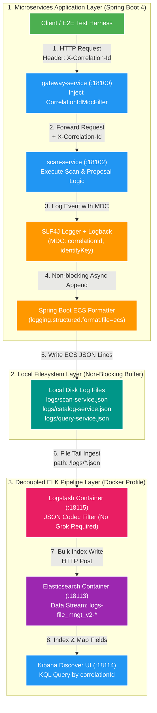

# 📜 Structured Logging Deep-Dive: Spring Boot ECS & ELK Stack

Tài liệu đi sâu vào kiến trúc ghi log cấu trúc chuẩn Elastic Common Schema (ECS) trong Spring Boot 4, cơ chế File Shipping độc lập của Logstash và kỹ thuật tra cứu log chuyên sâu bằng Kibana Query Language (KQL).

---

## 1. Kiến trúc Spring Boot 4 ECS JSON Format

Dự án sử dụng tính năng **Spring Boot 4 Built-in Structured Logging** chuẩn Elastic Common Schema (ECS) mà không cần thư viện ngoài.

### 1.1. Cấu hình Runtime (`application.properties`)
```properties
logging.structured.format.file=ecs
logging.file.name=logs/${spring.application.name}.json
```

### 1.2. Cấu trúc 1 Record Log ECS JSON Chuẩn
```json
{
  "@timestamp": "2026-08-03T03:24:17.428Z",
  "log.level": "INFO",
  "message": "Decided scan proposal scanId=64932fb9-83d9-418f-8d88-b187c1729392 proposalId=ba243dcd-f109-4597-acec-6c953b770c21 decision=APPROVE identityKey=JOKE-011 relativePath=A - [JOKE-011].mp4",
  "service.name": "scan-service",
  "correlationId": "78f3a11f-3400-4013-966a-6477c7d173bc",
  "process.thread.name": "http-nio-18102-exec-3",
  "log.logger": "com.filemngt.v2.scan.application.ScanDecisionService"
}
```

---

## 2. Triết lý Ghi Log Độc lập (Decoupled File Shipping)

### 2.1. Tại sao KHÔNG gửi log trực tiếp qua Network (Socket / HTTP Appender)?
- **Nguy cơ Sập Dây Chuyền (Cascading Failure)**: Nếu Logstash/Elasticsearch chậm hoặc ngắt kết nối, việc Application gửi log đồng bộ/bất đồng bộ qua Network có thể gây nghẽn Thread Pool, tràn bộ nhớ đệm Buffer Overflow và làm sập API nghiệp vụ.
- **Tốc độ OS Buffered Write**: Ghi log ra đĩa cục bộ (`/logs/*.json`) dựa vào OS Page Cache cực kỳ nhanh và tin cậy.

### 2.2. Luồng Xử lý 8 Bước Chi tiết từ App ➔ Disk ➔ Logstash ➔ Elasticsearch ➔ Kibana



### 2.3. Cấu hình Logstash Ingest Pipeline (`infra/observability/logstash/pipeline/logstash.conf`)
1. Logstash container mount thư mục đĩa `/logs`.
2. Pipeline tự động đọc file JSON bất đồng bộ ngầm:
   ```ruby
   input {
     file {
       path => "/logs/*.json"
       codec => "json"
       start_position => "beginning"
       sincedb_path => "/usr/share/logstash/data/plugins/inputs/file/.sincedb" # Con trỏ lưu offset đọc file
     }
   }
   ```
3. Logstash gửi dữ liệu về Elasticsearch qua port `18113` vào Data Stream `logs-file_mngt_v2-*`.
4. **Phân tách hoàn toàn**: Index log `logs-file_mngt_v2-*` hoạt động độc lập, không ảnh hưởng đến Elasticsearch index tìm kiếm dữ liệu media (`media-subject-search`).

### 2.4. Phân Tầng Layer & Ma Trận Cấu Hình Rolling/Retention Policy

> **Thắc mắc vận hành**: *"Mấy cơ chế này là tự động hay phải chỉnh? Mặc định (Default) là gì? Cấu hình ở đâu và thuộc Layer nào?"*

#### 📊 Bảng Ma Trận Phân Tầng Trách Nhiệm

| Công Việc | Layer Chịu Trách Nhiệm | Tính Tự Động | Giá Trị Mặc Định (Defaults) | Nơi Cấu Hình (Config Location) |
| :--- | :--- | :---: | :--- | :--- |
| **Xoay file log cũ (Rolling Policy)** | **App Layer** *(Spring Boot Logback)* | **TỰ ĐỘNG** *(khi bật file log)* | `max-file-size: 10MB` *(Đủ 10MB nén `.json.gz`)* | `apps/<service>/src/main/resources/application.yml` |
| **Dọn file nén cũ (Retention Policy)** | **App Layer** *(Spring Boot Logback)* | **TỰ ĐỘNG** *(khi bật file log)* | `max-history: 7` *(Xóa file cũ quá 7 ngày)*<br>`total-size-cap: 0B` *(Không giới hạn tổng GB)* | `apps/<service>/src/main/resources/application.yml` |
| **Nhớ offset đã đọc (`sincedb`)** | **LogShipper Layer** *(Logstash Container)* | **TỰ ĐỘNG 100%** | `sincedb_write_interval: 15s`<br>Lưu tại file ngầm `.sincedb_*` | `infra/observability/logstash/pipeline/logstash.conf` |
| **Xóa log cũ trên Elasticsearch** | **Storage Layer** *(Elasticsearch ILM)* | **TỰ ĐỘNG** *(khi bật ILM)* | Retention: `30 ngày` | Kibana UI *(Index Lifecycle Management)* / API |

#### ⚙️ Ví dụ Cấu hình Tùy chỉnh Chi tiết trong Spring Boot 3/4 (`application.yml`)

```yaml
logging:
  file:
    name: logs/${spring.application.name}.json
  structured:
    format:
      file: ecs # Khai báo định dạng JSON ECS
  logback:
    rollingpolicy:
      max-file-size: 50MB          # Đủ 50MB thì xoay file & nén GZIP
      max-history: 14               # Tự động xóa file nén cũ quá 14 ngày
      total-size-cap: 5GB           # Tổng thư mục logs tối đa 5GB (vượt quá xóa file cũ nhất)
      clean-history-on-start: true  # Quét dọn file quá hạn ngay khi restart app
```

---

## 3. Hướng dẫn Tra cứu Log trên Kibana Discover (`http://localhost:18114`)

Kibana được cấu hình không cần password trên local (`xpack.security.enabled: false`). Mở `http://localhost:18114` → Chọn **Discover**.

### 3.1. Các câu truy vấn KQL (Kibana Query Language) thông dụng

| Mục đích Tra cứu | Cú pháp KQL Query |
| :--- | :--- |
| **Trace toàn bộ luồng theo Correlation ID** | `correlationId : "78f3a11f-3400-4013-966a-6477c7d173bc"` |
| **Tìm vết theo Mã Chủ Thể (Identity Key)** | `message : "*JOKE-011*"` |
| **Tìm theo Tên File tương đối (Relative Path)** | `message : "*JOKE-011.mp4*"` |
| **Lọc log lỗi của 1 Service cụ thể** | `service.name : "scan-service" and log.level : "ERROR"` |
| **Lọc HTTP Requests có lỗi 5xx** | `http.response.status_code >= 500` |
| **Theo dõi Event công bố từ Scan Outbox** | `service.name : "scan-service" and message : "*Published outbox event*"` |

---

## 4. Tài liệu Tham khảo Liên quan
- [00. Tổng quan Observability](00-overview.md)
- [03. Correlation ID & Distributed Tracing](03-correlation-id-tracing.md)
- [Ngân hàng Câu hỏi Phỏng vấn Logging & ELK](question-bank/02-logging-questions.md)
