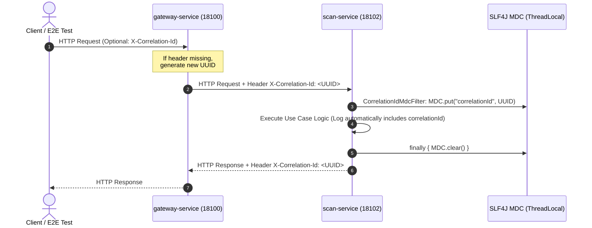
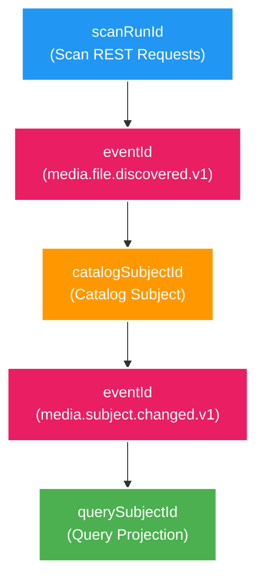

# 🔗 Correlation ID & Distributed Tracing Deep-Dive

Tài liệu đi sâu vào cơ chế lan truyền Correlation ID, quản lý SLF4J MDC trong Thread Pool Java, mô hình truy vết liên kết theo Entity Key và định hướng phát triển Distributed Tracing xuyên Kafka với OpenTelemetry.

---

## 1. Cơ chế Lan truyền Correlation ID qua HTTP & MDC

Trong Backend V2, mọi thao tác người dùng đều được đánh dấu bằng một **Correlation ID** (dạng UUID) để theo dõi xuyên suốt các dịch vụ.



### 1.1. Chi tiết Implementation `CorrelationIdMdcFilter`
Dự án đóng gói module dùng chung `platform/observability` chứa `CorrelationIdMdcFilter`:
```java
public class CorrelationIdMdcFilter implements Filter {
    @Override
    public void doFilter(ServletRequest req, ServletResponse res, FilterChain chain) 
            throws IOException, ServletException {
        HttpServletRequest request = (HttpServletRequest) req;
        HttpServletResponse response = (HttpServletResponse) res;
        
        String correlationId = request.getHeader("X-Correlation-Id");
        if (correlationId == null || correlationId.isBlank()) {
            correlationId = UUID.randomUUID().toString();
        }
        
        try {
            MDC.put("correlationId", correlationId);
            response.setHeader("X-Correlation-Id", correlationId);
            chain.doFilter(request, response);
        } finally {
            MDC.clear(); // BẮT BUỘC: Ngăn rò rỉ Correlation ID sang Request khác trong Thread Pool
        }
    }
}
```

### 1.2. Tại sao BẮT BUỘC phải gọi `MDC.clear()` trong khối `finally`?
- Các Java Web Server (Tomcat / Jetty) sử dụng **Worker Thread Pool** để xử lý request. Khi request hoàn tất, Thread không bị tiêu hủy mà quay trở lại Pool để phục vụ request mới.
- Vì MDC lưu trữ trong `ThreadLocal`, nếu không gọi `MDC.clear()`, Correlation ID của Request cũ sẽ bị rò rỉ (leak) sang Request mới thực thi trên cùng Thread đó, dẫn đến sai lệch dữ liệu tra cứu log.

---

## 2. Mô hình Truy vết Liên kết (Entity Business Key Tracing Model)

Trong mô hình **Event-Driven Architecture (EDA)** bất đồng bộ:
- Mỗi HTTP request trực tiếp có một `correlationId` riêng.
- Để truy vết trọn vẹn toàn bộ vòng đời của dữ liệu từ khi Scan → Approve → Event Outbox → Kafka Consumer → Catalog → Query Projection, chúng ta nối vết bằng **Chuỗi Entity Keys**:



### Các Bước Truy vết theo Command Line (PowerShell):
1. **Tìm tất cả HTTP Request của lượt Scan theo `scanRunId`**:
   ```powershell
   Get-ChildItem -Path logs, apps -Filter "*.log" -Recurse | Select-String "<scanRunId-UUID>"
   ```
2. **Tìm log Scan bắn Event & Catalog tiêu thụ Event theo `eventId`**:
   ```powershell
   Get-ChildItem -Path logs, apps -Filter "*.log" -Recurse | Select-String "<eventId-UUID>"
   ```
3. **Tìm log Catalog bắn Event & Query dựng Projection theo `subjectId` / `identityKey`**:
   ```powershell
   Get-ChildItem -Path logs, apps -Filter "*.log" -Recurse | Select-String "<identityKey-String>"
   ```

---

## 3. Định hướng Tracing Xuyên Kafka (OpenTelemetry Roadmap)

Để tự động hóa việc nối chuỗi vết qua Kafka mà không cần tra cứu thủ công qua ID:
- **Tích hợp OpenTelemetry Java Agent / Micrometer Tracing**.
- **Kafka Record Header Injection**: Tự động inject `traceparent` (W3C Trace Context bao gồm Trace ID và Span ID) vào Kafka Record Headers khi Outbox Relay publish message.
- **Tích hợp Grafana Tempo / Jaeger**: Hiển thị Gantt Chart thời gian xử lý thực tế qua các service (từ REST API → Outbox Relay → Kafka Broker → Consumer Process → FFmpeg Worker).

---

## 4. Tài liệu Tham khảo Liên quan
- [00. Tổng quan Observability](00-overview.md)
- [02. Structured Logging: Spring Boot ECS & ELK](02-structured-logging-elk.md)
- [Ngân hàng Câu hỏi Phỏng vấn Tracing & Correlation ID](question-bank/03-tracing-questions.md)
