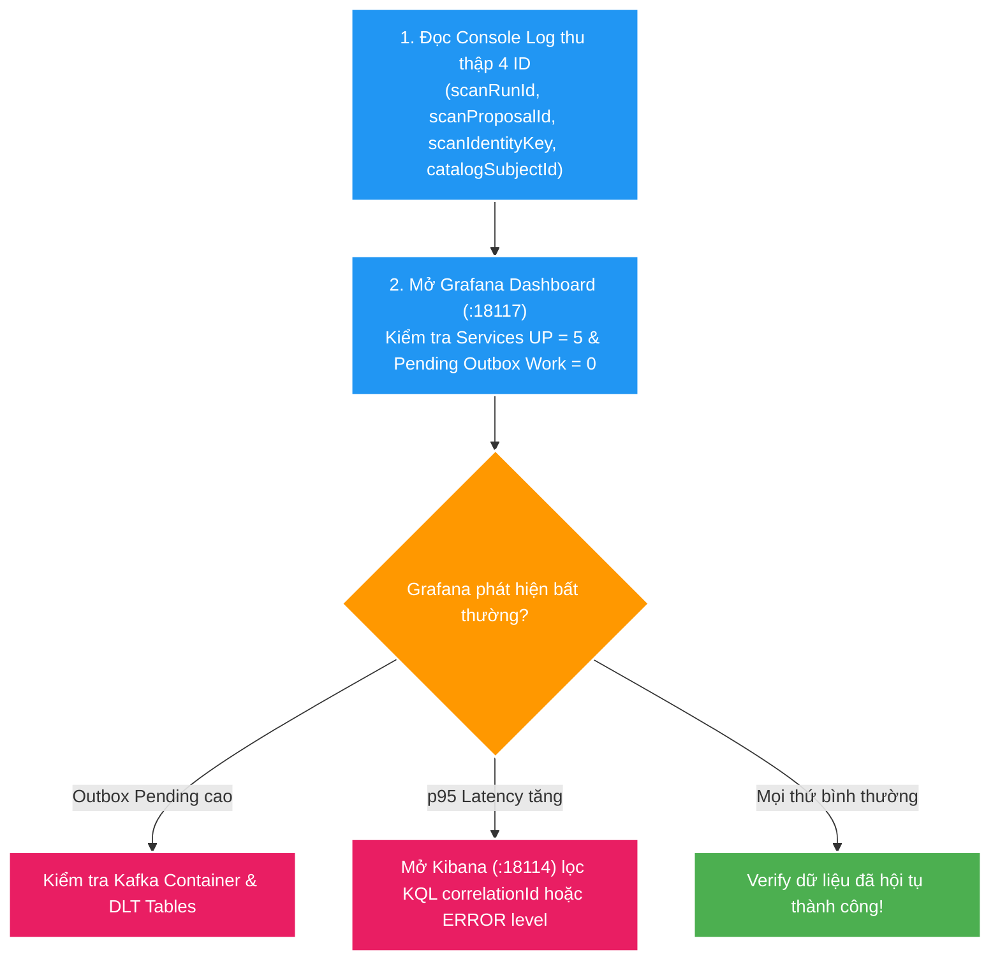

# 🚨 Dashboards, Alerting & Incident Response Deep-Dive

Tài liệu hướng dẫn quy trình thiết kế Dashboard, cấu hình Alerting Rules, xử lý sự cố thực tế (Incident Response) và kịch bản E2E Debugging trong hệ thống **Backend V2**.

---

## 1. Nguyên tắc Thiết kế Dashboard & Cảnh báo (Alerting Rules)

### 1.1. Bốn Tín hiệu Vàng trong Monitoring (Four Golden Signals)
1. **Latency**: Thời gian xử lý request (p50, p95, p99).
2. **Traffic**: Tổng lưu lượng yêu cầu (Requests per second).
3. **Errors**: Tỷ lệ lỗi xuất hiện (HTTP 5xx, Exception counts).
4. **Saturation**: Mức độ đầy của tài nguyên (JVM Heap, DB Connection Pool, Outbox Backlog).

### 1.2. Kế hoạch Tích hợp Prometheus Alertmanager
Trong môi trường Production, container **Alertmanager** kết nối với Prometheus Server để tự động gửi thông báo qua Slack / Telegram khi có sự cố:

```yaml
# Prometheus Alerting Rules Example (infra/observability/prometheus/alert.rules.yml)
groups:
  - name: backend-v2-alerts
    rules:
      - alert: ServiceDownAlert
        expr: up{job="file-mngt-v2-services"} == 0
        for: 30s
        labels:
          severity: critical
        annotations:
          summary: "Microservice {{ $labels.instance }} is DOWN"

      - alert: OutboxBacklogHigh
        expr: catalog_outbox_pending > 100 or query_search_outbox_pending > 100
        for: 2m
        labels:
          severity: warning
        annotations:
          summary: "Outbox relay backlog is building up on {{ $labels.application }}"

      - alert: HighErrorRate
        expr: sum(rate(http_server_requests_seconds_count{status=~"5.."}[5m])) > 0.05
        for: 1m
        labels:
          severity: critical
        annotations:
          summary: "HTTP 5xx error rate exceeds 5% on {{ $labels.application }}"
```

---

## 2. Quy trình Xử lý Sự cố & E2E Debugging Workflow

Khi thực thi kịch bản E2E debug:
```powershell
npm run scan:local:debug
```

Quy trình 4 bước khoanh vùng sự cố siêu tốc:



### Chi tiết các Bước Chẩn đoán:
1. **Bước 1: Thu thập Dấu vết (Console/Test Output)**: Lấy `scanRunId`, `eventId`, `identityKey` từ response hoặc output của test harness.
2. **Bước 2: Kiểm tra Tổng quan trên Grafana (`:18117`)**:
   - Xác nhận đủ `5/5` microservices đang UP (`up == 1`).
   - Kiểm tra thanh `Pending Outbox Work`. Nếu thanh màu cam/đỏ kéo dài: Outbox Relay Publisher bị hỏng hoặc Kafka Broker nghẽn.
3. **Bước 3: Tra cứu Nguyên nhân Gốc trên Kibana Discover (`:18114`)**:
   - Nhập KQL: `correlationId : "<UUID>"` để xem toàn bộ luồng xử lý của request đó.
   - Nhập KQL: `message : "*<identityKey>*"` để kiểm tra event phát và nhận của file cụ thể.
4. **Bước 4: Kiểm tra Dead Letter Topic (DLT) & DB Transaction**:
   - Nếu event bị deserialize lỗi hoặc consumer fail quá số lần retry, kiểm tra bảng `processed_event` hoặc Kafka DLT Topic.

---

## 3. Tài liệu Tham khảo Liên quan
- [00. Tổng quan Observability](00-overview.md)
- [01. Metrics: Prometheus & Grafana](01-metrics-prometheus-grafana.md)
- [Ngân hàng Câu hỏi Phỏng vấn Dashboards & Alerting](question-bank/04-dashboards-alerting-questions.md)
