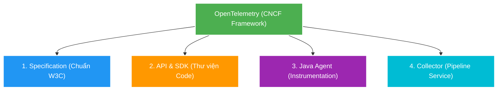
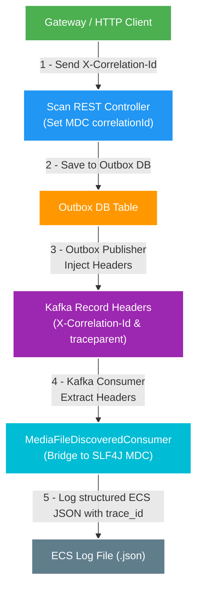

# 05. OpenTelemetry Overview: Khung Chuẩn & Cơ Chế Hoạt Động

> **Mục tiêu**: Giải thích ngắn gọn, dễ hiểu về bản chất của **OpenTelemetry (OTel)** — phân biệt giữa Khung chuẩn (Specification), Thư viện (SDK) và Agent tự động, cùng cơ chế truyền W3C Trace Context qua Kafka và liên kết với SLF4J MDC trong hệ thống Backend V2.

---

## 1. Bản chất OpenTelemetry: Khái niệm hay Thư viện?

OpenTelemetry **không chỉ là một thư viện đơn lẻ**, cũng **không chỉ là một khái niệm lý thuyết**.

Chính xác nhất: **OpenTelemetry là một Khung chuẩn & Bộ công cụ mã nguồn mở (Framework & Standard)** do tổ chức CNCF (Cloud Native Computing Foundation) quản lý, được hợp nhất từ hai dự án nổi tiếng trước đây là *OpenTracing* và *OpenCensus*.



### Chi tiết 4 thành phần chính:

| Thành phần | Vai trò & Giải thích đơn giản |
| :--- | :--- |
| **1. Specification (Chuẩn hóa)** | Quy định "ngôn ngữ chung" cho dữ liệu quan sát (*Traces, Metrics, Logs*). Định nghĩa cấu trúc header **W3C Trace Context** (`traceparent`) để các service bất kể ngôn ngữ nào (Java, Go, Python, Node.js) đều có thể truyền Trace ID cho nhau. |
| **2. API & SDK (Thư viện)** | Bộ thư viện mã nguồn nhúng trực tiếp vào dự án (`opentelemetry-api`, `opentelemetry-sdk`). Giúp lập trình viên gọi lệnh tạo Span, ghi Metrics hoặc inject/extract header context bằng code. |
| **3. Java Agent (Instrumentation)** | Tiến trình chạy ngầm gắn vào JVM (`-javaagent:opentelemetry-javaagent.jar`). Tự động can thiệp Bytecode của Spring MVC, Tomcat, Kafka, JDBC, Redis... để đo hiệu năng và truyền Header mà **không cần sửa code**. |
| **4. OTel Collector** | Một service trung gian đứng riêng, tiếp nhận telemetry data từ nhiều app gửi về, tiến hành xử lý (filter, batch, sample) rồi đẩy sang backend lưu trữ như Grafana Tempo, Jaeger, Prometheus. |

---

## 2. Chuẩn W3C Trace Context Header (`traceparent`)

Trong giao tiếp microservice (cả HTTP REST lẫn Kafka Event), OpenTelemetry chuẩn hóa việc truyền Distributed Trace qua HTTP/Kafka Record Header mang tên `traceparent`.

Cấu trúc một chuỗi `traceparent` chuẩn W3C:
```text
00-4bf92f3577b34da6a3ce929d0e0e4736-00f067aa0ba902b7-01
│  │                               │                │
│  │                               │                └─ Trace Flags (01 = Sampled)
│  │                               └─ Span ID (16 hex chars - ID của bước xử lý hiện tại)
│  └─ Trace ID (32 hex chars - ID duy nhất đại diện toàn bộ luồng E2E)
└─ Version (00 = Phiên bản hiện tại)
```

---

## 3. Luồng Truyền Context Xuyên Kafka & MDC Bridge (Liên hệ FT020)

Trong hệ thống Backend V2 (kế hoạch triển khai tại [`FT020`](../../docs/features/020-opentelemetry-tracing-propagation/03-plan.md)), OpenTelemetry hoạt động song hành cùng SLF4J MDC như sau:

[Skill: mermaid-styling]



### Tại sao vẫn cần SLF4J MDC khi đã có OpenTelemetry?
- **MDC lưu trữ context theo Thread (`ThreadLocal`)**: Các thư viện logging Java như Logback/Log4j2 không tự lấy được `trace_id` nếu không nằm trong MDC.
- **Cầu nối (Bridge)**: OpenTelemetry Agent hoặc Filter sẽ tự động bơm (bridge) `trace_id` và `span_id` thu thập được vào SLF4J MDC (`MDC.put("trace_id", ...)`).
- **Kết quả**: Mỗi dòng log JSON xuất ra file chứa đầy đủ cả `correlationId` lẫn `trace_id`, giúp kỹ sư vận hành trên Kibana 1-click chuyển hướng trực tiếp sang Grafana Tempo xem Gantt Chart trace tương ứng.

---

## 4. Bảng So sánh Nhanh

| Tiêu chí | SLF4J MDC / Logback | OpenTelemetry (OTel) |
| :--- | :--- | :--- |
| **Bản chất** | Thư viện Logging Context cục bộ theo Thread của Java (`ThreadLocal`). | Khung chuẩn & Hệ sinh thái quan sát toàn diện (*Distributed Tracing, Metrics, Logs*). |
| **Phạm vi** | Giới hạn trong 1 tiến trình JVM. | Xuyên suốt môi trường Distributed Microservices đa ngôn ngữ. |
| **Cách truyền context** | Cần code viết tay để inject/extract HTTP/Kafka Header (như `CorrelationIdMdcFilter`). | Tự động hóa qua W3C `traceparent` Header (qua OTel Java Agent hoặc SDK propagation). |
| **Mục đích chính** | Đưa thông tin ID vào các dòng file log `.log`/`.json`. | Nối vết timeline (Gantt Chart) tổng thời gian request đi qua các service. |

---

## 5. Tài liệu Tham khảo Liên quan

- 🔗 [03. Correlation ID & Distributed Tracing](03-correlation-id-tracing.md)
- 📜 [02. Structured Logging: Spring Boot ECS & ELK Stack](02-structured-logging-elk.md)
- 📋 [FT020 — OpenTelemetry Tracing & Kafka Header Propagation](../../docs/features/020-opentelemetry-tracing-propagation/01-brief.md)
