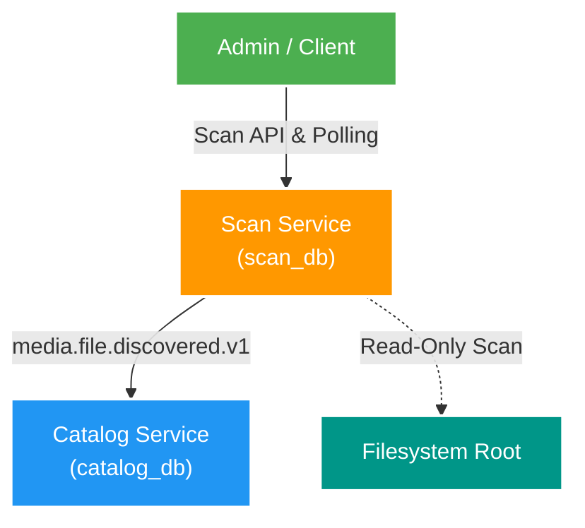

# 🔍 Scan Service Deep-Dive: Overview & Fundamentals

Tài liệu phân tích tổng quan về **Scan Service** (`apps/scan-service`) trong kiến trúc **Backend V2**: Mục tiêu thiết kế, ranh giới sở hữu dữ liệu (`scan_db`), nguyên tắc cách ly filesystem (Read-only), và vị trí của Scan Service trong luồng Ingestion dữ liệu từ FileSystem ra Canonical Catalog.

---

## 1. Mục tiêu và Trách nhiệm của Scan Service

Trong hệ thống quản lý tập tin truyền thông (File Management Microservice), **Scan Service** đóng vai trò là **cửa ngõ phát hiện dữ liệu (Discovery Gateway)** từ hạ tầng đĩa cứng vật lý/NAS.

### 🧠 Đặt vấn đề
Hệ thống lưu trữ hàng triệu tập tin media (Video, Photos, Albums) trên nhiều ổ đĩa và thư mục gốc khác nhau (`rootKey`). Cần một dịch vụ có khả năng:
1. Quét cây thư mục bất đồng bộ mà **không gây nghẽn HTTP thread**.
2. Phân tích tên file, đường dẫn tương đối và metadata để sinh ra đề xuất chuẩn hóa (**Proposals**).
3. Đánh dấu các file bị sai định dạng, thiếu metadata hoặc ambiguos thành các sự cố (**Issues**) cho Admin rà soát.
4. Tuyệt đối **không tự ý sửa đổi/xóa file thật** trên đĩa cứng và **không tự ý ghi vào Canonical Catalog** trước khi Admin duyệt (**Approval**).

---

## 2. Ranh giới Bất biến & Ownership (`scan_db`)

### 📌 Dữ liệu thuộc quyền sở hữu (Owned by `scan_db`)
- `scan_run`: Quản lý các đợt scan (Status: `RUNNING`, `COMPLETED`, `FAILED`, `CANCELLED`).
- `scan_proposal`: Danh sách các đề xuất chuẩn hóa tên/metadata file chờ Admin duyệt (`PENDING`, `APPROVED`, `REJECTED`).
- `scan_issue`: Danh sách các file gặp sự cố parse hoặc không hợp lệ.
- `scan_item`: Bảng lưu vết các item đã được duyệt thành công.
- `scan_outbox_event`: Transactional Outbox ghi nhận event `media.file.discovered.v1` sẵn sàng bắn sang Kafka.

### ⛔ Dữ liệu KHÔNG sở hữu (Does NOT Own)
- **Canonical Subject/Asset Metadata**: Do `catalog-service` sở hữu duy nhất (`catalog_db`).
- **Read Model Search/Projection**: Do `query-service` sở hữu (`query_db` & Elasticsearch).
- **Thao tác xử lý Media nặng (Thumbnail, GIF, MD5 Hash, Transcoding)**: Do background workers xử lý.

---

## 3. Kiến trúc Cốt lõi của Scan Service

Scan Service tuân thủ 4 nguyên tắc kiến trúc bất biến:

1. **Read-Only System Interaction**: Chỉ đọc cây thư mục thông qua các cấu hình `rootKey` được định nghĩa sẵn trong hệ thống (như `fixture-joke-video`, `nas-media-root`). Không nhận tham số path tuyệt đối tự do từ HTTP request để phòng chống Path Traversal Attack.
2. **Asynchronous Polling Pattern**: Request kích hoạt scan (`POST /api/v2/scans/previews`) trả về `202 Accepted` ngay lập tức. Client/FE định kỳ polling `GET /api/v2/scans/{scanId}` để nhận diện trạng thái hoàn tất.
3. **Strategy-Based Parser Engine**: Sử dụng Strategy Pattern để áp dụng quy tắc parse tên file khác nhau tùy theo cấu hình loại root (JOKE, USE Video, USE Album).
4. **Transactional Outbox for Eventual Consistency**: Việc duyệt (Approve) proposal sẽ ghi nhận `scan_item` và phát bản tin `media.file.discovered.v1` vào `scan_outbox_event` trong cùng 1 ACID Database Transaction.

---

## 4. Cấu trúc Tài liệu Deep-Dive Scan Service

Bộ tài liệu deep-dive này được chia làm các phần chính:

- **[01-filesystem-preview-engine.md](./01-filesystem-preview-engine.md)**: Chi tiết động cơ Scan Preview bất đồng bộ, Strategy Pattern parse filename, rootKey isolation và cơ chế HTTP Polling.
- **[02-approval-and-outbox-flow.md](./02-approval-and-outbox-flow.md)**: Chi tiết luồng duyệt Proposal, Idempotency, Transactional Outbox và Event-driven integration với Catalog service.
- **[03-improvements-and-ideas.md](./03-improvements-and-ideas.md)**: Nơi tổng hợp các góc nhìn kỹ thuật, đánh giá ưu/nhược điểm, điểm chưa tối ưu và các đề xuất cải tiến cho luồng Scan trong tương lai.
