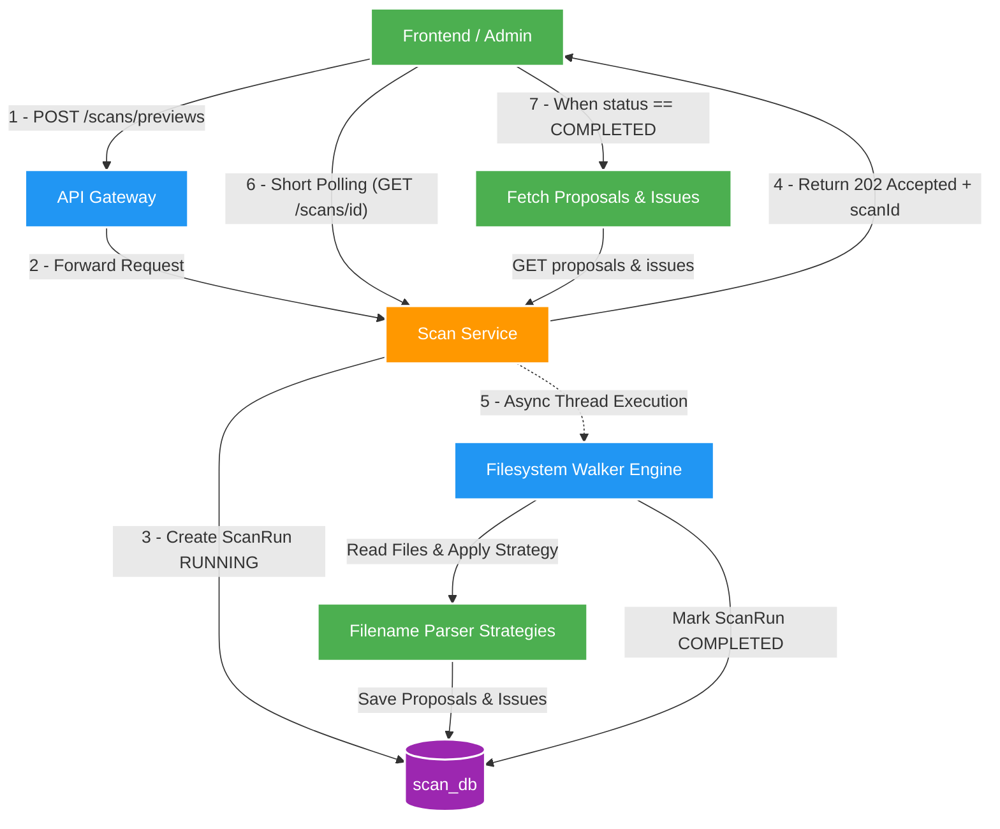

# 📁 Filesystem Preview Engine & Strategy Pattern

Tài liệu giải thích chi tiết cơ chế hoạt động của động cơ **Scan Preview**, cách mã nguồn duyệt đĩa cứng bất đồng bộ, áp dụng **Strategy Pattern** để parse filename/path, và cơ chế **HTTP Short Polling** giữa Frontend và Scan Service.

---

## 1. Đặt vấn đề & Bảo mật đường dẫn (`rootKey` Isolation)

### 🛡️ Phòng chống Path Traversal Attack
Trong một microservice quản lý file, nếu cho phép Client gửi trực tiếp một đường dẫn tuyệt đối dạng `POST /api/v2/scans/previews` với body `{"targetPath": "C:/Windows/System32"}` hay `"/etc/passwd"`, kẻ tấn công có thể lợi dụng để đọc quét các file nhạy cảm trên hệ thống.

### 💡 Giải pháp cấu hình `rootKey`
Scan Service bắt buộc Client truyền một mã **`rootKey`** định nghĩa sẵn (ví dụ: `fixture-joke-video`, `nas-movies-root`).
- Backend ánh xạ `rootKey` sang một đường dẫn đĩa cứng an toàn trong cấu hình ứng dụng (`application.yml`).
- Mọi thao tác scan chỉ được phép hoạt động bên trong cây thư mục con của `rootKey` đó.

---

## 2. Luồng thực thi Asynchronous Scan & HTTP Short Polling



### ⏱️ Lý do không dùng Synchronous HTTP Call
Nếu quét một thư mục có 50,000 files:
- Việc đọc I/O đĩa cứng và parse regex cho 50,000 files có thể mất 15-30 giây.
- Nếu giữ HTTP Request mở trong 30 giây, kết nối qua API Gateway hoặc Nginx Load Balancer dễ bị **HTTP 504 Gateway Timeout**, đồng thời làm cạn kiệt Tomcat Worker Threads của Backend.
- Do đó, phương án **Asynchronous Job + HTTP Short Polling** là chuẩn mực bắt buộc.

### ⚡ Cơ chế Threading trong Code (`TaskExecutor` & Virtual Threads)
- **Implementation thực tế**: Trong `ScanService.java`, Spring Bean tiêm `@Qualifier("applicationTaskExecutor") TaskExecutor taskExecutor`. Lệnh `start()` ghi nhận `ScanRun` thành công rồi ngay lập tức gửi task bất đồng bộ via `taskExecutor.execute(() -> execute(run.id(), root))`, trả về HTTP 202 ngay tức thì.
- **Cấu hình Toggle Virtual Threads (JDK 25 / Spring Boot 3.4+)**: Ứng dụng đã được khai báo sẵn cờ cấu hình `spring.threads.virtual.enabled: ${SCAN_VIRTUAL_THREADS_ENABLED:false}` trong [application.yml](file:///d:/Study/Project/file_mngt_microservice/apps/scan-service/src/main/resources/application.yml#L4-L6). Mặc định cờ ở trạng thái `false`. Khi cần benchmark hoặc chạy thực tế với lượng file lớn, chỉ cần thiết lập biến môi trường `SCAN_VIRTUAL_THREADS_ENABLED=true` trong `.env` để kích hoạt **Virtual Threads** mà không cần sửa code.

---

## 3. Filename Parsing Strategy Pattern

Để hỗ trợ nhiều quy tắc đặt tên file khác nhau mà không làm câu lệnh `if-else` trong code phình to, Scan Service sử dụng **Strategy Pattern**:

```
                  ┌───────────────────────────┐
                  │   FilenameParserStrategy  │ (Interface)
                  └───────────────────────────┘
                                ▲
        ┌───────────────────────┼───────────────────────┐
        │                       │                       │
┌──────────────────────┐┌──────────────────────┐┌──────────────────────┐
│ JokeVideoStrategy    ││ UseVideoAssetStrategy││ UseAlbumFolderStrategy│
└──────────────────────┘└──────────────────────┘└──────────────────────┘
```

### 🧬 Chi tiết các Strategy
1. **`JokeVideoStrategy`**:
   - Dành cho các bộ sưu tập video ngắn (JOKE/Meme).
   - Sử dụng regex trích xuất mã code, tiêu đề ngắn và tags từ tên file.
2. **`UseVideoAssetStrategy`**:
   - Dành cho các file video media chuẩn.
   - Tiến hành chuẩn hóa basename (normalized basename) loại bỏ kí tự đặc biệt, khoảng trắng thừa.
3. **`UseAlbumFolderStrategy`**:
   - Dành cho các bộ sưu tập ảnh/album.
   - Nhận diện toàn bộ folder tương đối (`relative folder path`) làm Identity của Album, cho phép liên kết candidate link `FULL_ALBUM_OF` tới hệ thống Syncdroid.

---

## 4. Proposals vs. Issues: Phân loại Kết quả Scan

Trong quá trình duyệt cây thư mục, mỗi tập tin được xử lý sẽ rơi vào 1 trong 2 trường hợp:

### 🟢 Proposals (`scan_proposal`)
Tập tin hợp lệ và parse thành công tên/metadata:
- Tạo một đề xuất (**Proposal**) lưu vào `scan_db`.
- Chứa thông tin đề xuất: `canonicalSubjectName`, `assetName`, `relativePath`, `fileSize`, `extension`.
- Trạng thái ban đầu: `PENDING` (Chờ Admin duyệt).

### 🔴 Issues (`scan_issue`)
Tập tin gặp sự cố khi parse hoặc không tuân thủ quy tắc:
- Tên file mơ hồ, không trích xuất được thông tin bắt buộc.
- File bị trùng lặp đường dẫn hoặc không đọc được do lỗi permission I/O.
- **Quy tắc quan trọng**: Scan Service **không tự đoán** dữ liệu khi mơ hồ. Mọi trường hợp không chắc chắn đều chuyển thành **Issue** để Admin xử lý bằng tay.
