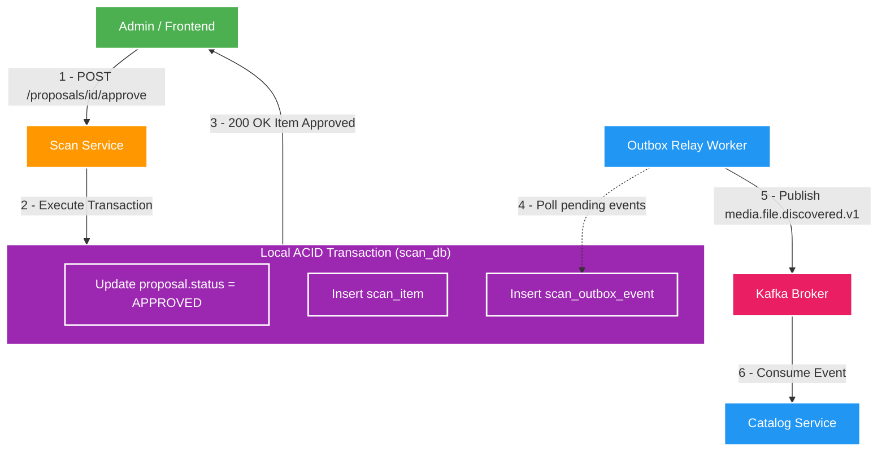

# 🔄 Approval Ingestion Flow & Transactional Outbox Integration

Tài liệu giải thích chi tiết quy trình Admin duyệt đề xuất (**Proposal Approval**), cơ chế ghi nhận **Transactional Outbox**, cách **Scan Service** truyền dữ liệu sang **Catalog Service** qua Kafka Event `media.file.discovered.v1`, và chiến lược đảm bảo tính **Idempotency** (Chống trùng lặp dữ liệu).

---

## 1. Luồng Duyệt Đề xuất (Proposal Approval Flow)

Sau khi giai đoạn **Scan Preview** hoàn tất, các đề xuất (**Proposals**) nằm ở trạng thái `PENDING` trong `scan_db`. Admin có quyền thực hiện hai hành động:

1. **`REJECT`**: Từ chối đề xuất. Đánh dấu `proposal.status = REJECTED`. Không có sự kiện nào được phát đi.
2. **`APPROVE`**: Chấp nhận đề xuất. Chuyển đề xuất thành dữ liệu media chính thức để nạp vào hệ thống.



---

## 2. Ứng dụng Transactional Outbox Pattern tại Scan Service

### 🧠 Tại sao phải dùng Outbox ở Scan Service?
Khi Admin bấm `APPROVE`, hệ thống cần thực hiện 2 việc:
1. Đánh dấu proposal đã được duyệt trong `scan_db`.
2. Phát tín hiệu cho `catalog-service` để tạo ra Subject & Asset chính thức.

Nếu gọi Kafka Publisher trực tiếp trong lúc đang xử lý HTTP Request của lệnh Approve:
- Nếu DB commit xong nhưng Kafka chập chờn $\rightarrow$ Admin thấy trên màn hình là đã duyệt, nhưng `catalog-service` không bao giờ nhận được tin nhắn $\rightarrow$ **Mất dữ liệu đồng bộ**.
- Nếu dùng **Transactional Outbox**, event `media.file.discovered.v1` được lưu trực tiếp vào bảng `scan_outbox_event` **trong cùng local transaction với việc ghi `scan_item`**.

---

## 3. Cấu trúc Event Contract: `media.file.discovered.v1`

Khi Outbox Relay quét bảng `scan_outbox_event`, nó phát bản tin dạng JSON tuân thủ strictly theo contract [docs/contracts/events/media.file.discovered.v1.md](../../../docs/contracts/events/media.file.discovered.v1.md):

```json
{
  "eventId": "evt_01HNG89Z...",
  "eventType": "media.file.discovered.v1",
  "occurredAt": "2026-08-03T20:48:00Z",
  "correlationId": "corr_01HNG89...",
  "payload": {
    "scanItemId": "item_01HNG...",
    "rootKey": "fixture-joke-video",
    "relativePath": "jokes/cat-meme.mp4",
    "canonicalSubjectName": "cat-meme",
    "assetName": "cat-meme.mp4",
    "fileSizeBytes": 1048576,
    "discoveredAt": "2026-08-03T20:45:00Z"
  }
}
```

---

## 4. Cơ chế Idempotency tại Consumer (Catalog Service)

Do Kafka hoạt động theo cơ chế **At-Least-Once Delivery** (Có thể phát lặp bản tin khi network retry), `catalog-service` bắt buộc phải xử lý event một cách **Idempotent** (Đồng công):

1. **Idempotency Key Check**: `catalog-service` sử dụng `scanItemId` hoặc kết hợp `rootKey` + `relativePath` làm khóa Idempotency.
2. **Upsert Logic**: Khi nhận được event lặp lại, `catalog-service` kiểm tra nếu Subject/Asset đã tồn tại thì tiến hành cập nhật (Update) hoặc bỏ qua (Ignore) chứ **không bao giờ tạo ra bản ghi nhân đôi (Duplicate Canonical Subject)**.
