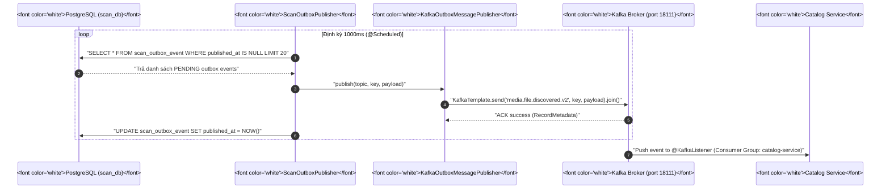

# ⚡ Kafka Integration Deep-Dive trong Scan Service

Tài liệu hướng dẫn chi tiết từ **First Principles** về cơ chế tích hợp **Apache Kafka** trong `scan-service` (`file_mngt_microservice`). Tài liệu cung cấp bức tranh toàn cảnh về thiết kế component, cú pháp mã nguồn, luồng di chuyển dữ liệu runtime, kỹ năng kiểm tra qua Web UI / CLI, cách đọc log/tracing, cũng như danh mục các lỗi thường gặp và phương pháp xử lý sự cố chuẩn Production.

---

## 🎯 Bản chất trong một câu

> **Kafka trong `scan-service` đóng vai trò là một Hàng đợi Sự kiện (Event Stream) phi đồng bộ, kết hợp cùng Transactional Outbox Pattern để bảo đảm tính nhất quán dữ liệu cuối cùng (Eventual Consistency) giữa Scan Service và Catalog Service mà không gây nghẽn HTTP.**

---

## 1. D0 — Vấn đề Nghiệp vụ & Kiến trúc (Why Kafka?)

### ❌ Nếu KHÔNG dùng Kafka (Mô hình Đồng bộ HTTP Direct Call):
- Khi Admin bấm **Approve** một bộ phim/hình ảnh, `scan-service` phải gọi HTTP POST trực tiếp sang `catalog-service` để chèn dữ liệu.
- **Hạn chế**:
  1. **Nghẽn dây chuyền (Cascading Failure)**: Nếu `catalog-service` bị chậm hoặc sập, luồng Approve ở Scan Service sẽ bị ném lỗi HTTP 500/504 Timeout.
  2. **Mất dữ liệu**: Nếu kết nối mạng giữa 2 service chập chờn, hành động Approve của Admin có thể bị hủy dở chừng.
  3. **Không chịu tải tốt (Lack of Backpressure)**: Khi duyệt hàng loạt (Bulk Approve 10,000 files), `catalog-service` bị quá tải kết nối DB.

### ✅ Khi DÙNG Kafka (Mô hình Sự kiện Bất đồng bộ - Event-Driven):
- Khi Admin bấm **Approve**, `scan-service` chỉ cần chốt DB local và ghi 1 tin nhắn vào bảng `scan_outbox_event`.
- Tiến trình ngầm **Outbox Poller** sẽ bắn Event này sang Kafka Topic.
- `catalog-service` tự lắng nghe Kafka và tiêu thụ tin nhắn theo đúng tốc độ xử lý của nó. Admin nhận phản hồi UI ngay lập tức trong $< 50ms$.

---

## 2. D1 — Từ vựng & Ranh giới Component (Vocabulary & Class Ownership)

### 📚 Từ vựng Cốt lõi:

- **Topic (`media.file.discovered.v2`)**: Kênh truyền thông điệp chính chứa các sự kiện phát hiện file phương tiện mới được duyệt.
- **Partition Key (`region:subjectType:identityKey`)**: Ví dụ `USE:VIDEO:sod-001`. Giúp Kafka phân bổ tin nhắn của cùng một bộ phim vào đúng 1 Partition để bảo đảm thứ tự (Ordering).
- **Outbox Event (`ScanOutboxEventEntity`)**: Bản ghi lưu trữ tin nhắn nháp trong PostgreSQL `scan_db` trước khi bắn sang Kafka.

### 🏢 Bảng Ranh giới Các Component / Class trong Source Code:

| Class / Component | Trách nhiệm (Owns) | Không làm (Does NOT Own) | File Source |
| :--- | :--- | :--- | :--- |
| **`ScanDecisionService`** | Đóng gói JSON Event `MediaFileDiscoveredV2` và lưu vào bảng `scan_outbox_event` trong local DB transaction. | Không trực tiếp kết nối hay bắn tin nhắn sang Kafka Broker. | [ScanDecisionService.java](file:///d:/Study/Project/file_mngt_microservice/apps/scan-service/src/main/java/com/filemngt/v2/scan/application/ScanDecisionService.java) |
| **`ScanOutboxPublisher`** | Tiến trình `@Scheduled` định kỳ 1s quét các event chưa chốt (`published_at IS NULL`) để đẩy sang Kafka. | Không quyết định logic nghiệp vụ Approve/Reject. | [ScanOutboxPublisher.java](file:///d:/Study/Project/file_mngt_microservice/apps/scan-service/src/main/java/com/filemngt/v2/scan/application/ScanOutboxPublisher.java) |
| **`OutboxMessagePublisher`** | Interface (Port) trừu tượng hóa hành vi phát tin nhắn ra ngoài. | Không phụ thuộc thư viện Spring Kafka cụ thể. | [OutboxMessagePublisher.java](file:///d:/Study/Project/file_mngt_microservice/apps/scan-service/src/main/java/com/filemngt/v2/scan/application/OutboxMessagePublisher.java) |
| **`KafkaOutboxMessagePublisher`** | Triển khai Interface (Adapter Out) sử dụng `KafkaTemplate.send().join()` để bắn message sang Kafka. | Không quản lý trạng thái bảng Outbox trong DB. | [KafkaOutboxMessagePublisher.java](file:///d:/Study/Project/file_mngt_microservice/apps/scan-service/src/main/java/com/filemngt/v2/scan/adapter/out/messaging/KafkaOutboxMessagePublisher.java) |
| **`MediaFileDiscoveredV2`** | Record DTO định nghĩa cấu trúc hợp đồng dữ liệu (Event Contract) dùng chung toàn dự án. | Không chứa logic xử lý DB hay Kafka. | `platform/event-contracts` |

---

## 3. D2 — Luồng Di chuyển Dữ liệu Runtime (Data Flow Sequence)

Để đảm bảo sơ đồ trực quan và **không bị nhỏ chữ trên viewport**, luồng dữ liệu được chia làm **Sơ đồ Khối Tổng thể (Top-to-Bottom)** và **2 Giai đoạn Chi tiết**:

### 📐 1. Sơ đồ Khối Tổng thể (Block Flow Architecture)

```mermaid
flowchart TB
    subgraph PHASE1["<font color='white'>Giai đoạn 1: Đồng bộ HTTP & Ghi nhận Outbox (Scan Service)</font>"]
        ADMIN["<font color='white'>Admin UI (Browser)</font>"]
        CTRL["<font color='white'>ScanController</font>"]
        SVC["<font color='white'>ScanDecisionService</font>"]
        DB_WRITE[("<font color='white'>PostgreSQL (scan_db)<br/>scan_decision + scan_outbox_event</font>")]

        ADMIN -->|"1 - POST /decision (APPROVE)"| CTRL
        CTRL -->|"2 - Gọi decide()"| SVC
        SVC -->|"3 - Single DB Transaction"| DB_WRITE
        SVC -.->|"4 - Phản hồi HTTP 200 OK ngay (< 50ms)"| ADMIN
    end

    subgraph PHASE2["<font color='white'>Giai đoạn 2: Quét Polling Bất đồng bộ & Phát Event Kafka</font>"]
        POLLER["<font color='white'>ScanOutboxPublisher<br/>(@Scheduled 1000ms)</font>"]
        KAFKA_PUB["<font color='white'>KafkaOutboxMessagePublisher</font>"]
        KAFKA_BROKER["<font color='white'>Kafka Broker (Port 18111)<br/>Topic: media.file.discovered.v2</font>"]
        CONSUMER["<font color='white'>Catalog Service<br/>(Consumer Group)</font>"]

        DB_WRITE -->|"5 - Poll SELECT PENDING (published_at IS NULL)"| POLLER
        POLLER -->|"6 - Bắn Message"| KAFKA_PUB
        KAFKA_PUB -->|"7 - KafkaTemplate.send().join()"| KAFKA_BROKER
        KAFKA_BROKER -->|"8 - ACK thành công"| POLLER
        POLLER -->|"9 - UPDATE published_at = NOW()"| DB_WRITE
        KAFKA_BROKER -->|"10 - Push Event sang Consumer"| CONSUMER
    end

    style PHASE1 fill:#1e293b,stroke:#3b82f6,stroke-width:2px
    style PHASE2 fill:#0f172a,stroke:#10b981,stroke-width:2px
```



---

### 🎬 2. Chi tiết Giai đoạn 1: Nhận HTTP & Lưu Outbox vào DB

```mermaid
sequenceDiagram
    autonumber
    actor Admin as <font color='white'>Admin (UI)</font>
    participant Ctrl as <font color='white'>ScanController</font>
    participant Svc as <font color='white'>ScanDecisionService</font>
    participant DB as <font color='white'>PostgreSQL (scan_db)</font>

    Admin->>Ctrl: "POST /api/v2/scans/{scanId}/proposals/{proposalId}/decision (APPROVE)"
    Ctrl->>Svc: "decide(scanId, proposalId, 'APPROVE')"
    
    rect rgb(30, 41, 59)
        note right of Svc: Local DB Transaction
        Svc->>DB: "INSERT INTO scan_decision"
        Svc->>DB: "INSERT INTO scan_outbox_event (published_at = NULL)"
    end
    
    Svc-->>Admin: "Phản hồi HTTP 200 (DecisionView)"
```



---

### 🎬 3. Chi tiết Giai đoạn 2: Polling Outbox & Bắn tin nhắn sang Kafka



---

## 4. D3 — Cú pháp & Cấu hình Kafka trong Dự án

### ⚙️ 1. Cấu hình Connection trong `application.yml`:
File: `apps/scan-service/src/main/resources/application.yml`
```yaml
spring:
  kafka:
    bootstrap-servers: ${KAFKA_BOOTSTRAP_SERVERS:localhost:18111}
    producer:
      key-serializer: org.apache.kafka.common.serialization.StringSerializer
      value-serializer: org.apache.kafka.common.serialization.StringSerializer
      acks: all # Đảm bảo tin nhắn được ghi an toàn vào Broker trước khi trả ACK

scan:
  outbox:
    enabled: true
    fixed-delay-ms: 1000 # Chu kỳ polling 1 giây
```

### 💻 2. Cú pháp gửi tin nhắn (Producer Code):
```java
@Component
public class KafkaOutboxMessagePublisher implements OutboxMessagePublisher {
    private final KafkaTemplate<String, String> kafka;

    public KafkaOutboxMessagePublisher(KafkaTemplate<String, String> kafka) {
        this.kafka = kafka;
    }

    @Override
    public void publish(String topic, String key, String payload) {
        // Gửi tin nhắn đồng bộ bằng .join() để bắt ngoại lệ ngay nếu Kafka sập
        kafka.send(topic, key, payload).join();
    }
}
```

---

## 5. D4 — Hướng dẫn Kiểm tra & Giám sát (Hands-on UI & CLI)

### 🖥️ 1. Giám sát bằng Giao diện Web (Kafka UI)
- **Địa chỉ UI**: **`http://localhost:18121`** (Port cấu hình theo [ADR-004](file:///d:/Study/Project/file_mngt_microservice/docs/adr/ADR-004-local-port-allocation.md)).
- **Các bước kiểm tra**:
  1. Vào menu **Topics** $\rightarrow$ Click chọn **`media.file.discovered.v2`**.
  2. Chọn thẻ **Messages**: Xem danh sách các gói tin JSON vừa được bắn từ `scan-service`.
  3. Chọn thẻ **Consumer Groups**: Kiểm tra `catalog-service` có đang bị **Lag** (tích tụ tin nhắn chưa đọc) hay không.

---

### 💻 2. Giám sát & Thao tác bằng Lệnh Terminal CLI

Tất cả câu lệnh CLI dưới đây chạy trực tiếp từ thư mục gốc dự án (`d:\Study\Project\file_mngt_microservice`):

#### A. Xem danh sách tất cả các Topics hiện có:
```bash
docker exec -it compose-kafka-1 /opt/kafka/bin/kafka-topics.sh --bootstrap-server localhost:9092 --list
```

#### B. Đọc trực tiếp (Live Stream) tin nhắn đang được phát vào Topic:
```bash
docker exec -it compose-kafka-1 /opt/kafka/bin/kafka-console-consumer.sh --bootstrap-server localhost:9092 --topic media.file.discovered.v2 --from-beginning
```

#### C. Kiểm tra trạng thái Consumer Group & Tình trạng Lag:
```bash
docker exec -it compose-kafka-1 /opt/kafka/bin/kafka-consumer-groups.sh --bootstrap-server localhost:9092 --describe --group catalog-service
```
- **Ý nghĩa chỉ số**:
  - `LOG-END-OFFSET`: Tổng số tin nhắn đã gửi vào Kafka.
  - `CURRENT-OFFSET`: Vị trí tin nhắn mà Catalog Service đã đọc tới.
  - `LAG`: Số lượng tin nhắn chưa xử lý xong (`LOG-END-OFFSET` - `CURRENT-OFFSET`).

#### D. Xóa sạch tin nhắn của 1 Topic (Purge Topic):
```bash
docker exec -it compose-kafka-1 /opt/kafka/bin/kafka-topics.sh --bootstrap-server localhost:9092 --delete --topic media.file.discovered.v2
```

---

## 6. D5 — Logging, Tracing & Đọc Log Kafka

### 📝 1. Đọc Log trong Scan Service (Bên phát):
Mở log của `scan-service` để vết tiến trình Outbox Poller:
```text
INFO  c.f.v.s.a.ScanDecisionService     : Đã ghi nhận quyết định thành công: proposalId=9e53... decision=APPROVE eventId=a1b2...
INFO  c.f.v.s.a.ScanDecisionService     : Đã đóng gói và lưu transactional outbox event: eventId=a1b2... topic=media.file.discovered.v2
INFO  c.f.v.s.a.ScanOutboxPublisher     : Published outbox event eventId=a1b2... topic=media.file.discovered.v2
```

### 📝 2. Đọc Log trong Catalog Service (Bên nhận):
Mở log của `catalog-service` để kiểm tra việc tiêu thụ event:
```text
INFO  c.f.v.c.a.CatalogDiscoveredConsumer : Consumed media.file.discovered.v2 eventId=a1b2... identityKey=sod-001
INFO  c.f.v.c.a.CatalogDiscoveredService  : Upserted media subject identityKey=sod-001 successfully.
```

---

## 7. D6 — Failure Modes & Phương án Xử lý Sự cố (Troubleshooting)

### 🔴 Lỗi 1: Kafka Broker ngắt kết nối (Connection Refused)
- **Biểu hiện**:
  Outbox Poller in log cảnh báo liên tục:
  `WARN ScanOutboxPublisher : Outbox publish failed eventId=... error=Connection to node -1 (localhost/127.0.0.1:18111) could not be established.`
- **Nguyên nhân**: Container Docker Kafka bị tắt hoặc sập.
- **Xử lý**:
  Gõ lệnh bật lại Kafka từ root:
  ```bash
  docker compose -f infra/compose/compose.yaml up -d kafka kafka-ui
  ```
  *(Dữ liệu Approve trong DB `scan_db` không bị mất. Ngay khi Kafka sống lại, Poller sẽ tự động bắn tiếp các tin nhắn PENDING)*.

---

### 🔴 Lỗi 2: Xóa Topic trên Kafka nhưng tin nhắn vẫn xuất hiện lại
- **Biểu hiện**: Bạn xóa Topic `media.file.discovered.v2` trên Kafka UI, nhưng vài giây sau Topic lại tự sinh ra và có tin nhắn cũ.
- **Nguyên nhân**: 
  Nguồn gốc dữ liệu nằm ở bảng **`scan_outbox_event`** trong PostgreSQL `scan_db` (nơi chứa các record `published_at IS NULL`). Khi bị xóa topic, Outbox Poller phát hiện record chưa chốt nên bắn lại tin nhắn sang Kafka $\rightarrow$ Kafka tự động tạo lại Topic (Auto-create topic).
- **Xử lý**:
  Muốn xóa sạch tận gốc, phải dọn dẹp dữ liệu trong bảng Outbox của PostgreSQL:
  ```sql
  TRUNCATE TABLE scan_outbox_event CASCADE;
  ```

---

### 🔴 Lỗi 3: Consumer Lag tích tụ lớn (Catalog Service bị treo)
- **Biểu hiện**: Trên Kafka UI (`http://localhost:18121`), chỉ số **Lag** của group `catalog-service` tăng liên tục lên hàng ngàn tin nhắn.
- **Nguyên nhân**: Catalog Service bị sập, bị nghẽn DB Connection Pool hoặc bị lặp vô tận do một Message bị lỗi format (Poison Pill).
- **Xử lý**:
  1. Kiểm tra trạng thái health của Catalog Service: `http://localhost:18101/actuator/health`.
  2. Xem log của Catalog Service để tìm ngoại lệ (Exception stacktrace).

---

### 🔴 Lỗi 4: Multi-Node Outbox Polling Concurrency (Race Condition)
- **Biểu hiện**: Khi scale ngang `scan-service` thành nhiều Pods trên Kubernetes/Cloud, xuất hiện các tin nhắn trùng lặp bắn sang Kafka.
- **Nguyên nhân**: Các Instance Poller cùng chạy câu lệnh SQL `SELECT ... WHERE published_at IS NULL` tại cùng một thời điểm và nhận về cùng một tập dữ liệu PENDING.
- **Xử lý**:
  Áp dụng **`FOR UPDATE SKIP LOCKED`** (PostgreSQL) trong câu query Repository hoặc dùng **`ShedLock` (Redis Distributed Lock)** để đảm bảo chỉ 1 Instance được xử lý 1 batch tại 1 thời điểm.

---

### 🔴 Lỗi 5: Message dị tật gây tắc nghẽn Kafka (Poison Pill & Thiếu DLT)
- **Biểu hiện**: Consumer ở Catalog/Query Service lặp vô tận việc đọc-lỗi-đọc-lỗi, khiến toàn bộ tiến trình tiêu thụ tin nhắn bị tắc nghẽn (Head-of-Line Blocking).
- **Nguyên nhân**: Một message bị hỏng JSON hoặc thiếu dữ liệu bắt buộc làm code Consumer ném Unhandled Exception mà không được retry/skip đúng cách.
- **Xử lý**:
  Cấu hình Kafka Listener Container Factory dùng **`DeadLetterPublishingRecoverer`**. Sau 3 lần retry thất bại, tự động đẩy message sang Dead Letter Topic (`media.file.discovered.v2.DLT`) để cảnh báo Admin.

---

### 🔴 Lỗi 6: Mất dấu vết Distributed Tracing khi tìm kiếm log sự cố
- **Biểu hiện**: Tra cứu log bằng Correlation ID trên Kibana/Grafana chỉ thấy log từ `gateway-service` và `scan-service`, nhưng không tìm thấy vết log tiếp theo tại `catalog-service`.
- **Nguyên nhân**: `scan-service` chưa nhúng `X-Correlation-ID` vào **Kafka Record Header** khi bắn outbox event.
- **Xử lý**:
  Bổ sung header `X-Correlation-ID` vào `ProducerRecord` trong `KafkaOutboxMessagePublisher` và trích xuất header ở `@KafkaListener` để gắn lại MDC context (`MDC.put("traceId", ...)`).

> **Cập nhật 2026-08-05 — Đã hoàn thành theo [FT020 — OpenTelemetry Tracing & Kafka Header Propagation](../../../docs/features/020-opentelemetry-tracing-propagation/03-plan.md):** `scan-service` hiện lưu durable `correlationId` và `traceparent` ngoài event payload trong outbox, rồi truyền qua Kafka headers `X-Correlation-Id` và `traceparent`. Catalog/Query consumer bridge `correlationId` và `trace_id` (khi `traceparent` hợp lệ) vào MDC, đồng thời dọn context sau mỗi message.

---

## 🔗 Tài liệu liên quan trong Dự án

- [02-approval-and-outbox-flow.md](file:///d:/Study/Project/file_mngt_microservice/manual/learning/deep-dive/scan-service/02-approval-and-outbox-flow.md) — Chi tiết luồng duyệt Approve & Outbox Pattern.
- [03-improvements-and-ideas.md](file:///d:/Study/Project/file_mngt_microservice/manual/learning/deep-dive/scan-service/03-improvements-and-ideas.md) — Đánh giá cải tiến Kafka Partitioning & Ingestion Feedback cho Production Scale.
- [ADR-004-local-port-allocation.md](file:///d:/Study/Project/file_mngt_microservice/docs/adr/ADR-004-local-port-allocation.md) — Bảng phân bổ port chuẩn cho các dịch vụ local V2.
