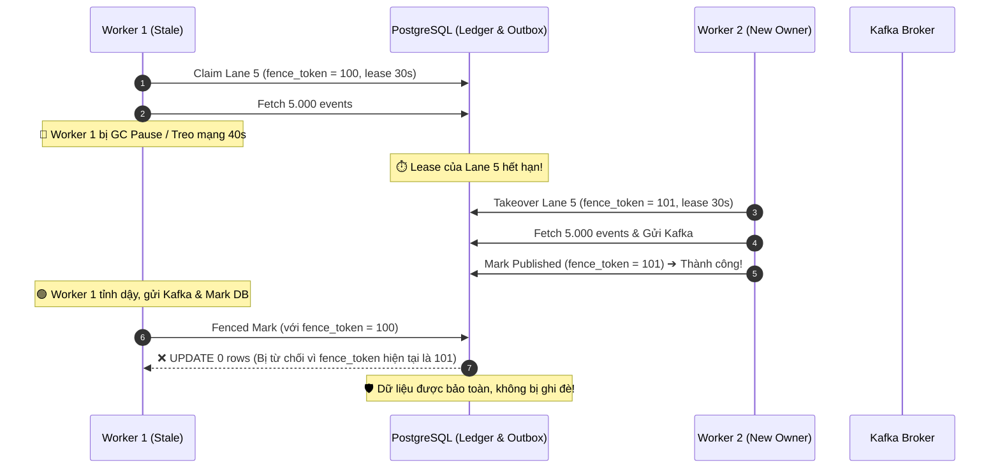

# ⚡ Deep-Dive Kiến trúc Outbox Relay: FT-053 (Lane-Fenced) vs FT-052 (JPA Per-Event Lease)

Tài liệu hướng dẫn chuyên sâu từ **First Principles** bóc tách sự chuyển dịch kiến trúc dữ liệu (Data Plane Transformation) trong `scan-service` (`file_mngt_microservice`). Tài liệu giải thích lý do vì sao FT-053 nâng thông lượng từ **`5.387 records/s`** (FT-052) lên **`121.007 records/s`** (xử lý 1 triệu sự kiện chỉ trong **`8,26 giây`** — tăng tốc gấp **~22 lần**), chi tiết hóa cơ chế **Virtual Lane Ledger**, **Fencing Token**, **Native JDBC Projection** và **PostgreSQL Array Acknowledgment**.

---

## 🎯 Bản chất trong một câu

> **FT-053 giải phóng Transactional Outbox khỏi nút thắt I/O bằng cách chuyển đơn vị quản lý khóa từ "từng dòng dữ liệu trong bảng hàng triệu record" sang "Sổ cái 64 làn ảo trong RAM/PostgreSQL", kết hợp Native JDBC và Fencing Token để loại bỏ 50% thao tác ghi đĩa mà vẫn đảm bảo tính nhất quán tuyệt đối.**

### 🔑 Keyword Spine
`Transactional Outbox` • `Per-Event Lease` • `Virtual Lane Ledger` • `Monotonic Fencing Token` • `JPA Dirty Checking Elimination` • `Native UUID Array Mark` • `Virtual Threads Concurrency`

---

## 1. D0 — Bối cảnh & Vấn đề Cốt lõi (Why FT-053?)

Trong mô hình **Transactional Outbox Pattern**, nghiệp vụ duyệt file (`ScanDecisionService`) và việc lưu sự kiện (`scan_outbox_event`) được commit nguyên tử (Atomic) trong PostgreSQL `scan_db`. Sau đó, tiến trình ngầm (**Outbox Relay**) phải liên tục quét các sự kiện chưa gửi (`published_at IS NULL`) để đẩy lên Apache Kafka.

```
[User Action: Approve File] ➔ [PostgreSQL: Commit File + Outbox Event] ➔ [Outbox Relay] ➔ [Kafka Topic]
```

### ❌ Nút thắt của FT-052 (As-Is: JPA Per-Event Lease)

FT-052 đã cải tiến vòng lặp điều khiển (loại bỏ Wave Barrier cố định), nhưng hiệu năng thực tế đo được trên môi trường cô lập vẫn rất hạn chế:
- **Workload 25.000 events**: Đạt `5.387 records/s` (mất ~4,6 giây).
- **Workload 1.000.000 events**: Bị treo (timeout/abort), không thể hoàn thành trong phiên đo.

#### 3 Điểm nghẽn chí mạng của FT-052:
1. **Ô nhiễm I/O đĩa (Write Amplification)**: Để gửi 1 sự kiện, hệ thống phải ghi đĩa **2 lần** lên bảng `scan_outbox_event`:
   - Lần 1: `UPDATE` ghi `lease_owner` + `lease_until` để giữ chỗ (Claim lease).
   - Lần 2: `UPDATE` ghi `published_at` khi Kafka đã nhận xong.
   $\rightarrow$ Với 1 triệu event, PostgreSQL phải gánh **2 triệu lượt UPDATE trên bảng lớn**, sinh ra lượng khổng lồ Write-Ahead Log (WAL) và Table Bloat.
2. **Quá tải ORM (Hibernate/JPA Hydration Overhead)**: Mỗi đợt 500 records phải load thành 500 JPA Entity vào Hibernate Session (First-level Cache), kích hoạt Dirty Checking và tạo hàng triệu object ngắn hạn, làm tê liệt CPU do Garbage Collection (GC).
3. **Tranh chấp khóa dòng & Thuế kiểm tra trạng thái**: Sử dụng `SELECT ... FOR UPDATE SKIP LOCKED` trên bảng hàng triệu dòng, kết hợp việc gọi `countByPublishedAtIsNull()` quét toàn bảng liên tục trong vòng lặp chính làm kiệt quệ DB Connection Pool.

---

## 2. D1 — Từ vựng & Khái niệm Kiến trúc (Vocabulary & Concepts)

| Thuật ngữ | Định nghĩa & Trách nhiệm | Vai trò trong FT-053 |
| :--- | :--- | :--- |
| **Virtual Lane (Làn ảo)** | Phân vùng logic 64 làn (`0..63`) được xác định bởi hàm băm cố định: `MD5(partition_key) % 64`. | Đảm bảo mọi event của cùng 1 file luôn đi qua 1 làn cố định (Bảo toàn FIFO). |
| **Lane Ledger (Sổ cái Làn)** | Bảng PostgreSQL [`scan_outbox_relay_lane`](file:///d:/Personal/file-management/v2/file-mngt-be-v2/apps/scan-service/src/main/java/com/filemngt/v2/scan/adapter/out/persistence/outbox/lane/ScanOutboxRelayLaneStore.java#L18-L32) chỉ gồm đúng **64 dòng** quản lý trạng thái thuê. | Nơi duy nhất diễn ra tranh chấp khóa và ghi trạng thái Lease. |
| **Fencing Token** | Số nguyên tăng đơn điệu (`fence_token + 1`) mỗi khi một worker claim hoặc takeover một lane. | Ngăn chặn hiện tượng Split-Brain khi worker cũ bị chậm / lag tỉnh dậy ghi đè dữ liệu. |
| **Pure Read (Đọc thuần túy)** | Đọc sự kiện ra khỏi bảng outbox mà không cần `FOR UPDATE` hay ghi lease. | Loại bỏ hoàn toàn lock contention trên bảng `scan_outbox_event`. |
| **Native Array Mark** | Cập nhật hoàn tất hàng loạt qua mảng native: `= ANY(?::uuid[])`. | Gom 5.000 ID vào **1 câu SQL duy nhất trong 1 network round-trip**. |
| **OutboxRelayRecord** | Java immutable Record phẳng (`id, eventType, partitionKey, payload, ...`). | Loại bỏ hoàn toàn Hibernate Entity và Dirty Checking. |

---

## 3. D2 — So sánh Kiến trúc Trực quan: FT-052 vs FT-053

### 🎨 Sơ đồ Kiến trúc Draw.io (Chuyên sâu)

> *(💡 Gợi ý: Bạn có thể mở trực tiếp các file diagram dưới đây trong IntelliJ IDEA hoặc phần mềm Draw.io để chỉnh sửa kéo thả trực quan).*

- **Sơ đồ As-Is FT-052**: [assets/as-is-ft052-jpa-data-plane.drawio.svg](./assets/as-is-ft052-jpa-data-plane.drawio.svg)
- **Sơ đồ To-Be FT-053**: [assets/to-be-ft053-lane-fenced-relay.drawio.svg](./assets/to-be-ft053-lane-fenced-relay.drawio.svg)

---

### 📊 Sơ đồ Dòng dữ liệu (Mermaid Side-by-Side)

#### 1. Mô hình cũ — FT-052 (Per-Event Lease & JPA Overhead)

```mermaid
flowchart LR
    subgraph DB["1. DATABASE (scan_db)"]
        direction TB
        TBL[("scan_outbox_event<br/>1M Records")]
        ROW_LEASE["🛑 WRITE #1: Ghi Lease từng row<br/>UPDATE lease_owner, lease_until"]
        DB_MARK["🛑 WRITE #2: Mark Published<br/>UPDATE WHERE id IN (:ids)"]
    end
    subgraph APP["2. APP ENGINE (JPA Relay)"]
        direction TB
        JPA_HYDRATE["JPA Hydration (500 Entities)<br/>Dirty Checking Overhead"]
        SAVE_ALL["saveAll() Lease cho 500 rows"]
        DISPATCH["Async Window Dispatch"]
        COUNT_TAX["⚠️ Exact count(*) Polling Loop"]
    end
    subgraph BROKER["3. KAFKA BROKER"]
        direction TB
        TOPIC{{"media.file.discovered.v2"}}
        ACK["Broker Ack Callback"]
    end
    TBL -->|"1. SELECT FOR UPDATE"| JPA_HYDRATE
    JPA_HYDRATE --> SAVE_ALL
    SAVE_ALL -->|"Ghi đĩa lần 1"| ROW_LEASE
    SAVE_ALL --> DISPATCH
    DISPATCH -->|"2. Publish"| TOPIC
    TOPIC -.->|"3. Ack"| ACK
    ACK --> DISPATCH
    DISPATCH -->|"4. Ghi đĩa lần 2"| DB_MARK
    COUNT_TAX -.->|"Quét full table liên tục"| TBL
    style DB fill:#4A148C,stroke:#fff,stroke-width:2px,color:#fff
    style TBL fill:#9C27B0,stroke:#fff,stroke-width:2px,color:#fff
    style ROW_LEASE fill:#E91E63,stroke:#fff,stroke-width:2px,color:#fff
    style DB_MARK fill:#FF9800,stroke:#fff,stroke-width:2px,color:#fff
    style APP fill:#263238,stroke:#fff,stroke-width:2px,color:#fff
    style JPA_HYDRATE fill:#E91E63,stroke:#fff,stroke-width:2px,color:#fff
    style SAVE_ALL fill:#E91E63,stroke:#fff,stroke-width:2px,color:#fff
    style DISPATCH fill:#2196F3,stroke:#fff,stroke-width:2px,color:#fff
    style COUNT_TAX fill:#455A64,stroke:#fff,stroke-width:2px,color:#fff
    style BROKER fill:#004D40,stroke:#fff,stroke-width:2px,color:#fff
    style TOPIC fill:#009688,stroke:#fff,stroke-width:2px,color:#fff
    style ACK fill:#4CAF50,stroke:#fff,stroke-width:2px,color:#fff
```


#### 2. Mô hình mới — FT-053 (Virtual Lane Ledger & Native Data Plane)

```mermaid
flowchart LR
    subgraph DB["1. DATABASE (scan_db)"]
        direction TB
        LEDGER[("scan_outbox_relay_lane<br/>Chỉ có đúng 64 dòng")]
        INDEX["Partial Lane Index<br/>(lane_id, created_at, id)"]
        EVENTS[("scan_outbox_event<br/>1M Records")]
        FENCED_MARK["⚡ WRITE DUY NHẤT: Fenced Mark<br/>UPDATE WHERE id = ANY(:ids)<br/>AND fence_token = :token"]
    end
    subgraph APP["2. APP ENGINE (FT-053 Coordinator)"]
        direction TB
        ACQUIRE["1. Claim 1 Lane Ledger<br/>Nhận fence_token (SKIP LOCKED)"]
        WORKERS["2. 4 Virtual-Thread Workers"]
        FETCH_RECORD["3. Pure Read Keyset Fetch<br/>Native OutboxRelayRecord (5000)"]
        BUFFER["4. Bounded Completion Buffer"]
    end
    subgraph BROKER["3. KAFKA BROKER"]
        direction TB
        TOPIC{{"media.file.discovered.v2"}}
        ACK["Broker Ack Callback"]
    end
    LEDGER <-->|"1. Claim 1 row"| ACQUIRE
    ACQUIRE --> WORKERS
    WORKERS --> FETCH_RECORD
    EVENTS --> INDEX
    INDEX -->|"2. Pure Read (No Lock)"| FETCH_RECORD
    FETCH_RECORD -->|"3. Async Stream"| TOPIC
    TOPIC -.->|"4. Fast Ack"| ACK
    ACK --> BUFFER
    BUFFER -->|"5. Flush Array 1 roundtrip"| FENCED_MARK
    style DB fill:#4A148C,stroke:#fff,stroke-width:2px,color:#fff
    style LEDGER fill:#FF9800,stroke:#fff,stroke-width:2px,color:#fff
    style INDEX fill:#4CAF50,stroke:#fff,stroke-width:2px,color:#fff
    style EVENTS fill:#9C27B0,stroke:#fff,stroke-width:2px,color:#fff
    style FENCED_MARK fill:#4CAF50,stroke:#fff,stroke-width:2px,color:#fff
    style APP fill:#263238,stroke:#fff,stroke-width:2px,color:#fff
    style ACQUIRE fill:#FF9800,stroke:#fff,stroke-width:2px,color:#fff
    style WORKERS fill:#2196F3,stroke:#fff,stroke-width:2px,color:#fff
    style FETCH_RECORD fill:#009688,stroke:#fff,stroke-width:2px,color:#fff
    style BUFFER fill:#009688,stroke:#fff,stroke-width:2px,color:#fff
    style BROKER fill:#004D40,stroke:#fff,stroke-width:2px,color:#fff
    style TOPIC fill:#E91E63,stroke:#fff,stroke-width:2px,color:#fff
    style ACK fill:#4CAF50,stroke:#fff,stroke-width:2px,color:#fff
```


---

## 4. D2 — Chi tiết Cơ chế Runtime của FT-053 (Step-by-Step Execution)

### Bước 1: Phân bổ sự kiện vào 64 Virtual Lanes
Khi lưu vào DB, sự kiện được ánh xạ tự động vào một Làn ảo từ `0` đến `63`:
```sql
lane_id = (get_byte(decode(md5(partition_key), 'hex'), 0) & 63)
```
Database sử dụng một Partial Index siêu nhỏ:
```sql
CREATE INDEX idx_scan_outbox_lane_pending 
ON scan_outbox_event (
    (get_byte(decode(md5(partition_key), 'hex'), 0) & 63), 
    created_at, 
    id
) WHERE published_at IS NULL;
```

### Bước 2: Worker chiếm quyền Làn (Acquire Lane Lease & Fencing Token)
Thay vì khóa từng event, worker chạy một câu lệnh nguyên tử chiếm **duy nhất 1 dòng** trên bảng ledger [`scan_outbox_relay_lane`](file:///d:/Personal/file-management/v2/file-mngt-be-v2/apps/scan-service/src/main/java/com/filemngt/v2/scan/adapter/out/persistence/outbox/lane/ScanOutboxRelayLaneStore.java#L18-L32):
```sql
WITH candidate AS (
    SELECT lane_id
    FROM scan_outbox_relay_lane
    WHERE lane_id = ?
      AND (lease_owner = ? OR lease_until IS NULL OR lease_until < ?)
    FOR UPDATE SKIP LOCKED
)
UPDATE scan_outbox_relay_lane lane
SET lease_owner = ?, lease_until = ?, fence_token = lane.fence_token + 1,
    last_heartbeat_at = ?
FROM candidate
WHERE lane.lane_id = candidate.lane_id
RETURNING lane.lane_id, lane.lease_owner, lane.lease_until, lane.fence_token;
```
👉 **Điểm đặc biệt**: `fence_token` tự động tăng lên 1 đơn vị (`+ 1`), biến nó thành "vé bài" độc quyền chống worker cũ ghi đè.

### Bước 3: Đọc dữ liệu cực nhanh không cần Khóa (Pure Read Keyset Fetch)
Worker tự do đọc 5.000 events thuộc Làn mà nó đang giữ lease:
```sql
SELECT id, event_type, partition_key, payload, correlation_id, traceparent, created_at
FROM scan_outbox_event
WHERE published_at IS NULL
  AND (get_byte(decode(md5(partition_key), 'hex'), 0) & 63) = ?
ORDER BY created_at, id
LIMIT ?;
```
- Không có `FOR UPDATE`.
- Trả về Java immutable record [`OutboxRelayRecord`](file:///d:/Personal/file-management/v2/file-mngt-be-v2/apps/scan-service/src/main/java/com/filemngt/v2/scan/adapter/out/persistence/outbox/lane/OutboxRelayRecord.java), hoàn toàn không khởi tạo JPA Entity / Hibernate Session.

### Bước 4: Phát tán bất đồng bộ lên Kafka (Async Parallel Dispatch)
[`ScanOutboxLaneRelayCoordinator`](file:///d:/Personal/file-management/v2/file-mngt-be-v2/apps/scan-service/src/main/java/com/filemngt/v2/scan/application/outbox/lane/ScanOutboxLaneRelayCoordinator.java#L92-L97) kích hoạt Java 25 Virtual Threads, gửi đồng thời hàng ngàn message:
```java
List<CompletableFuture<DeliveryResult>> futures = events.stream()
    .map(this::publish)
    .toList();
CompletableFuture.allOf(futures.toArray(CompletableFuture[]::new)).join();
```

### Bước 5: Đánh dấu hoàn tất nguyên tử bằng Mảng Native (Fenced Array Mark)
Sau khi Kafka Broker xác nhận thành công (Ack), toàn bộ danh sách UUID (`5.000 IDs`) được gửi xuống PostgreSQL trong **1 câu SQL duy nhất**:
```sql
UPDATE scan_outbox_event event
SET published_at = ?, last_error = NULL
FROM scan_outbox_relay_lane lane
WHERE event.id = ANY (?::uuid[])
  AND event.published_at IS NULL
  AND lane.lane_id = ?
  AND lane.lease_owner = ?
  AND lane.fence_token = ?
  AND lane.lease_until > ?;
```

---

## 5. D3 — Xử lý Sự cố & Bảo vệ Tính nhất quán (Failure Modes & Fencing Token)

Trong hệ thống phân tán, các sự cố mạng và dừng tiến trình (GC pause) là không thể tránh khỏi. Dưới đây là cách FT-053 bảo toàn dữ liệu:



### Các Kịch bản Sự cố (Failure Matrix)

| Kịch bản lỗi | Hành vi của FT-053 | Đảm bảo tính nhất quán |
| :--- | :--- | :--- |
| **Worker bị GC Pause / Treo mạng (Split-Brain)** | Worker 2 chiếm Lane và nâng `fence_token`. Khi Worker 1 tỉnh dậy cố mark DB, câu lệnh trả về `0 rows` vì mismatch `fence_token`. | **Không lỗi dữ liệu (Zero Data Corruption)** nhờ Fencing Token. |
| **Crash sau khi Kafka Ack nhưng trước khi DB Mark** | Sự kiện chưa có `published_at`. Worker tiếp theo sẽ republish lại sang Kafka. | **At-Least-Once Delivery**. `catalog-service` sử dụng `eventId` deduplication để triệt tiêu message trùng. |
| **Một vài message gửi Kafka bị lỗi** | Chỉ các event lỗi được ghi nhận `markFailed()`, các event thành công trong batch vẫn được mark `published_at`. | Không làm nghẽn hoặc rollback toàn bộ batch. |
| **Kafka Broker sập (Outage)** | Circuit breaker kích hoạt, dừng claim lane mới, backlog nằm an toàn trong DB. | **Zero Data Loss**. Không mất bất kỳ event nào. |

---

## 6. D4 — Phân tích Kết quả Thực nghiệm (Benchmark & Performance Evidence)

Thử nghiệm được thực hiện trên môi trường Testcontainers (`postgres:18.0-alpine`, Corretto 25) cô lập data plane ([`ScanOutboxLaneRelayBenchmarkTest`](file:///d:/Personal/file-management/v2/file-mngt-be-v2/apps/scan-service/src/test/java/com/filemngt/v2/scan/benchmark/outbox/ScanOutboxLaneRelayBenchmarkTest.java)):

### Bảng Kết quả Đo lường:

| Chỉ số | FT-052 (Wave / JPA) | FT-053 (Lane-Fenced Native) | Tỷ lệ Cải thiện |
| :--- | :---: | :---: | :---: |
| **Workload 25.000 events** | `5.387 records/s` | **`47.893 records/s`** | **Tăng ~8,9 lần** |
| **Thời gian chạy 25k events** | `4.640 ms` | **`522 ms`** | Nhanh hơn **~88,7%** |
| **Workload 1.000.000 events** | *Bị treo / Abort* | **`121.007 records/s`** | **Đạt ngưỡng kỷ lục** |
| **Thời gian chạy 1M events** | *Không hoàn tất* | **`8.264 ms` (~8,2 giây)** | **Vượt xa mốc chuẩn** |
| **So với Hard-floor Target (30k/s)** | Không đạt | **Vượt 4,3 lần** | PASS Qualification |

```
Log thực tế phiên đo 1 Triệu Events:
FT-053 lane relay: events=1000000, lanes=64, workers=4, fetchSize=5000, elapsedMs=8264, throughputPerSecond=121007
```

---

## 7. 🎓 Phỏng vấn Mock Q&A (Senior & Architect Level)

### Q1: Tại sao không dùng Debezium / CDC (Change Data Capture) mà lại tối ưu Polling Outbox?
> **Trả lời:**
> CDC (Debezium đọc WAL PostgreSQL) là một giải pháp kiến trúc mạnh mẽ nhưng đi kèm chi phí vận hành lớn: phụ thuộc hạ tầng Kafka Connect, quản lý replication slot, schema registry, snapshot table và xử lý failover phức tạp. 
> FT-053 chứng minh rằng: **Bản thân mô hình Polling không hề chậm**. Nút thắt trước đây nằm ở cách thiết kế I/O (per-row locking và ORM overhead). Khi áp dụng **Virtual Lane Ledger + Native Array Mark**, ứng dụng đạt tới **121.000 records/s** — thừa sức đáp ứng nhu cầu throughput của hệ thống mà không cần thêm bất kỳ thành phần hạ tầng phức tạp nào.

### Q2: Tại sao số Virtual Lanes cố định là 64 trong khi số Worker Concurrency lại là 4?
> **Trả lời:**
> Đây là nguyên lý tách biệt giữa **Độ mịn phân vùng logic (Logical Partitioning)** và **Năng lực tính toán vật lý (Physical Concurrency)**:
> - **64 Lanes logic**: Đảm bảo phân tán đều dữ liệu, tránh tình trạng "làn quá đông, làn quá vắng" (Lane Skew) và bảo toàn thứ tự FIFO của cùng 1 file.
> - **4 Workers vật lý**: Được điều chỉnh tùy theo tài nguyên máy chủ (CPU cores, DB Connection Pool size). 4 worker sẽ luân phiên "nhặt" các lane có việc để xử lý theo mô hình Work Stealing. Khi cần scale up, ta có thể tăng lên 8 hoặc 16 worker mà không cần re-hash hay migrate lại dữ liệu trong database.

### Q3: Fencing Token hoạt động ra sao nếu Worker bị Pause 1 phút do Full GC?
> **Trả lời:**
> Khi Worker 1 bị GC Pause vượt quá thời hạn Lease (ví dụ 30s), Làn đó được coi là hết hạn. Worker 2 sẽ nhảy vào claim Làn và tăng `fence_token` từ `100` lên `101`. Khi Worker 1 tỉnh dậy sau 1 phút, nó gửi lệnh `UPDATE` kèm điều kiện `WHERE fence_token = 100`. Database kiểm tra thấy `fence_token` hiện tại của Làn đã là `101`, nên câu `UPDATE` của Worker 1 trả về `0 rows affected`. Worker 1 nhận biết mình đã mất quyền và hủy bỏ kết quả an toàn mà không làm sai lệch trạng thái DB.

---

## 8. 📚 Source of Truth & Tài liệu Tham khảo

- **Implementation**:
  - Coordinator: [`ScanOutboxLaneRelayCoordinator.java`](file:///d:/Personal/file-management/v2/file-mngt-be-v2/apps/scan-service/src/main/java/com/filemngt/v2/scan/application/outbox/lane/ScanOutboxLaneRelayCoordinator.java)
  - Native Store: [`ScanOutboxRelayLaneStore.java`](file:///d:/Personal/file-management/v2/file-mngt-be-v2/apps/scan-service/src/main/java/com/filemngt/v2/scan/adapter/out/persistence/outbox/lane/ScanOutboxRelayLaneStore.java)
  - Record DTO: [`OutboxRelayRecord.java`](file:///d:/Personal/file-management/v2/file-mngt-be-v2/apps/scan-service/src/main/java/com/filemngt/v2/scan/adapter/out/persistence/outbox/lane/OutboxRelayRecord.java)
- **Benchmark Test**:
  - Test Case: [`ScanOutboxLaneRelayBenchmarkTest.java`](file:///d:/Personal/file-management/v2/file-mngt-be-v2/apps/scan-service/src/test/java/com/filemngt/v2/scan/benchmark/outbox/ScanOutboxLaneRelayBenchmarkTest.java)
  - Result Report: [07-ft053-lane-fenced-outbox-relay.md](file:///d:/Personal/file-management/v2/file-mngt-be-v2/apps/scan-service/src/test/java/com/filemngt/v2/scan/benchmark/results/07-ft053-lane-fenced-outbox-relay.md)
- **Feature Design**:
  - [01-brief.md](file:///d:/Personal/file-management/v2/file-mngt-be-v2/docs/features/053-lane-fenced-outbox-data-plane/01-brief.md)
  - [02-design.md](file:///d:/Personal/file-management/v2/file-mngt-be-v2/docs/features/053-lane-fenced-outbox-data-plane/02-design.md)
