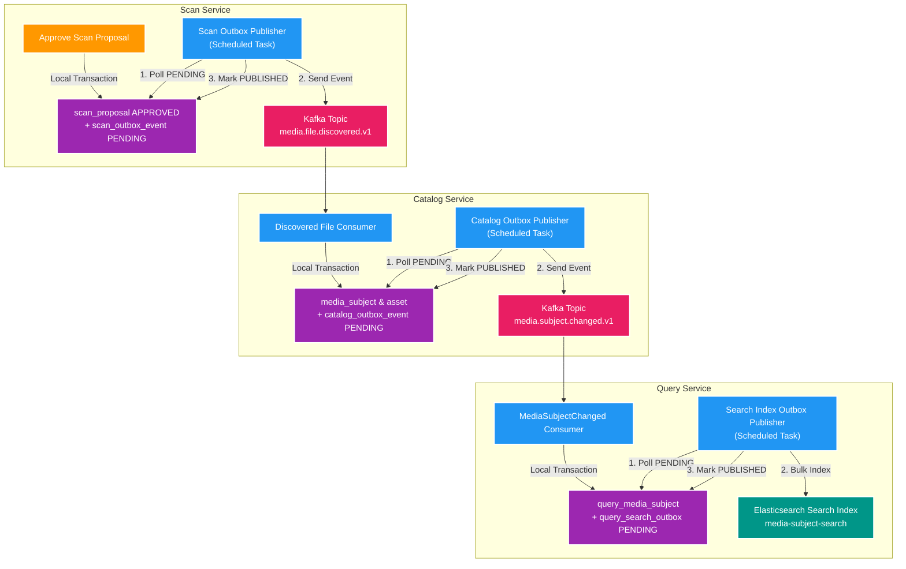

# 🏗️ Outbox Architecture & Implementation Details

Tài liệu mô tả kiến trúc triển khai chi tiết của **Transactional Outbox Pattern** tại 3 vị trí chiến lược trong dự án **Backend V2** (`file_mngt_microservice`), cùng với việc so sánh mô hình Polling Publisher vs CDC Debezium.

---

## 1. Chi tiết Ứng dụng Outbox Pattern trong Hệ thống Backend V2

Trong dự án `file_mngt_microservice`, Outbox Pattern được triển khai nhất quán ở **3 vị trí chiến lược**:

### 📍 Vị trí 1: `scan-service` (`scan_db`)
- **Tác vụ**: Khi User nhấn Approve 1 Proposal nhập liệu.
- **Thao tác**: `ScanDecisionService` mở Local Transaction:
  1. Update `scan_proposal` status = `APPROVED`.
  2. Insert bản tin `media.file.discovered.v1` vào `scan_outbox_event`.
- **Relay**: `ScanOutboxPublisher` định kỳ poll các bản tin `PENDING`, publish sang Kafka topic `media.file.discovered.v1`, sau đó cập nhật `status = PUBLISHED`.

### 📍 Vị trí 2: `catalog-service` (`catalog_db`)
- **Tác vụ**: Khi Catalog cập nhật thông tin Subject / Asset hoặc nhận file mới.
- **Thao tác**: `CatalogSubjectMutationService` mở Local Transaction:
  1. Upsert `media_subject`, `media_asset` và tăng `subject_version`.
  2. Insert bản tin `media.subject.changed.v1` vào `catalog_outbox_event`.
- **Relay**: `CatalogOutboxPublisher` poll `catalog_outbox_event`, publish sang Kafka topic `media.subject.changed.v1`, sau đó đánh dấu `PUBLISHED`.

### 📍 Vị trí 3: `query-service` (`query_db` ➔ Elasticsearch)
- **Tác vụ**: Cập nhật Search Index trên Elasticsearch khi Read Model PostgreSQL có thay đổi.
- **Thao tác**: `QueryProjectionService` mở Local Transaction:
  1. Upsert projection vào PostgreSQL `query_media_subject`.
  2. Insert bản tin đồng bộ vào `query_search_outbox`.
- **Relay**: `SearchIndexOutboxPublisher` batch poll `query_search_outbox`, gọi Bulk API đẩy sang Elasticsearch index `media-subject-search`, sau đó cập nhật `PUBLISHED`.

---

## 2. So sánh Polling Publisher vs CDC (Debezium / Kafka Connect)

| Tiêu chí | Polling Outbox Publisher (Dự án chọn) | CDC (Change Data Capture - Debezium) |
| :--- | :--- | :--- |
| **Cơ chế hoạt động** | Scheduled Task định kỳ quét SQL `SELECT ... WHERE status = 'PENDING'` | Đọc trực tiếp Postgres Write-Ahead Log (WAL) |
| **Độ trễ (Latency)** | Phụ thuộc polling interval (vd: 500ms - 1s) | Tiệm cận Zero-latency (vài millisecond) |
| **Tải trên DB** | Tạo thêm câu lệnh SQL `SELECT` / `UPDATE` định kỳ | Không tạo thêm SQL query, đọc log WAL ngầm |
| **Độ phức tạp hạ tầng** | **Rất đơn giản**: Thuần Java code + SQL table, không cài thêm plugin | **Phức tạp**: Cần Kafka Connect, Debezium, Postgres WAL logical replication |
| **Tính tương thích Local** | **Tuyệt vời**: Chạy nhẹ nhàng trên mọi máy dev, CI/CD, Testcontainers | Phải cấu hình Postgres WAL level = logical, setup Kafka Connect container |

### 💡 Lý do Dự án chọn Polling Publisher:
Đáp ứng nguyên tắc **Pragmatic & Fit-for-purpose**: Tối ưu hóa tính đơn giản khi khởi động dự án ở môi trường Local/Dev, không cần duy trì hạ tầng Kafka Connect phức tạp mà vẫn đạt 100% cam kết **At-Least-Once Delivery**.

---

## 3. Tài liệu Tham khảo Liên quan
- [00. Tổng quan Outbox Pattern](00-overview.md)
- [02. Idempotency, Resilience & Optimization](02-idempotency-and-resilience.md)
- [Ngân hàng Câu hỏi Phỏng vấn Outbox Pattern](question-bank/00-outbox-questions.md)
