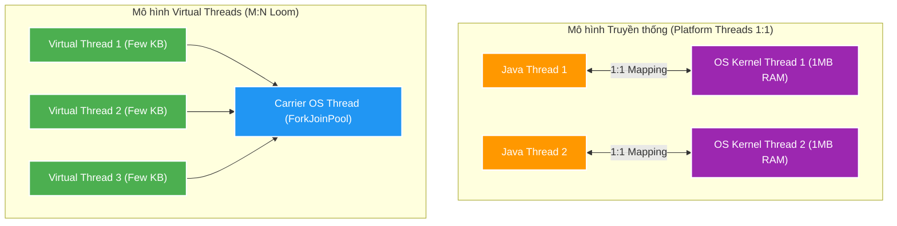
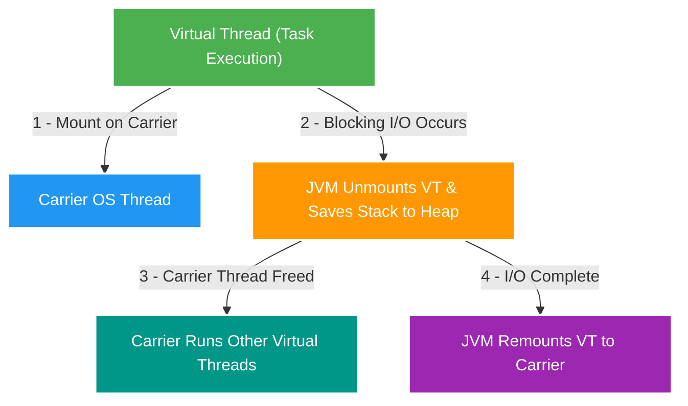

# 🧵 Virtual Threads: Overview & Fundamentals

Tài liệu giải thích chuyên sâu về **Virtual Threads** (Project Loom) từ Java 21 / JDK 25: Khái niệm cốt lõi, so sánh mô hình Platform Threads (OS Threads) với Virtual Threads, cơ chế Mount/Unmount trên Carrier Threads, và kiến trúc luồng dữ liệu của JVM.

---

## 1. Ý tưởng Cốt lõi & Sự Tiến hóa của Threading trong Java

### 🧠 Đặt vấn đề: Mô hình 1:1 Platform Threads (OS Threads)
Từ các phiên bản Java đầu tiên cho đến Java 20, Java áp dụng mô hình **1:1 Threading**:
- **1 Java Thread = 1 OS Platform Thread** (Kernel Thread do Hệ điều hành quản lý).
- **Tốn bộ nhớ**: Mỗi OS Thread chiếm giữ khoảng **1MB RAM** bộ nhớ Stack (Native Stack Memory).
- **Tốn CPU**: Khi OS chuyển đổi giữa các thread (**Context Switching**), CPU phải lưu lại trạng thái registers, nhịp đồng hồ và nhường quyền cho thread khác. Chi phí này rất đắt đỏ.
- **Giới hạn số lượng**: Một máy chủ thông thường chỉ chịu đựng được khoảng 1,000 - 5,000 OS Threads trước khi cạn RAM hoặc sập hệ thống do CPU thrashing.

---

## 2. Cơ chế Mount và Unmount trên Carrier Threads

Mấu chốt giúp Virtual Threads đạt được số lượng hàng triệu concurrent threads nằm ở cơ chế **Continuation** và **Carrier Threads**:

### 🔄 Quy trình Xử lý I/O:
1. **Mount (Gắn)**: Khi một Virtual Thread bắt đầu chạy, JVM sẽ gắn (mount) nó vào một OS Thread thực sự gọi là **Carrier Thread** (thường dùng `ForkJoinPool`).
2. **Unmount (Gỡ khi I/O Wait)**: Khi Virtual Thread thực hiện một thao tác blocking I/O (như đọc đĩa, gọi Database, chờ HTTP response):
   - JVM lưu lại trạng thái Continuation (Call Stack) của Virtual Thread vào RAM Heap (chỉ ngốn vài KB).
   - JVM lập tức **gỡ (unmount)** Virtual Thread đó khỏi Carrier Thread.
   - Carrier Thread trống sẽ tiếp tục gánh cho Virtual Thread khác chạy.
3. **Remount (Gắn lại khi I/O xong)**: Khi thao tác I/O hoàn tất, Virtual Thread được đưa vào danh sách sẵn sàng và JVM sẽ gắn (remount) nó lại vào một Carrier Thread rảnh rỗi bất kỳ để chạy nấc logic tiếp theo.

---

## 3. Bảng So sánh Chi tiết: Platform Threads vs Virtual Threads

| Tiêu chí | Platform Threads (OS Threads) | Virtual Threads (JVM-Managed) |
| :--- | :--- | :--- |
| **Quản lý bởi** | OS Kernel | JVM (Java Virtual Machine) |
| **Dung lượng Stack RAM** | ~1 MB / Thread | ~Kài KB / Thread (nhẹ hơn 1000x) |
| **Chi phí Tạo mới** | Cực kỳ đắt đỏ (Phải gọi OS System Call) | Cực kỳ rẻ (Như tạo một Java Object thông thường) |
| **Mô hình Pool** | Bắt buộc dùng Thread Pool (`ExecutorService`, `ThreadPoolExecutor`) để tái sử dụng. | **Không cần Thread Pool**. Tạo mới 1 Virtual Thread cho mỗi task. |
| **Số lượng Tối đa** | Vài nghìn (1,000 - 5,000 Threads) | Hàng triệu (1,000,000+ Threads) |
| **Phù hợp với** | CPU-Bound Tasks (Tính toán nặng, Mã hóa) | I/O-Bound Tasks (DB Query, Network HTTP, FileSystem) |
