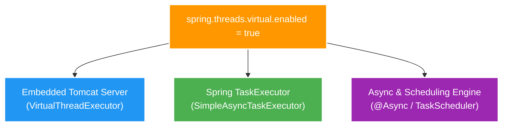

# 🍃 Virtual Threads Integration in Spring Boot 3.4+ & JDK 25

Tài liệu hướng dẫn cách tích hợp và kích hoạt **Virtual Threads** trong ứng dụng **Spring Boot 3.4+** chạy trên **JDK 25**, cách Spring Boot tự động thay thế Servlet Container (Tomcat) và Spring `TaskExecutor`, cũng như áp dụng thực tế trong microservice `scan-service`.

---

## 1. Cơ chế Auto-Configuration của Spring Boot 3.x

Từ Spring Boot 3.2+ trở đi (và tối ưu hoàn hảo ở Spring Boot 3.4+ / JDK 25), việc bật Virtual Threads được thiết kế dạng **Zero-Code Change** (Không cần sửa một dòng code Java nào).

Khi bạn khai báo cờ cấu hình trong file `application.yml`:

```yaml
spring:
  threads:
    virtual:
      enabled: true
```

Spring Boot Autoconfiguration sẽ tự động thực hiện 3 hành động hạ tầng quan trọng:



### 🔹 1. Embedded Web Server (Tomcat)
- Mặc định: Tomcat tạo một Platform Thread Pool cố định (ví dụ `max-threads: 200`). Nếu có 201 request đồng thời, request thứ 201 phải xếp hàng (Queue).
- Khi bật Virtual Threads: Tomcat chuyển sang dùng `VirtualThreadExecutor`. Mỗi HTTP Request đến sẽ sinh ra **1 Virtual Thread riêng biệt**. Tomcat không bị giới hạn 200 threads nữa mà có thể xử lý hàng chục nghìn kết nối đồng thời.

### 🔹 2. Spring `TaskExecutor` & `@Async`
- Mặc định: Spring dùng `ThreadPoolTaskExecutor` (với `corePoolSize`, `maxPoolSize`).
- Khi bật Virtual Threads: Spring thay thế bằng `SimpleAsyncTaskExecutor` chạy trên Virtual Threads. Mỗi task bất đồng bộ (như `taskExecutor.execute(...)` hay `@Async`) được gán trực tiếp cho 1 Virtual Thread mới.

---

## 2. Áp dụng Thực tế trong Microservice `scan-service`

Trong dự án **Backend V2**, service `scan-service` thực hiện quét cây thư mục bất đồng bộ.

### 📁 File Cấu hình: [apps/scan-service/src/main/resources/application.yml](../../../../apps/scan-service/src/main/resources/application.yml#L4-L6)

```yaml
spring:
  application:
    name: scan-service
  threads:
    virtual:
      enabled: ${SCAN_VIRTUAL_THREADS_ENABLED:false}
```

### 💻 Mã nguồn Java: [ScanService.java](../../../../apps/scan-service/src/main/java/com/filemngt/v2/scan/application/ScanService.java#L41-L58)

```java
@Service
public class ScanService {
    private final TaskExecutor taskExecutor;

    public ScanService(
            ScanProperties properties,
            ScanRunRepository runs,
            ScanProposalRepository proposals,
            ScanIssueRepository issues,
            @Qualifier("applicationTaskExecutor") TaskExecutor taskExecutor) {
        this.taskExecutor = taskExecutor;
    }

    public RunView start(String rootKey) {
        // Ghi nhận ScanRun
        var run = runs.saveAndFlush(...);
        
        // Gửi task bất đồng bộ
        taskExecutor.execute(() -> execute(run.id(), root));
        
        return view(run);
    }
}
```

- **Khi `SCAN_VIRTUAL_THREADS_ENABLED=false`**: `taskExecutor` chạy bằng Platform Thread Pool thông thường.
- **Khi `SCAN_VIRTUAL_THREADS_ENABLED=true`**: `taskExecutor` tự động chạy bằng Virtual Thread. Lệnh `taskExecutor.execute(...)` tạo một Virtual Thread siêu nhẹ để đọc đĩa cứng `Files.walk(...)` mà không chiếm giữ OS Thread của hệ thống.
