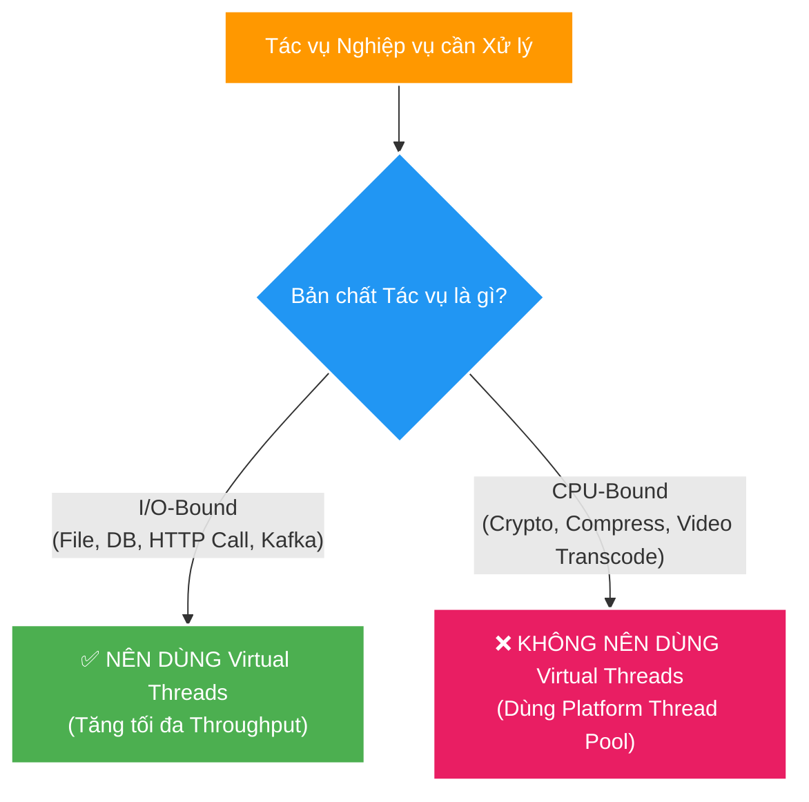

# ⚖️ Virtual Threads: Use Cases, Trade-offs & Best Practices

Tài liệu phân tích chuyên sâu về **Use Cases thích hợp**, các **Trade-offs (sự đánh đổi)**, cạm bẫy kỹ thuật (**Thread Pinning, Database Connection Exhaustion, ThreadLocal**) và bộ **Best Practices** khi áp dụng Virtual Threads trong các dự án Java / Spring Boot.

---

## 1. Phân loại Use Cases: Khi nào NÊN và KHÔNG NÊN dùng?



### ✅ Use Cases NÊN dùng Virtual Threads (I/O-Bound Tasks)
1. **Web Services / REST API Gateways**: Nhận hàng chục ngàn kết nối đồng thời từ Client và chờ phản hồi từ Downstream Microservices.
2. **FileSystem Operations**: Duyệt thư mục đĩa cứng, đọc/ghi file (`scan-service`).
3. **Database-Intensive Services**: Các service dành phần lớn thời gian chờ PostgreSQL/MySQL trả kết quả SQL Query.
4. **Message Broker Consumers**: Kafka/RabbitMQ Consumers xử lý bản tin và gọi HTTP/DB.

### ❌ Use Cases KHÔNG NÊN dùng Virtual Threads (CPU-Bound Tasks)
1. **Video/Audio Transcoding**: Xử lý nén video, render ảnh, mã hóa media.
2. **Crypto & Hashing**: Tính toán MD5, SHA-256, bcrypt password hashing cho tập tin lớn.
3. **In-Memory Computation**: Thuật toán tính toán số học nặng, Machine Learning / AI inference trực tiếp trên RAM.
> **Lý do**: Virtual Threads không làm CPU xử lý nhanh hơn. Nếu CPU bị chiếm 100% để tính toán, Virtual Thread không thể unmount và không đem lại bất kỳ lợi ích nào.

---

## 2. Các Cạm bẫy Kỹ thuật & Trade-offs (Trade-offs & Pitfalls)

### ⚠️ 1. Hiện tượng Thread Pinning (`synchronized` block)
- **Vấn đề**: Khi một Virtual Thread đi vào một khối `synchronized` hoặc gọi Native C/C++ Method, nó sẽ bị **gắn chặt (pinned)** vào Carrier Thread. Nếu trong khối `synchronized` có thao tác I/O blocking, Virtual Thread **không thể unmount**, khiến Carrier Thread (OS Thread) bị khóa cứng.
- **Giải pháp**: Thay thế `synchronized` bằng `ReentrantLock` (`java.util.concurrent.locks.ReentrantLock`).

```java
// ❌ KHÔNG NÊN: Gây Thread Pinning
public synchronized String readData() {
    return restTemplate.getForObject(...); // Blocking I/O inside synchronized!
}

// ✅ NÊN DÙNG: Không bị Pinning
private final ReentrantLock lock = new ReentrantLock();
public String readData() {
    lock.lock();
    try {
        return restTemplate.getForObject(...);
    } finally {
        lock.unlock();
    }
}
```

---

### ⚠️ 2. Quá tải Database Connection Pool (HikariCP Exhaustion)
- **Vấn đề**: Với Platform Threads, số lượng request bị chặn lại ở mức 200 (theo Tomcat Thread Pool Size). Với Virtual Threads, hệ thống có thể cho phép **10,000 requests** chạy cùng lúc.
- Nếu cả 10,000 Virtual Threads này đồng loạt xin Connection từ HikariCP Pool (vốn chỉ có `maximumPoolSize: 10`), **10,000 Virtual Threads sẽ cùng bị nghẽn (Contention)** tại Database Connection Pool.
- **Giải pháp**: Dùng `Semaphore` để giới hạn số lượng Virtual Threads được phép chạm vào Database đồng thời, hoặc tinh chỉnh HikariCP timeout phù hợp.

---

### ⚠️ 3. Bộ nhớ RAM & `ThreadLocal` Leak
- **Vấn đề**: Trong mô hình cũ, người ta hay lưu các Object lớn vào `ThreadLocal` để tái sử dụng (vì số lượng Platform Threads ít). Với Virtual Threads, việc tạo ra hàng triệu Virtual Threads mang theo các Object `ThreadLocal` lớn sẽ gây **Out Of Memory (OOM)** lập tức.
- **Giải pháp**: 
  - Tránh lưu Object lớn vào `ThreadLocal`.
  - Trên JDK 21+, ưu tiên dùng **Scoped Values** (`java.lang.ScopedValue`) thay thế cho `ThreadLocal`.

---

## 3. Checklist Best Practices cho Developer

1. ❌ **Không tạo Virtual Thread Pool**: Không bao giờ dùng `Executors.newFixedThreadPool()` cho Virtual Threads. Hãy dùng `Executors.newVirtualThreadPerTaskExecutor()`.
2. 🔄 **Chuyển từ `synchronized` sang `ReentrantLock`**: Rà soát codebase để loại bỏ các điểm I/O nằm trong `synchronized`.
3. 🛡️ **Bảo vệ Downstream Resources**: Sử dụng `Semaphore` hoặc Rate Limiter khi gọi các tài nguyên ngoại vi có giới hạn (như DB connections, External APIs).
4. 🧪 **Benchmark thực tế trước khi bật trên Production**: Luôn kiểm tra chỉ số Throughput và Latency bằng các công cụ Load Testing (JMeter, k6) trước khi bật cờ `spring.threads.virtual.enabled=true`.
