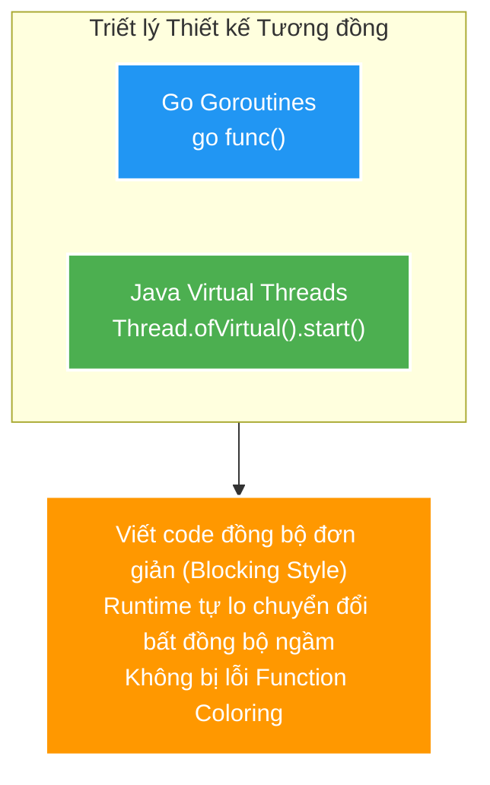

# 🔄 Virtual Threads vs. Go Goroutines, Kotlin Coroutines & Node.js

Tài liệu so sánh đối chiếu chuyên sâu giữa **Java Virtual Threads** (Project Loom) với các cơ chế Concurrency phổ biến khác trong ngành phần mềm: **Go Goroutines**, **Kotlin Coroutines**, và **Node.js Event Loop**.

---

## 1. Bảng So sánh Tổng quan

| Tiêu chí | Java Virtual Threads | Go Goroutines | Kotlin Coroutines | Node.js Event Loop |
| :--- | :--- | :--- | :--- | :--- |
| **Quản lý bởi** | **JVM Runtime** (Project Loom). | **Go Runtime Scheduler**. | **Compiler + Library** (`kotlinx.coroutines`). | **Single-threaded Event Loop** (libuv). |
| **Phong cách Code (Style)** | **Thread-per-task (Blocking style)**. Code như code đồng bộ truyền thống. | **Blocking style** đơn giản (`go func()`). | **Async/Await style** (`suspend` functions). | **Async/Await / Promise / Callback**. |
| **Vấn đề "Function Coloring"** | **KHÔNG**. Hàm bình thường gọi mà không cần từ khóa đặc biệt. | **KHÔNG**. Bất kỳ hàm nào cũng chạy được trong Goroutine. | **CÓ**. Hàm `suspend` bắt buộc chỉ được gọi từ 1 `suspend` function khác. | **CÓ**. Hàm `async` trả về Promise, làm đổi cách gọi hàm ở caller. |
| **Cơ chế Scheduling** | **Cooperative / Hybrid**: Tự động unmount khi gặp Blocking I/O. | **Preemptive**: Go Scheduler có thể ngắt Goroutine nếu chạy CPU quá lâu (Go 1.14+). | **Cooperative**: Coroutine phải tự nhường quyền (Yield/Suspend) tại điểm `suspend`. | **Event Loop Callback Queue**: Không chạy đa luồng thật cho JS code (chỉ 1 main thread). |
| **Tương thích Code Cũ (Legacy)** | **Cực cao**. Không cần rewrite codebase Java 15-20 năm qua. | Tích hợp sẵn từ đầu trong ngôn ngữ Go. | Cần rewrite code sang `suspend` function hoặc wrap bằng `Deferred`/`Flow`. | Phải refactor code sang `async/await` hoặc `Promise`. |

---

## 2. Phân tích So sánh Chi tiết từng Công nghệ

### 🅰️ Java Virtual Threads vs. Go Goroutines (Tương đồng cao nhất)

- **Điểm tương đồng**: Cả hai đều đi theo triết lý **"Code như blocking đồng bộ nhưng chạy bất đồng bộ ngầm"**. Cả hai đều **không bị vấn đề Function Coloring** (Dev không phải suy nghĩ hàm nào là `async`, hàm nào là `sync`).
- **Điểm khác biệt**:
  - **Go Goroutines** có cơ chế **Preemptive Scheduling** (từ Go 1.14). Nếu một Goroutine mải tính toán CPU liên tục, Go Scheduler vẫn có thể cưỡng chế ngắt nó để nhường CPU cho Goroutine khác.
  - **Java Virtual Threads** hiện tại chủ yếu phụ thuộc vào các điểm Blocking I/O hoặc `LockSupport.park()`. Ngoài ra, Virtual Threads bị dính hiện tượng **Thread Pinning** khi gặp khối `synchronized` (điều mà Go không bị).

---

### 🅱️ Java Virtual Threads vs. Kotlin Coroutines

- **Điểm tương đồng**: Đều chạy trên môi trường JVM.
- **Điểm khác biệt**:
  - **Kotlin Coroutines** là giải pháp ở cấp độ **Biên dịch & Thư viện (Compiler-driven)**. Compiler tự biến đổi các `suspend` function thành các State Machine ngầm. Điều này gây ra bài toán **Function Coloring** (từ khóa `suspend` lây lan khắp codebase).
  - **Java Virtual Threads** là giải pháp ở cấp độ **Runtime (JVM-driven)**. JVM can thiệp trực tiếp vào Call Stack. Nhờ đó, code Java cổ điển (từ JDBC đến Spring MVC) **không cần sửa một dòng chữ nào** vẫn nghiễm nhiên hưởng lợi từ Virtual Threads.

---

### 🅲 Java Virtual Threads vs. Node.js Event Loop

- **Điểm tương đồng**: Đều xử lý I/O bất đồng bộ rất hiệu quả.
- **Điểm khác biệt**:
  - **Node.js** chỉ có **1 Single Thread** chạy Javascript code. Nếu code JS bị lặp vô tận hoặc tính toán CPU nặng, toàn bộ server Node.js bị **đóng băng (block)**. Node.js phải đẩy các tác vụ I/O nặng sang `libuv thread pool` (mặc định chỉ có 4 threads).
  - **Java Virtual Threads** tận dụng tốt **Multi-core CPU** bằng cách phân bổ hàng triệu Virtual Threads lên nhiều Carrier OS Threads chạy song song thực sự trên nhiều lõi CPU.

---

## 3. Tóm tắt Cốt lõi

- **Go Goroutines & Java Virtual Threads**: Tiếp cận dạng **Transparent (Tự nhiên)** — Dev viết code như truyền thống, Runtime bên dưới tự lo chuyển đổi ngầm.
- **Kotlin Coroutines & Node.js**: Tiếp cận dạng **Explicit (Khai báo rõ)** — Dev phải chủ động đánh dấu `suspend` hoặc `async/await` để nhường quyền điều khiển.
