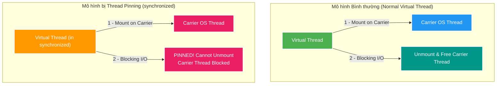

# 📌 Thread Pinning Deep-Dive: Native Monitors, Carrier Starvation & ReentrantLock Solution

Tài liệu phân tích sâu về hiện tượng **Thread Pinning** trong Java Virtual Threads: Nguyên nhân gốc rễ ở cấp độ Native C++ Stack của từ khóa `synchronized`, tại sao Pinning dẫn tới cạn kiệt Carrier Threads (Carrier Thread Starvation), và lý do kiến trúc của `ReentrantLock` (AQS on Heap) giải quyết triệt để vấn đề này.

---

## 1. Thread Pinning là gì?

**Thread Pinning** (định vị/gắn chặt thread) là hiện tượng một **Virtual Thread bị dính chặt vào Carrier OS Thread** bên dưới và **KHÔNG THỂ unmount** ngay cả khi Virtual Thread đụng phải một thao tác **Blocking I/O** (như chờ đĩa, chờ Database hay HTTP call).



---

## 2. Nguyên nhân Gốc rễ: Native C++ Object Monitor & OS Stack Frame

Tại sao từ khóa `synchronized` lại gây ra Thread Pinning còn `ReentrantLock` thì không? Câu trả lời nằm ở ranh giới giữa **Native OS Stack** và **Java Heap Memory**:

### 🔒 1. Bản chất của `synchronized` (Native C++ Monitor)
- `synchronized` là một tính năng gốc cấp thấp (low-level native feature) trong nhân JVM.
- Khi một Thread đi vào khối `synchronized`, JVM ghi nhận thông tin khóa (Object Monitor reference, Lock Record) trực tiếp lên **Native C++ Stack Frame** của OS Thread.
- Để unmount một Virtual Thread, JVM phải di chuyển (relocate) Call Stack của nó từ OS Stack sang RAM Heap dưới dạng một object gọi là **Continuation**.
- **Hạn chế của JVM hiện tại**: JVM chưa thể di chuyển các Native C++ Monitor Frames chứa con trỏ C++ trên OS Stack lên Heap. Do đó, JVM buộc phải **Pin (dính chặt)** Virtual Thread vào OS Thread đó cho tới khi thoát khỏi `synchronized`.

### 🗝️ 2. Bản chất của `ReentrantLock` (Pure Java AQS on Heap)
- `ReentrantLock` (trong gói `java.util.concurrent.locks`) được viết hoàn toàn 100% bằng code Java thuần dựa trên **AbstractQueuedSynchronizer (AQS)**.
- Trạng thái khóa (`state`) và danh sách các thread đang chờ (`Wait Queue`) của `ReentrantLock` là các **Java Objects nằm hoàn toàn trên RAM Heap**.
- Khi Virtual Thread không lấy được `ReentrantLock`, nó gọi `LockSupport.park()`. Do không có Native C++ Frame nào trên OS Stack, JVM **unmount** Virtual Thread một cách dễ dàng, cất Continuation lên Heap và giải phóng OS Thread ngay lập tức.

---

## 3. Tại sao Thread Pinning làm Sập Hiệu năng Hệ thống?

Hiện tượng này dẫn tới cạm bẫy **Carrier Thread Starvation (Cạn kiệt OS Carrier Threads)**:

1. Số lượng **Carrier OS Threads** bên dưới rất nhỏ (mặc định chỉ bằng đúng số lõi CPU, ví dụ: 8 Cores = 8 OS Threads trong `ForkJoinPool`).
2. Nếu có 8 Virtual Threads đồng thời đi vào khối `synchronized` và thực hiện Blocking I/O (ví dụ: gọi HTTP call mất 3 giây).
3. Cả 8 Virtual Threads này đều bị **Pinned** $\rightarrow$ Khóa cứng 100% số OS Carrier Threads khả dụng của JVM.
4. **Hậu quả**: Hàng ngàn Virtual Threads còn lại trong ứng dụng không còn bất kỳ OS Thread rảnh nào để nạp vào chạy. Toàn bộ hệ thống rơi vào trạng thái **đóng băng (Stuck/Hang)**.

---

## 4. Giải pháp & Refactoring Pattern

### ❌ KHÔNG NÊN: Dùng `synchronized` có chứa Blocking I/O
```java
public class LegacyService {
    // Gây Thread Pinning khi restTemplate chờ HTTP response!
    public synchronized String fetchData() {
        return restTemplate.getForObject("http://external-api/data", String.class);
    }
}
```

### ✅ NÊN DÙNG: Refactor sang `ReentrantLock`
```java
public class ModernService {
    private final ReentrantLock lock = new ReentrantLock();

    public String fetchData() {
        lock.lock();
        try {
            // Unmount an toàn khi gặp Blocking I/O!
            return restTemplate.getForObject("http://external-api/data", String.class);
        } finally {
            lock.unlock();
        }
    }
}
```

---

## 5. Phương pháp Phát hiện & Troubleshooting Thread Pinning

1. **Bật VM Option để phát hiện khi Dev/Local**:
   - Thêm cờ JVM: `-Djdk.tracePinnedThreads=short` (in stack trace ngắn khi có Thread Pinning) hoặc `-Djdk.tracePinnedThreads=full`.
2. **Theo dõi trên Production bằng Java Flight Recorder (JFR)**:
   - JFR tự động ghi nhận event **`jdk.VirtualThreadPinned`**.
   - Mở file `.jfr` bằng JDK Mission Control (JMC) để xem chính xác class và line number đang gây ra Pinning.
