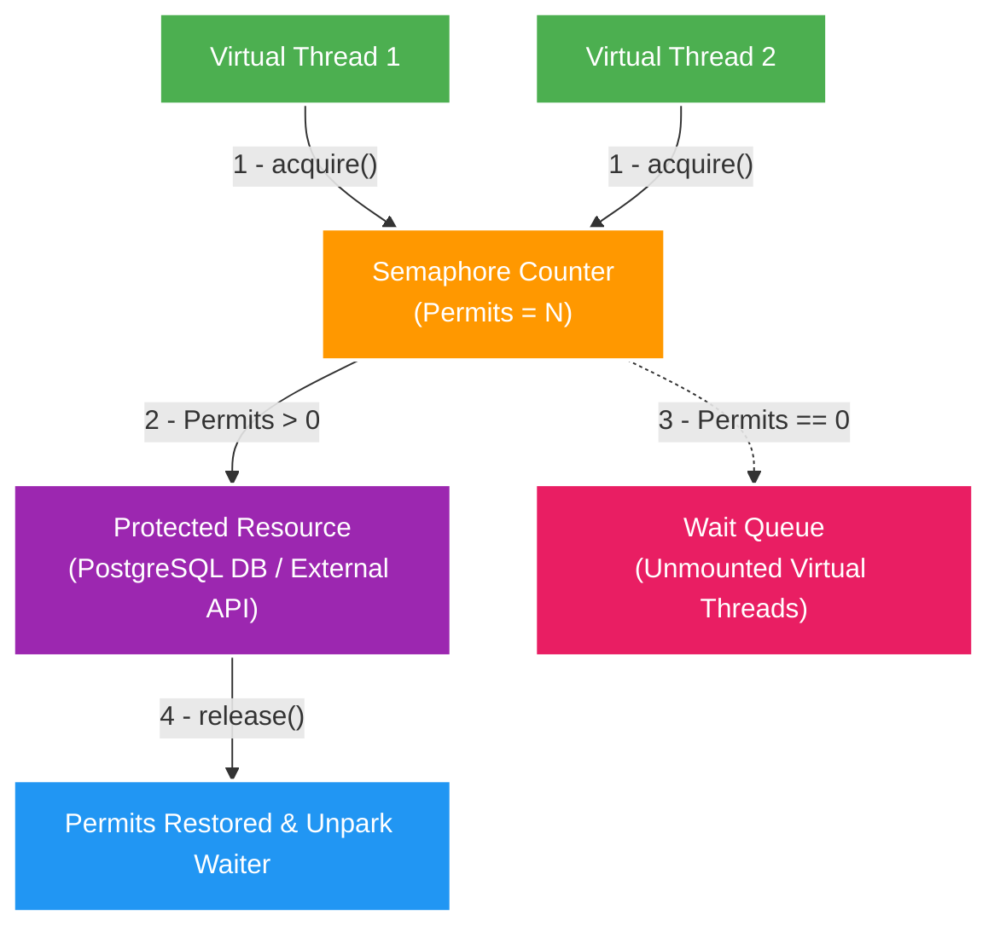

# 🎟️ Semaphore Deep-Dive: Concurrency Throttling & Resource Protection in Virtual Threads

Tài liệu phân tích chuyên sâu về **Semaphore**: Ý tưởng cốt lõi, cơ chế đồng bộ hóa dựa trên biến đếm (`Permits`), so sánh với Mutex/`ReentrantLock`, kiến trúc bên dưới AQS (AbstractQueuedSynchronizer), và cách sử dụng Semaphore làm "tấm lá chắn" bảo vệ Database/Downstream Services trong kỷ nguyên Virtual Threads (Java 21+ / JDK 25).

---

## 1. Khái niệm & Ý tưởng Cốt lõi của Semaphore

### 🧠 Định nghĩa Kỹ thuật
**Semaphore** (do nhà khoa học máy tính Edsger Dijkstra đề xuất năm 1965) là một công cụ đồng bộ hóa (**Synchronization Primitive**) dựa trên một **biến đếm nguyên (Permits Counter)**, dùng để **giới hạn số lượng Threads đồng thời được phép truy cập vào một tài nguyên dùng chung (Shared Resource)**.

### 🚗 Ví dụ Bãi Đỗ Xe (Intuitive Analogy)
- Một Bãi Đỗ Xe có **`N` chỗ đỗ** (tương ứng `N` Permits).
- Xe đi vào cổng $\rightarrow$ Gọi `acquire()` $\rightarrow$ Nếu còn chỗ (`Permits > 0`), cấp 1 vé và cho xe vào.
- Nếu hết chỗ (`Permits == 0`) $\rightarrow$ Các xe tiếp theo phải đứng xếp hàng chờ ngoài cổng.
- Một xe đi ra $\rightarrow$ Gọi `release()` $\rightarrow$ Trả 1 vé, cho phép chiếc xe đứng đầu hàng chờ đi vào.



---

## 2. Thao tác Nguyên tử: `acquire()` vs `release()`

Semaphore hoạt động dựa trên 2 phương thức nguyên tử (**Atomic Operations**):

1. **`acquire()` (Giảm Counter)**:
   - Giảm số `Permits` đi 1.
   - Nếu `Permits > 0`: Thread được tiếp tục thực thi ngay lập tức.
   - Nếu `Permits == 0`: Thread bị **tạm dừng (parked/blocked)** và chuyển vào Wait Queue.
2. **`release()` (Tăng Counter)**:
   - Tăng số `Permits` lên 1.
   - Đồng thời phát tín hiệu đánh thức (**unpark/notify**) một Thread đang xếp hàng chờ ở cổng vào để chạy tiếp.

---

## 3. So sánh: Semaphore vs. Mutex / `ReentrantLock`

| Tiêu chí | Mutex / Lock (`ReentrantLock`) | Semaphore (`java.util.concurrent.Semaphore`) |
| :--- | :--- | :--- |
| **Số lượng Threads cho phép** | **Chỉ ĐÚNG 1 Thread** tại một thời điểm (`Permits = 1`). | Cho phép **N Threads** cùng truy cập (`Permits = N`). |
| **Tính sở hữu (Ownership)** | Thread nào gọi `lock()` thì **chính Thread đó phải gọi `unlock()`**. | Thread A gọi `acquire()` nhưng Thread B hoàn toàn có thể gọi `release()`. |
| **Bài toán ứng dụng** | Bảo vệ Mutual Exclusion (Đồng bộ hóa dữ liệu dùng chung). | **Concurrency Throttling / Rate Limiting** (Giới hạn tải concurrent). |

---

## 4. Tại sao Semaphore là "Lá Chắn" Số 1 cho Virtual Threads?

### 🚨 Vấn đề Concurrency Surge của Virtual Threads
Trong Java 21+, việc tạo ra **1,000,000 Virtual Threads** rất dễ dàng. Tuy nhiên:
- **Database (PostgreSQL / HikariCP Pool)** chỉ chịu được tối đa 10 - 50 connections.
- **External Web API** chỉ chịu được 100 concurrent requests.
- Vì ta **không dùng Thread Pool cho Virtual Threads** (không dùng Pool Size để giới hạn), nếu 100,000 Virtual Threads cùng xả vào Database, HikariCP sẽ bị sập lập tức (**Database Connection Exhaustion**).

### 🛡️ Giải pháp Semaphore:
- Dùng `Semaphore(10)` bọc xung quanh câu lệnh truy vấn Database.
- Chỉ cho đúng 10 Virtual Threads đụng vào Database cùng một lúc.
- 99,990 Virtual Threads thừa sẽ bị `Semaphore.acquire()` hãm lại.
- **Đặc biệt**: `java.util.concurrent.Semaphore` được xây dựng dựa trên **AQS (AbstractQueuedSynchronizer)**. Khi Virtual Thread bị chờ ở `acquire()`, JVM sẽ **unmount Virtual Thread đó một cách an toàn mà KHÔNG bị Thread Pinning và KHÔNG tốn OS Thread nào**!

---

## 5. Pattern Code Chuẩn trong Spring Boot

```java
@Service
public class ScanDatabaseIngestionService {

    // Chỉ cho phép tối đa 10 Virtual Threads ghi nhận dữ liệu xuống scan_db cùng lúc
    private final Semaphore dbConcurrencySemaphore = new Semaphore(10);

    public void processProposalIngestion(UUID proposalId) throws InterruptedException {
        // 1. Xin vé (Nếu đủ 10 Threads -> Virtual Thread tự unmount đứng chờ)
        dbConcurrencySemaphore.acquire();
        try {
            // 2. Thao tác I/O an toàn xuống PostgreSQL
            executeDatabaseTransaction(proposalId);
        } finally {
            // 3. BẮT BUỘC release trong khối finally để chống rò rỉ Permit
            dbConcurrencySemaphore.release();
        }
    }
}
```

---

## 6. Best Practices & Cạm bẫy cần tránh

1. **BẮT BUỘC gọi `release()` trong khối `finally`**:
   - Nếu xảy ra Exception trong khối try mà không có `finally { semaphore.release(); }`, Permit sẽ bị **rò rỉ (Permit Leak)** vĩnh viễn, làm cạn kiệt cổng vào của hệ thống.
2. **Sử dụng `tryAcquire()` với Timeout**:
   - Để tránh Virtual Thread đứng chờ vô tận khi hệ thống quá tải, dùng `semaphore.tryAcquire(5, TimeUnit.SECONDS)`. Nếu quá 5s không có vé, trả về lỗi `HTTP 429 Too Many Requests` hoặc `HTTP 503 Service Unavailable` cho Client.
3. **Cấu hình Fair vs. Non-Fair Mode**:
   - `new Semaphore(10, true)` (Fair Mode): Đảm bảo các Threads xếp hàng theo thứ tự FIFO (First In First Out), tránh Thread Starvation nhưng Throughput thấp hơn một chút.
   - `new Semaphore(10, false)` (Non-Fair Mode - Mặc định): Cho phép Thread mới đến cướp vé nếu có rảnh, Throughput cao hơn.
