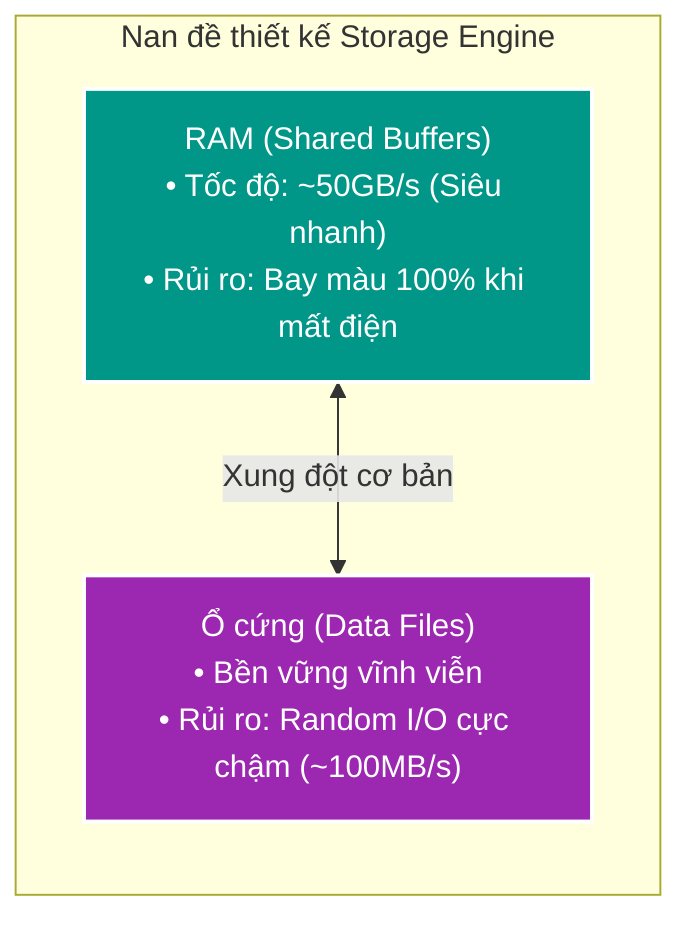
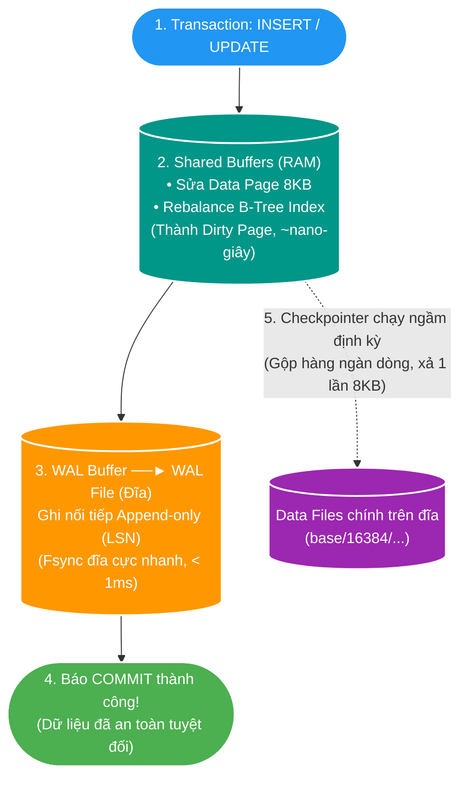
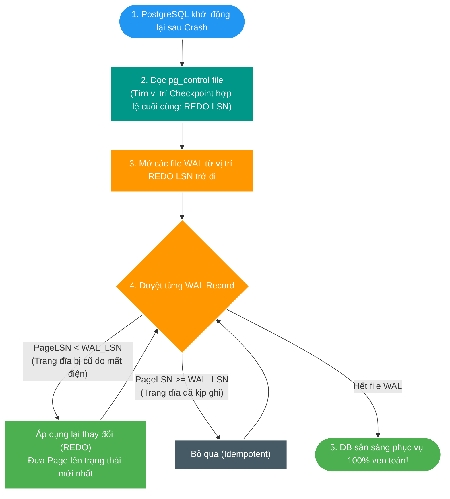
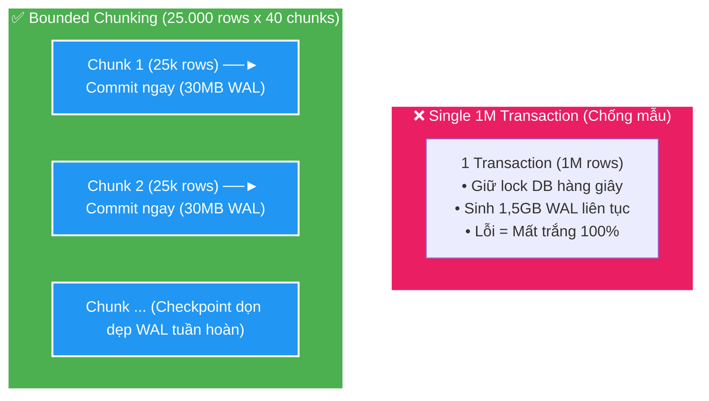

# 📜 Deep-dive: Write-Ahead Logging (WAL) & Database Storage Engine Internals

> **Mục tiêu học tập**: Hiểu bản chất sâu xa từ First Principles về cách Database (PostgreSQL) quản lý bộ nhớ (Shared Buffers), cơ chế ghi nhật ký trước (Write-Ahead Logging), vòng đời Checkpointing, nguyên nhân phình to WAL và giải pháp Bounded Chunking trong các hệ thống quy mô lớn.  
> **Áp dụng dự án**: `file_mngt_microservice` (PostgreSQL 17 / SC-01 Scale 1M records).

---

## 1. D0 — Bản chất vấn đề: Nan đề Hiệu năng vs Độ bền vững (Durability)

Trong thiết kế hệ quản trị cơ sở dữ liệu quan hệ (RDBMS), mọi kiến trúc sư đều phải đối mặt với một mâu thuẫn vật lý cơ bản:

1. **Nếu ghi trực tiếp xuống Data Files mỗi khi Commit**:
   - Dữ liệu trong database không phải là văn bản phẳng mà được tổ chức thành các khối cố định **Data Pages (8KB)** và các cây phân nhánh **B-Tree Index Pages**.
   - Mỗi lệnh `INSERT 1 dòng` 100 bytes sẽ buộc DB phải tìm và ghi ngẫu nhiên (Random Write) vào 1 Table Page và 2–4 Index Pages $\implies$ **Tốn 4–5 lần Random I/O đĩa**.
   - Tốc độ toàn hệ thống sẽ bị bóp nghẹt, chỉ đạt tối đa vài trăm đến vài ngàn transaction/giây.
2. **Nếu chỉ ghi trên RAM để đạt tốc độ cao**:
   - Khi server bị sập nguồn đột ngột, toàn bộ dữ liệu chưa kịp ghi xuống đĩa sẽ biến mất vĩnh viễn $\implies$ **Vi phạm nghiêm trọng tính Bền vững (Durability - chữ D trong ACID)**.

---

## 2. D1 — Từ vựng & Mental Model cốt lõi

| Thuật ngữ | Định nghĩa & Trách nhiệm trong Database Kernel |
| :--- | :--- |
| **Shared Buffers / Buffer Pool** | Vùng nhớ RAM chuyên dụng của PostgreSQL dùng để nạp và sửa đổi các Data Pages. Mọi thao tác đọc/ghi đều phải qua đây. |
| **Data Page (Block 8KB)** | Đơn vị lưu trữ cơ bản nhất của PostgreSQL trên đĩa và RAM, chứa các bản ghi (tuples) và header. |
| **Dirty Page** | Trang dữ liệu trên RAM đã bị sửa đổi (có dữ liệu mới) nhưng **chưa được ghi đồng bộ** xuống file dữ liệu chính trên đĩa. |
| **WAL (Write-Ahead Log)** | File nhật ký chỉ ghi nối tiếp (Sequential Append-Only) trên đĩa, ghi lại từng byte thay đổi của các Data Pages trước khi trang đó được xả xuống đĩa. |
| **LSN (Log Sequence Number)** | Mã số byte 64-bit tăng dần đơn điệu, định danh vị trí chính xác của từng bản ghi nhật ký trong chuỗi WAL. |
| **Checkpointer** | Tiến trình chạy ngầm của PostgreSQL, có nhiệm vụ định kỳ gom tất cả Dirty Pages trên RAM xả xuống file dữ liệu chính trên đĩa. |

### 🧠 Mental Model tổng thể:

> **Bản chất trong 1 câu**: *WAL biến thao tác ghi dữ liệu ngẫu nhiên phức tạp trên đĩa thành một thao tác ghi nhật ký nối tiếp siêu tốc, lấy RAM làm xưởng chế tạo và lấy Checkpointer làm công nhân dọn dẹp chạy nền.*

---

## 3. D2 — Cơ chế Runtime chi tiết: Từ Lệnh INSERT đến Đĩa cứng

### Bước 1: Sửa đổi trên RAM (Buffer Management)
- Khi có lệnh `INSERT INTO scan_decision`:
  1. Engine tìm Data Page chứa bảng trong **Shared Buffers**. Nếu chưa có, nạp 8KB từ đĩa lên RAM.
  2. Ghi bản ghi mới vào Data Page trên RAM. Trang này lập tức bị đánh dấu là **Dirty Page**.
  3. Cập nhật các cây B-Tree Index tương ứng trên RAM.
  4. Gán mã số **LSN mới** vào phần Header của Page.

### Bước 2: Ghi nhật ký WAL (The Write-Ahead Rule)
- Engine tạo một bản ghi WAL Record mô tả ngắn gọn sự thay đổi:  
  `[LSN: 0/16B3A88, Page: 142, Offset: 24, Data: 'APPROVE', XID: 5012]`.
- Bản ghi này được đẩy vào **WAL Buffers** trên RAM và lập tức gọi lệnh hệ điều hành `fsync()` để đẩy xuống file vật lý `pg_wal/000000010000000000000001` trên đĩa.
- **Quy tắc bất di bất dịch (Write-Ahead Invariant)**:  
  $$\text{LSN}_{\text{WAL on Disk}} \ge \text{LSN}_{\text{Dirty Page in RAM}}$$
  *(Không bao giờ được phép ghi một Dirty Page xuống đĩa nếu bản ghi WAL tương ứng của nó chưa được flush xuống đĩa trước).*

### Bước 3: Hoàn tất Transaction (Commit Phase)
- Ngay khi bản tin WAL đã nằm an toàn trên đĩa cứng, PostgreSQL trả về tín hiệu `COMMIT OK` cho ứng dụng Java/Spring Boot.
- Toàn bộ quá trình chỉ mất **$< 1\text{ms}$** vì ghi tuần tự (Sequential I/O) tận dụng 100% băng thông của ổ cứng SSD.

### Bước 4: Checkpointing & Write Coalescing (Tiết kiệm I/O)
- Nếu có **1.000 lệnh INSERT** diễn ra liên tiếp rơi vào cùng 1 Data Page 8KB:
  - 1.000 lệnh này đều sửa trên cùng 1 trang RAM trong tích tắc.
  - Khi tiến trình **Checkpointer** thức giấc: Nó chỉ cần ghi đúng **1 lần 8KB** xuống file dữ liệu chính trên đĩa!  
  $\implies$ **Tiết kiệm 99,9% số lần ghi đĩa (Write Coalescing).**

---

## 4. D3 — Phục hồi dữ liệu sau sự cố (Crash Recovery / REDO)

Điều gì xảy ra nếu server bị rút phích cắm đột ngột khi các Dirty Pages trên RAM chưa kịp ghi xuống Data Files?

- **Tính lũy đẳng (Idempotency)**: Nhờ có mã số LSN trên từng Page Header, tiến trình Crash Recovery biết chính xác trang nào đã có dữ liệu, trang nào bị thiếu để đắp vào, không bao giờ bị ghi đè trùng lặp.

---

## 5. D4 — Rủi ro phình to WAL & Vấn đề trong bài toán 1M Records (SC-01)

### 💥 Tại sao 1 Transaction 1.000.000 dòng lại nguy hiểm?

File WAL trong PostgreSQL được chia thành các file segment cố định **16MB**. Khi một transaction khổng lồ chạy:

1. **Khóa Checkpoint Truncation**: Trong suốt thời gian transaction chưa `COMMIT`, PostgreSQL **bắt buộc phải giữ lại toàn bộ các file WAL** liên quan để phòng trường hợp ứng dụng gọi `ROLLBACK`.
2. **Bùng nổ băng thông I/O (WAL Generation Spike)**:
   - 1 triệu records insert dồn dập trong 2 giây $\implies$ sinh ra **$\sim 1,5\text{GB}$ WAL log** (tốc độ ghi $750\text{MB/s}$).
   - Băng thông ổ đĩa bị nghẽn cứng, các câu query `SELECT` của service khác bị **I/O Wait** và vọt P99 latency.
3. **Checkpoint Stall (Đóng băng DB)**:
   - Mặc định `max_wal_size = 1GB`. Khi dung lượng WAL vượt ngưỡng này, Postgres kích hoạt **Forced Checkpoint**, ép toàn bộ Dirty Pages xả xuống đĩa ngay lập tức $\implies$ Toàn bộ hệ thống bị đứng hình (I/O Freeze).
4. **Replication Lag**: 1,5GB WAL phải đẩy qua mạng sang Standby replica làm nghẽn card mạng.

---

## 6. Giải pháp kiến trúc: Bounded Chunking (BT-09B) trong Backend V2

Để giải quyết triệt để vấn đề phình to WAL mà vẫn đạt mục tiêu SLO 30 giây, dự án áp dụng chiến lược **Bounded Chunking 25.000 records**:

### 🎯 4 Lợi ích vàng của Chunk 25.000 records:
1. **WAL Ổn định**: Mỗi chunk chỉ sinh $\sim 30\text{MB}$ WAL rồi commit ngay sau $90\text{ms}$, Postgres tái sử dụng file segment liên tục, không bao giờ phình to đĩa.
2. **Khả năng Resume**: Lỗi ở chunk 35 thì 34 chunk trước (850k rows) đã an toàn, chỉ cần chạy tiếp chunk 35.
3. **Pipelining sang Kafka**: Chunk 1 commit xong là Outbox Relay xả ngay sang Kafka cho Catalog và Query xử lý gối đầu, không cần đợi 1 triệu dòng.
4. **Hiệu năng đỉnh cao**: 40 chunks $\times 90\text{ms} = \mathbf{3,6\text{ giây}}$, hoàn thành xuất sắc ngân sách 5s của Scan!

---

## 7. Bảng quyết định cấu hình WAL trong Production (PostgreSQL 17)

| Tham số cấu hình | Giá trị tối ưu (High Throughput) | Ý nghĩa kỹ thuật |
| :--- | :--- | :--- |
| `wal_level` | `replica` | Đủ cho HA/Replication, không bật `logical` nếu không dùng CDC Debezium để giảm 40% dung lượng WAL. |
| `synchronous_commit` | `on` (mặc định) / `local` | Đảm bảo an toàn đĩa cục bộ trước khi trả lời ứng dụng. |
| `max_wal_size` | `16GB` – `32GB` | Cho phép tích lũy WAL nhiều hơn trong các đợt bulk load lớn, tránh kích hoạt Forced Checkpoint quá sớm. |
| `checkpoint_completion_target` | `0.9` | Trải đều thời gian xả đĩa trong 90% chu kỳ checkpoint, triệt tiêu hiện tượng I/O Spike đột ngột. |
| `wal_buffers` | `64MB` | Vùng đệm WAL trên RAM đủ lớn để chứa trọn vẹn 1 chunk 25k records trước khi flush đĩa. |

---

## 8. Cầu nối Phỏng vấn Senior / Principal Database Engineer

### 💬 Câu hỏi 1: *"Tại sao PostgreSQL không ghi thẳng dữ liệu vào Table File mà phải qua WAL?"*
- **Trả lời**: *"Vì ghi vào Table File và Index là Random I/O trên các Page 8KB phân tán, rất chậm. WAL là Append-only Sequential I/O, tốc độ đạt tối đa băng thông đĩa. Database sửa trên RAM (Shared Buffers) trong vài nano-giây, ghi 1 dòng nhật ký ngắn vào WAL để đảm bảo Durability (ACID), rồi để Checkpointer gom hàng ngàn thay đổi xả xuống đĩa một lần (Write Coalescing)."*

### 💬 Câu hỏi 2: *"Một batch insert 1 triệu dòng gây ảnh hưởng gì đến WAL và hệ thống?"*
- **Trả lời**: *"Nó giữ transaction quá lâu, ngăn Checkpointer dọn dẹp các WAL segments cũ, làm phình to đĩa. Tốc độ sinh WAL dồn dập gây I/O bottleneck, kích hoạt Forced Checkpoint làm đơ DB, và tăng Replication Lag sang máy Standby. Giải pháp là chia nhỏ thành Bounded Chunks (20k–50k rows) với `REQUIRES_NEW` để commit từng đợt, vừa giải phóng WAL vừa kích hoạt stream processing gối đầu."*
