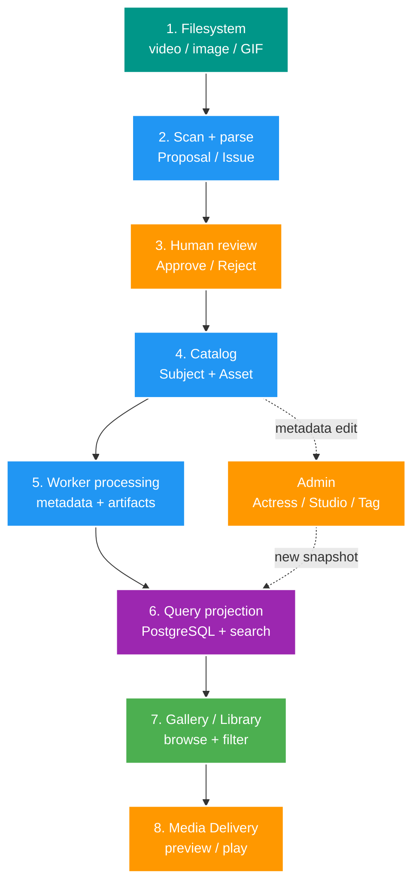
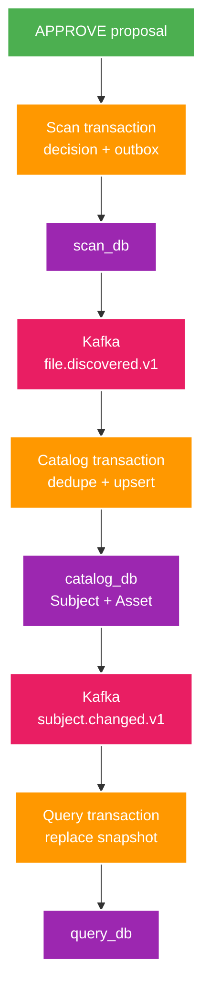
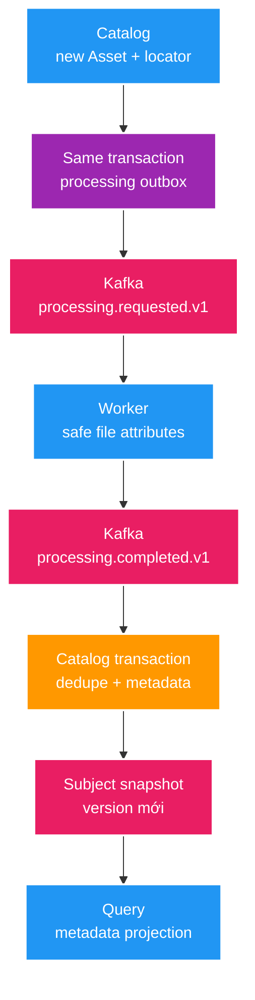
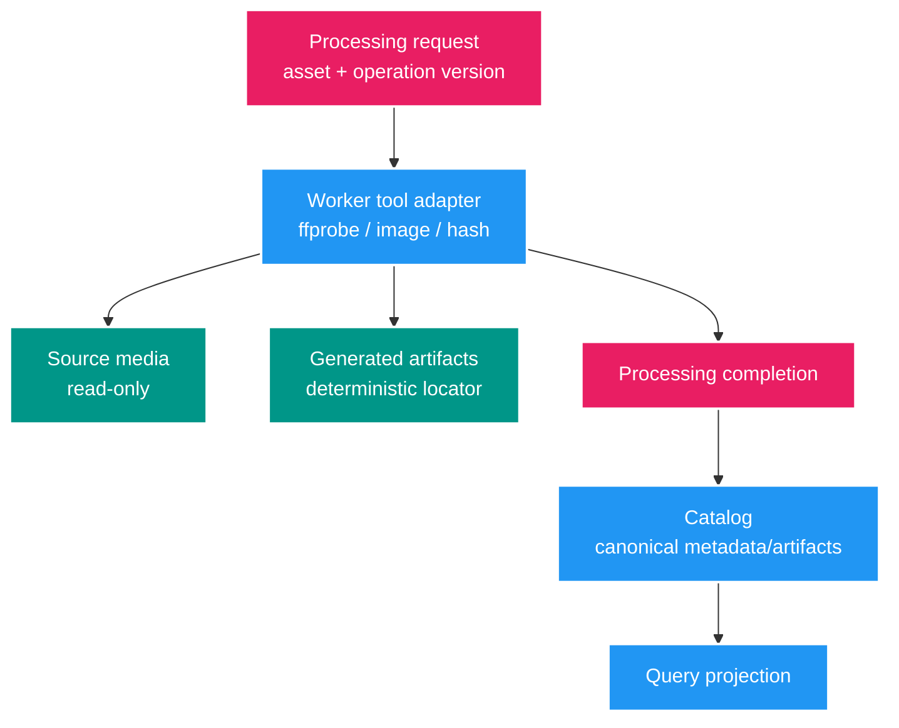
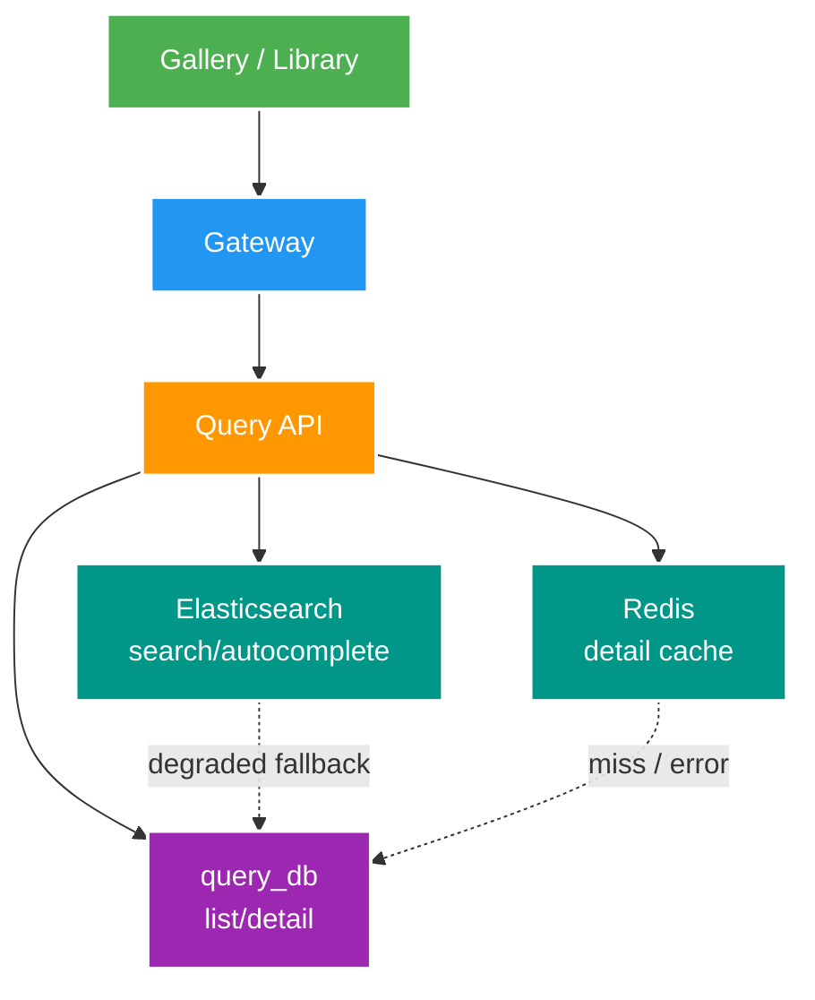
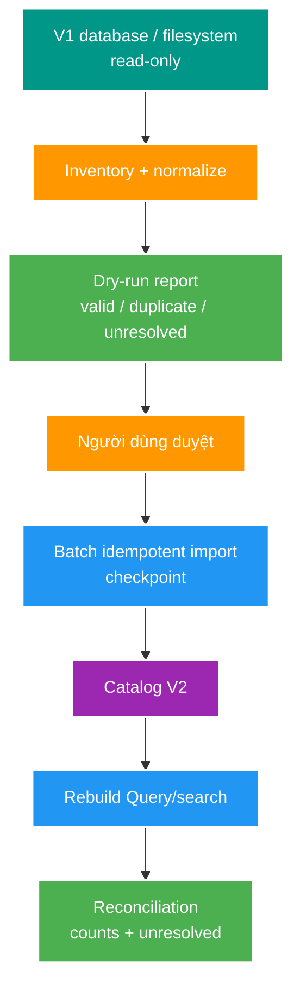

# 3. Use Cases và Data Flow (System Overview)

> 📌 **Tài liệu Nguồn chuẩn Features & Specs (SSOT)**:
> Để xem chi tiết thiết kế kỹ thuật của các Feature đã và đang triển khai, tham khảo:
> - 📂 **[Danh mục các Features đang làm (`docs/features/`)](../../../docs/features/)**
> - 📄 **[Thiết kế Scan Preview (FT004)](../../../docs/features/004-scan-preview/02-design.md)**
> - 📄 **[Trạng thái Dự án Hiện tại (`docs/STATUS.md`)](../../../docs/STATUS.md)**

Chương này mô tả cả hệ thống hiện tại lẫn đích dự kiến. Nhãn trạng thái:

- **ĐÃ CÓ**: code/runtime hiện tại đã hỗ trợ.
- **FT013**: đã có Plan `READY`, chưa code.
- **ROADMAP**: có trong kế hoạch kiến trúc nhưng chưa thành feature chi tiết.
- **BUSINESS TARGET**: nhu cầu đích đã biết, contract/database còn phải thiết kế.

## Bản đồ use case đầy đủ

| Nhóm | Use case | Trạng thái | Owner chính |
| --- | --- | --- | --- |
| Ingestion | Cấu hình root/profile | ĐÃ CÓ | Scan / Media Worker config |
| Ingestion | Scan preview, Proposal và Issue | ĐÃ CÓ | Scan |
| Review | Approve/Reject proposal | ĐÃ CÓ | Scan |
| Canonical | Hội tụ file thành Subject/Asset | ĐÃ CÓ | Catalog |
| Processing | Đọc size/MIME/last-modified | FT013 | Media Worker + Catalog |
| Processing | Duration/resolution/codec | ROADMAP | Media Worker |
| Processing | Thumbnail, GIF preview, hash | ROADMAP | Media Worker + Catalog |
| Read | List/detail/filter/order/pagination | ĐÃ CÓ nền | Query |
| Search | Full-text/fuzzy/autocomplete | ĐÃ CÓ nền | Query + Elasticsearch |
| Delivery | GET/HEAD/Range video, ảnh, GIF | ĐÃ CÓ | Media Worker |
| Metadata | Quản lý Actress/Studio/Tag/alias | BUSINESS TARGET | Catalog/Admin |
| Album | Review và liên kết `FULL_ALBUM_OF` | BUSINESS TARGET | Catalog/Admin |
| Migration | Dry-run/import/reconcile dữ liệu V1 | ROADMAP Phase 7 | Importer + Catalog |
| Recovery | Rebuild Query/search projection | ĐÃ CÓ một phần | Query |
| Operations | Metrics, trace và ELK end-to-end | ROADMAP Phase 8 | Toàn hệ thống |
| Frontend | Gallery V2 parity và cutover | DRAFT, làm sau backend | Gallery V2 |

## Toàn bộ lifecycle dự kiến của một media



Các bước 1–4, 6 nền và 8 đã có. FT013 hoàn thành phần đầu của bước 5. Metadata Admin và processing artifact đầy đủ chưa có contract V2.

## UC01 — Cấu hình root và profile (ĐÃ CÓ)

Mục tiêu: hệ thống biết một tên root logic trỏ tới folder nào và phải parse bằng luật nào.

Ví dụ:

```text
rootKey: fixture-joke-video
profile: JOKE_VIDEO
local path: D:/.../tests/fixtures/scan/joke-video
```

- API/event chỉ mang `rootKey`/`storageKey` và relative path.
- Absolute path chỉ nằm trong cấu hình local.
- Scan dùng profile để parse; Worker dùng root registry để đọc file.
- Cùng một key phải trỏ đúng cùng nguồn logic ở các service cần đọc nó.

## UC02 — Scan preview (ĐÃ CÓ)

1. Client gửi `rootKey`.
2. Scan tạo `scan_run` trạng thái `RUNNING` rồi trả `202`.
3. Background task duyệt regular files, bỏ symlink.
4. File parse được tạo `scan_proposal`; file không hiểu tạo `scan_issue`.
5. Run kết thúc `COMPLETED` hoặc `FAILED`, cập nhật counters.

Catalog không thay đổi trong use case này. Người dùng có thể xem proposal/issue trước khi quyết định.

## UC03 — Review và canonical ingestion (ĐÃ CÓ)



### Approve

- Scan ghi Decision và outbox cùng transaction.
- Catalog dedupe event rồi tìm/tạo Subject theo `(region, subjectType, identityKey)`.
- Nếu locator chưa có, Catalog thêm Asset.
- Catalog phát full Subject snapshot; Query chỉ áp dụng version mới hơn.

### Reject

- Scan chỉ ghi `scan_decision = REJECT`.
- Không có discovery event, Catalog và Query không thay đổi.

### Tính nhất quán

API approve trả khi Scan transaction xong, không đợi Catalog/Query. Dữ liệu đọc có thể xuất hiện sau một khoảng ngắn; E2E phải poll có timeout thay vì giả định xuất hiện ngay.

## UC04 — Technical metadata foundation (FT013)



Kết quả FT013: `contentLength`, `mediaType`, `sourceLastModifiedAt` và metadata version xuất hiện ở Catalog rồi hội tụ sang Query.

Worker không có database trong feature này. Đọc lại file là an toàn; completion có identity ổn định và Catalog dedupe.

## UC05 — Processing media đầy đủ (ROADMAP sau FT013)

Đây là hướng dự kiến, chưa có feature/contract cuối cùng:

1. Đọc deep metadata: duration, width/height, codec, frame rate khi có giá trị cho UI.
2. Tính content hash để hỗ trợ nhận diện duplicate/integrity.
3. Tạo thumbnail cho video/ảnh khi cần derivative riêng.
4. Tạo GIF/video preview với policy giới hạn dung lượng/thời lượng.
5. Ghi artifact an toàn bằng temp file + atomic move; retry không tạo nhiều bản khác nhau.
6. Catalog nhận completion và lưu locator/role/technical metadata của artifact canonical.
7. Query nhận snapshot mới để Gallery dùng thumbnail/GIF mà không tự suy diễn path.



Các quyết định còn phải chốt sau FT013: artifact root/layout, reprocessing policy, tool timeout, cleanup file lỗi và liệu Worker có cần durable job state hay không.

## UC06 — Browse, filter và search (ĐÃ CÓ nền, sẽ mở rộng)



Hiện đã có subject list/detail, filter nền, full-text/fuzzy/autocomplete, PostgreSQL fallback và Redis detail cache. Sau khi business metadata đầy đủ, Query dự kiến mở rộng filter/order theo Actress, Studio, Tag, media dimensions, availability và Album relation.

## UC07 — Direct media delivery (TARGET theo ADR-005)

1. Browser nhận `mediaUrl` do V2 tạo từ asset locator và root map đáng tin cậy.
2. Browser gọi trực tiếp Nginx bằng URL tương thích V1 `/files/<drive>:/...`.
3. Nginx resolve URL bằng `alias` read-only rồi tự phục vụ full response, HEAD hoặc byte range.
4. Media Worker chỉ dùng `storageKey + relativePath` cho processing nền, không nằm trên đường phát file.
5. Nginx tự trả MIME/header phù hợp.

`Range` cho phép video player tải từng đoạn. Frontend không nhận raw filesystem path.

## UC08 — Metadata management (BUSINESS TARGET)

Mục tiêu dự kiến:

- Admin xem Subject/Asset canonical.
- Gắn/sửa Actress, Studio, Title, Code, Tag và alias.
- Merge/split/relink có review, không đoán khi ambiguous.
- Catalog transaction cập nhật metadata và phát snapshot/version mới.
- Query cập nhật filter/search; Gallery chỉ đọc read model.

Database/API cụ thể chưa được feature hóa. Không nên code table Actress/Studio/Tag từ manual này trước khi có Brief/Design riêng.

## UC09 — USE Album linking (BUSINESS TARGET)

- Scan tạo ALBUM Subject theo folder.
- Hệ thống có thể đề xuất candidate `FULL_ALBUM_OF` tới Syncdroid VIDEO.
- Người dùng review candidate.
- Approve tạo relation giữa hai Subject, không merge Asset/Subject.
- Query projection cho phép đi từ video sang full album và ngược lại.

Candidate evidence và relation schema vẫn cần feature riêng.

## UC10 — Import/backfill V1 (ROADMAP Phase 7)



Import không sửa/xóa V1. Thứ tự rollout dự kiến: fixture → pilot root → JOKE video → JOKE assets → USE video/assets → USE Album.

## UC11 — Recovery và rebuild (ĐÃ CÓ một phần)

- Elasticsearch index có thể rebuild từ `query_db` rồi chuyển alias atomically.
- Redis detail cache có thể mất/xóa; request sẽ đọc PostgreSQL và cache lại.
- Query projection đầy đủ từ Catalog cần event replay hoặc rebuild endpoint/snapshot source hoàn chỉnh hơn; đây còn là gap trước cutover lớn.
- DLT cần thao tác xem/replay có kiểm soát, không replay mù.

## UC12 — Observability và performance (ROADMAP Phase 8)

- Correlation ID xuyên HTTP và sau đó Kafka.
- Metrics HTTP/Kafka lag/cache/DB pool/processing duration.
- Trace OpenTelemetry xuyên Gateway → service → Kafka.
- Prometheus/Grafana cho metrics; ELK cho structured logs.
- JFR/JMC, benchmark và load test sau khi có baseline.

Observability không thay đổi business state và lỗi log shipping không được chặn request.

## UC13 — Frontend cutover (DRAFT, sau backend parity)

1. Media Library/Gallery V2 gọi Gateway, không gọi trực tiếp database/search engine.
2. Query DTO map sang V2 view model; không ép backend giả shape V1.
3. Chạy V1 và V2 song song theo URL riêng.
4. Pilot dataset rồi đối chiếu count, filter, card fields, preview/player.
5. Chỉ opt-in/cutover khi backfill, processing và parity gate đạt; V1 vẫn là rollback.

## Khi nào dùng HTTP, khi nào dùng Kafka?

| Tình huống | Cơ chế | Lý do |
| --- | --- | --- |
| UI cần response ngay | HTTP qua Gateway | Request/response trực tiếp |
| Worker cần locator để phát file | HTTP Worker → Catalog | Cần trạng thái hiện tại ngay |
| Scan đã approve file | Kafka event | Catalog xử lý độc lập |
| Catalog thay đổi Subject | Kafka snapshot | Query tự hội tụ |
| Xử lý file nền | Kafka work queue | Không chặn API/UI |
| Operation/admin cần xác nhận ngay | HTTP command | Người dùng cần kết quả rõ |

Kafka không được dùng chỉ để “trông giống microservice”.

## Failure map

| Điểm lỗi | Hành vi |
| --- | --- |
| Parser không hiểu file | Tạo Issue, không đoán |
| Outbox publish lỗi | Row vẫn pending, tăng attempt/error |
| Kafka giao event trùng | Consumer dedupe/no-op |
| Consumer lỗi nhiều lần | Record sang `.DLT` |
| Worker root/path/file lỗi | Retry hữu hạn rồi DLT; không lộ absolute path |
| Elasticsearch lỗi | Query fallback PostgreSQL và báo degraded |
| Redis lỗi | Detail đọc PostgreSQL |
| Import ambiguous | Report unresolved, không tự apply |

## E2E sau FT013 cần chứng minh gì?

Một fixture được scan và approve phải:

1. Tạo đúng một Subject/Asset canonical.
2. Tạo processing request.
3. Được Worker đọc metadata.
4. Cập nhật Catalog đúng một lần về mặt hiệu lực.
5. Hội tụ metadata sang Query.
6. Chạy lại không tạo duplicate Asset hoặc side effect khác.

Thumbnail/GIF/hash, metadata management và import V1 cần E2E riêng khi feature tương ứng được thiết kế.
