# 🚀 Khung Tư Duy Kiến Trúc PRD-Ready (Production Readiness Framework)

Tài liệu cô đọng giúp thay đổi tư duy từ **"Code chạy được" (MVP)** sang **"Hệ thống sẵn sàng Production" (Enterprise PRD-Ready)**.

---

## 🏛️ Bức Tranh Toàn Cảnh: 4 Trụ Cột PRD-Ready

```mermaid
flowchart TB
    subgraph TOTAL["<font color='white'>ENTERPRISE PRD-READY SYSTEM</font>"]
        direction TB
        P1["<font color='white'>1. Application Architecture<br/>(S-C-A-L-E Framework)</font>"]
        P2["<font color='white'>2. Infrastructure & HA<br/>(Triển khai & Hạ tầng)</font>"]
        P3["<font color='white'>3. Security & DR<br/>(Bảo mật & Backup)</font>"]
        P4["<font color='white'>4. Observability & SRE Ops<br/>(Vận hành & Cảnh báo)</font>"]
    end

    style P1 fill:#1e293b,stroke:#3b82f6,stroke-width:2px
    style P2 fill:#0f172a,stroke:#10b981,stroke-width:2px
    style P3 fill:#312e81,stroke:#8b5cf6,stroke-width:2px
    style P4 fill:#451a03,stroke:#f59e0b,stroke-width:2px
```



---

## 🧠 Part 1: Khung Tư Duy 5 Trục S-C-A-L-E (Dành cho Dev & Lead)

Mỗi khi viết hoặc review code, đóng vai **"Kẻ phá hoại"** và tự hỏi 5 câu hỏi này:

### 1. **S — Scale & Concurrency (Tải & Đa tiến trình)**
- ❓ **Hỏi**: *"Nếu có 10 Pods cùng chạy đoạn code này hoặc dataset nhân lên $100\times$ thì sao?"*
- 💡 **Checklist**:
  - [ ] Multi-Node Race Condition: Dùng `FOR UPDATE SKIP LOCKED` hoặc `ShedLock (Redis)`.
  - [ ] DB Connection Pool Starvation: Tách I/O đĩa ra khỏi DB Transaction; dùng `Batch Insert`.
  - [ ] Pagination: Dùng `Keyset Pagination (WHERE id > last_id)` thay cho `OFFSET`.

### 2. **C — Crashes & Network Failures (Đứt mạng & Server sập)**
- ❓ **Hỏi**: *"Nếu API bên kia bị chậm 10s hoặc server bị `kill -9` giữa chừng thì sao?"*
- 💡 **Checklist**:
  - [ ] Cascading Failure: Bọc HTTP Client bằng `Resilience4j Circuit Breaker + TimeLimiter`.
  - [ ] Mất dữ liệu: Áp dụng `Transactional Outbox Pattern` (Ghi DB local trước khi gửi Queue).

### 3. **A — Anomalies & Poison Pills (Dữ liệu dị tật & Yêu cầu trùng)**
- ❓ **Hỏi**: *"Nếu 1 tin nhắn hỏng JSON rơi vào Queue hoặc User bấm nút 2 lần thì sao?"*
- 💡 **Checklist**:
  - [ ] Head-of-Line Blocking: Cấu hình `Dead Letter Queue (DLQ/DLT)` đẩy message lỗi sang topic riêng sau 3 retries.
  - [ ] Duplicate Request: Xây dựng `Idempotent Key (bảng processed_event)`.

### 4. **L — Logging & Observability (Khả năng truy vết)**
- ❓ **Hỏi**: *"Nửa đêm bị lỗi trên Production, làm sao vết 1 request qua 4 Microservices?"*
- 💡 **Checklist**:
  - [ ] Distributed Tracing: Nhúng `X-Correlation-ID` vào cả HTTP Header lẫn `Kafka Record Header`.

### 5. **E — Eviction & Housekeeping (Dọn dẹp rác)**
- ❓ **Hỏi**: *"Bảng phụ / Dữ liệu tạm này có sống vĩnh viễn không? Ai sẽ dọn rác?"*
- 💡 **Checklist**:
  - [ ] Table Bloat: Viết `Housekeeping Scheduled Job` tự động xóa/archive các bản ghi Outbox cũ quá 7-30 ngày.

---

## 🏛️ Part 2: 4 Trụ Cột Doanh Nghiệp (Enterprise Level)

| Trụ cột | Bài toán giải quyết | Công nghệ & Giải pháp chính |
| :--- | :--- | :--- |
| **1. Application** | Code chạy bền, không nghẽn, không mất dữ liệu | Outbox Pattern, DLQ, Circuit Breaker, `SKIP LOCKED` |
| **2. Infra & HA** | Đứt 1 Data Center hệ thống vẫn sống, deploy không gián đoạn | Multi-AZ (Kubernetes), Zero-Downtime (Canary/Rolling), Auto-Scaling (KEDA) |
| **3. Security & DR** | Chống rò rỉ dữ liệu & Khôi phục thảm họa | HashiCorp Vault (Secrets), TLS 1.3, RPO $< 1$m, RTO $< 15$m |
| **4. SRE Ops** | Cảnh báo chủ động trước khi khách hàng phàn nàn | SLO/SLA Metrics, Alerting (PagerDuty/Telegram), Chaos Engineering (Stress test) |

---

## 📋 Cheatsheet Bỏ Túi 30 Giây (Dán ở góc bàn làm việc)

```text
[1] MULTI-NODE   : 2 Pods chạy song song có bắn trùng / đọc trùng không?
[2] DATA VOLUME  : Bảng này sau 6 tháng có phình to làm chậm query không?
[3] DEPENDENCY   : API bên kia sập / chậm 10s, app mình có bị treo chết theo không?
[4] POISON PILL  : 1 message lỗi format có làm tắc nghẽn toàn bộ Queue không?
[5] TRACING      : Log có đính kèm Correlation ID xuyên suốt từ HTTP sang Kafka không?
```
