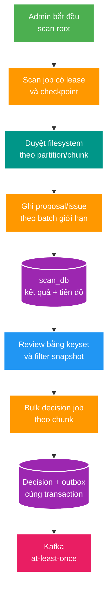

# SC-01 — Scan một triệu filesystem entry

> Câu hỏi trọng tâm: **Làm sao duyệt cây thư mục với memory bị chặn, progress/checkpoint, batch persistence và backpressure mà không biến preview thành một HTTP response khổng lồ?**
>
> Deep-dive của study pack SC-01, nghiên cứu cho feature candidate **Large-scale scan foundation**. Đây không phải Brief, Design hay Plan ADLC và không ấn định contract hay schema mới.

## Mục tiêu học và prerequisite

Mục tiêu là hiểu vì sao một thư mục một triệu file không chỉ là bài toán “đọc nhanh hơn”, mà là một pipeline gồm discovery, persistence, review và phát event. Người đọc cần biết khái niệm transaction, pagination và at-least-once delivery ở mức cơ bản.

## Bản chất trong một câu

**Một scan quy mô lớn là job có thể khôi phục, tạo dữ liệu theo chunk có giới hạn, và chỉ cho phép chuyển trạng thái downstream theo batch bền vững; không phải một HTTP request hay một vòng lặp lớn hơn.**

Keyword spine: `job lease → checkpoint → bounded chunk → progress → keyset → bulk job → outbox → reconciliation`.

## D0 — Vấn đề cần giải quyết

Một triệu file có ba đặc tính làm khác scan fixture nhỏ:

- Thời gian duyệt có thể dài hơn timeout, deploy hoặc restart process.
- Kết quả có thể chiếm hàng triệu row ở `scan_db`; review và approve cũng trở thành workload lớn.
- I/O filesystem, PostgreSQL và Kafka có năng lực độc lập. Nếu producer nhanh hơn consumer, dữ liệu phải chờ ở một nơi bền vững thay vì dồn vào heap hoặc connection pool.

“Quét xong” chưa đủ. Hệ thống cần trả lời được: đã đi đến đâu, restart có quét lại/mất item nào không, chạy lại có tạo bản sao không, và admin có thể duyệt phạm vi nào mà không treo browser hay transaction.

## D1 — Từ vựng và boundary

| Khái niệm | Sở hữu | Input → output | Không có nghĩa là |
| --- | --- | --- | --- |
| Scan job/run | Scan Service | `rootKey` → trạng thái, checkpoint, counters | một HTTP request còn mở |
| Lease | Scan Service | worker identity + thời hạn → quyền tiếp tục job | lock vĩnh viễn; lease phải được gia hạn |
| Checkpoint | Scan Service | vị trí partition/chunk đã commit → mốc khôi phục | filesystem snapshot bất biến |
| Chunk | Scan Service | tập item giới hạn → một transaction ghi kết quả | toàn bộ kết quả run |
| Keyset cursor | API Scan | khóa sắp xếp cuối trang → trang tiếp theo | số trang hay tổng số chính xác miễn phí |
| Bulk decision job | Scan Service | filter snapshot + decision → tiến độ/terminal result | một transaction cho mọi proposal |
| Outbox | Scan Service | decision đã commit → event cần publish | Kafka đã nhận event ngay lúc commit |

Invariant đề xuất để thảo luận trong ADLC sau này:

- Một logical root chỉ có một owner lease đang hoạt động; worker mất lease phải dừng trước chunk kế tiếp.
- Checkpoint chỉ advance cùng lúc với kết quả chunk đã commit. Restart có thể lặp một chunk, nhưng không được mất item.
- Bulk decision phải chốt phạm vi bằng snapshot/query version, không quét theo tập dữ liệu đang tiếp tục thay đổi.
- Mỗi proposal chỉ có một decision; APPROVE tạo tối đa một outbox event, kể cả khi chunk retry.

## D2 — Runtime model

Ví dụ root có một triệu file và worker bị restart ở chunk thứ 24:

1. API xác thực `rootKey`, tạo job `RUNNING` và cấp lease. API trả `202` cùng ID job; browser không giữ request scan.
2. Worker lấy một partition hoặc cursor discovery. Nó chỉ giữ metadata của chunk hiện tại trong memory.
3. Parser tạo proposal/issue. Worker ghi batch kết quả và checkpoint trong một local transaction. Khi commit xong, UI có thể đọc counter bền vững.
4. Worker gia hạn lease rồi tiếp tục. Backpressure xuất hiện khi DB chậm: giảm số chunk đang bay hoặc tạm dừng discovery; không tạo thêm task vô hạn.
5. Nếu process chết trước commit, checkpoint cũ được dùng lại. Unique key hoặc idempotency key làm cho chunk reprocess không tạo duplicate.
6. Khi mọi partition hoàn tất, job chuyển `COMPLETED`. Nếu không thể tiếp tục sau retry hữu hạn, job là `FAILED` nhưng giữ checkpoint và error để vận hành quyết định resume hay abort.
7. Review API trả một cửa sổ keyset ổn định, ví dụ `(source_relative_path, id) > cursor`, không dùng `OFFSET` càng lớn càng phải bỏ qua nhiều row.
8. Admin gửi bulk decision theo filter đã chốt. Worker bulk quyết định theo chunk: mỗi chunk ghi decision và outbox cùng transaction, cập nhật progress, rồi mới lấy chunk kế tiếp.

`bounded` quan trọng hơn “đa luồng”: số partition, số chunk in-flight, batch insert size và outbox publisher concurrency đều là các van điều tiết khác nhau. Chúng chỉ được tăng sau benchmark trên loại storage thật.

## Mapping vào implementation hiện tại

| Thành phần hiện tại | Điều đã có | Khoảng cách với mô hình lớn |
| --- | --- | --- |
| `ScanExecutor` | `Files.walk` lazy, buffer proposal/issue 500 và Hibernate JDBC batch 500. | Một task duy nhất duyệt tuần tự; chỉ log mỗi 5.000 file; không persist heartbeat/counter/checkpoint giữa chừng. |
| `ScanRunEntity` | `RUNNING`, `COMPLETED`, `FAILED`, counter tổng kết. | Counter chỉ được ghi trong `complete`; không có lease, worker identity, cancel, resume hay checkpoint. |
| `ScanService` | Chặn root có run `RUNNING`; background qua `TaskExecutor`. | Timeout 15 phút có thể đánh dấu stale trong khi executor cũ vẫn chạy; restart chủ động fail mọi run đang chạy. |
| Query API | Page tối đa 100 và index `(scan_run_id, source_relative_path)` cho list. | Spring `Page` dùng offset và count; chưa có cursor/keyset hoặc benchmark trang sâu. |
| `decideAll` | Idempotency decision và outbox atomic cho từng proposal. | Tải toàn bộ proposal/decision, dựng toàn bộ decision/outbox trong một transaction; không phù hợp một triệu record. |
| FE Scan | Render page 50, polling 3 giây và hủy request cũ. | Nút `Approve All` gửi một HTTP đồng bộ; không có progress, cancel, job detail hay warning về phạm vi lớn. |

Các claim trên là **cấu hình/implementation dự án**, đối chiếu tại `apps/scan-service/.../ScanExecutor.java`, `ScanService.java`, `ScanDecisionService.java`, `ScanQueryService.java`, `ScanRunEntity.java` và `D:/Study/Project/file_mngt_fe_v2/scan/scan-app.js`.

## D3 — Failure model và guarantee

| Tình huống | Nếu xử lý như hiện tại | Guarantee mục tiêu | Cơ chế cần có |
| --- | --- | --- | --- |
| Restart giữa scan | Run bị `FAILED`; phải tạo scan mới. | Không mất chunk đã commit; retry chunk có thể xảy ra. | Checkpoint transactional, lease expiry và idempotency key. |
| Scan kéo quá timeout | Có nguy cơ hai executor logic cùng root sau stale marking. | Một worker logical owner tại một thời điểm. | Lease compare-and-set/heartbeat, worker dừng khi mất lease. |
| DB chậm hoặc đầy pool | Worker vẫn tiếp tục discovery đến lần flush kế tiếp. | Memory và số transaction in-flight bị chặn. | Bounded queue, concurrency limit, metric saturation và retry có backoff. |
| Bulk approve 1M | Heap/transaction/HTTP timeout tăng rất mạnh. | Mỗi chunk commit độc lập, retry idempotent, UI thấy tiến độ. | Bulk job persisted, keyset claim, chunk transaction, cancel boundary. |
| Kafka/outbox publish lặp | Consumer có thể nhận duplicate. | At-least-once, không phải exactly-once xuyên service. | Event ID deterministic/unique, consumer dedupe hiện có. |
| File đổi trong khi scan | Không thể giả định filesystem snapshot nhất quán. | Phát hiện hoặc chấp nhận có chủ đích thay đổi. | Ghi fingerprint tối thiểu; reconciliation/incremental scan là quyết định sau benchmark. |

Không nên hứa “đúng một lần” cho việc đọc filesystem hoặc publish event. Điều có thể bảo vệ là **at-least-once ở biên chunk, không mất dữ liệu đã commit và không tạo duplicate business effect khi retry**.

## D4 — Quyết định kiến trúc và trade-off

| Lựa chọn | Dùng khi | Lợi ích | Chi phí / không dùng khi |
| --- | --- | --- | --- |
| Chunk tuần tự + checkpoint | Một root, I/O đĩa là bottleneck, ưu tiên an toàn. | Dễ resume, ít áp lực storage. | Không tận dụng nhiều volume độc lập. |
| Partition theo thư mục con | Root có subtree độc lập và filesystem cho phép. | Có thể tăng throughput có kiểm soát. | Cần canonical partition, xử lý file move và giới hạn I/O. |
| Keyset pagination | Dataset lớn, review chủ yếu next/previous theo sort cố định. | Latency ít phụ thuộc vị trí sâu. | Không nhảy chính xác đến “trang 20.000”; cursor gắn sort/filter. |
| Bulk job persisted | Hàng nghìn đến hàng triệu decision/event. | Không timeout HTTP, có resume/progress/cancel. | Nhiều state và API hơn single decision. |
| PostgreSQL `COPY`/JDBC batch | Benchmark chứng minh JPA batch là bottleneck. | Throughput insert cao hơn trong một số workload. | Phức tạp mapping/error isolation; không thay thế checkpoint. |
| OS watcher/incremental scan | Full rescan đã được đo là quá tốn kém và môi trường ổn định. | Giảm I/O ở thay đổi nhỏ. | Mất event watcher, rename và volume mạng làm reconciliation khó; không thay full scan ngay. |

Đề xuất evolution: bắt đầu bằng job persistence, chunk/checkpoint, keyset và bulk decision; sau đó đo filesystem/DB/outbox để quyết định partition hoặc bulk insert. Không đưa Kafka vào discovery chỉ để có “queue”: filesystem scan vẫn cần state durable tại owner `scan_db`.

## Red flags và hiểu nhầm thường gặp

- Bật virtual threads không tự tạo parallelism: code vẫn cần partition/concurrency limit, và DB/disk vẫn có giới hạn.
- Batch insert 500 không làm một transaction một triệu row trở nên an toàn.
- Pagination không đồng nghĩa scale: `OFFSET` sâu và `COUNT(*)` vẫn là chi phí SQL.
- “Approve all” không phải bulk API an toàn nếu server materialize toàn bộ tập chọn.
- Checkpoint không biến filesystem thành snapshot; nó chỉ nói hệ thống đã commit đến đâu.
- Counter hiển thị không phải observability đầy đủ: cần throughput, duration, chunk retry, lease loss, DB pool saturation, outbox backlog và failed job count.

## Cầu nối phỏng vấn

**30 giây:** Với một triệu file, tôi biến scan thành durable job. Kết quả và checkpoint được commit theo chunk để restart không mất dữ liệu; UI đọc keyset page; approve hàng loạt là job bất đồng bộ tạo decision/outbox từng chunk. Concurrency chỉ tăng sau khi bảo vệ disk và DB bằng giới hạn có đo đạc.

**Câu hỏi tự kiểm:** Nếu worker chết sau khi insert proposal nhưng trước checkpoint, vì sao retry không được tạo proposal thứ hai? Nếu UI đổi filter khi bulk job đang chạy, phạm vi quyết định nào là source of truth? Nếu offset page 20.000 chậm, cursor cần chứa những cột sort nào?

## Phương pháp Benchmark & Fixture Generation chuẩn xác cho SC-01

Để dữ liệu thử nghiệm 1 triệu file rỗng đủ độ tin cậy làm evidence cho SC-01, mã nguồn sinh/dọn dẹp dữ liệu phải tuân thủ các nguyên tắc sau:

1. **Ranh giới Test Scope & Boundary**:
   - Nằm tại dự án chung `tests/fixtures/tools/` (`fixture-tools`), thuộc feature package `com.filemngt.tools.sc01_scan_one_million`. Không đóng gói vào service production và không tự chạy trong root `mvn test` để tránh làm chậm CI.
2. **Yêu cầu Correctness & Fail-Fast**:
   - **Bắt lỗi Worker**: Sử dụng `CompletableFuture` với `.join()`; ném `RuntimeException` ngay lập tức nếu bất kỳ worker nào lỗi I/O, không in "HOÀN TẤT" khi bị thiếu file.
   - **Xác minh số lượng thực tế (Post-Verification)**: Đếm lại chính xác 1.000.000 file sau khi sinh bằng `Files.walk()`; ném `IllegalStateException` nếu số lượng không khớp.
   - **Bảo vệ thao tác xóa (Cleaner)**: Kiểm tra kết quả xóa nghiêm ngặt (`Files.delete()` hoặc throw `IOException` khi `!file.delete()`), xác minh thư mục đã bị hủy hoàn toàn.
   - **Độ chính xác đo đạc**: Dùng `System.nanoTime()` cho micro-benchmark thay cho `System.currentTimeMillis()`.
3. **Quản lý Concurrency & Đĩa Cứng**:
   - Không nổ Virtual Threads không giới hạn (1.000 tasks) gây tranh chấp I/O trên đĩa đơn. Sử dụng Bounded Thread Pool (ví dụ `concurrency = 16, 32`) được tham số hóa qua `-Dconcurrency`.
   - Benchmark ma trận concurrency: `1, 2, 4, 8, 16, 32` để tìm điểm bão hòa I/O.
   - Loại trừ thư mục benchmark (`D:/Study/Project/file_mngt_fixtures/`) khỏi Real-Time Protection của Antivirus / Windows Defender để phản ảnh đúng I/O đĩa đĩa không bị can thiệp.

## Tài liệu tham khảo trong dự án

- [fixture-tools](../../../../tests/fixtures/tools/pom.xml) — Dự án Java 25 Fixture Tools chung với package `com.filemngt.tools.sc01_scan_one_million` cho SC-01 (gồm generator và cleaner).
- `apps/scan-service/CONTEXT.md` — ownership và invariant Scan.
- `docs/features/004-scan-preview/02-design.md` — boundary preview hiện hành.
- `docs/contracts/openapi/scan-v1.yaml` — API hiện hành; thay đổi sau này phải qua contract workflow.
- `docs/architecture/02-PLAN.md` — Phase 7 importer/backfill và Phase 8 benchmark/profiling.
- `docs/STATUS.md` — các gate hiện còn mở.
