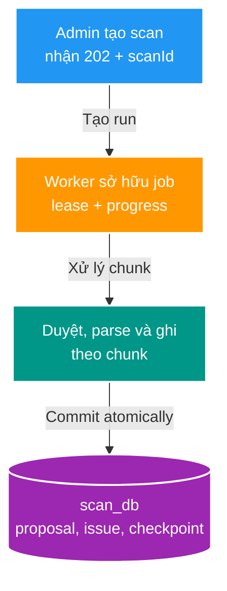
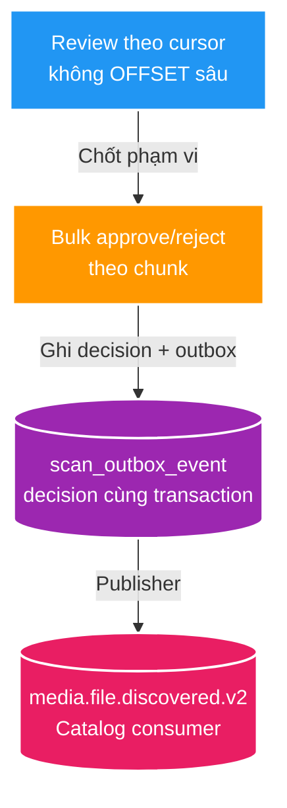

# SC-01 — Scan một triệu filesystem entry

> Overview của SC-01. Đọc file này để nắm bức tranh và thứ tự tư duy; đọc [02-architecture-touchpoints-and-flows.md](./02-architecture-touchpoints-and-flows.md) để đi vào từng điểm chạm trước khi lập plan/code.

## Mục tiêu

Biến scan từ một vòng lặp chạy nền thành pipeline có trạng thái: tạo job, duyệt filesystem theo chunk, persist proposal/issue, review dữ liệu lớn, bulk approve và phát event qua outbox.

Study project này ưu tiên một kiến trúc chạy được để học và phát triển nhanh. Data của môi trường dev có thể reset; batch `500`, queue `1.000` và lease `30s` là cấu hình khởi đầu để triển khai SC-01, không phải API/contract đã phát hành.

## Bản chất trong một câu

**Một scan quy mô lớn là durable job với tài nguyên bị chặn: chỉ giữ một chunk trong memory, commit kết quả theo chunk, rồi mới đi tiếp.**

Keyword spine: `job → lease → bounded discovery → parser → chunk commit + checkpoint → keyset review → bulk job → outbox`.

## Hai giai đoạn chính

## Điều đã có và phần sẽ thay

| Thành phần | Baseline hiện tại | Hướng SC-01 |
| --- | --- | --- |
| Scan run | `POST /api/v2/scans/previews`, background `TaskExecutor`, chặn root đang `RUNNING`. | Job có lease, progress/checkpoint và resume. |
| Discovery | `Files.walk`, buffer proposal/issue 500. | Bounded discovery, parser tách rõ và commit theo chunk. |
| Review | `Pageable` offset. | Keyset cursor theo `(source_relative_path, id)`. |
| Approve all | Materialize toàn bộ proposal trong một transaction. | Bulk job persisted, mỗi chunk ghi decision + outbox. |
| Outbox | Poll tối đa 20 event, at-least-once. | Giữ mẫu outbox; bổ sung backlog/concurrency phù hợp bulk. |

## Invariant thực dụng

- Một `rootKey` chỉ có một worker owner được ghi tiếp.
- Checkpoint chỉ advance cùng transaction với dữ liệu chunk.
- Retry chunk không tạo proposal hoặc event business trùng.
- Không đưa Kafka vào giữa file walker và `scan_db`; Kafka chỉ bắt đầu sau approval/outbox.
- Checkpoint không biến filesystem thành snapshot. Khi file thay đổi trong scan, dev baseline chấp nhận rewalk/dedupe; reconciliation là bước sau.

## Thứ tự đọc rồi lập plan

1. Touchpoint 1–2: tạo run, lease và vòng đời worker.
2. Touchpoint 3–5: walker, parser, batch/checkpoint.
3. Touchpoint 6: keyset review.
4. Touchpoint 7: bulk decision job.
5. Touchpoint 8: outbox publisher và Catalog handoff.

## Tham chiếu

- [UC-01](../../core-flows/uc-01-scan-to-catalog-canonical-ingestion/README.md)
- [Chi tiết các luồng và điểm chạm](./02-architecture-touchpoints-and-flows.md)
- `apps/scan-service/CONTEXT.md`
- `docs/contracts/openapi/scan-v1.yaml`
