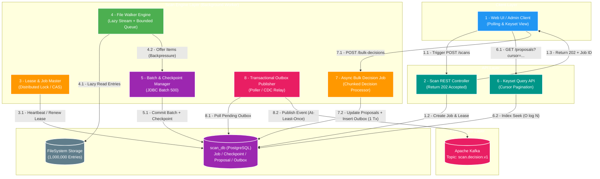
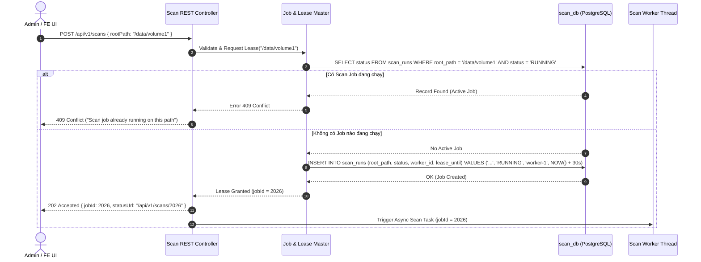
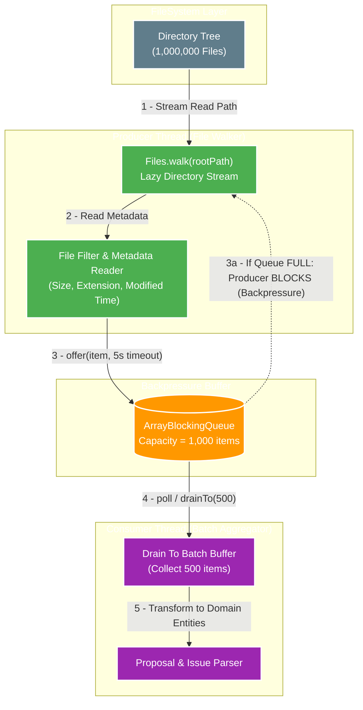
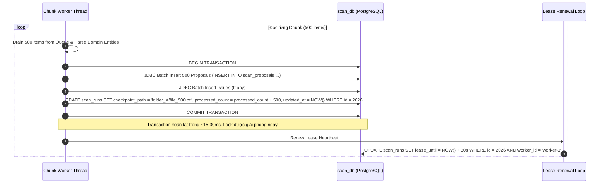
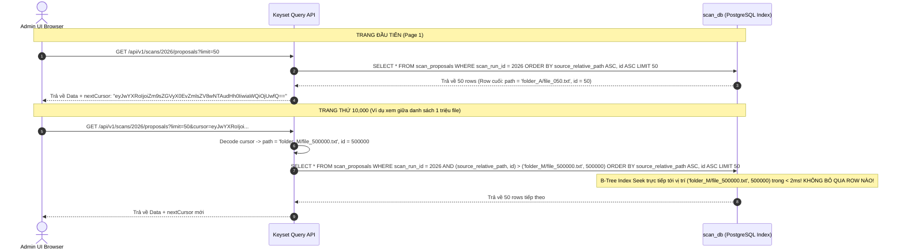
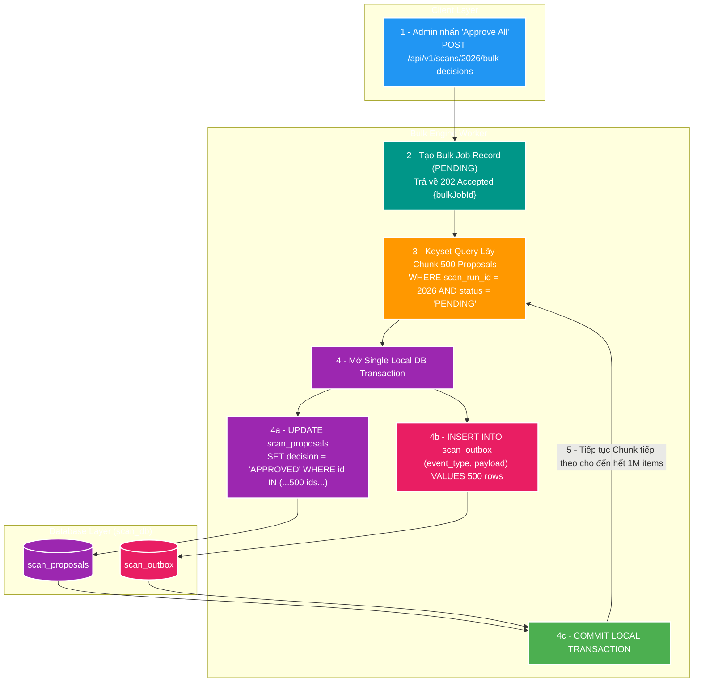
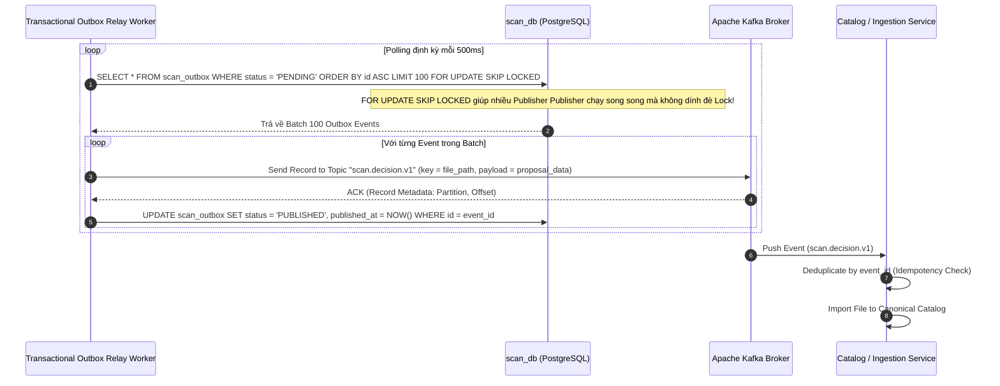

# SC-01 — Chi Tiết Các Luồng & Điểm Chạm Kiến Trúc Scan 1 Triệu Filesystem Entries

> **Mục đích tài liệu:** Giải thích chi tiết, dễ hiểu mọi luồng dữ liệu (Flows) và điểm chạm (Touchpoints) trong kiến trúc Scale & Capacity đáp ứng bài toán quét 1.000.000 file/thư mục.
>
> Tài liệu mở rộng thuộc study pack **SC-01 (Large-scale scan foundation)**, đặt tại `manual/learning/use-cases/scale-capacity/sc-01-scan-one-million-filesystem-entry/02-architecture-touchpoints-and-flows.md`. Đây là tài liệu học tập & phân tích kỹ thuật, không thay thế Brief/Design/Plan ADLC chính thức.

---

## 1. Bản Chất Kỹ Thuật & Thách Thức Từ First Principles

Duyệt một cây thư mục chứa **1.000.000 filesystem entries** không chỉ đơn thuần là bài toán "đọc đĩa nhanh hơn" hay "chạy đa luồng". Ở quy mô 1 triệu record, hệ thống sẽ sụp đổ tại 6 điểm nghẽn vật lý (Bottlenecks) nếu giữ tư duy lập trình thông thường:

```
                  ┌─────────────────────────────────────────────────────────┐
                  │          6 ĐIỂM NGHỄN VẬT LÝ KHI SCAN 1M FILE           │
                  └─────────────────────────────────────────────────────────┘
                                               │
    ┌───────────────────┬───────────────────┼───────────────────┬───────────────────┐
    ▼                   ▼                   ▼                   ▼                   ▼
┌──────────────┐    ┌──────────────┐    ┌──────────────┐    ┌──────────────┐    ┌──────────────┐
│ 1. Memory    │    │ 2. HTTP      │    │ 3. Long DB   │    │ 4. Slow      │    │ 5. DB Pool   │
│ Out-Of-Memory│    │ Timeout      │    │ Transaction  │    │ Pagination   │    │ Saturation   │
│ (Heap Buffer)│    │ (Gateway)    │    │ (Lock & Undo)│    │ (OFFSET 500k)│    │ (Connection) │
└──────────────┘    └──────────────┘    └──────────────┘    └──────────────┘    └──────────────┘
```

1. **Memory Buffer (Heap Overflow):** Nếu load toàn bộ 1 triệu file vào RAM dạng `List<FileMetadata>`, bộ nhớ JVM sẽ tiêu tốn hàng trăm Megabytes/Gigabytes, gây Garbage Collection pause kéo dài hoặc nổ lỗi `java.lang.OutOfMemoryError`.
2. **HTTP Execution Timeout:** Việc duyệt 1 triệu file mất từ hàng chục giây đến nhiều phút (tùy tốc độ đĩa I/O). Giữ một kết nối HTTP đồng bộ (Synchronous HTTP Request) sẽ khiến Nginx/Gateway ngắt kết nối với mã lỗi `504 Gateway Timeout`.
3. **Transaction Duration & Table Lock:** Gom 1 triệu insert vào đúng một `@Transactional` làm trễ việc giải phóng Undo Log, treo Lock tài nguyên, và nếu crash ở file thứ 999.999 thì toàn bộ dữ liệu bị rollback về 0.
4. **Offset Pagination Slowdown:** Khi admin vào UI xem kết quả scan ở trang thứ 10.000 (`OFFSET 500000 LIMIT 50`), PostgreSQL phải quét qua 500.000 row index trước khi trả về 50 row, khiến thời gian phản hồi từ 5ms tăng vọt lên 5-10 giây.
5. **Database Connection Pool Exhaustion:** Worker scan ngốn toàn bộ kết nối DB trong thời gian dài để ghi dữ liệu, khiến các request đọc API khác của người dùng bị nghẽn (Timeout waiting for connection).
6. **Downstream Message Overflow:** Nếu đẩy 1 triệu Kafka event liên tục mà không có cơ chế backpressure, Kafka broker hoặc Consumer Service phía sau sẽ bị ngập bộ nhớ (Buffer Overflow).

---

## 2. Điểm Chạm Kiến Trúc Tổng Thể (Master Architectural Touchpoints)

Để giải quyết triệt để 6 điểm nghẽn trên, hệ thống chia nhỏ luồng xử lý thành **8 Điểm Chạm (Touchpoints)** độc lập, giao tiếp với nhau qua các hàng đợi có giới hạn (Bounded Queues) và trạng thái bền vững (Durable Persistence).

### Sơ Đồ Điểm Chạm Kiến Trúc (Master Architecture Landscape)



---

## 3. Bảng Chi Tiết 8 Điểm Chạm Kiến Trúc (Touchpoint Breakdown)

| Điểm Chạm | Thành Phần Owner | Input → Output | Trách Nhiệm Chính | Cơ Chế Bảo Vệ & Scale |
| :--- | :--- | :--- | :--- | :--- |
| **Touchpoint 1** | `Scan REST Controller` | `POST /scans` → `202 Accepted {jobId}` | Nhận request khởi tạo scan, validate path, tạo `scan_run` entity ở trạng thái `RUNNING` và trả về Client ngay lập tức. | Giảm trễ HTTP xuống < 10ms, không giữ HTTP connection cho bài toán scan 1M file. |
| **Touchpoint 2** | `Lease & Job Master` | `jobId` + `workerId` → `Lease Granted / Denied` | Đảm bảo duy nhất 1 Worker được phép chạy scan trên một `rootKey` tại một thời điểm bằng thuật toán Lease (CAS/Heartbeat). | Ngăn ngừa Split-Brain khi scale đa node hoặc khi worker cũ bị kẹt GC. |
| **Touchpoint 3** | `File Walker Engine` | `rootKey` + `checkpointPath` → Stream `Path` | Traversal cây thư mục bằng `Files.walk()` lazy stream. Đẩy file metadata vào Bounded Blocking Queue. | **Backpressure:** Bounded Queue (kích thước 1.000) chặn File Walker dừng đọc đĩa khi DB chậm, giữ RAM cố định < 50MB. |
| **Touchpoint 4** | `Proposal & Issue Parser` | Stream `Path` → `ScanProposal` / `ScanIssue` | Phân tích file (extension, size, permission), kiểm tra quy tắc canonical/duplicate để tạo Proposal hoặc Issue. | Pure CPU function, chuyển đổi dữ liệu không giữ state. |
| **Touchpoint 5** | `Batch & Checkpoint Manager` | Chunk (500 items) → DB Commitment | Mở 1 local DB transaction: Execute JDBC Batch Insert 500 proposals/issues, đồng thời update `checkpoint_path` và counter. | **Resiliency:** Commit theo từng chunk 500 items. Nếu crash, khôi phục lại chính xác vị trí checkpoint gần nhất. |
| **Touchpoint 6** | `Keyset Query API` | `cursor (path, id)` → `Page 50 Proposals` | Cung cấp API đọc danh sách kết quả cho Admin UI bằng thuật toán Keyset Pagination `WHERE (path, id) > cursor`. | Latency truy vấn cố định < 5ms dù xem ở trang đầu hay trang cuối của 1 triệu record. |
| **Touchpoint 7** | `Async Bulk Decision Job` | Filter Snapshot + Action → Async Job Progress | Thực thi lệnh "Approve All / Reject All" bất đồng bộ theo từng Chunk (500 proposals) trong DB. | Không load 1 triệu record vào RAM. Mỗi chunk cập nhật status proposal + ghi Outbox trong 1 DB Transaction. |
| **Touchpoint 8** | `Transactional Outbox Publisher` | Outbox Table → Kafka Broker | Đọc record từ bảng `scan_outbox` và publish event sang Kafka topic `scan.decision.v1`. Trống duplicates bằng `eventId`. | Đảm bảo tính nhất quán dữ liệu **At-least-once delivery** giữa Scan DB và Kafka mà không dùng 2-Phase Commit (2PC). |

---

## 4. Chi Tiết Các Luồng Xử Lý Dữ Liệu (Detailed Flow Walkthroughs)

---

### Luồng 1: Khởi Tạo Job & Cấp Quyền Duyệt (Job Triggering & Lease Handshake)

Luồng này đảm bảo request từ phía Admin được xử lý nhanh chóng mà không gây nghẽn HTTP, đồng thời thiết lập quyền sở hữu độc quyền (Lease) cho Worker.



#### Giải thích từng bước (Walkthrough):
1. Admin bấm nút "Start Scan" trên UI. Client gửi HTTP `POST` chứa thư mục mục tiêu `/data/volume1`.
2. Controller gọi `JobMaster` kiểm tra xem đường dẫn này có đang bị khóa bởi job nào khác không.
3. `JobMaster` truy vấn database `scan_db`. Nếu phát hiện có job `RUNNING` chưa hết hạn Lease, hệ thống trả về mã lỗi `409 Conflict` ngay lập tức để tránh 2 worker quét đè lên nhau.
4. Nếu hợp lệ, hệ thống ghi record mới vào bảng `scan_runs` với trạng thái `RUNNING`, cấp Lease 30 giây cho `worker-1`.
5. Controller phản hồi ngay lập tức cho Client mã `202 Accepted` kèm `jobId`. Thời gian phản hồi chỉ mất **5 - 10ms**.
6. Controller đẩy `jobId` vào thread pool để Worker bắt đầu duyệt đĩa ở background.

---

### Luồng 2: Discovery Cây Thư Mục & Control Memory Backpressure (FileSystem Traversal)

Đây là luồng quan trọng nhất điều tiết tốc độ đọc đĩa (Disk I/O) phù hợp với tốc độ ghi của Database (Database I/O), giữ bộ nhớ Heap luôn dưới 50MB.



#### Giải thích từng bước (Walkthrough):
1. **Producer Thread** khởi tạo `Files.walk(rootPath)` dạng Lọc lười (Lazy Stream). Nó chỉ mở từng Directory Handle khi cần, không nạp toàn bộ cấu trúc cây vào RAM.
2. Với mỗi đường dẫn `Path` đọc được, Producer lấy các thuộc tính cơ bản (file size, creation time, permissions).
3. Producer đẩy item vào `ArrayBlockingQueue` có sức chứa cố định **1.000 items**.
4. **Cơ chế Backpressure (Chống tràn bộ nhớ):**
   - Nếu Database xử lý chậm khiến `ArrayBlockingQueue` bị đầy (đạt 1.000 items), lệnh `queue.put(item)` của Producer Thread sẽ tự động **BỊ CHẶN (BLOCK)**.
   - Producer Thread tạm dừng đọc đĩa. Việc duyệt thư mục dừng lại tự nhiên mà không tốn CPU hay RAM.
   - Ngay khi Consumer Thread rút bớt 500 items ra khỏi queue để ghi xuống DB, Queue có chỗ trống, Producer Thread tự động thức dậy và tiếp tục đọc file tiếp theo.

---

### Luồng 3: Batch Persistence & Checkpoint Commitment (Ghi Batch & Lưu Checkpoint)

Luồng này thực thi ghi dữ liệu theo từng nhóm (Chunk) 500 items và lưu vết vị trí (Checkpoint) trong cùng một DB Transaction để phục vụ khả năng khôi phục khi có sự cố.



#### Giải thích từng bước (Walkthrough):
1. Worker rút 500 items từ `ArrayBlockingQueue` và chuyển đổi thành danh sách `ScanProposalEntity` và `ScanIssueEntity`.
2. Worker mở 1 Database Transaction:
   - Thực thi `executeBatch()` chèn 500 row vào bảng `scan_proposals`.
   - Thực thi `executeBatch()` chèn các file lỗi vào bảng `scan_issues`.
   - Cập nhật cột `checkpoint_path = 'folder_A/file_500.txt'` và cộng dồn `processed_count += 500` ở bảng `scan_runs`.
3. Worker thực hiện `COMMIT`. Mọi row của Chunk 500 này được đóng băng bền vững vào ổ đĩa DB.
4. Ngay sau khi commit, Worker thực hiện Gia hạn Lease (`Lease Renewal`) thêm 30 giây để xác nhận Worker vẫn đang sống khỏe mạnh.

---

### Luồng 4: Phục Hồi Khi Sự Cố (Failure Drill & Lease Takeover)

Khi Server chứa Worker bị sập điện, sập mạng hoặc OOM giữa chừng ở file thứ 450.000, hệ thống tự động khôi phục và chạy tiếp từ vị trí 450.000 mà không phải scan lại từ đầu.

```mermaid
flowchart TD
    START["<font color='white'>1 - Worker-1 đang scan đến file 450.000<br/>(Checkpoint: folder_B/file_450k.mp4)</font>"] --> CRASH["<font color='white'>2 - Worker-1 bị Crash / Mất mạng<br/>(Ngừng gửi Lease Heartbeat)</font>"]
    CRASH --> TIMEOUT["<font color='white'>3 - Sau 30s: Lease hết hạn<br/>(lease_until < NOW())</font>"]
    TIMEOUT --> DETECT["<font color='white'>4 - Recovery Worker-2 Watchdog phát hiện<br/>Job 2026 bị Stale Lease</font>"]
    DETECT --> TAKEOVER["<font color='white'>5 - Worker-2 cướp Lease qua CAS SQL:<br/>UPDATE scan_runs SET worker_id = 'worker-2', lease_until = NOW() + 30s<br/>WHERE id = 2026 AND lease_until < NOW()</font>"]
    TAKEOVER --> READ_CP["<font color='white'>6 - Worker-2 đọc Checkpoint gần nhất:<br/>checkpoint_path = 'folder_B/file_450k.mp4'</font>"]
    READ_CP --> RESUME["<font color='white'>7 - Worker-2 tiếp tục Files.walk(root)<br/>Skip các file đứng trước checkpoint_path</font>"]
    RESUME --> DEDUPE["<font color='white'>8 - DB Idempotency Constraint:<br/>ON CONFLICT (scan_run_id, source_relative_path) DO NOTHING</font>"]
    DEDUPE --> DONE["<font color='white'>9 - Scan tiếp tục đến file 1.000.000<br/>COMPLETED an toàn!</font>"]

    style START fill:#4CAF50,stroke:#fff,stroke-width:2px
    style CRASH fill:#E91E63,stroke:#fff,stroke-width:2px
    style TIMEOUT fill:#FF9800,stroke:#fff,stroke-width:2px
    style DETECT fill:#2196F3,stroke:#fff,stroke-width:2px
    style TAKEOVER fill:#9C27B0,stroke:#fff,stroke-width:2px
    style READ_CP fill:#009688,stroke:#fff,stroke-width:2px
    style RESUME fill:#4CAF50,stroke:#fff,stroke-width:2px
    style DEDUPE fill:#009688,stroke:#fff,stroke-width:2px
    style DONE fill:#4CAF50,stroke:#fff,stroke-width:2px
```



#### Giải thích từng bước (Walkthrough):
1. **Sự cố:** `Worker-1` bị crash ở file thứ 450.000. Do đã sập, `Worker-1` ngắt kết nối và không thể gửi lệnh gia hạn Lease.
2. **Phát hiện:** Sau 30 giây, cột `lease_until` trong bảng `scan_runs` trở thành thời gian trong quá khứ (`lease_until < NOW()`).
3. **Cướp Lease (Takeover):** `Worker-2` (hoặc Watchdog thread) chạy định kỳ phát hiện Job 2026 bị bỏ hổng. Nó thực thi lệnh `UPDATE` điều kiện để nhận lại Job.
4. **Đọc Checkpoint:** `Worker-2` truy vấn cột `checkpoint_path` và biết được hệ thống đã ghi thành công đến file `folder_B/file_450k.mp4`.
5. **Resampling:** `Worker-2` khởi động lại Stream traversal, bỏ qua (skip) các file đứng trước vị trí checkpoint và quét tiếp từ file 450.001.
6. **Chống trùng lặp (Idempotency):** Nếu Chunk bị ngắt ở file 450.200 (chưa kịp commit checkpoint 450.500), câu lệnh Insert của DB có cấu hình `ON CONFLICT (scan_run_id, source_relative_path) DO NOTHING` giúp tránh tạo ra các record trùng lặp.

---

### Luồng 5: Keyset Pagination Cho Review 1 Triệu Records (Query API Khủng)

Khi quét xong 1 triệu file, người dùng vào Admin UI để xem và duyệt danh sách. Luồng này thay thế hoàn toàn thuật toán `OFFSET` truyền thống bằng **Keyset Pagination (Cursor-based Pagination)**.



#### So sánh Latency giữa Offset Pagination và Keyset Pagination:

```
Thời gian phản hồi (Latency) theo vị trí trang
Latency (ms)
  ^
10000|                                     / Offset Pagination (Chậm dần O(N))
 8000|                                    /  (Trang 10.000 mất ~8.000ms)
 6000|                                   /
 4000|                                  /
 2000|                                 /
   50|________________________________/____ Keyset Pagination (Luôn cố định O(log N))
    0+---------------------------------------------------------> vị trí Row
     0               250k            500k            1M
```

---

### Luồng 6: Bulk Decision Job & Transactional Outbox (Duyệt Async 1M Items)

Khi Admin chọn "Approve All" 1 triệu file proposal, luồng này chuyển thao tác duyệt thành một Async Job chạy theo từng Chunk, ghi nhận quyết định và sinh Outbox Event trong cùng 1 Local Transaction.



#### Giải thích từng bước (Walkthrough):
1. Admin gửi lệnh Approve 1 triệu file kèm các tiêu chí lọc (ví dụ: `extension = '.pdf'`). Server tạo một `bulk_decision_job` và trả về `202 Accepted`.
2. Worker phụ trách Bulk Job đọc từng trang 500 proposals thỏa mãn điều kiện lọc.
3. Với mỗi Chunk 500 proposals, Worker mở 1 DB Transaction:
   - Cập nhật trạng thái `decision = 'APPROVED'` ở bảng `scan_proposals`.
   - Chèn 500 Outbox Records tương ứng vào bảng `scan_outbox`.
   - `COMMIT` transaction.
4. **Tính nhất quán (Atomicity):** Việc cập nhật trạng thái Proposal và tạo Event Outbox nằm chung trong một Local Transaction của PostgreSQL. Nếu sập điện giữa chừng, một chunk sẽ hoặc thành công cả 2, hoặc rollback cả 2. Không bao giờ có trường hợp Proposal đã Approved nhưng Event không được tạo!

---

### Luồng 7: Outbox Publishing & Kafka Event Pipeline (Đẩy Event Đều Đặn)

Luồng này làm nhiệm vụ quét bảng Outbox và phát Event sang Kafka với cơ chế Guaranteed At-Least-Once Delivery mà không làm ảnh hưởng đến tốc độ của luồng scan chính.



#### Giải thích từng bước (Walkthrough):
1. Background `OutboxRelayWorker` chạy polling liên tục (hoặc dùng Debezium CDC).
2. Worker dùng câu lệnh SQL `SELECT ... FOR UPDATE SKIP LOCKED` lấy ra 100 record Outbox ở trạng thái `PENDING`. Cú pháp `SKIP LOCKED` cho phép scale nhiều thread Publisher chạy song song mà không tranh chấp lock row với nhau.
3. Worker đẩy từng event sang Kafka Topic `scan.decision.v1`.
4. Khi Kafka phản hồi `ACK` (đã nhận và lưu bền vững vào Broker Partition), Worker cập nhật Outbox record sang `PUBLISHED`.
5. Consumer phía Catalog Service nhận event, kiểm tra `event_id` xem đã xử lý chưa (Idempotency deduplication), rồi đưa file vào catalog chính thức.

---

## 5. Mapping Chi Tiết Giữa Baseline Hiện Tại V2 & Target Scale 1M

| Thành Phần | Code Baseline Hiện Tại (V2 Baseline) | Kiến Trúc Mục Tiêu (SC-01 Target Architecture) | Kế Hoạch Nâng Cấp (Refactoring Path) |
| :--- | :--- | :--- | :--- |
| **Traversal Engine** | `ScanExecutor.java` dùng `Files.walk()` tuần tự, buffer list 500 items trong memory, flush JDBC batch 500. | `Files.walk()` lazy kết hợp Bounded `ArrayBlockingQueue` (size 1.000) chống nổ Heap RAM + Multi-worker traversal. | Bọc Producer stream qua Bounded Queue để kích hoạt cơ chế Backpressure tự nhiên của Java Threads. |
| **State & Checkpoint** | `ScanRunEntity.java` chỉ lưu counter tổng kết (`processed_count`, `total_files`) khi kết thúc công việc. | Lưu cột `checkpoint_path` và `lease_until` cập nhật liên tục theo từng Chunk 500 items trong Transaction. | Thêm cột `checkpoint_path`, `lease_until`, `worker_id` vào Migration Schema của `scan_runs`. |
| **Lease & Locking** | Kiểm tra trùng root ở `ScanService.java` nhưng không có gia hạn Lease. Timeout 15 phút đánh dấu stale cứng. | Thuật toán Distributed Lease với Heartbeat 30 giây. Cơ chế Compare-And-Set (CAS) cướp Lease khi Worker cũ chết. | Triển khai `LeaseManager` quản lý Heartbeat loop và Watchdog tiếp quản Job bị Stale. |
| **Review Query** | `ScanQueryService.java` dùng Spring Data `Pageable` (`OFFSET` & `COUNT(*)`). | API Keyset Cursor `WHERE (source_relative_path, id) > (:cursorPath, :cursorId) ORDER BY path, id LIMIT 50`. | Bổ sung Index B-Tree composite `(scan_run_id, source_relative_path, id)` và viết Keyset Query Repository. |
| **Bulk Decision** | `ScanDecisionService.decideAll()` nạp toàn bộ danh sách Proposal vào RAM và xử lý trong 1 Transaction khổng lồ. | `AsyncBulkDecisionJob` phân đoạn xử lý theo Chunk (500 items), commit từng chunk + ghi Outbox trong cùng Transaction. | Tách `decideAll()` thành Async Chunked Processor, trả về `202 Accepted` cho `bulk-decisions`. |
| **Event Publishing** | Ghi trực tiếp Outbox trong `decideAll()`, nhưng kích thước transaction quá lớn khi xử lý hàng loạt. | Single Chunk Transaction (500 Proposals Status Update + 500 Outbox Records Insert) + Polling Publisher với `SKIP LOCKED`. | Giữ mẫu thiết kế Outbox hiện tại nhưng siết phạm vi Transaction ở quy mô Chunk 500 items. |

---

## 6. Failure Model, Edge Cases & Ma Trận Đánh Đổi (Trade-offs)

### Ma Trận Xử Lý Sự Cố (Failure Matrix)

| Sự Cố / Edge Case | Nguyên Nhân Cốt Lõi | Hậu Quả Nếu Không Xử Lý | Giải Pháp Trong SC-01 Target |
| :--- | :--- | :--- | :--- |
| **Worker OOM / Crash** | Heap RAM thiếu hoặc dính GC Pause kéo dài. | Job bị dậm chân tại chỗ vĩnh viễn ở trạng thái `RUNNING`. | Lease hết hạn sau 30s. Worker khác tự động tiếp quản và scan tiếp từ `checkpoint_path`. |
| **Worker Mất Mạng Chập Chờn** | Mạng gián đoạn khiến Worker không thể gửi Heartbeat. | Worker cũ tưởng mình vẫn sống, Worker mới nhảy vào cướp Lease. | **Fencing Token / CAS Update:** Worker cũ khi ghi DB bị từ chối vì `lease_until` hoặc `worker_id` đã bị thay đổi. Worker cũ tự terminate. |
| **Đĩa I/O Rất Chậm** | Ổ cứng HDD / Storage mạng NAS bị quá tải read. | Queue rỗng, Worker ghi DB bị đói dữ liệu (Starvation). | Hệ thống tự động điều chỉnh nhịp (Self-throttling). Không sập, chỉ tăng thời gian hoàn tất Job. |
| **Antivirus Scan Interferences** | Antivirus (Windows Defender) khóa file khi đang đọc metadata. | Ném lỗi `AccessDeniedException` dừng toàn bộ Stream. | Bắt ngoại lệ cục bộ, ghi nhận vào bảng `scan_issues` với loại `ACCESS_DENIED`, tiếp tục đọc file kế tiếp. |
| **Duplicate Events Đến Kafka** | Publisher bị sập ngay sau khi publish Kafka nhưng trước khi commit Outbox status. | Downstream Service nhận 1 Event nhiều hơn 1 lần. | **At-least-once Guarantee:** Chấp nhận duplicate ở tầng Publisher. Downstream Consumer bắt buộc Deduplicate dựa trên `event_id` hoặc `proposal_id`. |

### Đánh Đổi Kiến Trúc (Architectural Trade-offs)

1. **Trade-off giữa Throughput và An Toàn (Chunk Size):**
   - *Chunk Size lớn (5.000 items):* Tăng tốc độ ghi DB (Throughput cao), nhưng thời gian giữ DB Lock dài hơn và nếu crash sẽ phải quét lại nhiều file hơn.
   - *Chunk Size nhỏ (500 items - Lựa chọn thiết kế):* Giảm thời gian giữ Lock (~15ms), khôi phục nhanh khi crash, dung lượng RAM cực kỳ nhẹ, nhưng tốn thêm một ít overhead của các câu lệnh `COMMIT`.
2. **Trade-off giữa Keyset Pagination và Nhảy Trang Tùy Ý (Random Page Access):**
   - *Offset Pagination:* Cho phép bấm nhảy thẳng đến "Trang 5.000", nhưng sụp đổ hiệu năng ở dữ liệu lớn.
   - *Keyset Pagination (Lựa chọn thiết kế):* Phản hồi siêu tốc (< 5ms) cố định ở mọi vị trí, nhưng chỉ hỗ trợ cuộn "Next Page" / "Previous Page" dựa trên Cursor, không hỗ trợ nhảy trang ngẫu nhiên.

---

## 7. Cầu Nối Phỏng Vấn & Phương Pháp Benchmark (Interview & Evidence Guide)

### Câu Trả Lời Phỏng Vấn Mẫu (Interview Elevator Pitches)

#### Dạng 30 Giây (Trả lời nhanh / Tổng quan):
> *"Để quét 1 triệu file mà không làm sụp đổ hệ thống, tôi không dùng một vòng lặp lớn hay một HTTP Request đồng bộ. Tôi thiết kế Scan thành một Async Job có khả năng tự khôi phục: Đọc file theo Stream lười (Lazy Stream) qua một Bounded Queue để chống nổ RAM Heap, ghi kết quả và Checkpoint xuống DB theo từng Chunk 500 items trong một local transaction. Nhờ vậy, nếu server crash, hệ thống tự động cướp Lease và quét tiếp từ vị trí Checkpoint mà không mất dữ liệu. API xem kết quả dùng Keyset Pagination để giữ latency dưới 5ms."*

#### Dạng 2 Phút (Trả lời sâu / Kiến trúc sư):
> *"Bài toán scan 1 triệu file có 3 điểm nghẽn chính: Memory, Database Transaction và Pagination.
> First principles của tôi là kiểm soát ranh giới tài nguyên (Bounded Resources) ở từng tầng:
> - Tầng Đọc File: Tôi dùng `Files.walk()` kết hợp `ArrayBlockingQueue` dung lượng 1.000 để tạo cơ chế Backpressure. Nếu DB ghi chậm, Producer Thread đọc đĩa tự động bị Block, giữ Heap RAM cố định dưới 50MB.
> - Tầng Persistence: Tôi chia 1 triệu file thành các Chunk 500 items. Mỗi Chunk thực thi JDBC Batch Insert và cập nhật cột `checkpoint_path` trong 1 DB Transaction nhanh (~15ms). Đồng thời Worker duy trì một Distributed Lease 30 giây. Nếu Worker sập, Lease hết hạn, Worker khác sẽ tiếp quản Job và resume từ Checkpoint đã lưu.
> - Tầng UI & Event: Xem danh sách qua Keyset Cursor `(path, id) > cursor` giúp truy vấn tận dụng B-Tree Index Seek cố định < 5ms thay vì `OFFSET` chậm chạp. Phê duyệt hàng loạt được đẩy xuống Async Job, cập nhật trạng thái và tạo Outbox Event đồng thời trong từng Chunk Transaction, đảm bảo tính nhất quán dữ liệu và phát event sang Kafka an toàn với chuẩn At-least-once."*

---

### Trả Lời Bộ Câu Hỏi Tự Kiểm (Self-Test Question Bank)

1. **Q: Nếu Worker bị chết sau khi insert 500 proposals nhưng ngay trước khi cập nhật cột Checkpoint, chuyện gì sẽ xảy ra khi Worker mới khởi động lại?**
   - **A:** Worker mới sẽ đọc Checkpoint cũ và quét lại đúng Chunk 500 file đó. Tuy nhiên, bảng `scan_proposals` có Unique Constraint trên `(scan_run_id, source_relative_path)` kèm chiến lược `ON CONFLICT DO NOTHING`. Do đó, 500 file quét lại sẽ bị DB bỏ qua, không tạo ra record trùng lặp và tiến trình tiếp tục bình thường.
2. **Q: Vì sao không dùng Kafka làm hàng đợi truyền dữ liệu trực tiếp từ File Walker sang DB Batch Worker?**
   - **A:** Vì dữ liệu File Discovery cần thuộc về ranh giới quản lý của chính `scan_db` (Domain Ownership). Đưa Kafka vào trung gian chỉ để truyền file path trong nội bộ 1 service sẽ làm tăng độ phức tạp vận hành (Ops overhead), tốn network I/O serialization, và không giải quyết được bài toán Checkpoint vốn cần tính nguyên tố (Atomicity) với DB record.
3. **Q: Làm sao để kiểm thử (Benchmark) hệ thống này trên môi trường Local?**
   - **A:** Sử dụng bộ tool Java 25 Fixture Generator được tích hợp sẵn tại `tests/fixtures/tools/` với câu lệnh `npm run fixture:sc01:gen`. Tool này sử dụng Bounded Thread Pool (`concurrency = 32`) tạo ra đúng 1.000.000 file rỗng trên đĩa để chạy thử nghiệm đo đạc Throughput và Memory Profile.

---

## 8. Tài Liệu Tham Chiếu Trong Dự Án (Project References)

- **Deep-Dive Tổng Quan SC-01:** [`01-deep-dive.md`](file:///D:/Study/Project/file_mngt_microservice/manual/learning/use-cases/scale-capacity/sc-01-scan-one-million-filesystem-entry/01-deep-dive.md) — Tài liệu tổng quan kiến thức SC-01.
- **Source Code Baseline V2:** [`ScanExecutor.java`](file:///D:/Study/Project/file_mngt_microservice/apps/scan-service/src/main/java/com/filemngt/v2/scan/application/scan/ScanExecutor.java) — Implementation hiện tại của Scan Engine.
- **Fixture Generator Tool:** [`pom.xml`](file:///D:/Study/Project/file_mngt_microservice/tests/fixtures/tools/pom.xml) — Java 25 Fixture Tool sinh 1M file test tại `com.filemngt.tools.sc01_scan_one_million`.
- **Ownership Context:** [`apps/scan-service/CONTEXT.md`](file:///D:/Study/Project/file_mngt_microservice/apps/scan-service/CONTEXT.md) — Quy tắc sở hữu dữ liệu và Boundary của Scan Service.
- **Study Pack Roadmap:** [`ADVANCED_MICROSERVICES_STUDY_ROADMAP.md`](file:///D:/Study/Project/file_mngt_microservice/manual/learning/ADVANCED_MICROSERVICES_STUDY_ROADMAP.md) — Định hướng các bài học Scale & Capacity.
