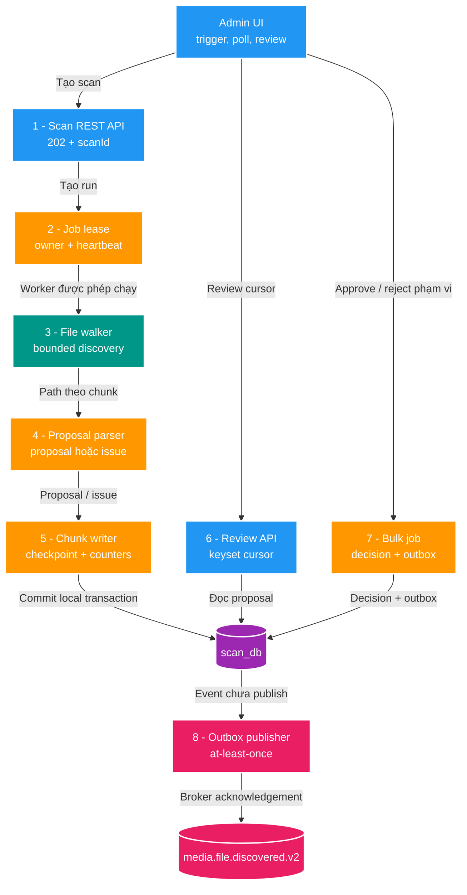
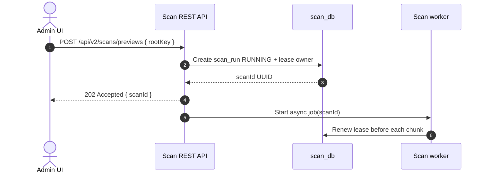
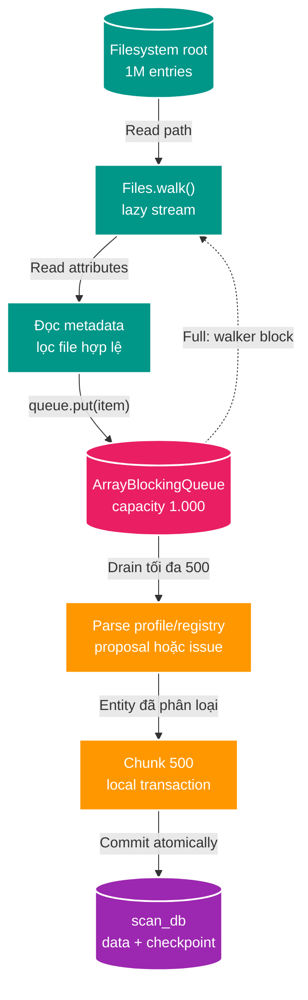
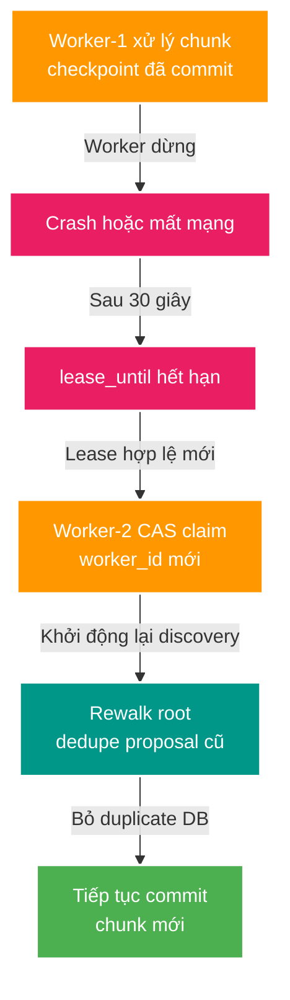
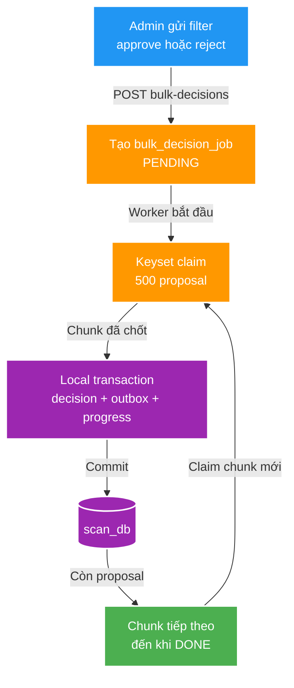
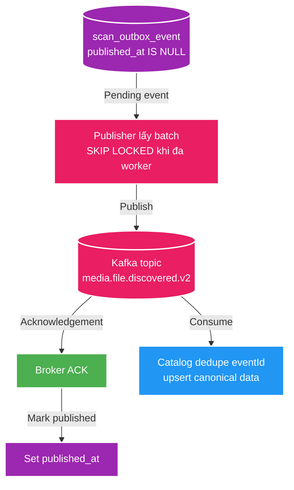

# SC-01 — Chi tiết các luồng và điểm chạm kiến trúc

> Deep-dive triển khai cho SC-01. `01-deep-dive.md` giữ overview; file này trả lời mỗi điểm chạm làm gì, dữ liệu đi đâu và code theo thứ tự nào.
>
> Đây là target architecture thực dụng cho môi trường study/dev. Có thể reset data khi đổi schema; endpoint/schema mới trong tài liệu là mục tiêu của SC-01, không phải baseline đang chạy.

## 1. Bản đồ 8 điểm chạm

Mục tiêu là cắt một scan lớn thành tám trách nhiệm có ranh giới rõ: tạo job, giữ ownership, tìm file, parse, commit chunk, đọc review, bulk decision và publish outbox. Không đưa Kafka vào giữa file walker và database vì proposal/issue vẫn thuộc Scan Service.



| Điểm chạm | Owner/code target | Input → output | Quyết định triển khai |
| --- | --- | --- | --- |
| 1 | `ScanController` + `ScanService` | `POST /api/v2/scans/previews {rootKey}` → `202 {scanId}` | Tạo `scan_run`, giao worker nền, không giữ HTTP request. |
| 2 | `ScanLeaseManager` | `scanId + workerId` → granted/lost | Một `rootKey` có một owner active; worker mất lease dừng trước chunk sau. |
| 3 | `ScanWalker` | root + checkpoint boundary → `Path` chunk | `Files.walk()` đọc lazy; queue bounded `1.000` là buffer giữa discovery và DB. |
| 4 | `ScanFileAnalyzer` | `Path` → proposal/issue | Parse thuần theo profile/registry; không giữ state của toàn run. |
| 5 | `ScanChunkWriter` | tối đa 500 item → commit | Ghi `scan_proposal`/`scan_issue`, checkpoint và counter cùng transaction. |
| 6 | `ScanQueryService` | cursor → trang proposal | Cursor `(source_relative_path, id)`, không OFFSET sâu. |
| 7 | `BulkDecisionJob` | snapshot filter + action → progress | Claim 500 proposal, ghi decision/outbox/progress cùng transaction. |
| 8 | `ScanOutboxPublisher` | `scan_outbox_event` → Kafka | Publish sau commit, đánh dấu `published_at` khi broker ACK; Catalog dedupe `eventId`. |

## 2. Luồng tạo job và lease

API hiện tại đã dùng `rootKey`, `scanId` UUID và `202 Accepted`; SC-01 giữ naming này. Target thêm `worker_id`, `lease_until`, `checkpoint_path` và counters tiến độ vào `scan_run`. Vì đây là dev study, migration có thể reset database thay vì phải tương thích dữ liệu cũ.



Nếu `rootKey` đã có run active thì trả `409 Conflict`. Lease timeout ban đầu là 30 giây; `workerId` và điều kiện CAS trong update lease là fencing đơn giản để worker cũ không tiếp tục ghi sau takeover.

## 3. Discovery, parse và chunk commit

Đây là hot path của SC-01. Một producer đọc path từ filesystem; consumer gom tối đa 500 item rồi persist. Queue không làm scan nhanh hơn; nó tách tốc độ disk I/O khỏi DB I/O và giới hạn heap.



Transaction của một chunk:

1. Insert proposal vào `scan_proposal` và issue vào `scan_issue`.
2. Update `checkpoint_path`, `scanned_file_count`, `proposal_count`, `issue_count` trên `scan_run`.
3. Commit; chỉ sau đó worker mới nhận chunk tiếp.

Unique key `(scan_run_id, source_relative_path)` giữ retry không tạo proposal trùng. Checkpoint là mốc dữ liệu đã commit, không phải filesystem snapshot: implementation dev đầu tiên có thể rewalk từ root và dedupe record đã có sau restart. Resume chính xác theo directory partition chỉ là tối ưu tiếp theo, không chặn touchpoint này.

## 4. Worker crash và lease takeover



Điều cần code là `UPDATE scan_run ... WHERE id = :scanId AND lease_until < now()` để claim, và mọi update chunk mang `worker_id` hiện tại. Không cần cố làm checkpoint path thành cursor hoàn hảo ngay từ đầu; rewalk + unique constraint đủ đơn giản để thông luồng, sau đó mới partition nếu full rewalk trở thành điểm nghẽn thật.

## 5. Review keyset

Baseline `Pageable`/OFFSET được thay bằng cursor. Composite index target là `(scan_run_id, source_relative_path, id)`.

```text
GET /api/v2/scans/{scanId}/proposals?limit=50

SELECT ...
FROM scan_proposal
WHERE scan_run_id = :scanId
ORDER BY source_relative_path, id
LIMIT 50;

GET /api/v2/scans/{scanId}/proposals?limit=50&cursor=<path,id>

SELECT ...
FROM scan_proposal
WHERE scan_run_id = :scanId
  AND (source_relative_path, id) > (:path, :id)
ORDER BY source_relative_path, id
LIMIT 50;
```

Cursor trả về `nextCursor` từ row cuối. UI chỉ cần Next/Previous theo filter/sort cố định; không cần hỗ trợ nhảy đến trang số bất kỳ trong SC-01.

## 6. Bulk decision và transactional outbox

`POST /api/v2/scans/{scanId}/decisions` hiện tại không phù hợp vì materialize toàn bộ proposal. Target API là `POST /api/v2/scans/{scanId}/bulk-decisions`; nó tạo `bulk_decision_job` rồi trả `202 {bulkJobId}`.



Mỗi chunk update/insert các bảng target: `scan_decision`, `scan_outbox_event`, `bulk_decision_job`. Approve tạo event; reject chỉ tạo decision. Phạm vi bulk phải được chốt khi tạo job để UI đổi filter sau đó không làm job đang chạy đổi tập dữ liệu.

## 7. Outbox đến Catalog

Outbox không nằm trong transaction Kafka. Worker lấy event có `published_at IS NULL`, gửi topic `media.file.discovered.v2`, broker ACK xong mới set `published_at`. Nếu process chết giữa hai bước, event có thể publish lại; Catalog xử lý bằng `eventId` nên không tạo asset/subject business trùng.



## 8. Thứ tự lập plan

1. Touchpoint 1–2: mở rộng `scan_run`, API start/status, lease manager và lifecycle worker.
2. Touchpoint 3–5: tách walker, inventory matcher, parser/chunk writer, queue bounded và checkpoint.
3. Touchpoint 6: đổi proposal API sang keyset cursor + composite index.
4. Touchpoint 7: schema/API/worker cho `bulk_decision_job`.
5. Touchpoint 8: upgrade publisher cho bulk backlog và xác nhận event `media.file.discovered.v2` với Catalog.

## Tham chiếu

- [Overview SC-01](./01-deep-dive.md)
- `apps/scan-service/CONTEXT.md`
- `apps/scan-service/.../ScanExecutor.java`, `ScanService.java`, `ScanDecisionService.java`, `ScanOutboxPublisher.java`
- `docs/contracts/openapi/scan-v1.yaml`
