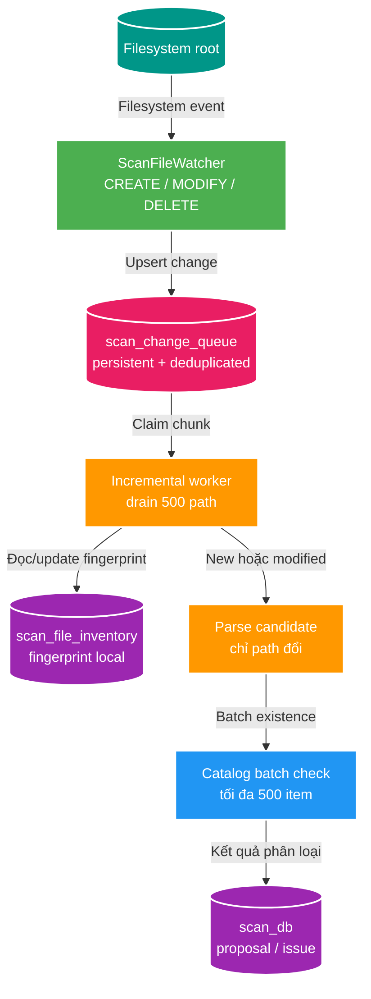

# SC-01 — Incremental scan và khử trùng xuyên service

> Mục tiêu: scan lần đầu một root lớn; những lần sau chỉ xử lý file thêm/sửa/xóa, không gửi lại một triệu record sang Catalog.

`scan-service` sở hữu inventory và change queue trong `scan_db`. `catalog-service` vẫn là owner duy nhất của canonical subject/asset trong `catalog_db`; Scan không join hay đọc trực tiếp database Catalog.

## 1. Nguồn của watcher

Watcher không phải hạ tầng bên ngoài. Nó là `ScanFileWatcher`, component chạy trong `scan-service`, đăng ký theo dõi các directory của từng root cấu hình bằng filesystem watch API của Java/OS.

- Khi có file mới: nhận `CREATE`.
- Khi file thay đổi: nhận `MODIFY`.
- Khi file biến mất hoặc đổi tên: nhận `DELETE`; rename thường là một `DELETE` cũ và một `CREATE` mới.
- Khi có directory mới: đăng ký watcher cho subtree đó ngay.

Watcher chỉ ghi change event vào database, không parse hay gọi Catalog trong watcher thread. Vì vậy event đến dồn dập vẫn chỉ làm queue lớn hơn; worker xử lý theo chunk.

## 2. Kiến trúc incremental



Ví dụ: full scan đầu tiên thấy 1.000.000 entry và seed inventory. Ngày mai thêm hai video; watcher ghi hai `CREATE`, incremental worker parse đúng hai path và gửi một batch Catalog gồm hai item. Không có lần đọc hoặc HTTP check nào cho 999.998 path còn lại.

## 3. Dữ liệu Scan Service sở hữu

```sql
create table scan_file_inventory (
    root_key varchar(100) not null,
    relative_path varchar(2048) not null,
    file_key varchar(512),
    file_size bigint not null,
    modified_at timestamptz not null,
    state varchar(16) not null,
    last_seen_at timestamptz not null,
    primary key (root_key, relative_path)
);

create table scan_change_queue (
    id uuid primary key,
    root_key varchar(100) not null,
    relative_path varchar(2048) not null,
    change_type varchar(16) not null,
    observed_at timestamptz not null,
    claimed_at timestamptz,
    processed_at timestamptz,
    unique (root_key, relative_path)
);
```

`scan_change_queue` deduplicate theo `(root_key, relative_path)`: nhiều `MODIFY` liên tiếp của cùng file chỉ cần một queue item. `change_type` được nâng cấp theo mức mạnh hơn: `DELETE` thắng `MODIFY`; một `CREATE` sau `DELETE` trở thành `UPSERT`.

Fingerprint ban đầu là `size + modifiedAt`, đủ để quyết định có cần parse lại hay không. Không hash file trong Scan; hash là trách nhiệm Media Worker khi cần phân biệt nội dung cùng locator.

## 4. Luồng xử lý từng loại thay đổi

| Event | Worker làm gì | Kết quả Catalog |
| --- | --- | --- |
| `CREATE` | Đọc metadata, upsert inventory, parse. | Batch check; tạo proposal nếu asset/subject cần xử lý. |
| `MODIFY` | So fingerprint; giống thì bỏ qua, khác thì parse lại. | Phân loại asset đã có locator nhưng source thay đổi để review/update sau. |
| `DELETE` | Mark inventory `MISSING`, xóa queue item. | Không tự xóa Catalog asset; để review/reconcile quyết định. |
| Rename | `DELETE old` + `CREATE new`. | Locator mới được batch check; có thể là asset mới hoặc move cần review. |
| Directory `CREATE` | Register watcher cho subtree, enqueue subtree scan. | Từng file con vẫn đi qua inventory/batch flow. |

## 5. Full scan chỉ còn là seed và reconcile

Full walk vẫn cần hai thời điểm:

1. Root chưa có inventory: seed toàn bộ `scan_file_inventory`.
2. Watcher báo `OVERFLOW`, service restart hoặc admin yêu cầu reconcile: walk lại root, upsert fingerprint và đánh dấu entry không còn xuất hiện là `MISSING`.

Nó không phải đường chạy hàng ngày. Ngay cả full reconcile cũng chỉ gửi Catalog batch check cho path mới/đổi fingerprint; path không đổi dừng ở inventory local.

## 6. Catalog batch existence check

Catalog không nhận một triệu path; chỉ nhận candidate đã qua inventory. Contract target là internal API, ví dụ:

```text
POST /internal/v2/catalog/scan-existence
```

```json
{
  "scanRunId": "UUID",
  "storageKey": "fixture-joke-video",
  "items": [
    {
      "clientRef": "UUID",
      "relativePath": "Actress - [START-001].mp4",
      "region": "JOKE",
      "subjectType": "VIDEO",
      "identityKey": "START-001",
      "assetRole": "PRIMARY_VIDEO"
    }
  ]
}
```

Catalog lookup theo hai khóa:

| Status trả về | Ý nghĩa | Scan làm gì |
| --- | --- | --- |
| `EXACT_ASSET_EXISTS` | Có `storageKey + relativePath` đúng locator. | Skip proposal. |
| `EXISTING_SUBJECT_NEW_ASSET` | Subject identity có rồi nhưng locator chưa có. | Tạo proposal thêm asset. |
| `NEW_SUBJECT` | Chưa có subject/asset tương ứng. | Tạo proposal mới. |
| `CONFLICT` | Locator hoặc identity không thể auto quyết định. | Tạo proposal review. |

`media_asset` cần index theo `(storage_key, relative_path)`. Với data dev reset được, có thể thêm unique partial index cho locator có `storage_key` để Catalog chặn race ở write-side; legacy asset không có storage key không nằm trong invariant này.

## 7. Chốt cuối tại Catalog

Batch check chỉ giảm rác proposal. Sau approval, Scan ghi decision và outbox cùng transaction rồi publish `media.file.discovered.v2`; Catalog consumer vẫn dedupe theo `eventId` và kiểm tra locator/subject khi ghi canonical data. Điều này bảo vệ race: hai worker cùng thấy path chưa tồn tại thì Catalog vẫn chỉ chấp nhận một kết quả canonical.

## 8. Thứ tự implement

1. Schema `scan_file_inventory` và full scan seed inventory.
2. `ScanFileWatcher` đăng ký root/subdirectory, ghi `scan_change_queue`.
3. Incremental worker claim queue + cập nhật inventory + parser.
4. Internal Catalog batch existence contract, index locator và classification response.
5. Nối proposal/approval/outbox hiện có vào classification mới.

## Tham chiếu

- [Overview SC-01](./01-deep-dive.md)
- [Touchpoint 3.5 trong luồng chính](./02-architecture-touchpoints-and-flows.md)
- `apps/scan-service/CONTEXT.md`
- `apps/catalog-service/CONTEXT.md`
