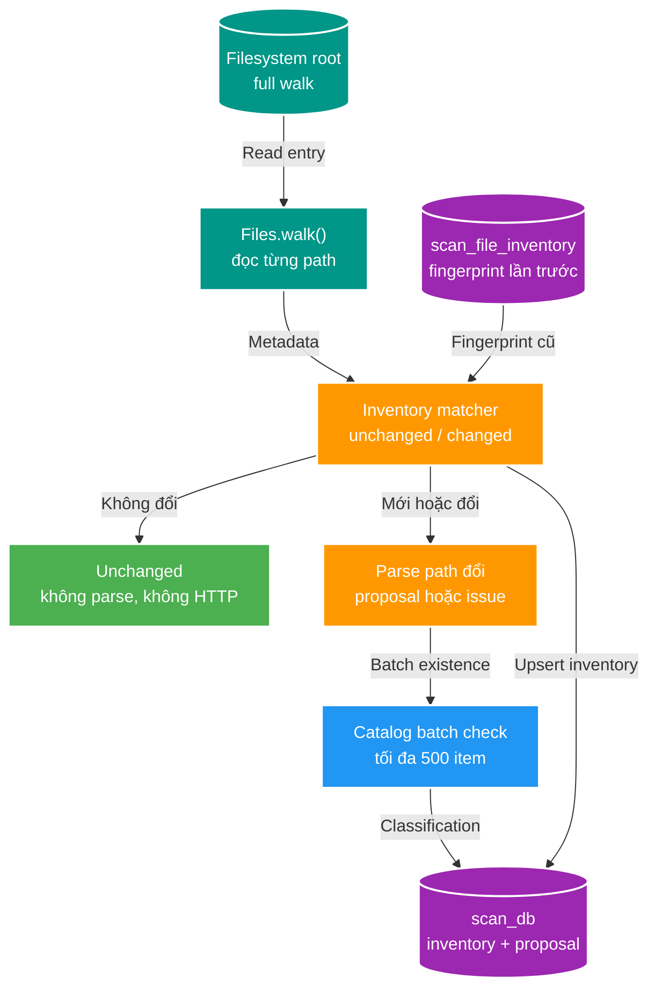

# SC-01 — Full scan có inventory và khử trùng xuyên service

> Mục tiêu: mỗi lần vẫn duyệt filesystem để nhìn đúng trạng thái thực tế, nhưng không parse, ghi proposal hay gọi Catalog cho file không đổi.

Không dùng watcher. Đây là baseline đơn giản: `scan-service` full walk root, đối chiếu inventory của chính nó trong `scan_db`, rồi chỉ gửi tập path mới/đổi sang Catalog batch check.

## 1. Luồng xử lý



Ví dụ: hôm nay root có 1M file và inventory được seed. Ngày mai full walk vẫn đọc 1M directory entry, nhưng với 999.998 file có fingerprint không đổi, worker chỉ update dấu `last_seen` theo batch; chỉ 2 file mới đi qua parser và một Catalog batch gồm 2 item.

## 2. Inventory Scan Service sở hữu

```sql
create table scan_file_inventory (
    root_key varchar(100) not null,
    relative_path varchar(2048) not null,
    file_size bigint not null,
    modified_at timestamptz not null,
    state varchar(16) not null,
    last_seen_run_id uuid not null,
    primary key (root_key, relative_path)
);
```

Fingerprint baseline là `(file_size, modified_at)`:

| So với inventory | Worker xử lý |
| --- | --- |
| Không có row | File mới: parse và Catalog check. |
| Size + modified time giống | Bỏ qua parser/Catalog; update `last_seen_run_id`. |
| Khác fingerprint | File thay đổi: parse lại và Catalog check. |
| Row inventory không được thấy trong full run | Mark `MISSING`; không tự xóa Catalog asset. |

Không hash file ở Scan. Nếu locator giống nhưng nội dung thực sự cần kiểm chứng, Media Worker xử lý hash trong flow riêng.

### Precision của `modified_at` là một phần của fingerprint contract

Filesystem trên Windows có thể trả timestamp chi tiết đến 100 ns, trong khi PostgreSQL lưu `timestamptz` ở precision microsecond. Nếu matcher lấy `toEpochMilli()` trên hai giá trị chưa cùng precision, một timestamp filesystem như `...54.2029999Z` có thể được PostgreSQL làm tròn thành `...54.203000Z`: hai giá trị chỉ lệch 100 ns nhưng floor millisecond lần lượt thành `202` và `203`. Warm rescan khi đó nhận nhầm file không đổi là `NEW_OR_CHANGED` và tạo proposal/issue rác.

`ScanInventoryItem` vì vậy chuẩn hóa timestamp filesystem theo precision microsecond trước cả lookup và upsert. Matcher so sánh `Instant` đã chuẩn hóa; không dùng tolerance tùy ý vì tolerance có thể che mất một thay đổi thật. Precision phải là policy deterministic và dùng cùng một cách ở hai phía của persistence round-trip.

## 3. Chunk database không nổ memory

Không load cả inventory 1M row vào `HashMap`. File walker gom tối đa 500 path; repository lấy inventory cho đúng 500 `(rootKey, relativePath)` đó, so fingerprint rồi flush cập nhật/proposal theo cùng batch.

Với file không đổi, chỉ có local DB read/update. Với file mới/đổi, worker mới dựng candidate để gọi Catalog. Vì thế full scan có I/O filesystem, nhưng cross-service traffic và proposal volume tỷ lệ theo số file thay đổi.

## 4. Catalog batch existence check

Catalog là owner của canonical asset/subject. Scan gửi một batch tối đa 500 candidate đã thay đổi qua internal API target:

```text
POST /internal/v2/catalog/scan-existence
```

```json
{
  "scanRunId": "UUID",
  "storageKey": "fixture-joke-video",
  "items": [
    {
      "clientRef": "UUID",
      "relativePath": "Actress - [START-001].mp4",
      "region": "JOKE",
      "subjectType": "VIDEO",
      "identityKey": "START-001",
      "assetRole": "PRIMARY_VIDEO"
    }
  ]
}
```

Catalog lookup theo locator `storageKey + relativePath` và semantic subject identity. Response phân loại:

| Status | Ý nghĩa | Scan làm gì |
| --- | --- | --- |
| `EXACT_ASSET_EXISTS` | Locator canonical đã có. | Skip proposal. |
| `EXISTING_SUBJECT_NEW_ASSET` | Subject có rồi, locator mới. | Tạo proposal thêm asset. |
| `NEW_SUBJECT` | Chưa có subject/asset. | Tạo proposal mới. |
| `CONFLICT` | Không thể auto quyết định. | Tạo proposal review. |

`media_asset` cần index `(storage_key, relative_path)`; data dev có thể reset để bổ sung unique partial index cho locator có `storage_key`.

## 5. Rename, delete và canonical Catalog

- Rename path: full scan thấy path mới là `NEW/MODIFIED`, path cũ thành `MISSING`. Đây là locator mới, tạo proposal để review thay vì cố đoán rename.
- Delete: chỉ mark inventory `MISSING`; Scan không tự xóa asset canonical ở Catalog.
- Sau approval, Scan ghi decision và outbox cùng transaction; Catalog consumer vẫn dedupe `eventId` khi nhận `media.file.discovered.v2`. Batch check chỉ giảm proposal rác, không thay write-side idempotency.

## 6. Thứ tự implement

1. Thêm `scan_file_inventory`; full scan seed inventory và mark `MISSING` cuối run.
2. Đổi `ScanExecutor` sang chunk lookup inventory, chỉ parse path mới/đổi fingerprint.
3. Thêm internal Catalog batch existence contract và index locator.
4. Gắn classification vào proposal/approval/outbox hiện có.

## 7. Update FT-025 — Staging reconciliation sửa write amplification

Các mục 1–6 ghi lại baseline BT-02/BT-03: `last_seen_run_id` giúp phát hiện file không xuất hiện nhưng buộc warm scan rewrite toàn bộ inventory. Evidence ngày 2026-08-07 cho root một triệu file: run không đổi tạo `0` proposal và `0` issue nhưng vẫn update đúng 1.000.000 row inventory, kéo dài khoảng 80 giây. Đây là giới hạn được sửa bổ sung, không viết lại lịch sử FT-024 như chưa từng tồn tại.

[FT-025](../../../../../docs/features/025-inventory-staging-reconciliation/01-brief.md) tách hai trách nhiệm:

- `scan_inventory_stage` là snapshot scratch của các path worker đã thấy trong run; pgJDBC `COPY FROM STDIN` ghi theo chunk bounded-memory.
- `scan_file_inventory` chỉ giữ state durable và chỉ insert/update file mới, fingerprint đổi hoặc `MISSING` tái xuất hiện.
- Finalization đã validate lease dùng anti-join staging để mark `MISSING`, sau đó xóa staging và complete run trong cùng transaction.
- `last_seen_run_id` cùng index bị xóa vì staging đã sở hữu semantics “đã thấy trong run”; giữ cột sẽ tiếp tục ép một triệu update không cần thiết.

### Update FT-025.1 — Batch reconciliation sau khi đo runtime

Implementation FT-025 đầu tiên vẫn dùng chunk 500 của FT-024 nên warm scan một
triệu file còn tạo 2.000 lookup/COPY/checkpoint transaction. Runtime quan sát là
khoảng 69,7 giây, trong khi benchmark filesystem thuần chỉ mất 17,832 giây.

Reconciliation batch nội bộ được tăng lên 10.000 file: vẫn bounded-memory nhưng
chỉ còn tối đa 100 transaction cho một triệu file. Con số này không thay đổi
Catalog batch tối đa 500 candidate của BT-04 vì đó là contract cross-service có
failure/latency budget khác.

### Update FT-025.2 — Streaming segment 500.000 và set-based diff

Benchmark `walkFileTree + BasicFileAttributes + indexed COPY` đạt 2,890 giây cho
một triệu fixture row. Implementation tiếp tục loại transaction amplification:

- Producer `walkFileTree` đưa item qua queue bounded 1.024 phần tử.
- Consumer stream tối đa 500.000 row vào mỗi COPY; không tạo list 500.000 item.
- Mỗi segment commit staging, progress/checkpoint và lease với conditional fence
  ở cuối transaction.
- Sau discovery, PostgreSQL join staging–inventory và keyset riêng file changed;
  Java không lookup mọi seen path bằng câu `IN`.
- Changed data vẫn commit theo chunk 10.000; Catalog batch 500 không đổi.

Một triệu file cần khoảng hai discovery COPY hữu ích; mười triệu file khoảng hai
mươi segment. Đây là cấu hình implementation hiện tại, không phải public contract
hay SLO đã xác nhận.

### Update FT-025.3 — Khi index tồn tại nhưng query vẫn gần O(N²)

Run `cb6ed18e...` đã discovery đủ 27.122 file nhưng reconciliation chạy hơn hai
phút. PostgreSQL plan của LEFT JOIN chỉ dùng `root_key='album'` trên index
`(root_key, source_relative_path)`; path là join filter. Với mỗi staging row, DB
gần như scan toàn inventory của root. Statistics staging còn báo 0 row nên planner
tin nested loop này rẻ. Run cuối cùng `FAILED` sau 5 phút 45 giây do lease hết hạn.

Fix gồm hai phần:

- `ANALYZE scan_inventory_stage` sau bulk discovery để cardinality phản ánh run.
- Keyset staging tối đa 25.000 row mỗi query; correlated lookup dùng đúng
  composite key để subplan có index condition trên cả root và path. Đây là
  effective page size hiện tại; `business-chunk-size=100k` chỉ là upper bound.
- Page không có file changed vẫn heartbeat lease, nên warm scan lớn không hết
  lease chỉ vì Java không có business chunk để commit.

Bài học: “có index” không đủ; phải đọc execution plan xem toàn bộ key có nằm trong
`Index Cond` hay bị rơi xuống `Join Filter`/`Filter`.

Staging là `UNLOGGED`: giảm WAL cho dữ liệu có thể tái tạo, nhưng bị truncate sau database crash. Điều đó không làm inventory canonical sai; run gián đoạn phải fail và run mới walk lại filesystem. Tối ưu này loại bỏ inventory write amplification, không loại bỏ full filesystem walk nên throughput mới vẫn phải benchmark.

## Tham chiếu

- [Overview SC-01](./01-deep-dive.md)
- [Luồng scan chính](./02-architecture-touchpoints-and-flows.md)
- [FT-025 — Inventory staging reconciliation](../../../../../docs/features/025-inventory-staging-reconciliation/03-plan.md)
- `ScanInventoryItem`, `ScanInventoryMatcher`
- `apps/scan-service/CONTEXT.md`
- `apps/catalog-service/CONTEXT.md`
