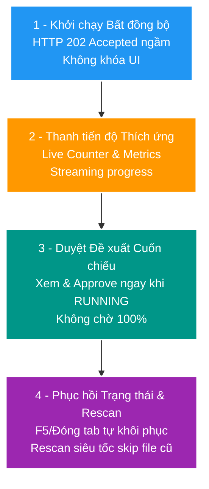
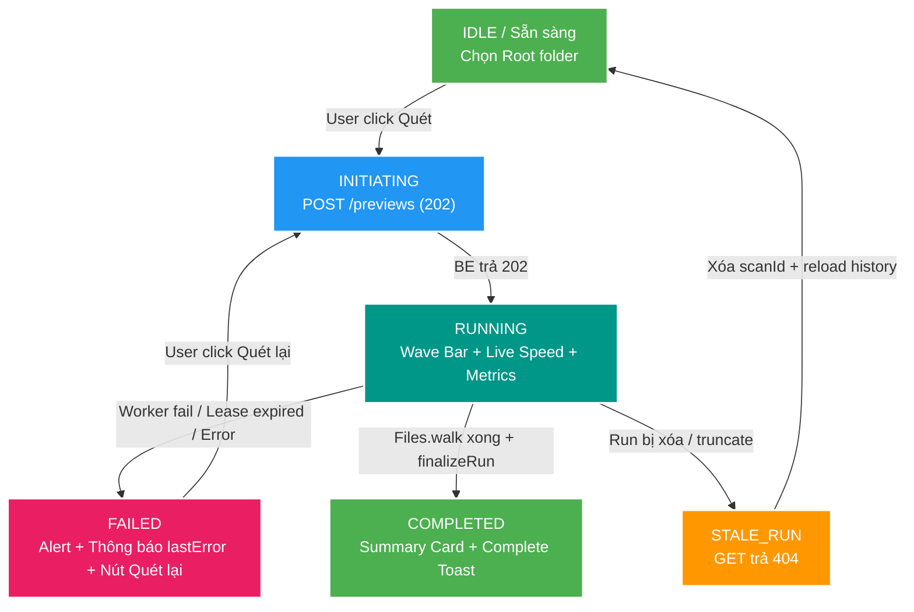

# SC-01 — UI/UX Solution Behavior (Trải nghiệm người dùng cho Quét 1 Triệu File)

> Tài liệu này chuẩn hóa **Phương án Giải pháp Giao diện & Trải nghiệm Người dùng (Frontend UI/UX Solution Behavior)** cho bài toán quét 1 triệu file filesystem (SC-01), tiêu thụ trực tiếp các khả năng kỹ thuật đã được xây dựng từ **BT-01 (Durable scan run & lease)**, **BT-02 (File inventory seed)** và **BT-03 (Inventory matcher)**.

---

## 1. Triết lý Thiết kế UX cho Quy mô 1 Triệu File

Vấn đề cốt lõi của bài toán Quét 1 Triệu File trên Frontend (FE):
- **Thời gian chạy**: Quét đĩa 1 triệu file tốn từ vài chục giây đến vài phút tùy tốc độ đĩa/NAS.
- **Trải nghiệm người dùng kém nếu**: Khóa màn hình (Synchronous blocking), hiện Spinner xoay vĩnh viễn, đơ tab, hoặc bắt người dùng đợi quét xong 100% mới được duyệt.

### 4 Trụ cột Solution Behavior



---

## 2. Chi tiết 4 Luồng Trải nghiệm Người dùng (UI Flow)

### 2.1 Luồng Khởi chạy Bất đồng bộ (Async Initiation)

- **Thao tác**: Người dùng chọn Root folder (ví dụ: `JOKE_VIDEO` - Path: `/media/store/joke`) và bấm nút **"Bắt đầu Quét"**.
- **Tương tác UI**:
  1. FE gửi `POST /api/v2/scans/previews` kèm `{ "rootKey": "joke_root" }`.
  2. BE thực hiện lấy snapshot registry từ Catalog (nếu cần), tạo `ScanRun` record trong `scan_db`, gán worker ngầm, và trả về **`HTTP 202 Accepted`** kèm `scanRunId` ngay sau khi tạo run.
  3. Màn hình FE **lập tức chuyển sang View Chi tiết đợt scan (`/scans/{scanRunId}`)** hoặc thu nhỏ thành **Floating Status Card** ở góc phải dưới màn hình.
  4. Người dùng hoàn toàn tự do chuyển tab, duyệt Gallery, hoặc làm việc khác.

---

### 2.2 Luồng Thanh Tiến Độ & REST Contract Alignment

FE V2 thực hiện **Short Polling** `GET /api/v2/scans/{scanRunId}` mỗi **3 giây** trong baseline hiện tại. Mỗi nhịp là one-shot timer: chỉ lên lịch nhịp kế tiếp sau khi request hiện tại kết thúc để không có hai poll cùng run chạy chồng nhau.

> **Future evolution:** SSE có thể thay polling sau khi có event schema, reconnect/heartbeat và connection policy riêng. SSE chưa thuộc BT-03 và không phải contract hiện hành.

#### REST Contract Hiện hành (Baseline):
Dữ liệu chuẩn `ScanRunView` do `GET /api/v2/scans/{scanRunId}` trả về:
```json
{
  "id": "e45d8fd4-3343-410f-affe-d15f5476d06f",
  "rootKey": "joke_root",
  "profile": "JOKE_VIDEO",
  "status": "RUNNING",
  "startedAt": "2026-08-07T07:15:10Z",
  "finishedAt": null,
  "scannedFileCount": 345500,
  "proposalCount": 12300,
  "issueCount": 145,
  "lastError": null,
  "registryVersion": 100
}
```

#### 🔸 Chế độ Tiến độ Hiện tại (Dựa trên Contract hiện hành)
- **Giao diện FE**:
  - **Thanh Progress Bar**: Dải màu Gradient chạy động (Indeterminate Wave Loader) thể hiện công việc đang thực hiện ngầm.
  - **Bộ đếm Thực tế (Live Metrics Panel)**:
    - 📄 **Đã quét**: `345,500` file vật lý (tăng liên tục theo `scannedFileCount`).
    - 🚀 **Tốc độ ước tính**: `~8,500 file/giây` (FE tự tính: `scannedFileCount / elapsedTime`).
    - 💡 **Đề xuất hợp lệ**: `12,300` | ⚠️ **Lỗi Naming**: `145`.

#### 🔸 Đề xuất Mở rộng Contract cho Chế độ Warm Scan (Tùy chọn tương lai)
> *Lưu ý: Các trường như `skippedFileCount` hoặc `estimatedTotalFiles` chưa có trong REST Contract hiện tại. Nếu mở rộng API ở nấc sau, FE có thể render thanh % chính xác và chỉ số skipped.*

---

### 2.3 Luồng Duyệt Đề xuất Cuốn chiếu (Incremental Progressive Review)

Người dùng **KHÔNG CẦN CHỜ** quét xong 1 triệu file. Nhờ cơ chế `commitChunk` độc lập của BE (mỗi chunk 500 item), các đề xuất được flush liên tục vào database.

- **Giao diện FE (Split-View Dashboard)**:
  - **Nửa trên**: Khung tiến độ Scan (Progress Banner).
  - **Nửa dưới**: Bảng danh sách Đề xuất (offset pagination hiện tại; keyset là BT-06).
- **Hành vi Tương tác**:
  - Mặc dù đợt scan đang ở trạng thái `status: "RUNNING"`, bảng danh sách đề xuất vẫn cho phép người dùng xem, lọc, và bấm **Approve / Reject** các item đã xuất hiện.
  - Mỗi hành động Duyệt gọi API `POST /api/v2/scans/{scanId}/proposals/{proposalId}/decision` (hoặc Bulk Decision).
  - Baseline gọi API với `page/size`; nút **"Trang tiếp"** dùng pagination hiện tại. Cursor/keyset và append khi scroll chỉ mở ở BT-06.

---

### 2.4 Luồng Rescan Siêu Tốc & Quản lý File Bị Xóa (Warm Rescan & Missing Handling — BT-03)

Nhờ **BT-03 (Inventory Matcher)**:
- **Quét lại (Rescan / Start New Scan)**:
  - Khi bấm **"Quét lại"**, hệ thống khởi tạo đợt scan mới (`POST /api/v2/scans/previews`).
  - BE thực hiện **Full Walk toàn bộ root**, nhưng tự động **bỏ qua (skip parse)** các file không thay đổi metadata `(fileSize, modifiedAt)` so với kho inventory đã seed từ đợt scan trước.
  - Cơ chế này có thể giảm chi phí parse ở warm scan; mức cải thiện phải đo bằng benchmark, chưa được mặc định là “nhanh hơn nhiều lần”.

- **Hiển thị File bị Xóa khỏi Ổ đĩa (`MISSING`) — Read-Only Badge**:
  - Sau khi scan kết thúc thành công, BE chạy `markMissing` cập nhật `state = 'MISSING'` trong `scan_file_inventory` cho các file vật lý không còn xuất hiện trên đĩa.
  - **Ranh giới Ownership**: `scan-service` chỉ quản lý inventory trong `scan_db` và **không tự động dọn dẹp asset trong `catalog_db`**.
  - **FE UI Badging (Read-Only, future read model)**: Khi có API/read model Inventory riêng, các file bị xóa được đánh dấu Badge cảnh báo tĩnh:
    - 🔴 `[MISSING - Không tìm thấy trên đĩa]`
    - *Ghi chú UI*: Đây là thông tin tra cứu read-only. Việc dọn dẹp hoặc gỡ bỏ asset ở Catalog là luồng nghiệp vụ riêng ở các Phase sau.

---

## 3. Khôi phục Trạng thái (Resilience & Error Handling)

### 3.1 Trường hợp 1: Người dùng F5 / Refresh Trình duyệt / Đóng Tab

- **BE**: Đợt scan vẫn chạy ngầm dưới executor cấu hình virtual thread; lease được gia hạn theo từng chunk với `leaseDurationSeconds` của service (mặc định 60 giây).
- **FE**:
  - Khi người dùng mở lại trang `/scans/{scanId}`:
  - FE gọi `GET /api/v2/scans/{scanId}`.
  - Nhận được `status: "RUNNING"`, `scannedFileCount: 890,000`.
  - Tiến độ tiếp tục hiển thị mà không bị mất bối cảnh hay đứt đoạn.

### 3.2 Trường hợp 2: Worker Fail / Lease Expired (`status: FAILED`)

- **BE**: Domain state của Backend chỉ có `RUNNING`, `COMPLETED`, `FAILED`. Nếu worker bị crash hoặc lease hết hạn, `ScanService` cập nhật `status = FAILED` kèm thông báo lỗi trong `lastError` (ví dụ: `"Lease expired or worker lost control"`).
- **FE**:
  - Nhận `status: "FAILED"`, đọc `lastError` và hiển thị Alert Box trên Dashboard:
    > ⚠️ **Đợt quét thất bại hoặc bị gián đoạn**  
    > Nguyên nhân: `lastError` (ví dụ: Worker timeout / Hết hạn lease).  
    > `[ 🔄 Bấm để Quét lại (Rescan) ]`
  - **Lưu ý về Resume**: Hệ thống không có endpoint resume từ checkpoint path lẻ. Nút **"Quét lại"** sẽ tạo đợt scan mới và thực hiện full walk lại root; nhờ BT-03, các file có inventory không đổi được skip parser. Hiệu quả warm scan phải được đo riêng.

### 3.3 Trường hợp 3: Run không còn tồn tại (`404` sau truncate/reset dữ liệu dev)

- `404` từ `GET /api/v2/scans/{scanId}` có nghĩa navigation state phía browser đã stale; đây không phải `FAILED` và FE không được tiếp tục poll ID đó.
- FE dừng timer, vô hiệu hóa response đang bay của selection cũ, xóa `scanId` khỏi URL rồi reload `GET /api/v2/scans?page=0&size=10`.
- Nếu còn run gần đây, FE chọn run mới nhất. Nếu lịch sử rỗng, FE về empty state và vẫn giữ root picker/nút **Bắt đầu Quét** hoạt động.
- Deep-link hợp lệ phải được xác minh bằng `GET /api/v2/scans/{scanId}`; không được kết luận “không tồn tại” chỉ vì ID không nằm trong trang 10 run gần nhất.

---

## 4. Sơ đồ Trạng thái UI chuẩn hóa theo Domain State

Domain chỉ có `RUNNING`, `COMPLETED`, `FAILED`; `IDLE`, `INITIATING` và `STALE_RUN` là trạng thái UI tạm thời, không được gửi ngược thành domain state.



---

## 5. Wireframe Mô phỏng Màn hình FE (`/scans/{scanId}`)

```text
+-----------------------------------------------------------------------------------------+
|  📂 SCAN DASHBOARD — Root key: joke_root · Profile: JOKE_VIDEO                          |
+-----------------------------------------------------------------------------------------+
|                                                                                         |
|  [Trạng thái: 🟢 DANG QUET NGAM]  ──  Đợt scan #e45d8fd4                               |
|                                                                                         |
|  Tiến độ Đang chạy (Indeterminate Stream):                                             |
|  [▒▒▒▒▒▒▒▒▒▒▒▒▒▒▒▒▒▒▒▒▒▒▒▒▒▒▒▒▒▒▒▒▒▒▒▒▒▒▒▒▒▒▒▒▒▒▒▒▒▒▒▒▒▒▒]                              |
|                                                                                         |
|  📊 Metric thời gian thực (Contract Baseline):                                         |
|  +---------------------+ +---------------------+ +-------------------------------------+ |
|  | 📄 ĐÃ QUÉT          | | 💡 ĐỀ XUẤT MỚI      | | ⚠️ LỖI NAMING                       | |
|  | 459,000 file        | | 14,250 item         | | 120 file                            | |
|  | Tốc độ: ~9,200 f/s  | | (Sẵn sàng duyệt)    | | (Cần kiểm tra)                      | |
|  +---------------------+ +---------------------+ +-------------------------------------+ |
|                                                                                         |
+-----------------------------------------------------------------------------------------+
|  📋 DANH SÁCH ĐỀ XUẤT (Offset baseline; Keyset ở BT-06)   [✓ Duyệt chọn (0)]                 |
+-----------------------------------------------------------------------------------------+
|  [ ] | Path File Vật Lý                           | Code      | Trạng thái | Thao tác  |
|  ----+--------------------------------------------+-----------+------------+-----------|
|  [ ] | Studio/Actress/A - [JOKE-001].mp4          | JOKE-001  | 🟡 PENDING | [Approve] |
|  [ ] | Studio/Actress/B - [JOKE-002].mp4          | JOKE-002  | 🟡 PENDING | [Approve] |
|  [ ] | Cover - [JOKE-003].jpg                     | JOKE-003  | 🟡 PENDING | [Approve] |
|                                                                                         |
|  < Trang 1 / 285 >   [◄ Trước] [Sau ►]    (Polling chỉ cập nhật trạng thái scan...)       |
+-----------------------------------------------------------------------------------------+
```

---

## 6. Tổng kết Mapping giữa BT Backend và FE Behavior

| Break Task (BE) | Tính năng Backend tương ứng | Trải nghiệm UI/UX trên Frontend |
| :--- | :--- | :--- |
| **BT-01** | Durable Scan Run, Worker Lease & Checkpoint | KHÔNG khóa UI. Khởi chạy 202 Accepted ngầm. Polling tiến độ ngầm. F5/Fail tự khôi phục hiển thị. |
| **BT-02** | File Inventory Seed (`scan_file_inventory`) | Hiển thị Live Metrics Panel (`scannedFileCount`, `proposalCount`, `issueCount`, Tốc độ f/s). |
| **BT-03** | Inventory Matcher (Skip unchanged + Mark Missing) | **Warm rescan**: Full walk lại nhưng skip parse file không đổi. Badge `MISSING` chỉ là future UI sau khi có inventory API/read model; không suy diễn từ Proposal hiện tại. |
| **BT-06** *(Sắp làm)* | Keyset Review Cursor `(source_relative_path, id)` | Phân trang bảng Proposal siêu mượt bằng cursor, không bị đơ database khi xem từ trang 1 đến trang 20,000. |
| **BT-07** *(Sắp làm)* | Bulk Decision Job Chunked | Duyệt hàng loạt (Approve 10,000 item) chạy job ngầm với thanh tiến độ Bulk Progress riêng. |

> **Kênh cập nhật trạng thái:** polling là baseline của BT-01–BT-03; SSE là evolution riêng sau khi chốt event contract và reconnect semantics.
