# SC-01 — Khung mục tiêu hiệu năng & Chỉ số SLO (1 Triệu Bản Ghi)

Ngày cập nhật: 2026-08-15  
Phạm vi: Toàn bộ pipeline SC-01 quy mô **1.000.000 files/records** xuyên suốt 3 service: `scan-service` $\rightarrow$ `catalog-service` $\rightarrow$ `query-service`.

---

## 1. Bối cảnh & Nguyên tắc thiết lập SLO cho 1.000.000 Bản ghi

Quy mô 1 triệu bản ghi tương đương với khối lượng dữ liệu thô khoảng **1.5 GB – 2.5 GB** (bao gồm metadata, B-Tree indexes, evidence text và WAL write logs). Việc thiết lập SLO dựa trên 3 nguyên tắc:
1. **Dựa trên giới hạn vật lý phần cứng**: NVMe SSD I/O, RAM Page Cache, CPU B-Tree compute và Network bandwidth.
2. **Dựa trên trải nghiệm người dùng thực tế**: Phân định rõ ràng giữa các mốc *Interactive (< 30s)*, *Background Batch (< 2 phút)* và *Deep Content Extraction (vài giờ)*.
3. **Tách biệt ranh giới critical path**: Phân biệt mốc `QUERY_DB_READY` (PostgreSQL + Redis) với `SEARCH_READY` (Elasticsearch bulk async).

---

## 2. Bảng chỉ số SLI / SLO chính thức (Workload 1.000.000 Records)

```text
Pipeline E2E cho 1.000.000 Bản ghi:
[1M Files on Disk] --(SLI-01/02)--> [Scan DB: 1M Proposals] --(SLI-03)--> [Catalog DB: ~150k Subjects] --(SLI-03)--> [Query DB & Redis]
                                                                                                          `--(SLI-04)--> [Elasticsearch]
```

| Mã SLI | Nghiệp vụ thực thi | Phạm vi kỹ thuật & Cơ chế tối ưu | Target SLO (P90) | Ngưỡng chặn (P99) | Throughput toàn tuyến | Đánh giá trạng thái |
| :--- | :--- | :--- | :--- | :--- | :--- | :--- |
| **`SLI-01`** | **Cold Scan 1M Files** | Quét lần đầu: `walkFileTree` $\rightarrow$ COPY Staging $\rightarrow$ Set-based SQL Diff $\rightarrow$ 8 Virtual Threads Parse $\rightarrow$ Fast-path inventory $\rightarrow$ COPY Proposals. | **$\le$ 30.0s** | **$\le$ 45.0s** | $\ge 33.000$ files/s | **`ĐẠT`** (Thực tế đạt **25.76s** ~ 39k/s) |
| **`SLI-02`** | **Warm Scan 1M Files** | Quét định kỳ: `walkFileTree` $\rightarrow$ Staging COPY $\rightarrow$ Diff SQL với inventory hiện có (0 changed) $\rightarrow$ Hoàn tất. | **$\le$ 8.0s** | **$\le$ 12.0s** | $\ge 125.000$ files/s | **`ĐẠT`** (~5.5s - 7.0s) |
| **`SLI-03`** | **Approve 1M Records** | Bấm Approve All $\rightarrow$ Scan Outbox $\rightarrow$ Kafka (1M) $\rightarrow$ Catalog Coalesce (~150k subjects) $\rightarrow$ Kafka (150k) $\rightarrow$ Query Bulk Upsert (`QUERY_DB_READY`). | **$\le$ 30.0s** | **$\le$ 45.0s** | $\ge 33.000$ records/s | **`MỤC TIÊU TỐI ƯU`** (Yêu cầu Batch & Coalesce) |
| **`SLI-04`** | **Search Ready 1M Records** | Query Search Outbox $\rightarrow$ Elasticsearch Bulk API (8 threads) $\rightarrow$ Index đồng bộ hoàn tất (`SEARCH_READY`). | **$\le$ 60.0s** | **$\le$ 90.0s** | $\ge 15.000$ docs/s | **`ASYNC LANE`** (Chạy nền, không block UI) |

---

## 3. Giới hạn vật lý của từng tầng phần cứng cho 1.000.000 Bản ghi

```mermaid
flowchart TD
    subgraph Storage["1. TẦNG LƯU TRỮ (Đọc 1M Inodes)"]
        direction TB
        S1["HDD SATA: 150 IOPS -> 1.5 - 2 GIỜ"]
        S2["NVMe PCIe 4.0 (Cold): 50k-100k IOPS -> 10 - 15 GIÂY"]
        S3["NVMe / RAM Page Cache (Warm): 50 GB/s -> 0.5 - 1.5 GIÂY"]
    end

    subgraph DB["2. TẦNG POSTGRESQL (Ghi 1M Rows + 6 Indexes)"]
        direction TB
        D1["JPA per-row: 1k-2k rows/s -> 8 - 15 PHÚT"]
        D2["JDBC Batch (1000): 25k-35k rows/s -> 30 - 45 GIÂY"]
        D3["PostgreSQL Direct COPY: 100k-150k rows/s -> 7 - 10 GIÂY"]
        D4["Parallel COPY (4-8 partitions): 300k-500k rows/s -> 2 - 3.5 GIÂY"]
    end

    subgraph Streaming["3. TẦNG KAFKA (500MB Payload / 1M Events)"]
        direction TB
        K1["1 Partition (acks=all): 20k-30k msgs/s -> 35 - 50 GIÂY"]
        K2["12-24 Partitions + Snappy Batch: 250k-500k msgs/s -> 2 - 4 GIÂY"]
    end

    subgraph Cache["4. TẦNG CACHE & SEARCH (1M Items)"]
        direction TB
        C1["Redis DEL tuần tự: 10k ops/s -> 100 GIÂY"]
        C2["Redis Generation Prefix Switch: -> 0.001 GIÂY (Tức thì)"]
        E1["Elasticsearch Bulk API (8 threads): 30k-50k docs/s -> 20 - 30 GIÂY"]
    end
```



---

## 4. Phân rã ngân sách thời gian cho 1.000.000 Bản ghi

### 4.1. Ngân sách cho Cold Scan 1M Files (Tổng ngân sách: 30.0 giây)

| Chặng thực thi | Công nghệ / Phương pháp áp dụng | Thời gian mục tiêu | Tỷ trọng |
| :--- | :--- | :---: | :---: |
| 1. Filesystem Discovery | `walkFileTree` streaming metadata qua pipe | 5.0s | 16.7% |
| 2. PostgreSQL Staging Write | Direct PostgreSQL `COPY FROM STDIN` (Unlogged table) | 3.0s | 10.0% |
| 3. Set-based SQL Diff | `INSERT ... SELECT` kết hợp Anti-join | 2.5s | 8.3% |
| 4. Semantic Parsing | 8 Partition Virtual Threads (Regex, JOKE/USE Rules) | 6.5s | 21.7% |
| 5. Inventory Set Insert | Fast-path bulk insert inventory mới (bỏ update/anti-join) | 4.0s | 13.3% |
| 6. Proposals & Issues Write | Direct PostgreSQL `COPY` vào bảng `scan_proposal` & `scan_issue` | 7.5s | 25.0% |
| 7. Checkpoint & Finalize | Commit transaction, release lease, phát tín hiệu SSE hoàn tất | 1.5s | 5.0% |
| **Tổng cộng** | | **30.0s** | **100%** |

---

### 4.2. Ngân sách cho Approve 1.000.000 Records (Tổng ngân sách: 30.0 giây $\rightarrow$ `QUERY_DB_READY`)

| Chặng thực thi | Cơ chế tối ưu bắt buộc | Thời gian mục tiêu | Tỷ trọng |
| :--- | :--- | :---: | :---: |
| 1. Scan DB Approve + Outbox 1M | Set-based SQL `UPDATE` status + Direct PostgreSQL `COPY` 1M outbox events | 4.0 – 6.0s | 16% |
| 2. Scan Outbox Relay $\rightarrow$ Kafka | Continuous drain relay (claim 1.000) + 12 Kafka Partitions + Snappy Compression | 3.0 – 5.0s | 13% |
| 3. Catalog Batch & Coalesce | Kafka Batch Listener (1.000) + **Coalesce** (1M files $\rightarrow$ ~150k subjects) + PostgreSQL COPY staging | 8.0 – 12.0s | 35% |
| 4. Catalog Outbox Relay $\rightarrow$ Kafka | Outbox Snapshot Drain (~150.000 events thay vì 1.000.000) | 1.5 – 2.5s | 7% |
| 5. Query Bulk Projection | Kafka Batch Listener + Staging/Native Bulk Upsert ~150.000 subjects | 5.0 – 8.0s | 23% |
| 6. Cache Invalidation & Watermark | Đổi Generation Key (`cache:gen:2:*`) + commit watermark `QUERY_DB_READY` | < 0.1s | 0.5% |
| 7. Dự phòng biến động I/O | Buffer trễ mạng / GC Pause | 1.5 – 3.5s | 5.5% |
| **Tổng cộng (`QUERY_DB_READY`)** | | **$\le$ 30.0s** | **100%** |

---

## 5. So sánh hai phương án thiết kế hệ thống

### Phương án A: Kiến trúc Hiện tại (Tối ưu Microservices Monorepo)
- **Cấu hình phần cứng**: 1 Server Dedicated (16 Cores / 32 Threads, 64GB–128GB RAM DDR5, 2TB NVMe PCIe 4.0/5.0).
- **Công nghệ**: Spring Boot 4 + Java 25 + PostgreSQL + Kafka (KRaft) + Redis.
- **Hiệu năng đạt được**:
  - Cold Scan 1M: **20 – 25 giây** *(Thực tế đã đạt: 25.76s)*.
  - Approve 1M $\rightarrow$ `QUERY_DB_READY`: **20 – 30 giây**.
  - Tổng thời gian E2E: **~40 – 55 giây**.
- **Đánh giá**: Chi phí thấp, vận hành đơn giản, bảo toàn 100% tính toàn vẹn dữ liệu ACID. Phù hợp hoàn hảo cho hệ thống quản lý file/media doanh nghiệp.

### Phương án B: Kiến trúc Cực hạn (Extreme Big Data Distributed Engine)
- **Cấu hình phần cứng**: Cụm 4–8 Servers Distributed (mỗi node 64 Cores, 256GB RAM, kết nối mạng 25Gbps / 100Gbps RDMA, Mảng NVMe RAID 0).
- **Công nghệ**: Native Rust/C Scanner (`io_uring`) + ClickHouse / ScyllaDB + 64 Partitions Kafka + Apache Arrow In-Memory.
- **Hiệu năng đạt được**:
  - Cold Scan 1M: **1 – 2 giây**.
  - Approve 1M $\rightarrow$ `QUERY_DB_READY`: **2 – 3 giây**.
  - Tổng thời gian E2E: **$\mathbf{\approx 3 – 5\text{ GIÂY}}$**.
- **Đánh giá**: Tốc độ cực hạn, nhưng chi phí hạ tầng rất lớn và độ phức tạp vận hành phân tán cao. Dành cho các hệ sinh thái Big Tech quy mô hàng tỷ files (Google Drive, Meta, ByteDance).

---

## 6. Tiêu chí Đạt / Không đạt (Pass/Fail Criteria cho 1M Records)

1. **Cold Scan 1M (SLI-01)**:
   - `PASS`: Hoàn tất dưới 30.0 giây, không có warning timeout, lease fencing hợp lệ.
   - `FAIL`: Vượt quá 45.0 giây hoặc bị OOM / GC Pause kéo dài > 2.0 giây.
2. **Approve 1M Records (SLI-03)**:
   - `PASS`: Trạng thái `QUERY_DB_READY` đạt được trong vòng 30.0 giây kể từ khi request Approve All được ghi nhận.
   - `FAIL`: Vượt quá 45.0 giây hoặc có message bị rơi vào Dead-Letter Topic (DLT) do lỗi không cô lập được batch.
