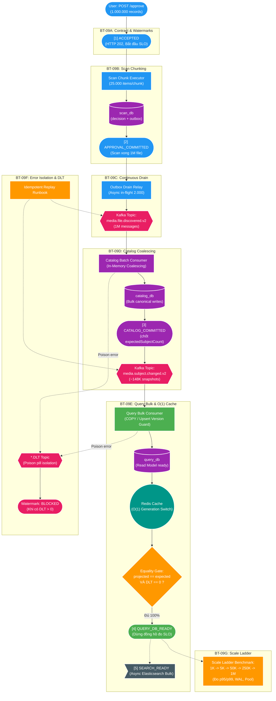

# Giải thích chi tiết: Master Pipeline Map toàn cảnh 7 lát cắt của BT-09

> **Mục đích tài liệu**: Dành cho người dùng / kiến trúc sư đọc hiểu toàn cảnh luồng đi của 1.000.000 bản ghi qua từng service, vị trí của 7 lát cắt (`BT-09A` → `BT-09G`) và 5 mốc Watermark.  
> **Router ngắn gọn cho Agent**: [`08-approve-1m-context.md`](../08-approve-1m-context.md).

---

## 1. Master Pipeline Map toàn cảnh

---

## 2. Ý nghĩa kỹ thuật của từng lát cắt

| Lát cắt | Service sở hữu | Trách nhiệm kỹ thuật cốt lõi |
| :--- | :--- | :--- |
| **`BT-09A`** | Cross-service | Thiết kế khung Hợp đồng & Watermarks (cấp vé `[1] ACCEPTED`, chốt 5 mốc). |
| **`BT-09B`** | `scan-service` | Ghi decision + outbox atomic theo bounded chunks 25.000 items $\to$ `[2] APPROVAL_COMMITTED`. |
| **`BT-09C`** | `scan-service` Relay | Continuous Drain Relay xả liên tục lên Kafka với in-flight buffer 2.000 messages. |
| **`BT-09D`** | `catalog-service` | In-Memory Batch Coalescing gom 1M file thành ~148K subject $\to$ `[3] CATALOG_COMMITTED`. |
| **`BT-09E`** | `query-service` | Bulk Projection (COPY/Upsert), Equality Gate $\to$ `[4] QUERY_DB_READY` & `[5] SEARCH_READY`. |
| **`BT-09F`** | Toàn hệ thống | Cô lập Poison pill sang DLT, chuyển `BLOCKED` để bảo vệ data, Runbook replay. |
| **`BT-09G`** | Hạ tầng & Benchmark | Chạy tải thực nghiệm 1K $\to$ 1M để chứng minh đạt mục tiêu SLO 30 giây. |
