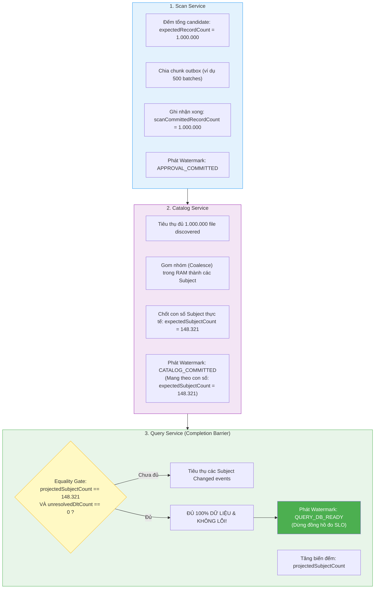
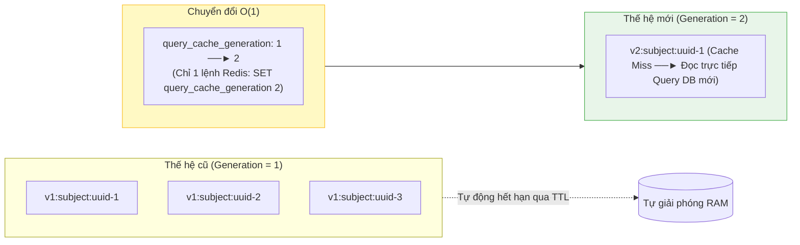

# Giải thích chi tiết BT-09A: Cơ chế Watermark, Completion Barrier & Cache Generation

> **Mục đích tài liệu**: Đây là tài liệu giải thích chi tiết, chuyên sâu (Deep-dive) dành cho lập trình viên / kiến trúc sư để hiểu rõ bản chất thiết kế của lát cắt **BT-09A** trong bài toán duyệt 1.000.000 bản ghi (SC-01).  
> **Tài liệu capsule tóm tắt cho Agent**: [`ref-bt09a-watermark-and-contract.md`](./ref-bt09a-watermark-and-contract.md).  
> **Hợp đồng kỹ thuật chính thức**: [`media.approval.watermark.v1.md`](../../../../../../docs/contracts/events/media.approval.watermark.v1.md).

---

## 1. Bối cảnh & Thách thức cốt lõi của bài toán 1M records

Khi người dùng nhấn nút **"Duyệt tất cả" (Approve All)** cho một đợt scan chứa **1.000.000 file**:

```text
[Scan Service] ──(1M files)──► [Kafka] ──► [Catalog Service] ──(N subjects)──► [Kafka] ──► [Query Service]
```

Dữ liệu phải chảy qua **3 microservices độc lập**, mỗi service sở hữu một Database PostgreSQL riêng biệt (`scan_db`, `catalog_db`, `query_db`).

### Vì sao không thể làm theo cách thông thường?
1. **Không thể dùng HTTP đồng bộ (Synchronous Blocking)**: Một request HTTP không thể giữ kết nối mở trong nhiều chục giây để chờ 3 database ghi hàng triệu bản ghi (sẽ gây HTTP 504 Gateway Timeout, cạn kiệt Connection Pool của Gateway).
2. **Không thể dùng Distributed Transaction (2PC / Saga nặng)**: Điều phối 2PC giữa 3 database trên 1.000.000 records sẽ làm khóa dữ liệu (database locks), nghẽn mạng và sập toàn bộ hệ thống khi chỉ 1 service bị chậm.
3. **Kafka không có thứ tự toàn cục (No Global Ordering)**: Kafka phân tán dữ liệu qua nhiều partition. Message từ các partition khác nhau có thể đến sớm hoặc muộn bất kỳ.
4. **Phép gộp (Coalesce) làm biến đổi số lượng bản ghi**: 1.000.000 file rời rạc khi vào Catalog sẽ được gom nhóm thành các phim/album (ví dụ: 1 Album USE có 50 ảnh, 1 Video JOKE có 3 file `mp4`, `jpg`, `gif`). Do đó, 1.000.000 file đầu vào sẽ biến thành một con số $N$ subject đầu ra (ví dụ: ~148.321 subjects) mà **tại thời điểm bắt đầu không ai biết trước $N$ bằng bao nhiêu**.

---

## 2. Vấn đề "Mù dữ liệu" và Giải pháp: Completion Barrier

### ❌ Vấn đề nếu không có Completion Barrier:
Giả sử Scan bắn 1.000.000 file vào Kafka. Catalog nhận và gom thành 148.321 subject events rồi bắn tiếp sang Query Service.
Query Service nhận các subject events từ 12 Kafka partitions. 
- Khi Query đã ghi được 100.000 subjects... Query có biết đã hết chưa? **Không.**
- Khi Query ghi được 148.320 subjects... Query có biết còn 1 cái nữa hay đã hết? **Không thể biết.**
- Nếu không có mốc chốt chặn, Query sẽ phải dùng một "đồng hồ hẹn giờ mò" (ví dụ: không thấy message nào trong 5 giây thì coi như xong). Điều này hoặc sẽ làm báo hoàn thành sớm (khi Kafka bị lag nhẹ) dẫn đến mất dữ liệu trên UI, hoặc phải chờ lãng phí hàng chục giây làm vi phạm SLO 30 giây!

### ✅ Giải pháp: Completion Barrier (Hàng rào chốt số lượng)



**Bản chất của Completion Barrier**:
1. Scan thông báo: *"Tôi đã phát đủ 1.000.000 file"* (`APPROVAL_COMMITTED`).
2. Catalog thông báo: *"Tôi đã xử lý xong 1.000.000 file và tạo ra chính xác 148.321 subjects"* (`CATALOG_COMMITTED`).
3. Query chỉ phát tín hiệu `QUERY_DB_READY` khi:
   $$\text{projectedSubjectCount} == \text{expectedSubjectCount} \quad \text{VÀ} \quad \text{unresolvedDltCount} == 0$$
Điều này đảm bảo **chính xác 100% về mặt toán học**, không bao giờ bị phát sớm, không bao giờ phải chờ timer mò mẫm.

---

## 3. Bản chất của 5 Mốc Watermark Lifecycle

Hệ thống được chuẩn hóa thành 5 mốc rõ ràng:

```text
[User POST /approve]
       │
       ▼
1. ACCEPTED (O(1))  ──► Bắt đầu bấm giờ đo SLO
       │
       ▼
2. APPROVAL_COMMITTED (Scan ghi xong 1M records vào DB/Outbox theo chunk)
       │
       ▼
3. CATALOG_COMMITTED (Catalog coalesce xong, chốt expectedSubjectCount)
       │
       ▼
4. QUERY_DB_READY (Query nạp đủ 100% Read Model, DLT = 0) ──► Dừng bấm giờ đo SLO (Thành công!)
       │
       ▼
5. SEARCH_READY (Elasticsearch bulk index xong ở làn xe riêng - Async)
```

### Chi tiết từng mốc:
1. **`ACCEPTED` (Scan)**: 
   - Ngay khi nhận HTTP request, Scan tạo 1 dòng `operation` trong database với trạng thái `ACCEPTED` ($O(1)$ mất ~5ms), trả về ngay HTTP `202 Accepted` kèm `operationId`. 
   - **Đây là điểm mốc $T_0$ bắt đầu tính thời gian cho SLO 30 giây.**
2. **`APPROVAL_COMMITTED` (Scan)**:
   - Worker nền của Scan chạy chia nhỏ 1.000.000 records thành từng chunk (ví dụ 2.000 records/chunk) với `@Transactional(REQUIRES_NEW)`.
   - Khi chunk cuối cùng commit xong, Scan phát watermark `APPROVAL_COMMITTED`.
3. **`CATALOG_COMMITTED` (Catalog)**:
   - Catalog consume các batch từ Kafka, gộp các file cùng subject vào RAM, ghi DB và phát ra các event `media.subject.changed.v2`.
   - Khi consume đủ 1.000.000 records, Catalog chốt con số `expectedSubjectCount` và phát watermark `CATALOG_COMMITTED`.
4. **`QUERY_DB_READY` (Query)**:
   - Query bulk upsert các subject vào bảng `query_subject`.
   - Khi số subject ghi nhận bằng đúng `expectedSubjectCount` và không có poison record nào trong DLT, Query phát watermark `QUERY_DB_READY`.
   - **Đây là điểm mốc $T_{\text{end}}$ hoàn tất Critical Path.** Gallery Web và Media Library đã có đủ dữ liệu.
5. **`SEARCH_READY` (Elasticsearch Worker)**:
   - Chạy bất đồng bộ, gom các subject thành từng đợt 1.000 items gửi lên Elasticsearch bằng `_bulk` API. Tách rời hoàn toàn để không ảnh hưởng đến tốc độ load của web chính.

---

## 4. Cache Generation Switch $O(1)$ vs Redis Pipeline $DEL$

### ❌ Cách cũ: Redis Pipeline `DEL` từng key ($O(N)$)
Khi có 150.000 subjects được cập nhật, nếu dùng Redis `DEL`:
- Phải gom 150.000 keys (`subject:uuid-1`, `subject:uuid-2`, ...) bắn sang Redis.
- Dù có dùng Redis Pipeline, việc truyền 150.000 keys qua mạng vẫn tốn hàng MB payload, chiếm dụng CPU của Redis server và mất 2–5 giây.
- **Rủi ro lớn**: Nếu Redis bị restart hoặc mạng chập chờn, pipeline xóa cache bị fail $\implies$ làm nghẽn luôn tiến trình DB-Ready!

### ✅ Cách mới: Cache Generation Switch ($O(1)$)

Thay vì đi xóa từng key của 150.000 subjects, chúng ta chỉ thay đổi **một biến số thế hệ (Generation Version)** trong Redis hoặc application memory:



1. **Cơ chế hoạt động**:
   - Khi Query Service đọc cache: `key = "v" + currentGeneration + ":subject:" + id`.
   - Khi `QUERY_DB_READY` đạt được: Query Service chỉ chạy đúng **1 lệnh**: `SET query_cache_generation 2` ($O(1)$, mất < 1ms).
   - Ngay lập tức, toàn bộ 150.000 keys cũ ở thế hệ `v1` trở thành vô hiệu (Stale). Các request tiếp theo tìm key `v2`, bị cache-miss và tự động kéo dữ liệu mới nhất từ `query_db` lên.
   - Các key `v1` cũ sẽ tự động được Redis dọn dẹp khi hết hạn TTL (Time-To-Live).
2. **Khả năng chịu lỗi (Fault-Tolerance)**:
   - Nếu Redis chết hoàn toàn: Ứng dụng tự động chuyển sang chế độ **Bypass Cache**, đọc trực tiếp từ `query_db`.
   - **Redis không bao giờ trở thành điểm nghẽn (Hard Dependency) chặn đứng `QUERY_DB_READY`**.

---

## 5. Quyết định dứt khoát: Event Contract `v2 duy nhất` (Clean Cut)

Trong thiết kế trước, có sự phân vân giữa việc giữ `media.subject.changed.v1` hay tạo `v2`. Sol đã chốt dứt khoát: **Chỉ dùng `media.subject.changed.v2`, khai tử v1 trên runtime.**

### Vì sao không nên làm Backward Compatibility (Dual-Publish v1 + v2)?
- Nếu Catalog vừa phát `v1` vừa phát `v2`, số lượng message trên Kafka sẽ bị nhân đôi (từ 150.000 lên 300.000 messages).
- Query Service phải duy trì 2 consumer listener, gây lãng phí gấp đôi CPU, Disk I/O và RAM trong lúc đang cần tối ưu từng milli-giây để đạt SLO 30 giây.
- Vì SC-01 là bài toán target mới, việc dứt khoát chuyển sang `v2` giúp loại bỏ toàn bộ code tương thích phức tạp, giữ kiến trúc sạch sẽ và tối đa hóa hiệu năng.

### Các cải tiến quan trọng trong `media.subject.changed.v2`:
- **Full Snapshot**: Payload mang đầy đủ danh sách `assets` và `tags` tại thời điểm đó, không gửi delta vụn vặt.
- **`operationId` & `batchId` nằm trực tiếp trong JSON**: Giúp việc debug, replay và tracing không phụ thuộc vào Kafka headers.
- **Optimistic Version Guard**: Query Service thực hiện câu lệnh upsert có điều kiện:
  ```sql
  INSERT INTO query_subject (subject_id, version, ...) VALUES (...)
  ON CONFLICT (subject_id) DO UPDATE SET ...
  WHERE EXCLUDED.version > query_subject.version;
  ```
  *(Lưu ý: Dùng toán tử `>` thay vì `>=` để loại bỏ cả các event duplicate có cùng version).*

---

## 6. Xử lý lỗi: Unresolved DLT và Trạng thái `BLOCKED`

Trong một batch lớn, nếu có 1 bản ghi bị lỗi dữ liệu (ví dụ: payload JSON bị méo mó không parse được), bản ghi đó sẽ bị đẩy vào Dead-Letter Topic (`*.DLT`).

### Quy tắc nghiêm ngặt của SLO:
- Hệ thống **không được phép báo `QUERY_DB_READY` thành công** nếu trong đợt duyệt đó vẫn còn bản ghi nằm trong DLT mà chưa được xử lý (`unresolvedDltCount > 0`).
- Nếu có DLT, Watermark sẽ chuyển sang trạng thái **`BLOCKED`**.
- Người quản trị (Operator) phải xem xét DLT, sửa lỗi hoặc quyết định bỏ qua (resolve) thì hệ thống mới được phép chuyển sang hoàn tất. Điều này đảm bảo tính toàn vẹn dữ liệu tuyệt đối (Data Integrity).

---

## 7. Tổng kết giá trị của BT-09A

| Hạng mục | Thiết kế cũ (Trước review) | Thiết kế mới (Sau review của Sol) | Lợi ích đạt được |
| :--- | :--- | :--- | :--- |
| **Completion Barrier** | Không có (chỉ có `operationId`, không biết khi nào nhận đủ). | Có stage `CATALOG_COMMITTED` chốt `expectedSubjectCount`, Equality Gate tại Query. | Xác định chính xác 100% thời điểm hoàn tất, không sợ mất dữ liệu hay lag Kafka. |
| **Xóa Cache Redis** | Gửi hàng trăm nghìn lệnh `DEL` qua Pipeline ($O(N)$). | Chuyển số thế hệ `query_cache_generation` ($O(1)$). | Giảm thời gian xóa cache từ vài giây xuống < 1ms; Redis sập không làm tắc pipeline DB. |
| **Bắt đầu tính SLO** | Mâu thuẫn giữa lúc nhận lệnh và lúc Scan commit xong. | Tách rõ: `ACCEPTED` (bắt đầu SLO) $\to$ `APPROVAL_COMMITTED` (Scan xong). | Đo đạc thời gian end-to-end SLI-03 hoàn toàn minh bạch và chuẩn xác. |
| **Event Versioning** | Nhập nhằng giữa v1 và v2, nguy cơ dual-publish. | Chốt sạch sẽ `media.subject.changed.v2`, khai tử v1 runtime. | Tiết kiệm 50% băng thông Kafka, code consumer sạch sẽ và tối ưu hiệu năng. |

Tài liệu này là cơ sở lý thuyết và kim chỉ nam vững chắc để chúng ta tự tin triển khai viết code thực tế từ **BT-09B** đến **BT-09G**.
